# 如何将 Node JS 应用程序连接到 MongoDB 数据库

> 原文：<https://medium.com/quick-code/the-article-you-were-looking-for-mongodb-and-connecting-your-node-app-to-the-database-b78b08d072f4?source=collection_archive---------0----------------------->


{Article you were looking for}

我学习 NoSQL(MongoDB)已经有几天了，我注意到它相当简单，我发现自己对它相当适应。
如果你是 JavaScript 出身，你也会发现这一点。

我这样说是因为 JavaScript 开发人员一直使用 JSON 数据来获取或发布数据，而 MongoDB 数据库集合中的文档使用类似 JSON 的数据，称为 BSON。

> **BSON** 是 MongoDB 在集合中存储文档时使用的类 JSON 文档的二进制编码。它增加了对 JSON 中不支持的数据类型的支持，比如 Date 和 binary

## 您将从本文中学到什么:

*   SQL 和 NoSQL 的区别
*   关于什么是 MongoDB 及其组成部分的基本概念
*   使用 MongoDB 的基本命令
*   安装 MongoDB 所需的基本工具
*   MongoDB 本地驱动程序简介，用于将节点应用程序连接到数据库
*   回调地狱及其解决方案承诺
*   使用节点应用程序执行 CRUD

让我们从区分 SQL 和 NoSQL 数据库开始这篇文章，之后，我们将在 MongoDB 中运行一些查询，看看查询是如何工作的，同时学习命令来操作我们即将创建的数据库。
在这里，我将创建一个数据库，并向其中插入一些条目，然后执行 CRUD 操作，以便您能够正确理解如何处理数据库中的条目。

MongoDB 是一个 NoSQL 数据库，我们将用它来创建和查询数据库。还有更多像 Redis、Amazon DynamoDB、Azure Cosmos DB、Couchbase 和 MongoDB 这样的 NoSQL 数据库。
MongoDB 在他们当中非常流行，它被用于所有类型的堆栈，如 MERN 和均值堆栈

## 让我们跳到 SQL 和 NoSQL 之间的区别。

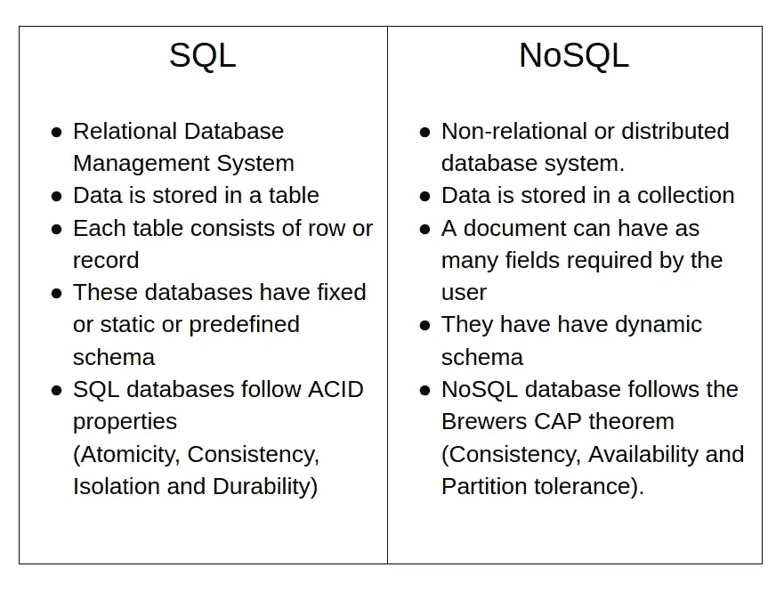

SQL vs NoSQL

上面，我已经写了 NoSQL 把文档作为他们的条目，所以现在让我们看看一个集合中的文档是什么样子的。

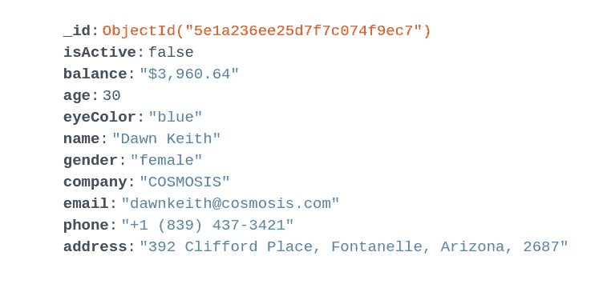

Document in a collection

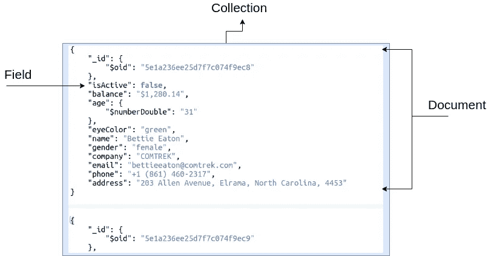

Draw.io is a great platform to make such snippets

每个文档都被分配了一个`_id`这是唯一的，不像 SQL，两个表可以有相同的`id:21`记录，这可能是一个问题，或者在将来会引起某种冲突，但 NoSQL 不是这样的。

每个`_id`都有它的含义，

它是一个 12 字节的 ObjectId 值，

***代表时间戳的 4 字节值
5 字节随机值
3 字节计数器，从随机值*** 开始

此外，NoSQL 遵循上限定理深入研究这个概念，你可以参考下面的文章，

[https://medium.com/@skeller88/cap-and-acid-8bbf9b45941](/@skeller88/cap-and-acid-8bbf9b45941)

我认为这个介绍已经足够让你开始学习 MongoDB 了，我们将会安装 MongoDB，你可以参考下面的链接来安装你的机器，我使用 Linux Mint。

[](https://docs.mongodb.com/manual/administration/install-community/) [## 安装 MongoDB 社区版- MongoDB 手册

### 这些文档提供了安装 MongoDB Community Edition 的说明。安装 MongoDB 社区版和…

docs.mongodb.com](https://docs.mongodb.com/manual/administration/install-community/) 

我假设您已经成功安装了 MongoDB，如果您在安装过程中有任何疑问或问题，请在下面的回复部分告诉我。

现在让我们学习一些基本的命令来显示现有的数据库和创建数据库等…
为此，您可以到您的终端并简单地给出命令`mongo`，您的 mongo shell 将被启动。

在这里，您可以运行所有的 mongo 命令。

你可以在网上找一个图形用户界面，我不会推荐 **compass** ，因为我觉得它没什么用。
我个人使用的是 **Robo 3T** 它也有一个名为 Studio 3T 的付费版本，但如果你只是在学习和本地主机上使用它，Robo 3T 也会工作得很好。

[](https://robomongo.org/) [## Robo 3T |免费的开源 MongoDB GUI(以前的 Robomongo)

### “我非常了解 3T 公司的员工，我知道他们将会出色地带领 Robomongo 前进——我迫不及待地想看到……

robomongo.org](https://robomongo.org/) 

现在让我们从创建数据库和执行 CRUD 操作所需的基本命令开始。

***查看系统中的数据库使用*****`show dbs`命令**

*****创建一个 DB***`use database_name`**

*****删除一个数据库***`db.dropDatabase()`**

*****创建收藏***
`db.devs.insert({
name: "Bhavishya Negi"
})`**

**这里`devs`是集合的名称，一个数据库可以有一个或多个集合。**

*****显示收藏***`show collections`**

*****重命名收藏***`db.collectionName.renameCollection("new_name")`**

****创建加盖收藏**
`db.createCollection("devs", { capped : true, size : 5242880, max : 5000 } )`**

**我们可以在 MongoDB 中创建**集合，并对其应用大小限制。这些特殊类型的**集合**被称为**加盖集合**。这是一种循环队列，如果达到分配的大小限制，它会通过覆盖**集合**中最旧的文档来为新文档腾出空间。
基于 FIFO(先进先出)****

**在上面的命令中，我创建了一个名为`devs`的封闭集合，它被封闭到`size: 5242880`中，如果插入了第 5001 个文档，那么第一个带有`_id:1`的文档将从集合中删除。**

*****落个收藏***
`db.collection_name.drop()`**

*****将文档插入收藏(创建)*****

```
db.devs.insert({
 regNo: "3014",
 name: "Bhavishya Negi",
 course: {
  courseName: "B.Tech",
  duration: "4 Years"
 },
 address: {
  city: "Bangalore",
  state: "KA",
  country: "India"
 }
})
```

**还有像`insertOne`和`insertMany`这样的方法，我们将在稍后创建 CRUD 时讨论它们。**

*****【从集合中查询文档(读取)*** `db.collection_name.find()
db.collection_name.find({})`**

**如果将`find`方法留空，它将返回集合中存在的所有文档。
如果有空对象传入，也会触发。
`db.collection_name.find({"fieldname":"value"})`**

*****更新集合中的文档(Update)*****

```
db.collection_name.update()db.student.update({
 "regNo": "3014" 
},{$set:
{
 "name":"Bhavishya"
}})
```

**update 方法有几个操作符来完成一个查询，我们一会儿再看。**

*****【删除】从集合中移除一个条目*****

```
//Syntaxdb.collection_name.remove({"fieldname":"value"})db.devs.remove({"regNo":"3014"})//To delete all the documents just pass an empty obj as parameterdb.col_name.remove({})
```

**因此，这些是一些基本命令，您需要 MongoDB 官方文档来了解它们，并学习其他命令。**

**【https://docs.mongodb.com/manual/reference/mongo-shell/ **

**现在，在了解了这些命令之后，我们可以轻松地在初级到中级水平上使用数据库了。
我现在将我的 node.js 代码链接到 MongoDB 数据库，但是要将 node.js 代码或应用程序连接到数据库，我们需要一个客户端。**

**有许多客户端可以使用，主要是开发人员更喜欢 MongoDB 驱动程序或 Mongoose。**

**你可以在 npm 包的集合[npmjs.com](https://www.npmjs.com/)中找到这两个。但是对于这篇文章，我将使用 MongoDB 公司的官方客户端。**

# **MongoDB 节点。JS 驱动程序**

**[](https://www.npmjs.com/package/mongodb) [## mongodb

### Node.js 的官方 MongoDB 驱动程序在 mongodb-core 之上提供了一个面向最终用户的高级 API

www.npmjs.com](https://www.npmjs.com/package/mongodb)** 

**现在让我们创建一个节点应用程序并安装所有的依赖项。我正在使用 VSCode 进行开发。我假设你的系统中已经安装了`node`。**

**创建一个新的文件夹，根据你的名字命名。**

**打开终端，发出命令`npm init -y`，它将为你创建`package.json`文件。这个`package.json`文件包含了所有的应用程序依赖关系和关于你的项目的其他信息。**

**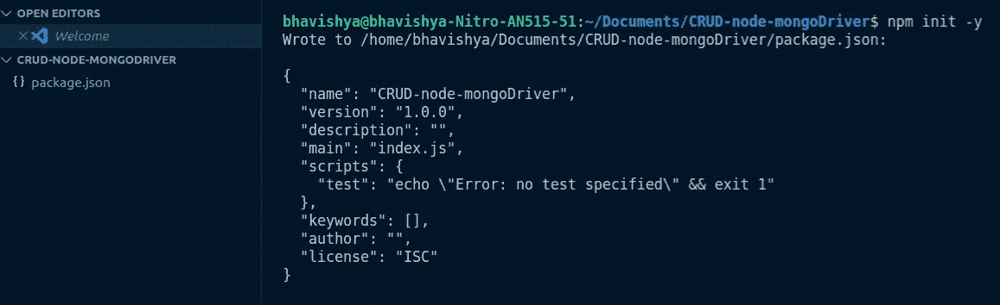**

**现在回到终端安装`mongodb`，这是`nodejs`的官方 MongoDB 驱动。
运行命令`npm i mongodb`**

**在查看`package.json`时，我们看到在`dependencies`中有`mongodb`**

**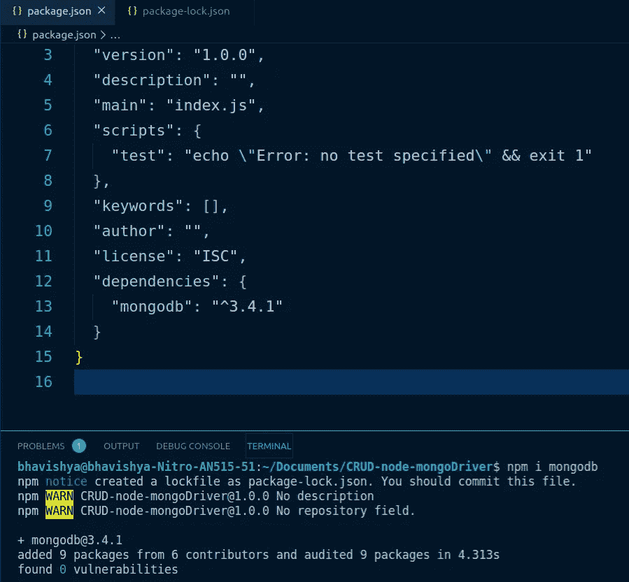**

**现在我们的开发环境已经设置好了，让我们创建 javascript 文件来连接数据库。**

**所以，在`crud.js`中我首先`require`我们刚刚安装的模块`mongodb`它返回的是一个对象。
我们需要一个客户端连接到数据库，因此`mongodb`有一个名为`MongoClient`的方法。**

**MongoClient 为我们提供了创建数据库的函数，这样我们就可以执行 4 个基本的 CRUD 操作。
`mongodb.MongoClient`**

**我已经用 URL 和数据库名分配了两个变量。
我们使用方法`MongoClient.connect()`这个方法接受 URL、选项和一个回调函数。
为了传递正确定义的 URL，我们使用选项`useNewUrlParser`并将其设置为`true`。**

**使用`node crud.js`运行文件时，它成功连接到数据库。**

# **创造**

**现在，为了在数据库中插入一个文档，我使用了方法`insertOne()`,它将一个对象作为参数，并有一个回调函数，是的，这是异步的。**

**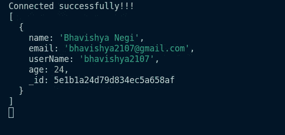**

**console output**

**我已经使用插入属性`ops`将插入的文档转储到控制台，还有更多这样的属性，比如`insertedCount,insertedId,result etc...
ops`是一个数组，它返回所有你插入的文档。**

**你可以从 MongoDB 的官方文档中查看所有这些属性。**

**在查看 Robo3T(用于查询和读取数据的 GUI)时，我们发现名为`devs`和集合名为`users`的数据库已成功创建，其中有一个单独的文档。**

**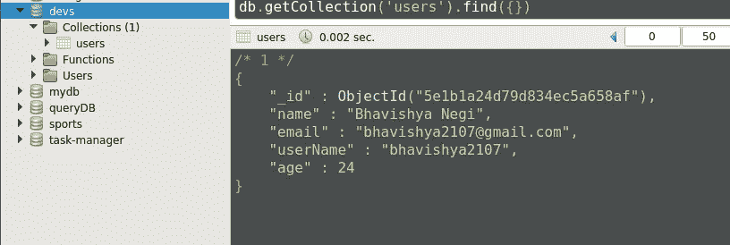**

**所以，是的，我们已经成功地插入了一个文件，并将其连接到数据库。**

> **如果你已经到达这里，请拍拍我的背，因为在这之后，这将是一个简单的游戏。**

# **让游戏开始吧…**

**现在我们已经使用`insertOne`插入了单个文档，让我们使用方法`insertMany`插入多个文档。**

**现在，如果我们检查 Robo3T，我们会看到所有的插入都在数据库中完成。**

**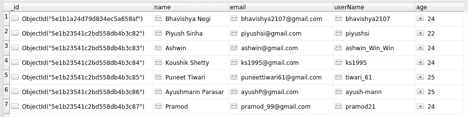**

**insertMany()**

**让我们添加一个新的集合`todos`，其中每个文档将有两个属性，
*{描述: " "，已完成:" " }***

**`insertMany()`获取要插入对象的文档数组和返回错误和响应的回调函数。**

# **阅读**

**在读取操作之前，我从名为`ObjectID`的`mongodb`获取属性。
这个属性将帮助我们在数据库中使用`_id`。**

**在控制台中，我们看到与 24 岁的`_id`和`users`匹配的`doc`被记录。**

**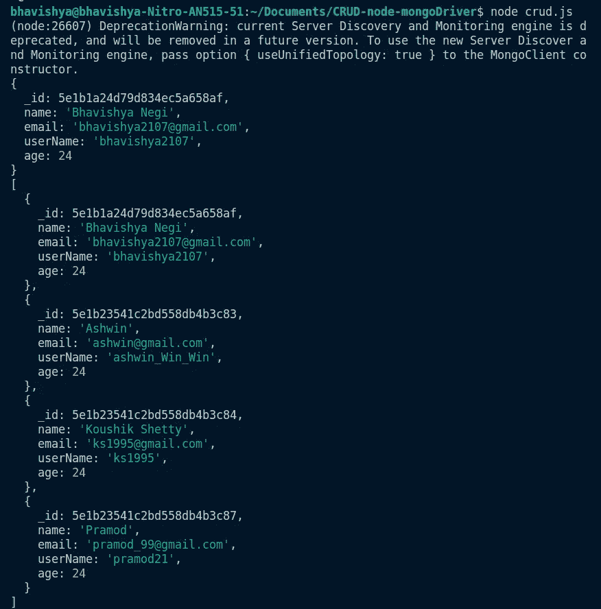**

**让我们也读一下集合`todos`和`find`中没有完成的待办事项，是的，所有插入的待办事项都没有完成，但这只是为了更好地理解。**

```
*db*.*collection*('todos').*find*({ completed: false }).*toArray*((err, todo) *=>* {*if* (err) *return* console.log(err)console.log(todo)})
```

**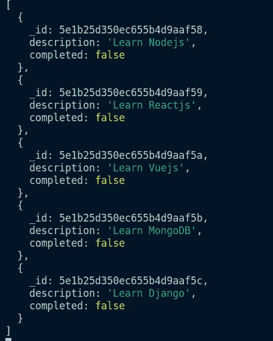**

**console logged all the incomplete todos**

# **更新**

**正如我们在上面看到的，我一直在使用回调来完成其他任务，如果没有太多代码要写，这是可以的，但是如果代码太多，开发人员处理这么多回调就成问题了。他们很难在未来处理自己的代码，因为很难分析和处理它们，这就是所谓的回调地狱。**

**为了避免上述情况我们使用 promise，你可以参考我的 ES6 slayer 文章来阅读`promise`并有所了解。**

**[](/quick-code/es5-es6-a-must-read-if-you-wanna-be-a-slayer-in-javascript-es6-959a8215e252) [## ES5 = > ES6…如果你想成为一名杀戮者，这是一本必读的书😎在 JavaScript ES6 中

### 每个 JavaScript 开发人员都能很好地发现 EcmaScript 版本，这些版本会随着新的内容不断更新…

medium.com](/quick-code/es5-es6-a-must-read-if-you-wanna-be-a-slayer-in-javascript-es6-959a8215e252) 

所以在这里的更新和进一步的代码中，我们将利用`promises`。

现在当我们看图形用户界面时，

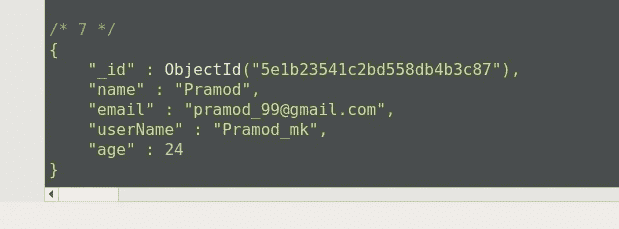

updateOne

根据我们的查询，现在用户名被更改为 Pramod_mk。
在这里的`updateOne()`中，我使用了一个操作符`$set`,用于更新现有属性或键的新值。

现在让我们使用`$inc`操作符将年龄增加 5，

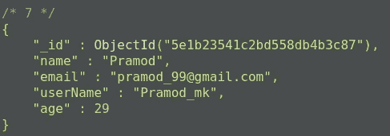

age is increased by 5

您也可以使用`$inc`通过使用负整数来减少年龄或任何数字值。

您可以学习几个更新运算符。

**查看以下链接:**

[](https://docs.mongodb.com/manual/reference/operator/update/) [## 更新操作符- MongoDB 手册

### 将 MongoDB 社区升级到 MongoDB Enterprise

docs.mongodb.com](https://docs.mongodb.com/manual/reference/operator/update/) 

让我们使用`updateMany`方法来完成`todos`集合中的所有 todo。

现在看看 Robo 3T，我们看到所有的文档都有键`completed:true`。

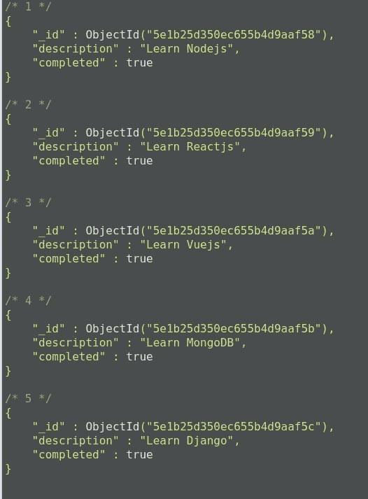

因此，您可以更多地练习更新文档，以便这些命令和操作符唾手可得。

# 删除

我们有像`deleteOne()`和`deleteMany()`这样的方法来删除文档。
两者都需要 querySelector。

在上面的代码中，
我使用`deleteOne()`方法从集合`todos`中删除了一个 todo。

还从集合`users`中删除了年龄为 24 的文档。

因此，在查看 Robo 3T，
时，我们看到带有`description:"Learn MongoDB"`的文档被删除。

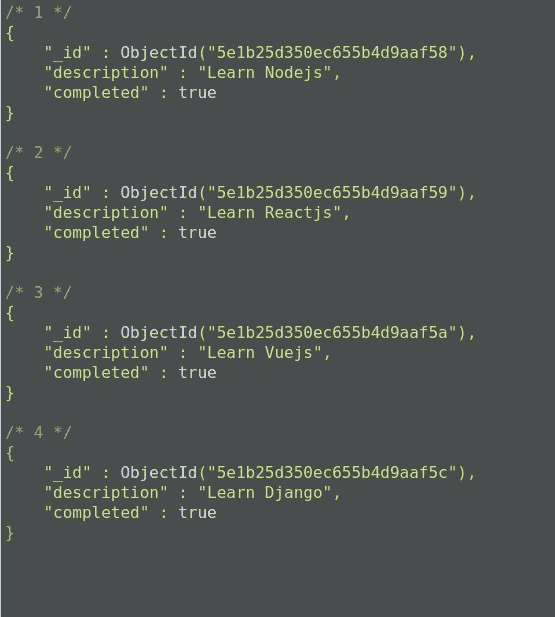

类似地，在查看`users`集合时，我们可以看到该年龄的用户都不存在。

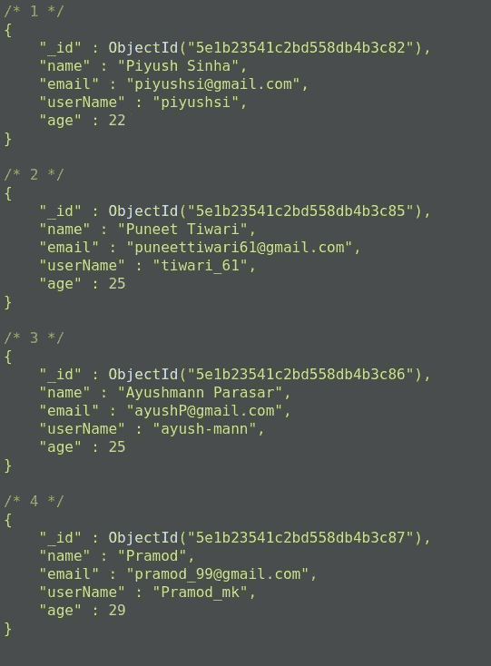

因此，我们已经看到了什么是 MongoDb 以及如何将它连接到节点应用程序。
我们还通过在 mongodb native nodejs 驱动程序的帮助下创建我们自己的数据库，讲述了基本的命令和 CRUD 操作。

MongoDB 还有更多概念，如索引、聚合等…
我将在接下来的文章中介绍它们。

所以，就这样了**谢谢各位！！！为了阅读我的文章，让我知道你是否对文章或我解释的概念有任何疑问，请在底部写下回复。**

在 twitter 上关注我，保持联系，让我知道你感到困难的其他领域，以便我阅读自己，并尝试用我的文章解释它。

[https://twitter.com/bhavishya2107](https://twitter.com/bhavishya2107)

# 谢谢你！！！

# 掌声是受欢迎的🤗

> *保持学习，编码😎分享你的知识🤩*

# 参考:

*   https://docs.mongodb.com/:学习 MongoDB 不需要任何其他资源，文档中有很多简单的例子和解释。**