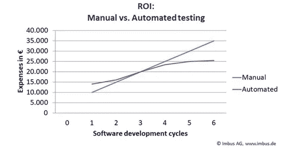
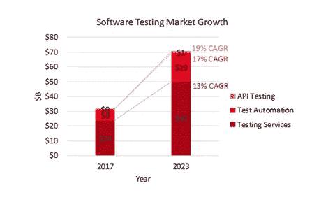

# 自动化测试的神奇之处

> 原文：<https://medium.com/version-1/the-awesomeness-of-automated-testing-ea9720cf17a2?source=collection_archive---------2----------------------->

# **简介**

作为一名软件开发人员工作了近二十年，最近又作为一名 QA 专家，我已经意识到了[自动化测试的重要性。](https://www.version1.com/it-service/erp/maximise/automatedtesting/)

一些软件应用程序一年要部署多次新版本。针对更新的源代码持续运行自动化测试有助于防止将错误引入到现有的功能中。

Photo by [Zan](https://unsplash.com/@zanilic?utm_source=medium&utm_medium=referral) on [Unsplash](https://unsplash.com?utm_source=medium&utm_medium=referral)

自动化测试是一种受开发人员欢迎的测试形式，特别是对于:

*   高风险—业务关键型测试案例
*   重复执行的测试用例
*   耗时的测试用例

# **什么是**自动化测试？

自动化测试是软件测试中的一种方法，它利用特殊的软件工具来控制测试的执行，然后将实际的测试结果与预测或预期的结果进行比较。

# **为什么使用**自动化测试？

自动化测试有助于:

*   加速测试
*   减少用户的重复性任务
*   减少人为错误
*   测试响应时间

# **目前市场上有哪些自动化测试工具？**

自动化测试利用测试工具来帮助加速测试的运行，我们可以将实际结果与预期结果进行比较。

Source: [https://technofaq.org/posts/2017/08/10-most-extensively-used-test-automation-tools/](https://technofaq.org/posts/2017/08/10-most-extensively-used-test-automation-tools/)

目前市场上有一些非常好的自动化测试工具。不胜枚举，但这里列出了几个:

IBM 理性测试

雷诺克斯

硒

黄瓜

邮递员

用于问答的 Java

REST API 自动化测试

Webdriver？

智能熊(ReadyAPI 和 Testcomplete)

特里森蒂斯

茄子

微焦点

CA 技术公司

Parasoft

工作软件

青蛙的

柏树木卫一

摇摆

量角器

IntelliJ

朱尼特

泽法

**我最近用过的工具有:**

Selenium Web 驱动程序 3.1.41.0

Nunit 框架

# **自动化的优势**

比手动测试快得多

在应用程序的回归测试中非常有用

节省时间和成本

可重复使用的测试脚本

当应用程序中需要测试大量输入和屏幕时，用户可以应用自动化

有助于在每天使用的代码中尽早发现错误

减少人为错误

增强信心

# **结论**

我已经意识到自动化测试的重要性和好处，特别是对于业务关键的和经常被点击的代码。自动化测试的使用正在增长，其市场规模预计将继续增长。**一个重要的影响因素是与投资回报相关的成本节约。**

Source:[https://medium.com/memory-leak/introducing-redpoints-software-testing-landscape-3c5615f7eeae](/memory-leak/introducing-redpoints-software-testing-landscape-3c5615f7eeae)

# 关于作者

*Clodagh Reardon 是一名托管服务顾问，目前正在开发版本 1。关注 Version 1 的 Medium 博客，获得更多关于自动化测试以及它如何使您的组织受益的博客。*