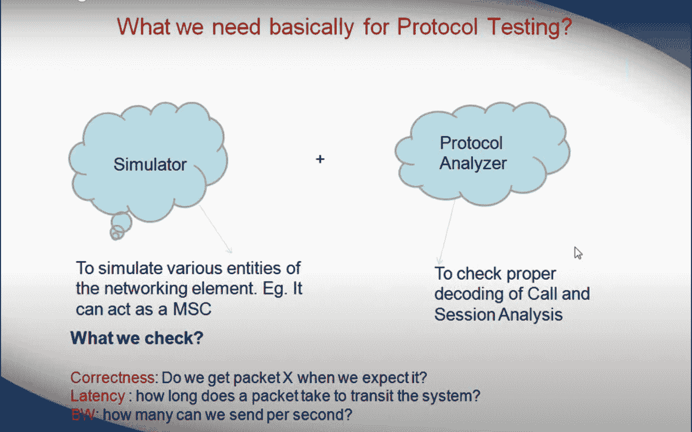

# 协议测试基础(L2 和 L3)

> 原文：<https://medium.com/globant/the-basics-of-protocol-testing-l2-l3-ce810bb0d5fa?source=collection_archive---------0----------------------->

# 什么是协议？

当计算机相互通信时，每台计算机都必须遵循一组通用的规则和条件。换句话说，协议决定了数据如何在计算设备之间和网络上传输。

**协议测试的重要性**

它还能够建立可靠和高性能的网络通信。在没有协议的情况下，设备将无法理解它们在通过网络连接通信时发送的电子信号。

带有加密二进制数据的数据包通过网络传输。此外，为了存储有关消息发送者的信息，许多协议都带有报头。网络协议在开头添加了关于消息发送方和接收方的描述。此外，很少有协议还会添加页脚。因此，当在设备之间移动数据时，网络协议以自己的方式识别头部和尾部。

# 协议测试

**协议测试**是一种在交换、无线、VoIP、路由等领域检查通信协议的方法。协议测试的主要目标是使用协议测试工具检查通过网络发送的数据包的结构。路由器和交换机在测试中被用来构成被测设备和产品的一部分。

# 协议类型

协议分为两类**路由协议**和**路由协议**

*   **路由协议**:路由协议可用于将用户数据从一个网络发送到另一个网络。它承载用户流量，如电子邮件、网络流量、文件传输等。路由协议有 IP、IPX 和 AppleTalk。
*   **路由协议**:路由协议是为路由器确定路由的网络协议。它仅用于路由器之间。例如 RIP、IGRP、EIGRP 等。

简单来说，**路由器就像是用来运输的火车，而路由协议就是铁轨上的信号。**

根据通信类型，使用不同的协议。思科、JUNIPER、ALCATEL 等公司生产路由器、调制解调器、无线接入点等网络设备。使用不同协议进行通信，例如，Cisco 使用 EIGRP、OSPF 等。协议测试只是检查 EIGRP(增强型内部网关路由协议)或 OSPF(开放最短路径优先)或任何其他协议是否按照各自的标准工作。

# 协议类型和使用

**TCP/IP** -用于在互联网上以小数据包的形式发送信息

**UDP/ ICMP** -用于通过互联网以数据包的形式发送少量信息

**POP3 和 SMTP**——用于收发邮件

**超文本传输协议**——用于以加密的形式传输 HTML 页面，为敏感数据提供安全保障

**FTP** -它用于通过网络将文件从一个节点传输到另一个节点

**TCP/IP** -传输控制协议/互联网协议，

**UDP / ICMP** -用户数据报协议/互联网控制消息协议，

**POP3/SMTP** -邮局协议/简单邮件传输协议。

# 不同类型的网络协议

OSI 模型共有 7 层网络通信，其中第 2 层和第 3 层非常关键。

**第二层**:为**数据链路层**。Mac 地址、以太网是数据链路层 2 的最佳示例。

**第三层**:第**网络层**决定网络中通信的最佳可用路径。IP 地址是第 3 层的一个例子。

# 如何进行协议测试

*   对于协议测试，你需要**协议分析器和模拟器**
*   协议分析器确保正确解码以及呼叫和会话分析。而模拟器模拟网络元件的各种实体
*   通常，协议测试是由 DUT(被测设备)对其他设备(如交换机和路由器)进行的，并在其中配置协议
*   此后检查由设备发送的分组的分组结构
*   它检查可伸缩性、性能、协议算法等。使用 lxNetworks、Scapy 和 Wireshark 等工具

# 协议测试的测试类型

协议测试包括功能、性能、协议栈、互操作性等测试。在协议测试期间，基本上要进行三项检查。

*   正确性:我们收到预期的数据包 X 了吗？。
*   **延迟**:一个数据包通过系统需要多长时间？。
*   带宽:我们每秒能发送多少数据包？。

协议测试分为两类。**压力和可靠性测试以及功能测试。** **压力和可靠性**测试涵盖负载测试、压力测试、性能测试等。而  功能测试包括**负面测试**、**一致性测试**、**互操作性测试**等。

*   **压力测试:-** 压力测试(酷刑测试)是一种有意进行的激烈或彻底的测试，用于确定给定系统、关键基础设施或实体的稳定性。它包括超出正常操作能力的测试，通常达到一个临界点，以便观察结果。
*   **可靠性测试** :-可靠性测试是一个软件测试过程，检查软件是否能在特定的环境下，在规定的时间内无故障运行。可靠性测试的目的是确保软件产品没有缺陷，并且对于其预期目的来说足够可靠
*   **一致性测试**:对产品上实现的协议进行一致性测试，如 IEEE、RFC 等。
*   **互操作性测试**:测试不同厂商的互操作性。这种测试是在适当的平台上完成一致性测试之后进行的
*   **网络功能测试:**参照设计文档对网络产品的功能进行测试。例如，功能可以是交换机上的端口安全、路由器上的 ACL 等。

# 结论:

在本文中，我们讨论了协议测试。我们讨论了协议测试程序、协议类型以及用于进行协议测试的测试工具。这是一种独特的测试，分享你的经验有助于理解更多的协议测试的洞察力。