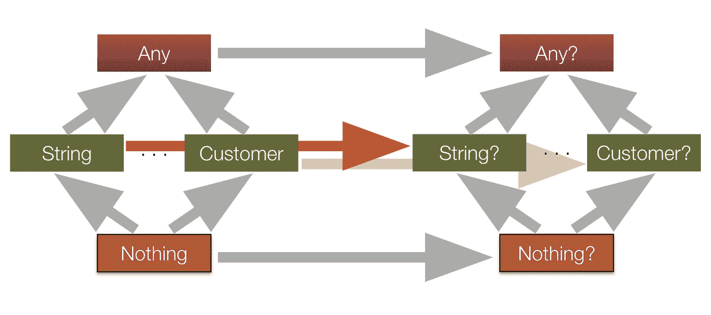
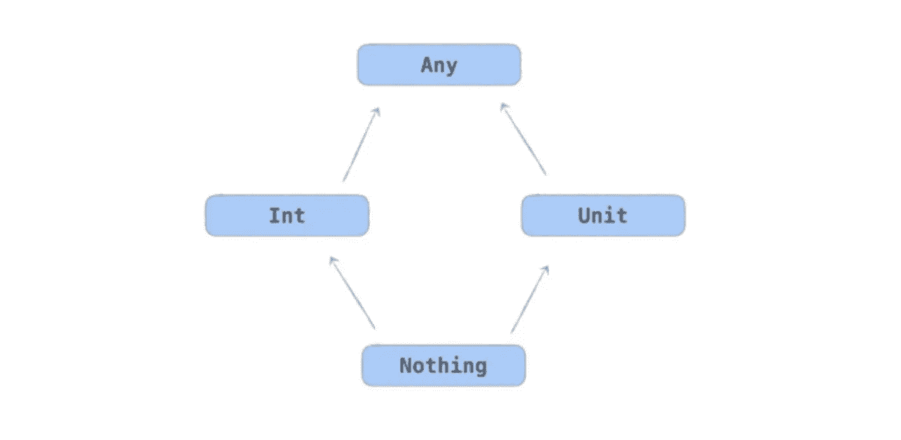
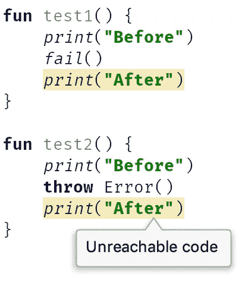
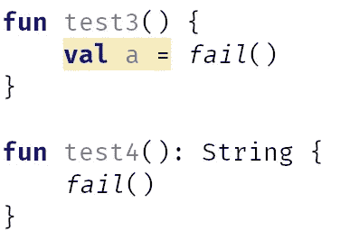
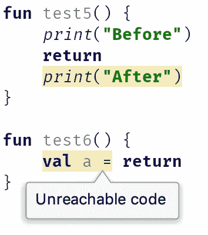
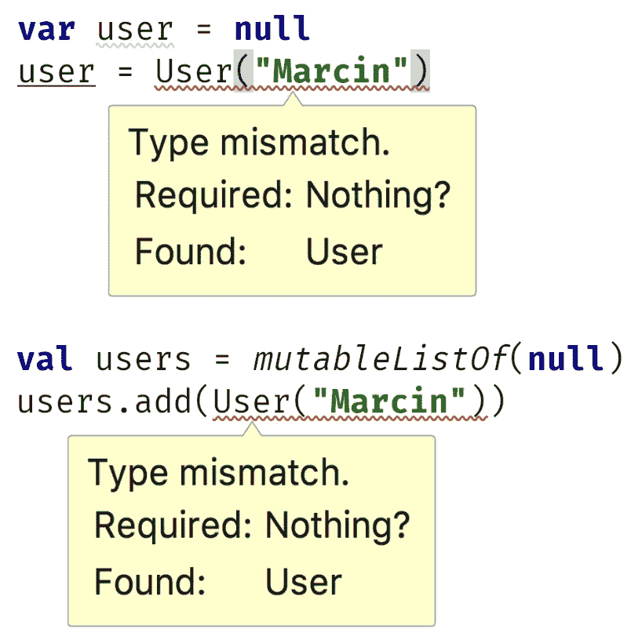

# 科特林打字系统之美

> 原文：<https://blog.kotlin-academy.com/the-beauty-of-kotlin-typing-system-7a2804fe6cf0?source=collection_archive---------1----------------------->

Kotlin 打字系统的设计令人惊叹。它为我们提供了非常舒适的可空性支持、类型推断、通用保护等等。例如:

在这篇文章中，我们将揭示许多科特林魔术。我总是喜欢在我的研讨会上谈论它，因为我看到了它是如何被设计出来的惊人之美，所有这些部分都完美地结合在一起，给我们带来了很好的编程体验。还有一些有用的提示，如何在不同的情况下使用打字系统。享受:)

# 常规类型层次结构

假设您定义了一个类`Customer`。这个类生成两种类型:可空版本`Customer?`和不可空版本`Customer`。他们之间是什么关系？

嗯，nullable 不能直接使用。需要首先将其解包为不可空。另一方面，non-nullable 也可以用作 nullable:

无论如何，不可空可以作为可空使用。这是可能的，因为这两种类型之间存在联系。可空类型是不可空的超类型。

在 Kotlin 类型层次结构中还有一些更有趣的事实。这是一张图中的整个层次结构:

您可以注意到两个有趣的元素:

*   所有类型都有一个超类型
*   所有类型都有一个子类型

# 所有类型的超类型:`Any?`

每个不可空类型都有一个名为`Any`的超类型。分别地，它唯一的超类型是`Any?`，它是包括 nullable 在内的所有类型的超类型。所有类的超类的概念在 Java 中是已知的，在 Java 中我们有`Object`。`Any?`同样可以用来表示我们正在接受任何事情:

println from the stdlib

尽管您可能也注意到了，如果您只想要不可空的类型，您可以使用`Any`。这一事实被广泛用于泛型，表明我们只接受不可空的类型参数[:](/programmer-dictionary-parameter-vs-argument-type-parameter-vs-type-argument-b965d2cc6929)

notNull delegate from the stdlib.

Example from [the previous article](/creating-a-random-instance-of-any-class-in-kotlin-b6168655b64a)

# 所有类型的子类型:无

在科特林，所有类型都有一个亚型——`Nothing`。它可以被视为任何类型，尽管没有实例是`Nothing`。当我开始讲授它时，它对大多数开发人员来说都是新事物。我们为什么需要这样的东西？

让我们从一个更简单的问题开始:为什么将`Nothing`声明为返回类型有意义？停止阅读一分钟，想一想。

没有`Nothing`的实例，所以我们不能返回它。但是我们有没有其他方法来逃避一个函数呢？嗯，有一个。我们可以在不返回任何东西的情况下对函数进行转义。我们可以抛出一个异常。事实证明，`throw`声明的返回类型是`Nothing`。这里我们将`Nothing`声明为返回类型，以抛出异常:

请注意结果，因为`Nothing`是所有类型的子类型。假设你有一个返回`String`或`Nothing`的 if 条件。推断的类型应该是什么？`String`和`Nothing`最接近的超类型，也就是`String`。这就是为什么这里的`data`推断类型是`String`:

这个函数也可以用在许多其他的上下文中。例如，我们可以在 Elvis 操作符的右侧使用它:

Elvis 运算符的约定是，推断的返回类型是左侧的不可空版本，并且是右侧最接近的超类型。左边是`String?`，它的不可空版本是`String`。右边是`Nothing`。`String`和`Nothing`的关闭超类型是`String`，因为`Nothing`是包括`String`在内的所有类型的子类型。

同理，我们可以在右侧抛出一个错误:它声明的返回类型是`Nothing`。

类似地，我们可以在控制结构上使用 throw，它可以用作[表达式](/kotlin-programmer-dictionary-statement-vs-expression-e6743ba1aaa0):

# 单位在哪里？

我经常被问到此时`Unit`在哪里。从打字系统的角度来看，这没什么特别的。它只是一个[对象声明](/kotlin-programmer-dictionary-object-expression-vs-object-declaration-791b183ad16b) (singleton)，在类型系统中，像所有其他类型一样，它是`Any`的子类型和`Nothing`的超类型。

How Unit is defined

# 当代码不可达时。

当一个元素将`Nothing`声明为返回类型时，意味着其后的一切都是不可达的。一定是这样，因为没有`Nothing`的实例。这就是为什么当我们使用`fail`或 throw 时，这些表达式之后的所有内容都是不可及的:

因此，我们可以将所有内容放在左侧，并且不需要使用 return 语句:

这个事实经常被返回`Nothing`、`TODO`的最流行的函数使用:

当我给出要实现的功能时，我经常在[我的工作室](http://kt.academy/)的任务中使用它:

尽管 throw 不是唯一一个没有声明任何东西作为返回类型的构造。你能猜出第二个是什么吗？

是`return`。Return 从一个函数返回，所以在一个`return`之后的一切都是不可到达的。它对函数进行了转义，所以我们可以说在这个函数内部，它不返回任何东西。这与`throw`是一致的，这就是打字系统如何知道`return`之后的一切都是不可到达的。

出于同样的原因，我们可以在各种控制结构中使用`return`:

注意，这最终解释了为什么我们可以在 Elvis 操作符的右侧使用`return`:

# null 的类型

假设你声明了一个变量或者一个列表，你把它的值设置为`null`，但是你忘了声明一个类型。因此，您会看到以下错误:

能解释一下吗？花点时间想一想。

这种错误的原因是，当我们不声明变量或属性类型时，将从右侧获取类型。这里就是这么回事，类型竟然是`Nothing?`。所以你可以看到`null`的类型是`Nothing?`。这是为什么呢？

让我们从注意到`null`是`Nothing?`唯一可能的实例开始。没有类型为`Nothing`的对象，任何类型的可空版本都可以是`null`。因此当我们看到`Nothing?`时，我们可以确定只有`null`会在那里。当我们希望属性 delegate 只在顶层使用时，就会用到这个事实，这里的`thisRef`是`null`:

另一件要注意的事情是，它给了我们完美的类型推断。再看一下键入层次结构:

现在想想`a`和`b`的推断类型是什么:

在`if`中，我们从两个分支中搜索最接近的超类型。`String`和`Nothing?`最接近的超类型是`String?`。关于`when`也是如此:`String`、`String`、`Nothing?`最接近的超类型是`String?`。一切都有道理。

出于同样的原因，每当我们需要`String?`时，我们可以通过`String`或`null`，也就是`Nothing?`。当你看一看类型层次结构时，这一点就很清楚了。那是`String?`的两个亚型。

# 摘要

在这篇文章中，我展示了一些事实:

*   每个类都生成一个可空和不可空的类型
*   可空类型是不可空类型的超类型
*   所有类型的超类型是`Any?`
*   不可空类型的超类型是`Any`
*   所有类型的子类型`Nothing`
*   所有可空类型的子类型`Nothing?`
*   当函数声明`Nothing`为返回类型时，意味着它将无限抛出一个错误或有趣
*   `throw`和`return`都声明`Nothing`为返回类型
*   当一个表达式将`Nothing`声明为返回类型时，在那之后执行的所有东西都是不可访问的
*   `null`的类型是`Nothing?`，这给了我们预期的类型推断，并且由于这个原因`null`可以在预期可空类型的任何时候使用。

要记住的图片是 Kotlin 类型层次的图解:

## 单击👏说“谢谢！”并帮助他人找到这篇文章。

了解卡帕头最新的重大新闻。学院，[订阅时事通讯](https://kotlin-academy.us17.list-manage.com/subscribe?u=5d3a48e1893758cb5be5c2919&id=d2ba84960a)，[观察 Twitter](https://twitter.com/ktdotacademy) 关注我们 medium。

