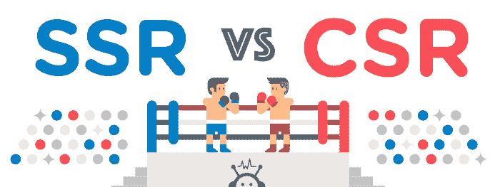
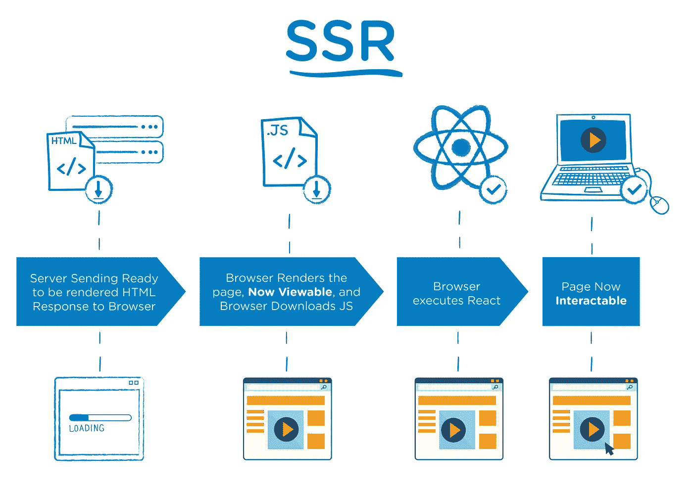
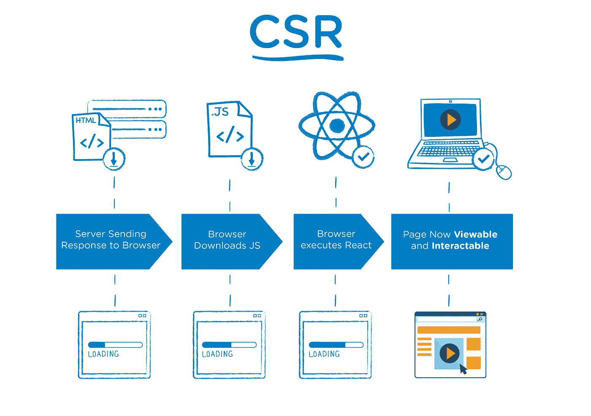
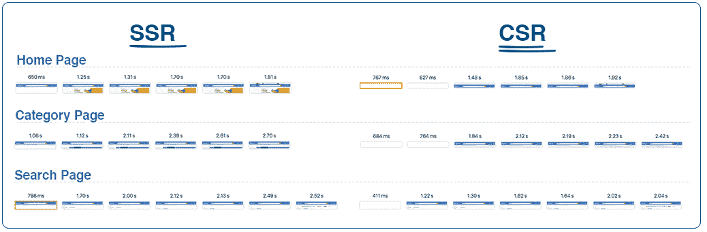
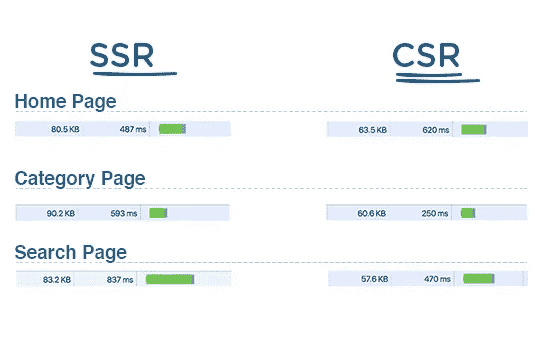

# 服务器端呈现优于客户端呈现的优势

> 原文：<https://medium.com/walmartglobaltech/the-benefits-of-server-side-rendering-over-client-side-rendering-5d07ff2cefe8?source=collection_archive---------0----------------------->

我们在 walmart.com 的大部分页面都使用了服务器端渲染(以下简称 SSR ),只有少数例外。

我们使用服务器端渲染有两个原因:

*   我们客户的性能优势
*   一致的 SEO 性能

由于 SSR 的优势，当我们将堆栈转换为 React 和 Nodejs 时，我们投入了大量时间和精力来优化 SSR 性能。我们衡量性能的关键指标之一是“折叠以上”渲染。我们开源的[电极框架](/walmartlabs/introducing-electrode-an-open-source-release-from-walmartlabs-14b836135319#.7eg4wfcp7)有[多个模块](http://www.electrode.io/docs/stand_alone_modules.html)来提高 SSR 和[的性能，我之前在博客中提到过这些模块](/walmartlabs/using-electrode-to-improve-react-server-side-render-performance-by-up-to-70-e43f9494eb8b#.3aljjuu5g)的好处。

当我们宣布电极及其对 SSR 的关注时，我收到了大量关于 SSR 好处的问题和评论。这篇博客文章关注使用 SSR 的性能优势——Andrew Farmer 和 Patrick Hund 在介绍 SEO 优势方面做得很好。

# 理论性能优势

这里有一个非常简单的时间线图(超级简单)来展示 SSR 和 CSR 的区别。

主要区别在于，对于 SSR，服务器对浏览器的响应是准备好呈现的页面的 HTML，而对于 CSR，浏览器得到的是一个相当空的文档，其中包含指向 javascript 的链接。这意味着您的浏览器将从您的服务器开始呈现 HTML，而不必等待下载并执行所有的 JavaScript。在这两种情况下，React 都需要下载，并经历构建虚拟 dom 和附加事件以使页面交互的相同过程——但对于 SSR，用户可以在所有这些发生的同时开始查看页面。对于 CSR 世界，您需要等待上述所有情况发生，然后将虚拟 dom 移动到浏览器 dom，以便页面可见。

**另一个好处:**CSR 中出现的空白页闪烁在 SSR 中也不会发生——尽管大多数人通过在服务器响应中发送一个加载图像来避免这种情况，当所有内容都完成加载时，该图像会被删除。

现在，有一些警告:

*   虽然页面呈现得更早，客户也能更快地看到页面，但在 react 执行完毕之前，他们无法真正与页面进行交互。如果客户真的很快并且点击了一个按钮，那么在 React 执行完之前，动作不会被执行；
*   SSR TTFB(到达第一个字节的时间)比 CSR 慢，因为你的服务器必须花时间为你的页面创建 HTML，而不仅仅是发出一个相对空洞的响应；
*   您的服务器的 SSR 吞吐量明显小于 CSR 吞吐量。特别是对于 react，吞吐量影响非常大。`ReactDOMServer.renderToString`是一个同步 CPU 绑定调用，它持有事件循环，这意味着服务器将无法处理任何其他请求，直到`ReactDOMServer.renderToString`完成。假设你需要 500 毫秒来对你的页面进行 SSR，这意味着你每秒最多只能处理 2 个请求。***大考量***

# 真实用例

下面是用 SSR 和 CSR 渲染的 walmart.com 的生产应用。

我们比较了 SSR 和 CSR 中的三个应用程序(主页、分类和搜索)。这些是正在渲染的网页的 chrome 网络截图。您会注意到 SSR 渲染速度更快，使用 CSR 加载时会出现空白页面。大多数使用 CSR 的应用程序显然会用加载图标替换空白页面，但是因为我们使用 SSR 进行正常操作，所以当强制进入 CSR 模式时，页面是空白的。请注意，这些是我们的机器在一天中的特定时间对当前产品版本的一次性捕获，因此个别性能可能会有所不同，但这应该是您看到的应用程序的总体趋势。

这是主页、类别和搜索页面的第一个服务器响应。我将忽略绿色条，因为与网络图的其余部分相比，它更具有相对性。我想提请注意的两件事是文档大小和 TTFB。由于服务器响应页面的 HTML，您会注意到 SSR 的文档总是更大。之前说的另一点，CSR 响应更快(这次测试中除了 home page 因为某些原因)。

我必须强调的是，这些捕获是可变的，取决于应用程序、延迟、服务器、位置和一系列其他变量，因此它们不应该被视为科学事实，而应该被视为一般趋势。

# 电极

当我们对 SSR 和 CSR 进行 A/B 测试时，上面的趋势就是我们将看到的，我们的数据显示客户对早期渲染的参与度更高。

由于这些原因，我们的[开源应用平台，电极](/walmartlabs/introducing-electrode-an-open-source-release-from-walmartlabs-14b836135319#.14ki95nbb)非常关注 SSR。它在默认情况下是打开的，我们有一些围绕优化 SSR 构建的模块。在另一篇文章中，[,我展示了使用其中两个模块，可以将 RenderToString()的时间提高 70%。](/walmartlabs/using-electrode-to-improve-react-server-side-render-performance-by-up-to-70-e43f9494eb8b#.7ptjeavgu)

非常感谢[玛雅库玛](/@vmayakumar)和[曹杨](/@caoyangs)帮助我审阅和润色这篇博文。