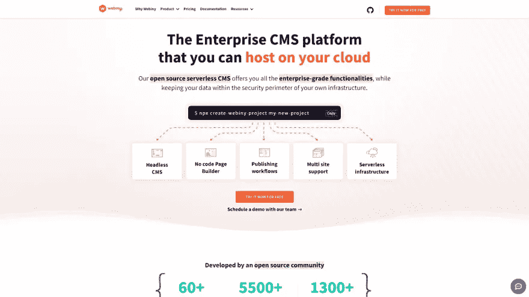

# 最好的 10+开源无头 CMS 2023

> 原文：<https://medium.com/quick-code/the-best-10-open-source-headless-cms-2022-f0821a946386?source=collection_archive---------0----------------------->

Credit: [FreePik](https://www.freepik.com/free-vector/flat-design-cms-illustration_12062615.htm?query=cms)

寻找一些开源的无头 CMS 来管理你的内容？那好吧，别担心。这里我们收集了一些最好的开源无头 CMS。

如果你不知道 CMS，如果你不熟悉它，它是一个用来管理内容的系统或软件程序。有了它，您可以快速创建、存储、管理和更改您的内容。使用高质量的 CMS，如 WordPress，Wix，Joomla 等。，即使你没有编码或技术知识，你也可以开发一个网站并立即开始发布内容。

使用 CMS 的用户友好界面，您可以创建、管理、修改和发布内容。除了使用代码，你还可以通过下载或购买模板和插件来改变网站的外观和操作。同一个工具的后端支持许多人同时工作，还有其他功能。

但是，典型 CMS 的问题是它们对设计和性能施加了许多限制。这些解决方案将前端和后端组件合并到一个位置，使得修改和重用材料更加困难。这就是无头 CMS 出现的原因。无头 CMS 严格处理内容。

在这个集合中，我们收集了最好的开源无头 CMS。但是，在您直接跳到集合之前，让我们简单地讨论一下无头 CMS。

# 什么是无头 CMS？

任何形式的后端内容管理系统，其中内容存储库(即“主体”)与表示层(即“头部”)分离或分离，都称为无头 CMS，也称为无头软件或无头系统。实际上，无头 CMS 使您能够在单个位置管理内容，同时还使您能够在您选择的任何前端分发该信息。通过简单地联系 headless CMS 提供的 API 将内容连接到任何系统、软件或网站的能力对于全渠道计划至关重要。

简而言之，只有后端系统、存储文件的服务器和用于内容传播的 API 的内容管理系统(CMS)被称为无头 CMS。“无头”一词是指没有前端系统。它处理内容时没有表示层或前端；相反，存储在其中的内容是通过 API 请求跨设备和平台交付的。

现在，在我们开始列表之前，你有必要不要混淆无头 CMS 和传统 CMS。所以，还是知道两者的基本区别比较好。

# CMS 和无头 CMS 有什么区别？

传统的内容管理系统(CMS)，如 **WordPress** 或 **Drupal** ，是将网站的前端和后端结合在一个干净和用户友好的应用程序代码库中的整体。它们由表示层一直到内容数据库组成。嗯，传统的 CMS 仍然是支持许多部署模型的优秀工具。如果您只是为自己、小型企业甚至是不需要与其他数字领域共享资料的企业解决方案创建网站，使用它可能是理想的选择。

而**的无头 CMS** 从不与前端直接交互，这让它与众不同。与标准 CMS 不同，无头 CMS 只管理内容，而标准 CMS 寻求成为管理内容和前端的单一解决方案。当材料完成开发和修改后，就可以使用 API 发布了。对前端没有任何影响和贡献。这给了你以你认为合适的方式和尽可能多的方式发布你的材料的自由。

现在，让我们了解什么是无头 CMS 解决方案，以及使用它们有什么意义。

## 无头 CMS 是如何工作的？

信用:[我们的银行](https://wearebrain.com/blog/ecommerce/headless-architecture-ecommerce/)

传统的 CMS 系统采用单一架构，其中程序或站点的前端和后端系统以直接的方式链接。这意味着它涵盖了网站的表示层，即前端和存储信息的后端。

让我们以 WordPress 为例来看看这是如何工作的。它的前端是有限的。您可以通过使用模板、图标等进行一些更改，但您不能完全替换所有内容。它还对内容操作、布局、优化和效率施加了约束。

这里，无头 CMS 不同于传统的 CMS。在这种情况下，无头 CMS 可以通过完全移除“头部”或前端来提供帮助。它只在一个 app 的后端运行，通过 API 连接到前端。这给了开发者将材料发送到任何地方的自由。因此，简单地说，一个将材料的“头”和“体”分开的内容管理系统被称为无头 CMS。您可以将素材存储在您的 headless CMS 中，然后发送到任何地方进行显示，这样您就可以更好地控制它的显示方式。

无头 CMS 存储您的内容，并使用 API 在网站、平板电脑、移动设备、CRM、可穿戴设备等之间交付内容。它是一种适应性更强的 CMS 类型，也消除了对主机的需求，使维护更容易，生产率更高，协作更好。

现在，让我们来看看无头 CMS 比传统 CMS 更好的优势。

[**Next JS Admin**](https://themeselection.com/item/category/next-js-admin-template/)

# 无头 CMS 给现代企业带来的好处

通过分离系统的前端和后端组件，您可以将后端仅用于内容存储、组织和管理，而将前端留给特定的渠道来交付材料。这为开发者和发布者提供了许多好处。

## 适应性增强

第一个方面是启动服务的简单性。大多数开源解决方案需要您首先设置设施，然后调整功能。虽然这给了你很多对你的安装的控制，但是这很费时间并且需要技术知识。

另一方面，SaaS 解决方案提供了更加用户友好的设置。您可以快速启动并运行您的无头 CMS。SaaS 替代方案还减少了对基础设施管理的需求，使开发人员能够更专注于 CMS 定制。

## 可攀登的

您可以从单一位置轻松管理内容，并在不影响内容的情况下更改您的框架、工具和技术。此外，采用基于云的架构允许您轻松地进行扩展和缩减。你可以定制你的网站，而不用等待它加载。

## 易于集成和完美兼容

无头 CMS 系统可与现代设备、平台和技术互操作。因此，您可以毫不费力地在任何地方发布您的作品，同时保持稳定的性能。你也可以集成各种语言和软件来使事情变得更容易。

在这一点上，开源系统和 SaaS 系统提供了同等程度的灵活性。这两种解决方案都允许与第三方平台集成，如支付网关、ERP 系统、消息代理、社交网站等。主要区别在于，在开源平台上，您可以在社区的支持下创建新的连接器，以促进新的集成。

## 增强的安全性

无头 CMS 的安全性由 SaaS 提供商管理。在开源方法中，大多数项目依赖贡献者来遵循遵从性和安全性标准。因此，开发人员要对安全后果完全负责。这种策略和平台维护一样，风险更大，需要更多的时间。

## 维护变得简单。

SaaS 解决方案不需要大量的维护。唯一的要求是内容保存在 headless CMS 中。网络和功能由平台提供商负责。此外，您必须获得适当的技术支持选项，以便解决平台的任何问题。

您负责开源平台的基础设施维护，获得帮助的唯一方式是询问参与该项目的开源社区。这种技术风险更大，但是它让您能够更好地控制平台效率，并使您能够操作平台来满足您的特定需求。

[Asp.NET Admin Template](https://themeselection.com/item/category/asp-net-dashboard/)

# 最好的开源无头 CMS:

根据研究，2019 年全球无头 CMS 市场价值 3.285 亿美元。预计到 2027 年，这一数字将增至 16.286 亿美元。许多服务提供商现在提供无头 CMS 解决方案，包括付费和开源选项。因此，如果您正在为您即将到来的项目寻找最棒的开源无头 CMS 解决方案，我们将满足您的需求。

虽然传统的 CMS 体系结构曾经是 web 开发的标准，但无头 CMS 软件解决方案由于其更大的灵活性和可伸缩性，现在很受欢迎。因此，在这里我们将看看一些顶级的开源无头 CMS。

现在，让我们开始收集

# Strapi(免费和付费)

通过 [Strapi](https://strapi.io/) 为您的下一个应用获得领先的开源无头 CMS。它是可定制的、开发者优先的、100% JavaScript，使得构建高性能的、可定制的、自托管的内容 API 变得容易和简单。

Strapi 是一个开源平台，因为它的完整代码库是公开的，由许多贡献者在 GitHub 上维护。定制 API 和管理面板很容易，而且你可以用定制插件在几秒钟内扩展内容管理。您还可以通过使用 GraphQL 或 RESTful 从各种客户端使用 API，如 Vue、Angular、React、物联网设备或移动应用程序。

对于文档和安装过程，您可以查看 [GitHub](https://github.com/strapi/strapi) repo。

**功能:**

*   完美的设计
*   轻松定制
*   高度灵活
*   以开发者为中心
*   多数据库支持
*   Webhooks &还有更多。

如果你觉得免费版本有用&值得使用，你可以升级到高级计划。保费计划提供更多功能。Strapi 基本上有 3 种保费计划。

*   **青铜计划:** $9 每个管理员用户/月。它带有精细的访问控制。
*   **白银计划:**:每个管理员用户每月 29 美元。这包括粒度访问控制、指导&协助、&客户成功经理。
*   **黄金计划:**面议。它包括粒度访问控制、单点登录、SLA 技术支持、客户成功经理、&技术入职。

# Ghost CMS(免费和付费)

从 [**Ghost**](https://ghost.org/docs/) 开始你的无头 CMS 之旅，学习如何构建独立的、漂亮的出版物。从本地环境到产品开发，遵循其安装指南，轻松安装软件。它支持 Ubuntu 服务器运行自托管实例。

您可以使用相同的指南设计自己的模板。通过了解 Ghost 的配置和架构，您将永远不会缺少构建新网站、应用程序等。使用开源主题启动框架，您可以更快地开发定制主题。

优秀的内部搜索引擎优化选项被纳入鬼 CMS。SEO 不需要增加 CMS 的权重。结构化数据:Ghost CMS 帖子默认支持结构化数据。在搜索引擎中显示有吸引力的搜索结果是很有帮助的。您可以查看 [GitHub](https://github.com/TryGhost/Ghost) repo 获取安装指南。

**特色:**

*   定制品牌
*   轻松导航
*   自定义重定向
*   多语言支持
*   Webhooks
*   前端不可知论者等等。

更多的功能，你可以转移到保费计划，主要来自 4 个不同的类别，取决于你的团队成员。

*   **首发计划:**$ 9/月 500 会员。
*   **创建者计划:**$ 25/月，1000 名会员。
*   **团队计划:** $50/月，1000 名成员+ 5 名员工用户
*   **商业计划:**199/月，10，000 名会员，无限员工用户&和高级域名配置。

# Netlify(开源)

[**Netlify CMS**](https://www.netlifycms.org/) 是一个单页 React 应用程序。它支持各种 Git 平台 API，并创建定制风格的预览、UI 小部件、编辑器插件或添加后端。通过使用这个开源的 Headless CMS 和 static site generator，您可以轻松地开始制作灵活而快速的 web 项目。此外，这款无头 CMS 开源软件将内容与代码一起存储在 Git 存储库中，以实现更轻松的版本控制、多渠道发布，以及直接在 Git 中处理内容更新的选项。因此，版本控制变得更加简单。

在开源内容管理系统 Netlify CMS 的帮助下，您可以为编辑提供友好的用户界面和简单的工作流程。它可以与任何静态站点生成器一起使用，以生成更快、适应性更强的 web 项目。此外，它还有助于多渠道发布和处理 Git 中的内容更新。它被设计成一个单页的 React 应用程序；因此，您可以创建 UI 小部件、编辑器插件、定制样式的预览，并添加后端来支持各种 Git 平台 API。有关安装指南，您可以参考 [GitHub](https://github.com/netlify/netlify-cms) repo。

**功能:**

*   编辑器友好的用户界面
*   快速和基于网络的用户界面
*   基于 Jamstack 构建
*   直观的工作流程
*   灵活的内容类型
*   无需 GitHub 帐户即可即时访问

这个 cms 是最好的基于 React 的无头 CMS 之一。说到 React CMS，还可以使用 [Materio MUI React NextJS 管理模板](https://themeselection.com/item/materio-mui-react-nextjs-admin-template/)。通过使用这些无头 CMS，你可以将它们与 Materio 集成。

此外，这个 [React 管理模板](https://themeselection.com/item/category/react-admin-templates/)有 TypeScript 和 JavaScript 两个版本。

也可以查看 [**Vue Admin**](https://themeselection.com/item/category/vuejs-admin-templates/) 版本…！

[**Materio — Vuetify Vuejs 3 Admin Template**](https://themeselection.com/item/materio-vuetify-vuejs-admin-template/)

# Tina CMS(开源)

Tina 是一个 Git 支持的无头内容管理系统，可以让开发者和内容创建者无缝协作。有了 Tina，开发人员可以创建完全适合他们网站的自定义可视化编辑体验。此外，您可以保留 Git 工作流的优点，并为所有团队成员提供一个直观的界面来更新网站。

此外，在更新网站内容时，您可以轻松提高输出并查看上下文相关的调整。鉴于它是使用 ReactJS 创建的，您可以通过向 React 组件添加编辑接口，为您的内容团队提供轻松创建复杂页面的能力。Tina CMS 项目设置使用 TinaCMS CLI 快速简单。Tina 起始站点可以使用已经设置了 Tina 的 CLI 来创建，也可以添加到现有的 Next.js 站点中。

检查 [GitHub](https://github.com/tinacms/tinacms) Repo 中的源代码。

**关键特征:**

*   前端和后端都可以使用新的统一客户端。
*   默认情况下，数据图层处于打开状态。
*   改进的只读令牌支持
*   在 CI 中使用 Tina CMS 的一种简单而直接的方法

# [Keystonejs](https://github.com/keystonejs/keystone) (开源)

借助 [**Keystone**](https://keystonejs.com/) 无头 CMS 平台构建更快、更具可扩展性的内容。只需描述您的模式，就可以获得针对数据和内容的出色的管理 UI 和健壮的 GraphQL API。用优雅的 API 发布代码，而不损害定制后端的灵活性。它提供了多种字段类型、会话管理、定制模式、访问控制、数据库迁移、强大的过滤器、关系数据、事件挂钩、自动化 CRUD 等等。

Keystone 的管理用户界面直观、灵活，能够理解您的需求并相应地调整您的内容。此外，它提供了下一代富文本所见即所得 BYO 自定义反应。可以部署在 Heroku、Render、数字海洋等上面。或您的自定义基础架构。Keystone 可以适应您基于 git 的构建工作流，并提供自动化和 CI 工具。

此外，你会很快得到你所需要的。使用 Keystone 的 GraphQL API，会话管理、访问控制、分页、排序和过滤都是现成的。在不丢失对你有用的元素的情况下，定制它们。它在 GitHub 上有更多的 67k 星。

**特色:**

*   所有字段类型
*   会话管理
*   自定义模式
*   数据库迁移
*   类型脚本支持
*   强大的过滤器
*   关系数据等等。

# PayloadCMS(开源)

[**有效载荷**](https://payloadcms.com/) 是你需要的最后一个 CMS。它是 100%的 TypeScript，是目前市场上最具可扩展性和开发者优先的无头 CMS。Payload 无疑是任何无头 CMS 中最好的开发者体验。构建您需要的任何东西，无论您想要什么，永远不要遇到功能性障碍。Payload 是网站、SaaS 应用程序、本机应用程序以及您需要构建的任何其他应用程序的首选无头 CMS。

有效负载支持各种形状和大小的极其复杂且功能齐全的 web 应用程序。它是电子商务网站、SaaS、视频游戏后端等的完美后台 CMS。以无头 CMS 的有效负载驱动任何网站，从企业到个人投资组合。其强大的版本系统和布局构建功能为市场上的编辑提供了最佳的 CMS 体验。目前，它在 [GitHub](https://github.com/payloadcms/payload) 上拥有超过 64k 颗星星。

**功能:**

*   内容块
*   多语言支持
*   富文本编辑器
*   资料管理
*   审批流程控制
*   版本控制

正如我们所说，这个 CMS 是 100%基于类型脚本的，在处理类型脚本时，我们建议您使用 [**Sneat MUI React Next js 管理模板**](https://themeselection.com/item/sneat-mui-react-nextjs-admin-template/)

[**Sneat MUI React Next js Admin Template**](https://themeselection.com/item/sneat-mui-react-nextjs-admin-template/)

这个 [**Next js Dashboard 模板**](https://themeselection.com/item/category/next-js-admin-template/) 有 TypeScript 和 JavaScript 两个版本。

# Webinyjs(免费和付费)

[**Webiny 无服务器 CMS**](https://www.webiny.com/serverless-cms/) 为您的内容需求提供灵活、可扩展、敏捷的解决方案。由于不同的业务有不同的需求，它提供了有价值的工具，可以在整个组织中独立使用，从开发团队到营销团队。这个开源的无头 CMS 基于 GraphQL，具有强大的建模功能。它提供了强大的 GraphQL 和细粒度的权限控制，可以在几分钟内构建登录页面。借助内置的多租户功能，您可以管理各种语言和多个网站的内容。

Webiny 应用程序框架为您提供了构建、设计和部署无服务器应用程序以及全渠道内容中心所需的一切。它还提供过滤操作和查询搜索，以提高性能。您甚至可以通过强大的 API 随时更改任何内容。此外，它允许您以编程方式创建或修改任何内容模型，并获得对您的操作的完全访问控制。它具有可伸缩性、适应性和安全性，提供了数据所有权、权限控制、更低的拥有成本等等。有关快速安装指南，请参考 [GitHub](https://github.com/webiny/webiny-js) repo。

**功能:**

*   无头 CMS。
*   没有代码页生成器。
*   发布工作流。
*   多站点支持。
*   无服务器基础设施

如果你对免费版本感到满意，并需要企业级功能，那么 Webiny 提供了高级计划。根据该计划，您将拥有:

*   OKTA 整合
*   活动目录集成
*   SLA 支持
*   无限的定制能力
*   咨询服务

# 战场

[**Cockpit CMS**](https://getcockpit.com/) 是一个用于管理复杂且有组织的信息的简单框架。此外，它使得可以适应性地控制内容，并且限制很少。这个开源的无头 CMS 也支持单一平台上的各种设备。安装起来很简单，需要一点时间就能完成。因此，你可以毫无困难地开始你的工作。

网站的内容安排在这个平台上。安装过程既快速又简单。从安装到管理，这一过程的每一步都很简单。数据可以一次全部列出，节省用户时间，加快程序。受到用户的高度重视。提供了与执行所需功能相关的代码。它有一个搜索工具，使访问者能够跳转到必要的部分。这个程序是用来建立和管理组织良好的网站。

**功能:**

*   灵活的结构化内容模型
*   资产经理
*   路线、搜索引擎优化和菜单
*   简单内容迁移
*   Webhooks
*   布局

它是免费的，你可以查看 [GitHub Repo](https://github.com/agentejo/cockpit) 获取源代码。如果您愿意获得更多功能，那么 Cockpit CMS 还提供了两个高级计划:

*   **专业:**$ 250/项目
*   **企业:**根据需要面议。

# 卫生组织

通过使用 React.js 构建的开源 CMS[Sanity Studio](https://www.sanity.io/studio)获得自由表单定制和快速配置。其插件和工具包可帮助您以您想要的方式创建自己的工作流，并开始管理您的内容。

这个单页应用程序可以帮助你安装插件或者独立构建插件。您还可以用 JavaScript 描述内容验证、UI 结构和内容模型，以便在下一个窗口中直接看到。

您将从中受益，如文档修订、构建类型预览、在电话或其他触摸设备上工作、直接从剪贴板上传图像、从工作、web 或 Google Docs 粘贴格式化文本等等。此外，使用普通的 JavaScript 对象并快速配置用户界面和内容模式。您还可以为数据模型安装 ui，并增强您的工作流。检查 [GitHub](https://github.com/sanity-io/sanity) 的源代码。

**功能:**

*   灵活的编辑环境。
*   实时数据库。
*   最佳工具
*   结构化内容
*   查看更改
*   图像管道等等。

Sanity 还提供 3 种保费计划:

*   **团队:**$ 99/项目/月，适合小型团队(10 个非管理员用户)
*   **企业:**$ 949/项目/月，适合中型企业(20 个非管理员用户)
*   **企业:**定制，针对大型组织。

# BuilderIO/builder(免费和付费)

构建器为您提供了一个与现有站点堆栈集成的可视化编辑器，允许您拖放组件。它是功能最强大的拖放式可视化编辑器之一，而 Headless CMSs 是 Builder。为了轻松管理和发布材料，您可以将其与任何网站或应用程序集成。

**功能:**

*   符号和状态
*   自定义数据提取
*   内容 API
*   Webhooks
*   确定目标和安排内容
*   用插件扩展 Builder.io

此外，该建筑商还提供 3 种高级计划:

*   **基本:**$ 90/月，每月 10 万建设者页面浏览量。适合小型企业
*   **增长:**$ 404/月，每月 50 万的建设者页面浏览量。最适合中型企业
*   **企业:**定制。适合每月有 100 万页面浏览量的大型企业。

# 撇号

获得一个灵活而强大的开源网站构建器— [撇号](https://apostrophecms.com/) —适用于 SaaS 公司、企业、高等教育、数字机构等等。它可以从同一个仪表板上增强您的数字体验，并让您通过现代技术堆栈定制无代码网站工厂。

撇号使编辑人员能够通过拖放编辑器实时进行更改。你还会发现易于使用的视觉设计工具，允许动态造型，而不干扰品牌准则。因此，你的市场速度将提高 10 倍。

将您的技术(包括 Express、MongoDB、npm、Vue.js 和 Node.js)与灵活的本地模块内容 API 相集成。此外，撇号为每个操作提供了一个单一的仪表板，这样你就永远不会缺少为你的网站寻找完美的工具。您还可以与 Jamstack 集成来创建健壮的定制解决方案。目前，它在 [GitHub](https://github.com/apostrophecms/apostrophe/) 上拥有 3.9k 颗星星。

*   上下文编辑
*   模块性
*   快速部署
*   可扩展性等等。

# 结论:

如果每个公司想在现代市场上竞争，提供一流的内容是必不可少的。您可以使用正确的 headless CMS 即时开发、管理和共享您的内容。此列表中的每一个用于内容管理的无头 CMS 都可以让您根据需要在任意多的设备和渠道上组织、编写和分发资料。

在为您的企业选择最佳的无头 CMS 时，请注意供应商提供的支持量会有所不同。因为迁移到 headless 可能很困难，所以请确保选择一个解决方案，以便在您需要时为您提供及时的帮助和合格的服务。

我们希望这个列表对你有所帮助。如果我们错过了任何其他好的内容管理系统，请在下面的评论区告诉我们。

# 关于我们:

我们在 ThemeSelection 为开发人员 & [开发人员&设计人员&构建高质量、开发人员友好且易于使用的](https://themeselection.com/item/category/ui-kits/) [React 管理模板](https://themeselection.com/item/category/react-admin-templates/)、[引导管理模板](https://themeselection.com/item/category/bootstrap-admin-templates/)、 [VueJS 管理模板](https://themeselection.com/item/category/vuejs-admin-templates/)、 [Laravel 管理模板](https://themeselection.com/item/category/laravel-admin-templates/) & [UI 工具包](https://themeselection.com/item/category/ui-kits/)。

*最初发布于 2022 年 8 月 10 日*[*https://dev . to*](https://dev.to/theme_selection/the-best-10-open-source-headless-cms-40hf)*。*[*Abhijeet Dave*](https://medium.com/u/f27303619e99?source=post_page-----f0821a946386--------------------------------)*为*[*theme selection*](https://medium.com/u/149fb54c8c5a?source=post_page-----f0821a946386--------------------------------)*。*