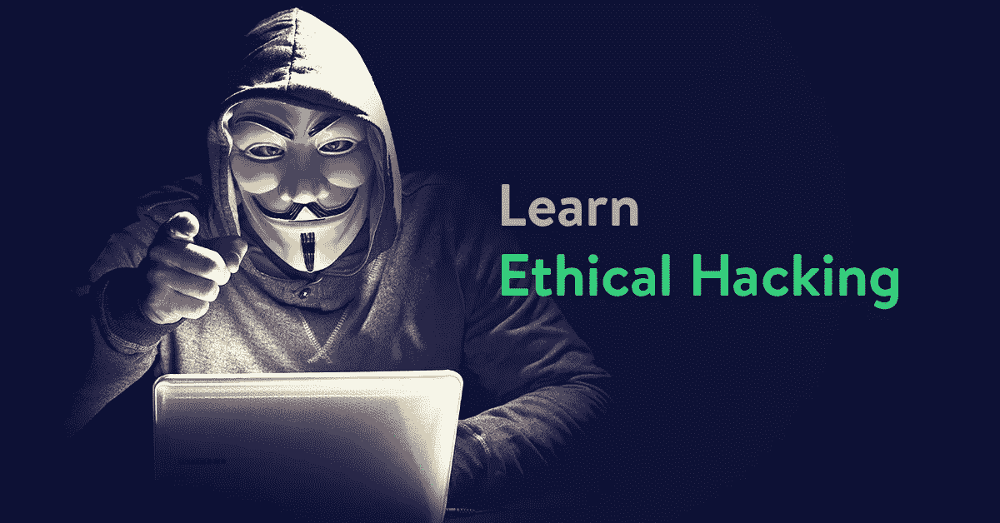
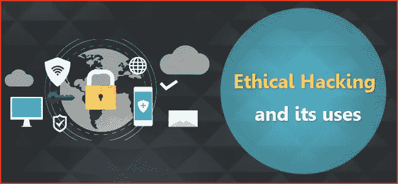
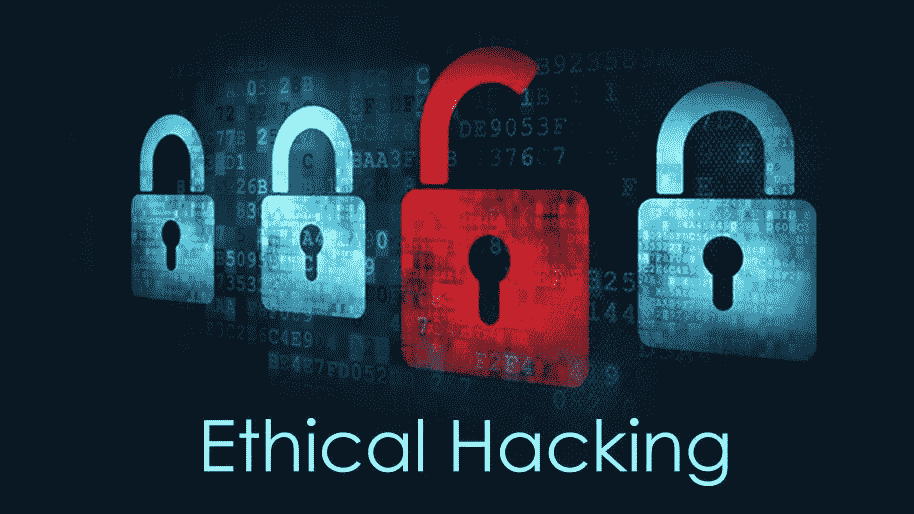
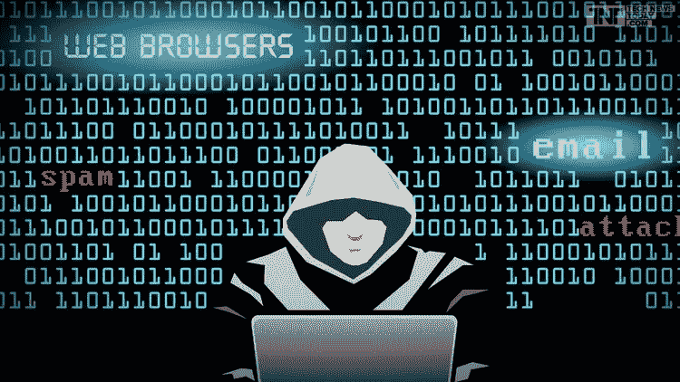

# 初学者的 10 个最佳道德黑客教程[2023 年 3 月]——在线学习黑客

> 原文：<https://medium.com/quick-code/the-best-ethical-hacking-video-tutorials-for-everyone-e0cbd465b03c?source=collection_archive---------0----------------------->

## 用 2023 年最佳新手伦理黑客教程学习网络安全伦理黑客。

## 1.[从头开始学习道德黑客](https://coursesity.com/r/site/learn-ethical-hacking-from-scratch)

成为一个有道德的黑客，能够像黑帽黑客一样入侵计算机系统，像安全专家一样保护计算机系统。

本课程侧重于渗透测试的实践方面，同时也不忽视每一次攻击背后的理论。在开始渗透测试之前，您将首先学习如何建立一个实验室并安装所需的软件，以便在您自己的机器上进行渗透测试。本课程中解释的所有攻击都是针对我实验室中的真实设备发起的。

本课程的结构将带您了解 linux、计算机系统、网络以及设备如何相互通信的基础知识。首先，我们将讨论如何利用这些系统来实施一些强大的攻击。本课程将带您从初学者到更高级的水平—当您完成时，您将拥有大多数渗透测试领域的知识。

本课程分为四个主要部分:

*1。网络渗透测试—* 本节将教您如何测试有线和无线网络的安全性。首先，您将学习网络如何工作、基本的网络术语以及设备如何相互通信。然后，它将分为三个子部分:

*   *预连接* : 在这一部分，我们仍然不太了解渗透测试——我们所有的就是一台带无线网卡的电脑。你将学习如何收集你周围的网络和计算机的信息，并在没有密码的情况下发起多种攻击，例如控制你周围的连接(即:拒绝/允许任何设备连接到任何网络)。您还将学习如何创建一个假接入点，吸引用户连接到它，并捕获他们输入的任何重要信息。
*   *获得访问权限*:现在你已经收集了周围网络的信息并找到了你的目标，你将学习如何破解密钥并获得对目标网络的访问权限。在本节中，您将学习许多破解 WEP/WPA/WPA2 加密的方法。
*   *Post Connection* :现在您有了目标网络的密钥，可以连接到它了。在本节中，您将了解一些针对网络和连接的客户端的强大攻击。这些攻击将允许您访问连接到您网络的任何设备访问的任何帐户，并读取这些设备使用的所有流量(图像、视频、音频、密码等)。

*2。获得访问权限—* 在本节中，您将学习两种完全控制任何计算机系统的主要方法:

*   *服务器端攻击:*通过这种方法，你将学习如何在不需要用户交互的情况下获得对计算机系统的完全访问权。您将学习如何收集有关目标计算机系统的信息，如其操作系统、打开的端口、安装的服务以及发现弱点和漏洞。您还将学习如何利用这些弱点来获得对目标的完全控制。最后，您将学习如何为您的发现生成不同类型的报告。
*   *客户端攻击—* 如果目标系统没有任何弱点，那么获得访问权限的唯一方法就是与用户进行交互。在这种方法中，您将学习如何发起大量强大的攻击来欺骗目标用户，让他们在自己的设备上安装后门。这是通过创建虚假的更新并提供给用户或者通过后门下载文件来实现的。您还将学习如何收集目标人物的信息，并使用社会工程将后门作为图像或任何其他文件类型发送给他们。

*3。漏洞利用后—* 在本节中，您将学习如何与目前已被您入侵的系统进行交互。您将学习如何访问文件系统(读/写/上传/执行)，保持您的访问权限，监视目标，甚至使用目标计算机作为入侵其他计算机系统的支点。

*4。Web 应用渗透测试—* 在本节中，您将了解网站是如何工作的。然后你将学习如何收集目标网站的信息，如网站所有者、服务器位置、使用的技术等等。您还将学习如何发现和利用许多危险的漏洞，如 SQL 注入、XSS 漏洞等。

在每一节的末尾，您将学习如何检测、预防和保护您的系统和您自己免受这些攻击。

本课程中的所有攻击都是针对任何计算机设备的实际攻击，例如:无论设备是手机、平板电脑、笔记本电脑等。每个攻击都以简单的方式进行了解释——首先，您将学习每个攻击背后的理论，然后您将学习如何使用 Kali Linux 进行攻击。

## 2.[道德黑客:道德黑客简介](https://linkedin-learning.pxf.io/c/1137078/646189/8005?u=https%3A%2F%2Fwww.linkedin.com%2Flearning%2Fethical-hacking-introduction-to-ethical-hacking&subId1=quickcode)

道德黑客是加强网络安全的关键，也是任何 it 安全专业人员最需要的技能之一。

在本课程中，您将学习:

*   道德黑客的重要性。
*   保护自己网络的基础知识。

如果你有兴趣成为一名有道德的黑客，或者开始保护你自己的网络，这篇介绍是为你准备的。本课程将帮助您探索当今的威胁形势，剖析主要的攻击媒介和攻击动机。

它确定了保护组织安全的各种方法，探索了有助于实施安全目标的策略。

## 3.[道德黑客终极课程](https://www.eduonix.com/ethical-hacking-ultimate-course/UHJvZHVjdC0zMjMyMDA=)

这个全面的课程将涵盖道德黑客的所有方面，以及与 Kali Linux 的集成。然而，这不仅仅是一门普通的基于理论的课程，而是一门实践性很强的课程，所以你不仅会阅读基础知识，而且你会实际上通过项目与它们一起工作！学习和实践道德黑客和渗透测试将为你的职业生涯打开许多大门。网络安全行业有很多就业机会，随着物联网成为明天的未来，会有令人惊叹的机会。

在这个广泛的课程结束时，你不仅会有完整的道德黑客知识，但你也将能够开始自己的职业生涯中的道德黑客，以及学习安全保护自己的设备免受恶意黑客。本课程旨在为您的所有道德黑客需求提供一站式服务！

## 4.[道德黑客:理解道德黑客](https://pluralsight.pxf.io/c/1137078/424552/7490?u=https%3A%2F%2Fwww.pluralsight.com%2Fcourses%2Fethical-hacking-understanding&subId1=quickcode)

本课程将使安全官员、网络管理员和任何关心网络基础设施完整性的人受益匪浅。

该课程包括:

*   生活在科技世界的真相
*   CEH 认证计划概述
*   如何搭建一个安全黑客的实验室
*   安装和配置您的 Windows 服务器虚拟机
*   安装和配置您的桌面虚拟机
*   信息安全概述
*   安全威胁和攻击媒介
*   黑客概念

您将学会从恶意攻击者的角度思考和看待您的网络。你将学会理解攻击者的动机。

所有系统管理员和安全专业人员都有责任保护他们的基础设施免受外部攻击者和公司内部攻击者的攻击。

您将涉及攻击者使用的术语,“黑客攻击”和“道德黑客攻击”之间的区别，黑客攻击的阶段，对系统的攻击类型，道德黑客需要获得的技能，安全策略的类型，为什么道德黑客是必不可少的，如何“了解”黑客世界发生的事情，谁是“黑客”,最大的安全攻击媒介是什么。

## 5.完整的道德黑客课程:从初级到高级！

了解如何使用 kali linux 进行道德黑客攻击、渗透测试、web 测试和 wifi 黑客攻击。

通过学习本课程，获得进行道德黑客和渗透测试的能力！从经验丰富的 IT 专家那里获得与您在本课程中所学内容相关的每个问题的答案，包括安装 Kali Linux、使用 VirtualBox、Linux 基础知识、Tor、Proxychains、VPN、Macchanger、Nmap、破解 wifi、aircrack、DoS 攻击、SLL 带、已知漏洞、SQL 注入、破解 Linux 密码，以及每月添加的更多主题。

## 6.[权威的道德黑客课程——从零开始学习](https://click.linksynergy.com/deeplink?id=Fh5UMknfYAU&mid=39197&u1=quickcode&murl=https%3A%2F%2Fwww.udemy.com%2Fkali-linux%2F)

了解道德黑客、渗透测试、Wifi 黑客的基本知识。

您将了解到世界上最强大的渗透测试平台之一。Kali Linux 是受到道德黑客青睐的最通用的渗透测试平台之一。

本课程将向您介绍 Kali Linux，并逐步解释如何在 Windows 10 机器上的虚拟环境中安装 Kali Linux。

您将学习如何安装 Kali Linux，设置根用户名和密码，安装 VirtualBox 来宾附件，Linux 内核等等！

还将向您介绍 Nmap 以及如何使用它进行安全扫描、端口扫描和网络探索。

这些视频还将指导您如何在虚拟环境中安装无线网卡，以便您可以扫描无线网络和设备，并利用 Kali Linux 环境中可用的许多无线安全工具。

您还将了解黑客如何使用恶意软件来感染受害者的计算机。此外，还将向您介绍 Python 以及如何将它用于道德黑客目的。

立即参加本课程，开始您的道德黑客之旅！

## 7.[终极道德黑客训练营——从初级到专业](https://click.linksynergy.com/deeplink?id=Fh5UMknfYAU&mid=39197&u1=quickcode&murl=https%3A%2F%2Fwww.udemy.com%2Fcybersecurity-ultimate-ethical-hacking-boot-camp%2F)

向世界著名黑客 Bryan Seely 学习道德黑客。从实物中学习真正的黑客秘密。

向世界著名的道德黑客学习道德黑客，他拥有马克·库班*亿万富翁科技企业家、《鲨鱼池》明星*和传奇网络安全专家约翰·迈克菲等人的专业支持。

本课程内容丰富，将带领一个网络安全和道德黑客的绝对初学者从零到能够真正入侵无线路由器、破解密码，并理解这些东西工作的原因。你会得到现场视频演示，讲座，在一些视频中，我会在镜头前解释一些事情。

我们谈论黑客攻击的过程，从侦察阶段收集信息，到扫描阶段更复杂地观察我们的目标。枚举和系统黑客攻击结束了基本的“黑客攻击过程”，但这并不是事情的结束，远非如此。

你在新闻中看到的许多今天的大型黑客和数据泄露都是非常聪明和坚持不懈的社会工程师的结果。社会工程师发现你不可能总是黑掉机器，有时黑掉使用机器的不知情的人要容易得多。学习进行社会工程渗透测试的宝贵技能，以及如何防范社会工程攻击。

您将会喜欢本课程中的演示，因为它们将带您了解整个过程，而不仅仅是重点部分。你可以跟随每一个演示，并把它们变成你自己的实践课程。

在短短的几个小时内，你将会发现使用我向你展示的软件工具和技巧的新方法，并想出新的东西来尝试。一旦你沉迷其中，就会上瘾。

## 8.[2016/2017 年完整的道德黑客课程！](https://click.linksynergy.com/deeplink?id=Fh5UMknfYAU&mid=39197&u1=quickcode&murl=https%3A%2F%2Fwww.udemy.com%2Fhacking-complete%2F)

获取黑客用来危害系统的知识，并用它来保护您自己的系统。

本课程将涵盖以下主题:

*   道德黑客入门
*   Linux 安装、终端基础知识和 Wireshark 设置
*   保持匿名在线，代理服务器，并使用 TOR 访问互联网的黑暗面
*   Aircrack-ng、HashCat 和 wifi 黑客
*   保护您自己的网络免受攻击
*   克隆网站
*   Arduino USB 键盘记录器，开箱即可用于 Windows 7、8、8.1 和 10
*   Windows power shell 脚本

## 9.[道德黑客基础课程——从零开始学习](https://click.linksynergy.com/deeplink?id=Fh5UMknfYAU&mid=39197&u1=quickcode&murl=https%3A%2F%2Fwww.udemy.com%2Fcomplete-ethical-hacking-course-2017-exploring-secrets%2F)

网络与安全，kali linux，道德黑客，网络安全，CISSP，道德黑客，渗透测试。

*   这项网络安全培训将使学生沉浸在一个互动的环境中，向他们展示如何扫描、测试、入侵和保护自己的系统。
*   实验室密集的环境为每个学生提供当前基本安全系统的深入知识和实践经验。
*   本课程是一门完整的道德黑客和测试课程。

## 10.[道德黑客的 Python 介绍](https://click.linksynergy.com/deeplink?id=Fh5UMknfYAU&mid=39197&u1=quickcode&murl=https%3A%2F%2Fwww.udemy.com%2Fpython-for-ethical-hacking%2F)

了解如何使用 Python 进行道德黑客攻击，并从头开始构建一个 Nmap 网络扫描器。

本课程仅供参考。课程是在一个封闭的网络中设计的。这些技术都不应该在公共网络上使用，因为如果你被抓住了，后果会很严重。

您将学习 Python 的基础知识，并学习如何在 Kali Linux 上安装 Python。您还将发现 PyCharm 的世界及其基本功能。您还将学习如何安装包括 Nmap 在内的模块。将向您介绍 Python 中的缩进和其他基本功能。学完本课程后，你将了解 Python 中的一些基本命令、条件语句、列表、数组和字典。还将向您介绍字符串以及如何操作字符串。了解如何在 Python 中管理、读取和操作文件和函数。在本课程结束时，你将能够建立自己的 Nmap 网络扫描器和自己的强力密码破解程序来执行合乎道德的黑客行为。

## 11.[使用 C++构建一个高级键盘记录程序来进行道德黑客攻击！](https://click.linksynergy.com/deeplink?id=Fh5UMknfYAU&mid=39197&u1=quickcode&murl=https%3A%2F%2Fwww.udemy.com%2Fhow-to-create-an-advanced-keylogger-from-scratch-for-windows%2F)

参加本课程，学习如何用 C++编写一个全功能的键盘记录程序，以便在 Windows 中使用。

如果你想学习 C++高级编程，或者从头开始构建自己的全功能高级键盘记录程序来学习道德黑客，我想你可能会喜欢这个课程。在这个课程中，你将会看到如何从零开始，按照我的步骤来创建一个高级的键盘记录程序。

这个键盘记录器能够记录所有的键盘和鼠标输入！它甚至可以独立于语言设置进行记录，因为它首先记录键盘上的物理键。接下来，通过使用具有人类友好名称的任意键映射，它将机器键翻译成我们可以理解的东西。它还拥有邮件发送功能，因此您可以安排日志文件通过邮件发送，比如每 12 小时发送一次。除此之外，它还将保持日志文件加密。因此，我们将创建另一个程序来解密你的日志文件。

对于学习 C++来说，这是一门理想的课程，因为它完全是动手学习，提供了一个功能性的最终产品。随着我的开发，一些未来的特性将被添加到键盘记录器课程中，包括但不限于截图、捕捉剪贴板内容(复制粘贴)、记录网站 URL 等等！立即参加本课程，立即观看视频，并获得您在课程中提出的每个问题的答案。

## 12.【2017 年终极道德黑客课程-真实世界示例

从初级到高级的专业级道德黑客和渗透测试-来自真实世界的经验。

如果你想学习符合职业标准的道德黑客和渗透测试，并在线帮助公司保护他们的数据，你会喜欢这个 Udemy 课程。

在这个高度实用的课程中，你将从一个经过认证的专业黑客&渗透测试员那里学到东西。为了成为一名专业水平的渗透测试者，你将获得关于现代笔测试者必须具备的实际细节。

本课程涵盖计算机攻击、网络攻击、Web 应用渗透测试和安全、漏洞利用、VAPT、自动攻击、防火墙和反病毒规避、面纱规避、暗网、无线攻击、社会工程攻击、最佳商业工具以及我从渗透测试的真实世界示例中获得的专业技巧。

本课程旨在让非技术背景的学生能够轻松学习并运用这些技能成为一名优秀的渗透测试员。

所有模块都是独立的，所以你可以开始任何你想要的模块，但我建议按照时间顺序学习课程。

## 13.[Wi-Fi 道德黑客大师](https://www.eduonix.com/master-in-wi-fi-ethical-hacking/UHJvZHVjdC0zMjMyMDA=)

本课程基于最新的工具和完整的实践基础。这个关于 Wi-Fi 黑客的课程解释了不同的技术，你可以攻击 WEP，WPA/WPA2 和 WPS 的 Wi-Fi 路由器。不断更新的新技术，攻击和安全。

破解无线网络会破坏无线局域网的安全性。一种常用的无线局域网是 wifi 网络。无线局域网有固有的安全弱点。

您将了解到:

*   破解任何 WIFI 网络密码
*   去认证或拒绝服务攻击
*   WIFI 干扰
*   如何保护您的无线网络
*   创建假的无线接入点
*   黑客攻击 wifi 网络的不同工具

> 感谢您阅读本文。我们策划了更多主题的顶级教程，您可能想看看:

 [## 学习 Kali—面向初学者的顶级 Kali Linux 教程—[2022 年更新]

### 了解 Kali for Linux 以及它如何与初学者的最佳 Kali 教程一起工作

medium.com](/quick-code/top-tutorials-to-learn-kali-linux-for-beginners-131a654b81ad)  [## 面向初学者的 15 门以上最佳 Python 课程——在线学习 Python

### 2022 年用最好的 Python 教程学习 Python，产生更清晰更有逻辑的代码

medium.com](/quick-code/top-tutorials-to-learn-python-programming-200a4283995f)  [## 10+最佳 Vue JS 初学者教程—在线学习 Vue JS

### 学习 VueJS 开始学习前端应用程序开发，最好的 VueJS 初学者教程在…

medium.com](/quick-code/top-tutorials-to-learn-vue-js-for-beginners-6c693e41091d) 

> **更新**:我们创建了最新版本的[顶级道德黑客教程](http://blog.coursesity.com/best-ethical-hacking-tutorials/?utm_source=botsfloor&utm_medium=referral&utm_campaign=mediumPost&utm_term=learn-EthicalHacking)。请随意查看年度最佳道德黑客教程。

***披露:*** *如果您通过本页的链接购买课程，我们可能会获得一小笔会员佣金。谢谢你。*