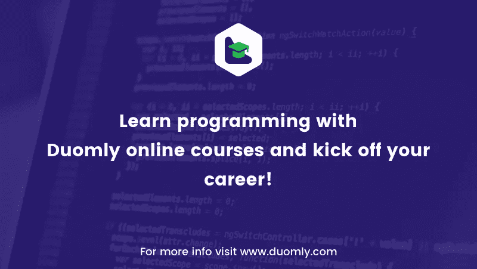

# 自 ES6 以来最新 Javascript 版本的最佳特性

> 原文：<https://medium.com/duomly-blockchain-online-courses/the-best-features-of-the-latest-javascript-version-since-es6-a46b7138c69a?source=collection_archive---------4----------------------->


[Duomly — programming online courses](https://www.duomly.com)

本文最初发布于:[https://www . blog . duomly . com/the-most-used-features-in-the-latest-JavaScript-since-es6/](https://www.blog.duomly.com/the-most-useful-features-in-the-latest-javascript-since-es6/)

2015 年 6 月，在中断六年后，Javascript 有了重大更新，带来了许多新功能。从那时起，我们每年都推出一个新版本，增加了一系列新功能，旨在帮助开发人员，提高我们的工作效率。为了帮助您跟踪 Javascript 版本，我将列出按版本分组的最有用的特性，并添加一些代码示例以便更好地了解。

## ES6 (ECMAScript 2015)

**1。箭头功能(= > )**

箭头函数是函数语法(= >)的简写。它为开发者带来了两个主要的开发工具。首先箭头函数帮助我们避免使用。bind()或其他用于应用适当 this 的方法，因为 arrow 函数与其周围的函数共享相同的词法 this。使用箭头函数的另一个好处是我们的代码看起来更好，它不像常规函数那样冗长。

```
// traditional function expression
var numbers = [2, 6, 40];
var twiceNum = numbers.map(function(number) { return number*2 })// arrow functional
var numbers = [2, 6, 40];
var twiceNum = numbers.map((number) => number*2);// lexical this
var greenBtn = document.getElementById(‘greenBtn’);
greenButton.addEventListener(‘click’, function() {
 this.style.backgroundColor = “red”; // no more binding
})
```

**2。类别**

尽管面向对象编程很有趣，但类可能是一个非常有用的特性。他们使得基于类模式编写代码变得非常容易。类支持原型继承、构造函数、超级调用以及实例和静态方法。让我们看看现在创建这个类有多容易:

```
// Class
class Person {
 constructor(firstName, lastName, age) {
   this.firstName = firstName;
   this.lastName = lastName;
   this.age = age;
 }sayHi() {
   return ‘Hi, my name is ${firstName}. Nice to meet you.’;
 }
}
```

**3。模板字符串**

可能在上面的例子中，你意识到我没有使用加号来给字符串添加变量。ES6 实现了一个非常有用的特性，叫做模板字符串。它允许我们在不中止变量的情况下，在字符串中实现变量。把变量放在花括号里，在 is 前面放$ sign 就够了。将字符串放入“`”中也很重要。在构造 API 请求时，这可能非常有用。让我们看一下代码:

```
var name = ‘Peter’, city = ‘London’;
// Before ES6
var greeting = ‘Hello, my name is ‘ + name + ‘. I am from ‘ + city + ‘.’;// After ES6 
var greeting = `Hello, my name is ${name}. I’m from ${city}.`
```

聪明又简单，对吧？

**4。假设和常数**

ES6 实现了两个新的关键字:const 和 let。两者都是用来声明变量的。Let 的工作方式与 var 非常相似，但是变量有块范围，所以它只在声明的代码块中可用。Const 用于声明常数。它的工作方式类似于 let，但是您需要在声明 const 的同时赋值。让我们来看看代码示例:

```
// Let — variable is available only in the block of code
function calculate(x) {
 var y = 0;
 if (x > 10) { // let y is only available in this block of code
   let y = 30;
   return y;
 }
 return y;
}
```

**5。承诺**

ECMAScript 2015 creators 还为我们提供了标准化的 Promise 实现，这非常有用，尽管我们现在经常使用异步编程。我们再也不用担心回调地狱了。承诺总是处于三种状态之一:待定、履行或拒绝。你也有。then()方法在承诺被解析或。catch()方法来检查它被拒绝的原因。让我们看一下代码:

```
const checkResult = () => new Promise(resolve, reject) => {
setTimeout(resolve, 500)} 
checkResult()
 .then((result) => { console.log(result); }) 
 .catch((error) => { console.log(error); })
```

## ES7 (ECMAScript 2016)

**1。Array.prototype.includes**

在 ES7 中出现了一个新的数组方法。。includes()方法使得检查某个值是否在数组中变得更加容易。以前开发人员使用 indexOf，必须创建一个额外的函数来检查这一点，现在我们可以使用。包括()，如果数组有特定的元素，它将返回 true，否则返回 false。让我们来看一个代码示例:

```
var fruits = [‘banana’, ‘apple’, ‘grape’, ‘nut’, ‘orange’];
var favoriteFruit = ‘banana’;// Before ES7
function isFruit(fruit) {
 if (fruits.indexOf(fruit) !== -1) {
   return true;
 } else {
   return false;
 }
}
isFruit(favoriteFruit); // returns true// After ES7
fruits.includes(favoriteFruit); // returns true
```

**2。求幂运算符**

这对于从事更高级数学运算、3D、VR 或数据可视化的开发人员来说最为重要。以前，这可以通过 loop、Math.pow()或递归函数来完成，现在这种方式简单多了。让我们来看看一些代码:

```
// Before ES7 (loop case) 
function calculate(num, exponent) { 
   var res = 1; 
   for (var i = 0; i < exponent; i++) { 
     res *= num; 
   } 
   return res;
}// After ES7
const calculate = (num, exponent) => num ** exponent;
```

很简单，对吧？

## ES8 (ECMAScript 2017)

**1。Object.values()和 Object.entries()**

ECMAScript2017 中实现的 Object.values()方法允许我们获取对象的所有值，并将它们作为数组返回。ES8 中关于 Object 的另一个有用的特性是 Object.entries()方法。它允许我们获取所有条目，并将它们显示为数组的数组。让我们来看看一些代码:

```
var person = {
 name: ‘Jenny’,
 age: 24,
 country: ‘UK’,
 city: ‘London’,
}// Object.values()
var arrJenny = Object.values(person); // returns [‘Jenny’, 24, ‘UK’, ‘London’];// Object.entries()
var arrJennyEntries = Object.entries(person); // returns [[‘name’, ‘Jenny’], [‘age’, 24], [‘country’, ‘UK’], [‘city’, ‘London’]];
```

**2。String.prototype.padEnd()和 String.prototype.padStart()**

ES8 中也有一些新的字符串。当您的字符串没有足够的长度时，您可以使用其中一种新方法来添加一些字符，直到它达到所需的长度。padEnd()将在字符串的末尾添加选定的字符(默认情况下是空格)，并在开头添加 padStart()。让我们来看看它在示例中是如何工作的:

```
var string = ‘Alice’; 
// padStart() — we assume our string needs to have 10 characters 
string.padStart(10, ‘o’); // returns ‘oooooAlice’// padEnd() 
string.padEnd(10, ‘o’); // returns ‘Aliceooooo’;
```

**3。异步功能(异步/等待)**

在 ES8 中，creators 为我们提供了另一种替代回调和异步编程的方法，那就是 async/await 函数。异步函数定义了一个异步函数，它返回一个将被解析或拒绝的承诺。还有就是。await()运算符，在异步函数中使用，它等待一个承诺。异步函数为我们提供了更友好的语法。让我们来看看一些代码:

```
function delayResult() {
 return new Promise(resolve => {
   setTimeout(() => {
     resolve(‘Done’);
   }, 5000)
 })
}async function getResult() {
 var result = await delayResult();
 return result;
}getResult();
```

## ES9 (ECMAScript 2018)

**1。异步迭代**

随着 ES9 creators 增加了异步迭代，这意味着您可以通过使用 await 来声明异步循环。但它可能只在数据来自同步源的情况下使用，所以我们不能从 https fetch 异步迭代数据。让我们看一下代码示例:

```
for await (let book of books) { 
 console.log(book) 
};
```

**2。休息操作员**

ECMAScript2019 还为 rest 操作符带来了新的行为。现在，它可以将对象文本中没有提到的剩余对象键值对复制到操作数中。rest 运算符应该用在末尾；否则，会导致错误。此外，也可以在函数中使用它并获得所需的属性。让我们看一个例子来更好地理解它:

```
const fruits = { orange: 1, apple: 10, banana: 4, } 
const { orange, …rest } = fruits; 
console.log(rest); // { apple: 10, banana: 4 };// in the function
function getFruits(apple, …rest) { 
 return rest.banana;
}
```

**3。无极.原型.最终**

ES9 附带的另一个有用的特性是。最后()，对 Promise 的另一个回调，无论是否。然后()或。catch()被调用。如果你需要在承诺之后采取行动，不管成功与否，这可能是有用的。让我们看一下代码:

```
const checkResult = () => new Promise(resolve, reject) => {setTimeout(resolve, 500)}checkResult() 
 .then((result) => { console.log(result); }) 
 .catch((error) => { console.log(error); }) 
 .finally(() => { console.log(‘Promise finished!’) })
```

**结论**

自 2015 年 ES6 以来，我们经历了 Javascript 最有用的更新，而不是每一次。有很多变化你可能今天才知道。请记住，使用它来更新您的编程知识并使您的代码更智能、更短、更干净是非常重要的。另外，加入 [Javascript 课程](https://www.duomly.com/course/javascript-course)来掌握你的知识。



[Duomly — programming online courses](https://www.duomly.com)

感谢您的阅读。

这篇文章是由我们的队友安娜创作的。