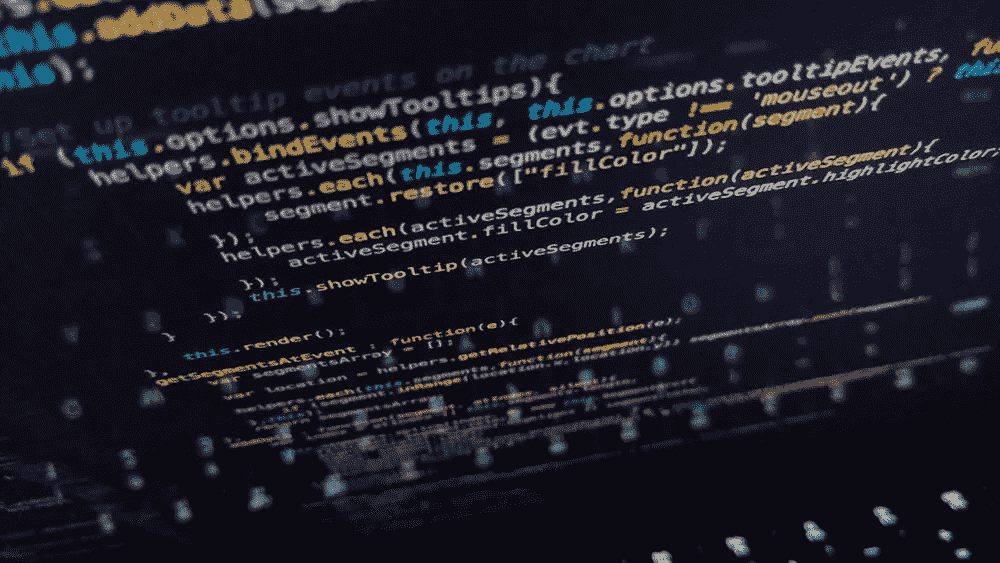

# 2019 年免费在线编程课程的 10 个最佳网站

> 原文：<https://medium.com/quick-code/the-best-free-resources-to-learn-programming-online-in-2019-4dfe23a62c7f?source=collection_archive---------0----------------------->

## 通过免费的在线编程课程学习编码和编程。

软件开发是 2019 年最热门的职业选择。知道如何编程会让你比其他人更有优势。我们已经创建了最好的免费学习编程的在线资源。免费学习编码，发展你的事业。

# [1。快速代码](http://www.quickcode.co)

Quick code 是查找与编程和开发相关的免费在线课程的首选网站。快码每天都会策划新的免费课程。这是一个关于 web 开发、移动开发、大数据、机器学习、数据库、数据科学、聊天机器人、加密货币等免费课程的地方。—无论你在学什么。

# 2. [Udemy](https://click.linksynergy.com/deeplink?id=Fh5UMknfYAU&mid=39197&u1=quickcode&murl=https%3A%2F%2Fwww.udemy.com%2Fcourses%2Fdevelopment%2F%3Fprice%3Dprice-free%26sort%3Dpopularity)

Udemy 有 1200 门与编程和开发相关的免费在线课程。Udemy 是全球领先的教学市场，将世界各地的学生与世界各地最好的教学联系起来。通过这些在线课程，从零开始学习编码或构建网站。主题包括 web 开发、IOS 移动应用、android 到游戏开发等等。

# [3。Coursera](https://click.linksynergy.com/deeplink?id=BuGceriufQM&mid=40328&u1=quickcode&murl=https%3A%2F%2Fwww.coursera.org%2Fbrowse%2Fcomputer-science)

Coursera 上的每一门课程都是由世界上最好的大学和教育机构的顶级讲师授课。课程包括录制的视频讲座、自动评分和同行评议的作业以及社区论坛。当您完成一门课程时，您将收到一份可共享的电子课程证书。

# [4。技能分享](https://skillshare.eqcm.net/c/1137078/298081/4650?u=https%3A%2F%2Fwww.skillshare.com%2Fbrowse%2Ftechnology%3FenrollmentType%3Dfree%26via%3Dall-technology%26seeAll%3D1)

Skillshare 是一个在线学习社区，有数以千计的设计、商业、技术等课程。任何人都可以加入社区中的数百万成员，学习前沿技能，与同龄人交往并发现新的机会。其目的是让新经济成为一个开放的精英政治，任何愿意学习的人都可以获得成功所需的技能和专业知识。

# [5。快速入门](https://click.linksynergy.com/deeplink?id=BuGceriufQM&mid=42440&u1=quickcode&murl=https%3A%2F%2Fwww.quickstart.com%2Fhot-deals%2Ffree-courses.html&LSNSUBSITE=LSNSUBSITE)

QuickStart 是免费的在线 IT 课程，提供结业证书。QuickStart 与 edX 和来自全球各地的主题专家合作，提供了许多课程，您可以参加这些课程来提高您的技术技能并推进您的 IT 职业生涯。注册免费课程，开始您的 IT 培训。

# [6。edX](https://www.awin1.com/cread.php?awinmid=6798&awinaffid=466009&clickref=&p=https%3A%2F%2Fwww.edx.org%2Fcourse%2Fsubject%2Fcomputer-science)

参加免费的在线计算机编程课程，提高你的技能，促进你的职业发展。在 *edX* 上学习计算机编程和其他受欢迎的课程，这些课程来自世界各地的顶尖大学和机构。其使命是让每个人在任何地方都能获得高质量的教育，加强校园和网络的教学，并通过研究推进教学。

# [7。Code.org](https://code.org/)

Code.org 在美国最大的学区提供 K-12 计算机科学的领先课程，Code.org 还组织了一年一度的代码小时活动，该活动吸引了全球 10%的学生。Code.org 得到了慷慨捐助者的支持，包括亚马逊、脸书、谷歌、印孚瑟斯基金会、微软等等。

# [8。免费代码营](https://www.freecodecamp.org/)

freeCodeCamp 是一个由捐赠人支持的免税 501(c)(3)非营利组织。这个任务是帮助人们免费学习编码。它通过创建数以千计的视频、文章和交互式编码课程来实现这一目标——所有这些都免费提供给公众。它还在世界各地拥有数千个 freeCodeCamp 学习小组。

您可以通过完成 5 个最终项目获得每项认证，所有这些都是 100%免费的。如果您是编码新手，我们建议您从头开始。

# [9。乌达城](https://www.udacity.com/)

通过 Udacity 提供的、与世界上最具前瞻性思维的公司(谷歌、脸书、美国电话电报公司、IBM、GitHub 等)共同创建的各种计划，让行业做好准备。通过参与基于行业领导者面临的全球挑战的项目，培养实践技能。

# [10。学习代码学院](https://www.youtube.com/user/learncodeacademy)

学习代码学院布朗斯给你 100%免费的网页开发教程，网站设计教程等。包括但不限于:HTML、CSS、JavaScript、CSS 布局、响应式设计、React.js、Node.js、Angular.js、Docker、Dev Ops、服务器管理、部署策略。

# [11。新波士顿](https://www.youtube.com/user/thenewboston)

新波士顿是 YouTube 的一个频道，提供计算机相关的教程，包括编程教程、技巧和其他有用的视频。该频道中有用且受欢迎的计算机编程视频包括“R 编程教程— 1 —什么是 R？”以及“计算机网络教程— 10 —什么是协议？”《新波士顿》目前拥有超过 210 万订阅用户和超过 1.69 亿的浏览量。