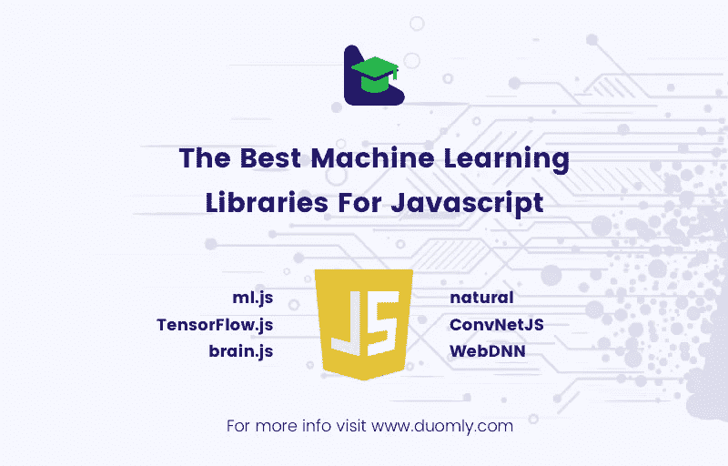

# Javascript 的最佳机器学习库

> 原文：<https://medium.com/duomly-blockchain-online-courses/the-best-machine-learning-libraries-for-javascript-ccfe554e74d9?source=collection_archive---------3----------------------->

[Duomly — programming online courses](https://www.duomly.com)

本文最初发表于:[https://www . blog . doomly . com/6-top-machine-learning-libraries-for-in-JavaScript-2019/](https://www.blog.duomly.com/6-top-machine-learning-libraries-for-javascript-in-2019/)

通常，人们使用两种编程语言中的一种来应用机器学习(ML)方法和算法:Python 或 r。关于机器学习的书籍、课程和教程通常也使用这两种语言中的一种(或两种)。

Python 是一种通用编程语言，不仅用于机器学习，还用于科学计算、后端 Web 开发、桌面应用程序等。r 主要是为统计学家创造的。然而，它们至少有两个共同的特征:

*   它们适合非程序员，
*   他们有全面的 ML 库。
*   在许多情况下，ML 算法是用 Fortran、C、C++或 Cython 实现的，并从 Python 或 r 中调用。

Java 也用于机器学习，但通常由专业程序员使用。

在过去的几年里，JavaScript 变得越来越流行，一些非常有趣的机器学习库出现了，支持在浏览器或 Node.js 上实现 ML 方法。令人惊讶的是，许多这样的库在 JavaScript 本身中实现了很多代码。

本文介绍了几种用于 JavaScript 的 ML 开源库:

*   ml.js，
*   TensorFlow.js，
*   brain.js，
*   ConvNetJS，
*   WebDNN，
*   很自然。

# **ml.js**

ml.js 是一个全面的、通用的 JavaScript ML 库，适用于浏览器和 Node.js。

*   对数组、哈希表、排序、随机数生成等的位操作。,
*   线性代数，数组操作，优化(Levenberg-Marquardt 方法)，统计学，
*   交叉验证，
*   监督学习，
*   无监督学习。

支持的监督学习方法有:

*   线性、多项式、指数和幂回归，
*   k-最近的邻居，
*   朴素贝叶斯，
*   支持向量机，
*   决策树和随机森林，
*   前馈神经网络等。

此外，ml.js 提供了几种无监督的学习方法:

*   主成分分析，
*   聚类分析(k-means 和分层聚类)，
*   自组织地图(Kohonen 网络)。

执照:麻省理工学院。

# TensorFlow.js

TensorFlow 是最流行的机器学习库之一。重点介绍各种类型和结构的人工神经网络，包括深层网络，以及网络的组成部分。TensorFlow 由谷歌大脑团队创建，用 C++和 Python 编写。但是，它可以与多种语言一起使用，包括 JavaScript。

TensorFlow 是一个非常全面的库，仍然可以轻松构建和培训模型。它支持各种网络层、激活功能、优化器和其他组件。它具有良好的性能，并提供图形处理器支持。

TensorFlow.js 是一个在浏览器或 Node.js 上使用的 JavaScript ML 库，它支持 WebGL。

许可证:Apache 2.0。

# **brain.js**

brain.js 是一个用 JavaScript 编写的库——专注于训练和应用前馈和递归神经网络。它还提供了额外的工具，比如神经网络所必需的数学例程。

它提供了高级选项，如:

*   使用 GPU 训练网络
*   可以并行适应多个网络的异步训练
*   交叉验证是一种更复杂的验证方法

brain.js 将模型保存到 JSON 文件或从 JSON 文件加载模型。

执照:麻省理工学院。

# ConvNetJS

ConvNetJS 是另一个用于神经网络和深度学习的库。它能够在浏览器中训练神经网络。除了分类和回归问题之外，它还有强化学习模块(使用 Q-learning ),仍处于实验阶段。ConvNetJS 为擅长图像识别的卷积神经网络提供支持。

在 ConvNetJS 中，神经网络是层的列表。它提供了以下层:

*   输入(第一)层
*   全连接层
*   卷积层
*   汇集层
*   局部对比度标准化层
*   分类器丢失(输出)层:softmax 和 svm
*   使用 L2 的回归损失(输出)图层

它支持几个重要的激活功能，如:

*   热卢
*   乙状结肠的
*   双曲正切
*   最大输出

以及优化器，例如:

*   随机梯度下降
*   阿达德尔塔
*   阿达格拉德
*   ConvNetJS 还提供了一种将模型保存到 JSON 文件和从 JSON 文件加载模型的便捷方式。

执照:麻省理工学院。

# WebDNN

**WebDNN** 是一个专注于深度神经网络的库，包括具有 LSTM 架构的递归神经网络。它用 TypeScript 和 Python 编写，并提供 JavaScript 和 Python APIs。

它还提供了在浏览器中执行 GPU 的可能性。

WebDNN 的一个非常方便的特性是可以转换和使用预先用 PyTorch、TensorFlow、Keras、Caffemodel 或 Chainer 训练的模型。

执照:麻省理工学院。

# 自然的

natural 是一个 JavaScript 库，用于 Node.js 的自然语言处理。

它支持:

*   标记化(将文本分解成字符串数组)
*   字符串距离的计算
*   匹配相似的字符串
*   分类(朴素贝叶斯、逻辑回归和最大熵)
*   情感分析(目前有八种语言)
*   语音匹配、词尾变化、n-gram 等。

执照:麻省理工学院。

# **结论**

在过去的几年里，JavaScript 和机器学习都得到了越来越多的关注和普及。虽然最初创建 JavaScript 是为了实现网页的动态行为，但它已成为实现和应用机器学习方法的首选语言之一，尤其是在浏览器或服务器中(Node.js)。

本文提供了 JavaScript 机器学习库可用性的初始信息。

尽情探索吧！

[Duomly — programming online courses](https://www.duomly.com)

感谢您的阅读！

这篇文章是我们的队友米尔科准备的。