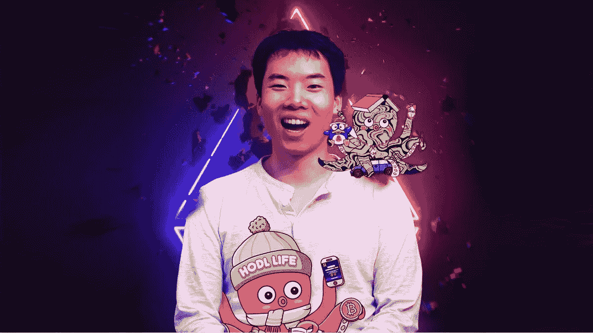
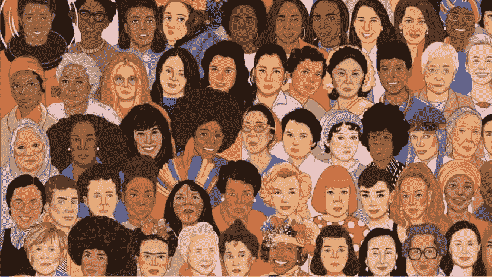

# 最佳 NFT 大师指南🤓

> 原文：<https://medium.com/quick-code/the-best-nft-master-guide-780046084e4f?source=collection_archive---------1----------------------->

问候开发者！👋

你知道吗，多亏了 NFT，人们成功地将荷马·辛普森和青蛙佩佩的照片卖出了 32 万美元，甚至一条简单的五个字的推特也卖到了 290 万美元。在我的整个互联网生涯中，我还没有看到任何一种趋势像非功能性互联网那样吸引了市场。

因此，Ben Yu，一个企业家，一个哈佛的辍学生，一个成功的加密投资者，正在举办一个关于 Nasacdemy 的免费研讨会，让你了解什么是 NFT，以及不可替代令牌背后的机制。✨

## [**进入 NFT 空间前必须知道的 7 件事**](https://nasacademy.pxf.io/c/1137078/1184472/14724?u=https%3A%2F%2Fnasacademy.com%2FBenYuNFTworkshop&subId1=coursesityEmail)

嗯，你会同意，当你试图突破一个新的市场或业务时，基础知识大有帮助，NFTs 也是如此。简而言之，NFT 使用区块链技术能够无可争议地验证谁是数字产品的原始所有者，当你知道如何以正确的方式投资这些数字产品时，购买它们会非常有利可图。

记住这一点，有一个复杂而深入的课程，你可以在那里了解为什么非功能性测试有价值，为什么它们是革命性的。你将学会如何建立一个加密钱包，并从二级市场购买/出售 NFT。此外，你将学习如何铸造你自己的 NFTs，并开始向世界出售你的艺术或你的项目。

这个“如何在 7 天内掌握 NFTs”是由 Ben Yu 创建的，他是一个成功的加密投资者，也是“好奇的 Addys”项目的幕后人员，该项目从头开始教你关于加密的知识。

## [**7 天内掌握 NFTs**](https://nasacademy.pxf.io/c/1137078/1184472/14724?u=https%3A%2F%2Fnasacademy.com%2FBenYuNFT&subId1=coursesityEmail)

近年来，NFT 以一种前所未有的方式占领了市场，并且正在永远地转变“数字所有权”。然而，尽管 NFTs 发展迅速，但只有少数优秀的新手指南。因此，如果你有兴趣了解在这个市场上从哪里开始，你可以查看“NFTEASY:兰迪·扎克伯格非功能性测试初学者指南”。

扎克伯格媒体公司的首席执行官兰迪·扎克伯格将指导你如何学习 11 个最有用的密码术语，让区块链变得轻而易举。你还将了解什么是 NFT，为什么他们给艺术家一个动力，以及通过跳过成长的烦恼和避免大多数人在开始时犯的错误，NFT 在各行业的应用

## [**NFTEASY:NFTs 入门指南**](https://nasacademy.pxf.io/c/1137078/1184472/14724?u=https%3A%2F%2Fnasacademy.com%2Frandizuckerberg&subId1=coursesityEmail)

你可以购买你的 NFT 作为一个单一的产品或一个完整的系列，因为 NFT 是在系列或奇点中创造和销售的。例如，你可以购买一整套复仇者联盟的 NFT，其中包含你最喜欢的超级英雄，如雷神、美国队长或绿巨人。这就带来了一个问题，如果你正在投资甚至创建自己的 NFT 收藏，那么你应该寻找什么？

这就是 Zeneca 的“如何启动 NFT 项目”课程发挥作用的地方。在这里，你将学到推出人们会投资的 NFT 系列所需的技能、软件和知识。你也会明白 Web3 社区的潜规则，以及如何建立你的梦之队。🥇

## [**如何启动一个 NFT 项目**](https://nasacademy.pxf.io/c/1137078/1184472/14724?u=https%3A%2F%2Fnasacademy.com%2Fzeneca&subId1=coursesityEmail)

你知道吗，作为一名艺术家或创作者，你可以利用 NFTs 提供的平台来改善社会，并创造关于心理健康和反种族主义的意识？Maliha Abidi 是一名社会工作者，他的工作主要集中在妇女权利方面，这是一门内容丰富的免费课程，将帮助您了解任何人如何作为创作者、贡献者或艺术家在该领域发挥积极作用。

通过 Nasacdemy 为您带来的“在 NFT/加密空间内创造社会影响”课程，您将了解关于该空间的常见投诉，如何将区块链/NFT 用于公益，以及它是如何工作的？您还将了解作为艺术家为社区做出贡献的不同方式。

## [**在 NFT/密码空间内创造社会影响**](https://nasacademy.pxf.io/c/1137078/1184472/14724?u=https%3A%2F%2Fnasacademy.com%2Fmalihaabidi&subId1=coursesityEmail)

要想在生活和事业上获得成功，你需要的不仅仅是一个好的学习者。你需要成为一个积极的学习者，Coursesity 毫不怀疑，通过在家里舒适地学习这些富有成效的 NFT 技能，你将成功地实现你的目标。🙌

现在，让我们继续关注面向开发人员和程序员的趋势编程文章。我希望这些帖子对你有所帮助和启发。💡✨

*   [为您的设计系统建立测试规则](/quick-code/build-testing-rules-for-your-design-system-e83500b25)
*   [提升 ReactJS 网站开发水平的技巧和诀窍](/quick-code/tips-and-tricks-to-level-up-your-reactjs-web-development-aba41a1012e4)
*   [内置 Python 函数 map()，filter( ) & reduce()，你现在就要学会。](/quick-code/built-in-python-functions-map-filter-reduce-you-should-literally-learn-right-now-9213cbfe4bad)

特别感谢我们的贡献者——[背光](https://medium.com/u/314fe9cc699d?source=post_page-----780046084e4f--------------------------------)、 [Bhargav Kuvadiya](https://medium.com/u/f6357761a3e9?source=post_page-----780046084e4f--------------------------------) 、[不精确解决方案](https://medium.com/u/1ad33f99d50b?source=post_page-----780046084e4f--------------------------------)

如果你喜欢，请随意转发或发推文给你的朋友。加入我们，达到 20K 会员的里程碑。谢谢你，❤