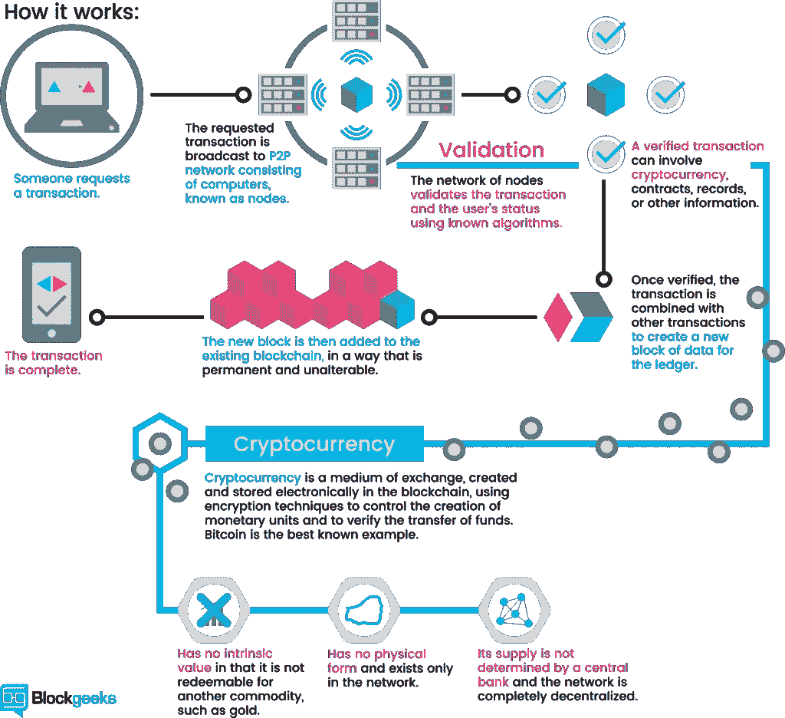

# 6 门最适合初学者的加密货币交易课程[2023 年 3 月]—在线学习加密货币交易

> 原文：<https://medium.com/quick-code/the-best-online-guide-to-learn-about-cryptocurrency-ec2560cd570e?source=collection_archive---------1----------------------->

## 学习加密货币交易了解如何用 2023 年最适合初学者的加密货币课程进行加密货币交易。

你想了解加密货币的工作原理吗？确实想投资比特币、以太坊、Dashcoin、莱特币、ICOs，但是不知道怎么做？我们收集了最好的在线教程，这些教程将解释关于加密货币和投资策略的一切。我们的[免费加密货币课程](https://coursesity.com/free-courses-learn/cryptocurrency)是初学者的良好起点。

# 1.[完全初学者加密货币介绍](https://click.linksynergy.com/deeplink?id=Fh5UMknfYAU&mid=39197&u1=quickcode&murl=https%3A%2F%2Fwww.udemy.com%2Fintroduction-to-crypto-currency-for-complete-beginners%2F)

任何想学习加密货币、比特币、另类硬币、投资和赚钱的人都可以报名参加这个课程。本课程将帮助初学者打下使用加密货币的知识基础。你将学习货币的历史。你将了解加密货币的基础知识和术语。你将深入了解加密货币和区块链背后的技术。本课程将为您提供提示和技巧以及一些有用的工具来开始使用 crypto。您将学习有价值的实践演示，帮助指导您完成从安装钱包到购买和提取硬币的每个步骤。

5 best CryptocCurrency Courses online

## 2.[比特币和加密货币技术](https://coursera.pxf.io/c/1137078/1213622/14726?u=https%3A%2F%2Fwww.coursera.org%2Flearn%2Fcryptocurrency&subId1=BotTutorials)

比特币是如何运作的？比特币的与众不同之处在哪里？你的比特币有多安全？比特币用户匿名程度如何？比特币的价格是由什么决定的？加密货币可以监管吗？未来会怎样？

在本课程中，您将学习:

*   关于比特币和其他加密货币。
*   如何获得设计与比特币网络交互的安全软件所需的概念基础。
*   如何在自己的项目中融入来自比特币的想法？

了解加密构建块(“原语”)，推理它们的安全性，并研究如何使用这些原语构建简单的加密货币。

了解比特币的共识机制和关于其安全性的理由，并了解安全性如何来自技术方法和聪明的激励工程的结合。

了解比特币协议的各个组成部分如何让整个系统运转起来:交易、脚本、区块和对等网络。

探索在实践中如何使用比特币:存储比特币密钥的不同方式、安全措施以及允许您使用比特币进行交易的各种类型的服务。

了解提高比特币匿名性和隐私性的各种方法，并了解比特币在丝绸之路和其他隐藏市场中的作用。

看看比特币和加密货币技术的世界对人类世界的所有影响。

你将讨论社区、比特币内部的政治以及比特币与政治互动的方式，以及执法和监管问题。

# 3.[加密货币基金会](https://linkedin-learning.pxf.io/c/1137078/646189/8005?u=https%3A%2F%2Fwww.linkedin.com%2Flearning%2Fcryptocurrency-foundations&subId1=quickcode)

最受欢迎的比特币正在成为合法的全球货币。

该课程包括:

*   什么是加密货币？
*   创造加密货币
*   加密货币挖掘

在这里，您将了解如何创建、交易和挖掘加密货币的基础知识。

本课程回顾了底层技术——区块链数据库、哈希和密码学——并解释了任何人如何创建一种加密货币并提供使用。

它还讨论了挖掘的过程以及成为加密货币挖掘者所需的硬件和软件。

# 4.[使用开源工具的加密货币取证(OSINT)](https://www.eduonix.com/cryptocurrency-forensics-using-open-source-tools-bitcoin-and-ethereum-real-life-case-investigation/UHJvZHVjdC0zMjMyMDA=)

学习实际案例和基于项目的学习

该课程包括:

*   加密货币取证—基本软件安装演示
*   加密货币取证—真实案例
*   加密货币取证-项目工作

本课程的目标是学习加密货币取证的基本概念。完成课程后，参与者将能够理解加密货币犯罪以及使用开源工具进行取证的方法。

探索加密货币很麻烦，因为它具有匿名性。本课程将使您能够使用开源工具解决现实生活中的案件，对各种交易进行在线取证分析，识别联系和相似性，使用加密货币描述和缩小犯罪范围，揭露和识别钱包提供商，查找 IP 地址，探索暗网和非法市场，搜索可疑操作。

本课程重点介绍对各种现实生活中可能涉及各种加密犯罪的加密货币地址进行远程取证分析(使用互联网连接)的方法。

这是一门基于项目的课程(学习),要求学员完成该课程以应用所学的技能。

# 5.[比特币和加密货币](https://www.awin1.com/cread.php?awinmid=6798&awinaffid=466009&clickref=quickcode&ued=https%3A%2F%2Fwww.edx.org%2Fcourse%2Fbitcoin-and-cryptocurrencies)

了解比特币和加密货币空间的基础知识，包括智能合约的基础知识、以太坊平台以及如何构建去中心化的应用程序。

在本课程中，您将学习:

*   集中/分散货币的基本属性和意图，以及对比特币的深入理解，包括身份、交易、记录保存和共识。
*   比特币在赛博朋克运动和自由主义理想中的根源，以及比特币相对于其早期前辈的革命性意义。
*   比特币背后的机制，如比特币网络、加密和加密哈希函数、比特币脚本、隐私和哈希承诺方案。
*   比特币的现实世界，如钱包、钱包机制、采矿、交易和比特币治理，以及人们与比特币网络互动的各种方式。
*   如何摧毁比特币，包括各种网络攻击。
*   第二大区块链平台以太坊背后的属性，包括以太坊虚拟机和图灵完全性的思想，比特币和以太坊的关键协议差异，以太坊的用例。

本课程介绍了比特币和加密货币作为区块链技术的动力，并对加密空间的基本概念进行了全面深入的概述，特别强调了比特币。

该课程涵盖比特币的基本属性、其背后的机制(例如，包括加密哈希函数、比特币脚本、隐私和哈希承诺方案)及其在赛博朋克运动和自由主义理想中的根源。

您将了解比特币的实际应用，如钱包和采矿，以及如何销毁比特币，包括网络攻击和恶意挖掘策略。

您还将简要了解以太坊以及如何在加密货币之外使用区块链。

# 6.[终极加密货币投资计划+附加项目](https://click.linksynergy.com/deeplink?id=Fh5UMknfYAU&mid=39197&u1=quickcode&murl=https%3A%2F%2Fwww.udemy.com%2F1-ultimate-crypto-currency-investing-program-extras%2F)

本课程将教你如何在最短的时间内做好购买、出售和交易加密货币的准备。本课程将加速您的理解，这样您就不必浪费宝贵的时间通过尝试和财务错误来学习，或者花费无尽的时间在互联网上搜索如何使用加密货币做每一件小事！！

How cryptocurruncy works

> 感谢您阅读本文。我们策划了更多主题的顶级教程，您可能想看看:

 [## 面向初学者的 10+最佳加密货币课程—在线学习加密货币

### 学习加密货币课程，在 2021 年为初学者提供最佳加密货币教程，以增加您的利润

medium.com](/quick-code/top-10-online-courses-to-learn-about-cryptocurrency-in-2018-1486628655b5)  [## 以太坊的 10+最佳坚固性教程——在线学习坚固性

### 用 2021 年最佳新手坚实度教程学习撰写智能合同的坚实度

medium.com](/quick-code/top-tutorials-to-learn-ethereum-solidity-at-different-level-23700a04ae80)  [## 初学者的 7 门最佳加密货币课程—在线学习加密货币

### 了解加密货币，如比特币，以太坊，Altcoin，Dashcoin，区块链，ICO 与最好的加密货币…

medium.com](/quick-code/top-free-online-courses-to-learn-about-cryptocurrency-for-beginners-de83842c601b) 

披露:我们与本文中提到的一些资源有关联。如果你通过本页的链接购买课程，我们可能会得到一小笔佣金。谢谢你。