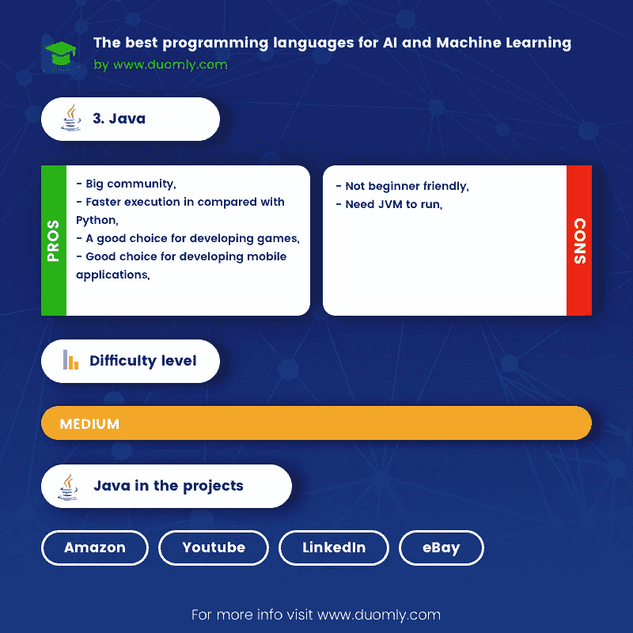

# 人工智能和机器学习的最佳编程语言

> 原文：<https://medium.com/duomly-blockchain-online-courses/the-best-programming-language-for-artificial-intelligence-and-machine-learning-538486b462c?source=collection_archive---------0----------------------->

[Duomly — programming online courses](https://www.duomly.com)

本文最初发表于:[https://www . blog . duomly . com/which-programming-language-is-the-best for-machine-learning-and-artificial-intelligence/](https://www.blog.duomly.com/which-programming-language-is-the-best-for-machine-learning-and-artificial-intelligence/)

作为人工智能(AI)领域的机器学习(ML)在计算机科学中并不是一个新概念。然而，自从有可能使用大数据以来，ML 只是在最近几年才经历了它的扩展和流行。想一想，与十年前相比，今天我们可以获得多少数据。

我们都知道，几乎所有的社交网络都使用 AI。例如，脸书和 Instagram 根据用户以前喜欢的页面，生成可能吸引用户的页面推荐。这些推荐是自动产生的，或者由一个程序产生，该程序首先学会识别用户喜欢什么，然后向他提出建议，以提高特定领域的知识。

通过选择一种编程语言，提供相关数据，并实现适当的算法，我们可以创建一个像人一样学习如何响应特定需求的程序。

根据以上内容，无论您是程序员还是对编程领域感兴趣并想学习的人，在本文中，我将通过分析和比较为您呈现 ML 领域中五种突出的语言。它们是 Python、R、Java、Lisp 和 Javascript。

## **1。Python**

[Duomly — programming online courses](https://www.duomly.com)

简单易学( [Python 课程](https://www.duomly.com/course/python-course))，语法简单，还有很多框架和库。这些就是原因，因为 Python 是最流行的语言之一。它是解释型和动态类型的程序语言。

**用在哪里？**

Python 具有一般用途，开发标准和 web 应用程序。然而，它的独特之处在于它在人工智能和数据科学领域的应用。

在数据科学和 ML 领域内，Python 相比其他语言越来越有优势。大量用于机器学习的框架和库的存在、简单的编写和一个大的社区影响了这种语言在这一领域正在经历真正的扩展。还有一点我要强调的是异步工作。当我们有更多的数据源时，这在 ML 的上下文中是很方便的。

**大项目/公司谁用？**

我们每个人都必须有在亚马逊上购买产品的经历。你可以看到产品推荐。这些建议基于我们之前的购买和产品搜索，并且它以 Python ML 模型为基础。

谷歌(Gmail)是使用 TensorFlow Python 框架预测垃圾邮件的较大公司之一。TensorFlow 是由谷歌开发的，因此被其他几个“产品”使用，如语音识别和类似的产品。

在机器学习和人工智能环境中有什么用途？如果有，可以用在语言环境中的 it 框架构建什么？

我已经提到过 Python 以库和框架的形式提供了巨大的 ML 支持。

TensorFlow 是最流行的框架，它涵盖了 ML 中的所有过程。也用于深度学习。它们涉及的领域是基于检测和建议的应用(例如语音检测、图像和视频识别)。

我们也可以用 TensorFlow 来开发聊天机器人。但是当谈到聊天机器人时，重要的是要强调除了它之外，还有几个其他的库，比如 Tweepy，用于 Twitter 聊天机器人。

说到库，Scikit 是一个包含众多算法的库。如果你访问官方网站，你可以看到几个例子，我想强调一下，例如，人脸识别或识别手写数字。

**优点**

-很容易写，
—极简主义(与 Java 相比代码行数更少的应用程序开发)，
—很多机器学习课程，
—大型社区，
—很多库和框架

**缺点**

-与 Java 相比执行速度较慢，
-不适合移动开发，
-不适合游戏开发

**2。r 编程**

[Duomly — programming online courses](https://www.duomly.com)

r 很多年都是数据科学的代名词。它是解释型和动态类型语言。

如果你已经用另一种语言编程，你可以很快理解 R 是如何工作的。它不需要很多知识，因为 R 有很多包、库和资料可以在学习过程中帮助你(比如 Python)。

**用在哪里？**

r 是为统计和预测分析而创建的，我们主要在数据科学中找到它的用法。在 ML 内部，R 是仅次于 Payton 的该领域最丰富的。

**大项目/公司谁用？**

许多大公司使用 R 进行数据分析、大数据建模和可视化。其中一些是谷歌，优步，纽约时报。r 在银行业中有着广泛的应用，尤其是在预测不同风险的领域。在这个领域，我想提一下美洲银行和 ANZ 银行。

脸书使用 R 进行 ML 测试，而 Twitter 创建了一个 R 语言异常检测库。

**在机器学习和人工智能环境中有什么用途，如果有，可以用在语言环境中的 it 框架构建什么？**

mlr 包具有最广泛的用途，因为它参与 ML 过程的所有阶段。dmlc XGBoost 与 mlr 的区别仅在于性能更好。

我需要强调数据科学的两个重要库。这是 Dplyr 和 Ggplot。

Dplyr 是一个强大的 R 库，它有简单的语法，并控制着数据操作的过程。在数据分解的过程中特别强调了这一点。

Ggplot2 是另一个重要的库，用于数据的可视化和图形化表示。这是一个非常古老的图书馆，但由于它包含了许多不同风格的情节。

**优点**

-有利于统计，
-大量的库和框架

**缺点**

-比 Python 慢，
—对初学者不友好，
—写得很差

**3。Java**

[Duomly — programming online courses](https://www.duomly.com)

Java 是编译型和强类型语言。在编程中，它是一个标准，而且多年来它的受欢迎程度不降反升。与 Python 相比，程序的执行性能要好得多。但是学习和编码更复杂。

**用在哪里？**

Java 就像 Python 通用语言，用途广泛:从游戏开发到标准、web 和移动应用。

这种编程语言可能是 ML 的一个很好的选择，特别是对于基于 Java 并且需要通过包含 ML 来改进的企业。然而，记住 ML 领域本身是复杂的，Java 可以在这个领域制造困难，即使是高级开发人员。正因为如此，Python 和 R 比在 ML 中更占优势。

**大项目/公司谁用？**

众多知名公司使用 Java 作为服务器端的语言之一。这些公司包括 YouTube、亚马逊、易贝和 LinkedIn。

**在机器学习和人工智能环境中有什么用途，如果有的话，可以用 it 框架构建什么？**

说到基于模式识别的深度学习，Deeplearning4j 是使用频率最高的库。它符合它工作的领域非常适合文本、人脸、图像和语音识别。

Weka 和 Masive 在线分析(MOA)是另外两个包含大量工具和算法的重要库。它们经常一起使用，并得到了广大社区的支持。他们应用的领域是数据科学和推荐系统。

此外，许多需要学习如何与用户玩游戏的人工智能游戏，如国际象棋和井字游戏，都是在这种编程语言的帮助下开发的。最后，我想提一下聊天机器人应用。我们可以在持续提供服务并与用户保持联系的医药和公司中找到许多这样的人。

**优点**

-大型社区，
—与 Python 相比执行速度更快，
—开发游戏的绝佳选择，
—开发移动应用的绝佳选择

**缺点**

-对初学者不友好，
-需要 JVM 才能运行

**4。Lisp**

[Duomly — programming online courses](https://www.duomly.com)

Lisp 是一个编程语言家族，其中最流行的方言是 Clojure 和 Common Lisp。与列表中的其他语言相比，Lisp 拥有最悠久的历史。因此，它对 R、Python 和 Javascript 的发展有很大的影响。它是动态类型的。

在人工智能的背景下，Lisp 是一种流行的语言，但它的人工智能概念不同于今天的概念和需求。在学习难度范围内，Lisp 是较难的语言之一，不建议初学者使用。

**用在哪里？**

Lisp 是一种通用语言，但它主要用于传统的符号人工智能领域。

**大项目/公司谁用？**

ELIZA 是一个用 LISP 开发的对话(talk)程序。它是当今聊天机器人应用的前身。至于现代版，ELIZA 的使用并没有停止，你可以用它来创建打算用于电子商务网站的 Chatbot。

另外，语法上使用 Common Lisp。

**在机器学习和人工智能环境中有什么用途，如果有的话，可以用 it 框架构建什么？**

我已经提到 Lisp 在传统人工智能中脱颖而出。与在机器学习和深度学习等领域使用的 Python 和 Java 相比，Lisp 无法处理这种类型的现代需求。其原因主要是缺少库形式的支持。

不管怎样，Lisp 的背景对于理解传统 AI 的概念仍然是必不可少的。

**优点**

—用合适的编译器很快，
—很好的解决了问题

**缺点**

—不适合初学者，
—没有足够的库，
—社区没有 Python 或 Java 社区那么大

**5。Javascript**

[Duomly — programming online courses](https://www.duomly.com)

带有 Node.js 的 Javascript 使这种语言在 web 开发中很特别，因为它具有全栈特性。Javascript 是解释型和动态类型语言。

一个必不可少的要素是 [Javascript 很容易学会基础](https://www.duomly.com/course/javascript-course)。然而，人们必须记住，对于初学者来说，理解工作的背景有时是困难的，需要大量的注意力。的确，这种语言属于一个容易学习的群体。

**用在哪里？**

Javascript 的使用仅限于 web 开发，这也是它区别于列表中其他语言的地方。我可以说，如果你的工作和兴趣领域纯粹是 web，这个特性是很有优势的。这种语言用于网站的动态和交互，然后构建标准的 web 应用程序和渐进式 web 应用程序。

由于 Javascript 不断发展，扩展了它的应用范围，除了上面提到的，它还用于数据科学和 ML。社区对这些领域的兴趣越来越强烈，这是一个非常积极的事实。

**大项目/公司谁用？**

在前端领域，很少有公司没有选择 Javascript 作为他们的主要语言。我只会提到维基百科、WordPress 和脸书。另一方面，除了前端、LinkedIn 和易贝，Javascript 已经包含在语言和后端页面中。

**在机器学习和人工智能环境中有什么用途，如果有的话，可以用在语言环境中的 it 框架构建什么？**

谷歌和脸书已经开发了许多库和框架。

当我们谈到 Javascript 中的 ML 时，我首先需要提到 DialogFlow。那既不是一个库，也不是一个框架，而是谷歌在 AI 基础上开发的一项强大技术。DialogFlow 可以轻松创建和训练人机交互。使用 DialogFlow 和 Node.js，您可以为 messenger、Slack、Twitter 和类似的网络快速开发语音或文本聊天机器人。此外，这种技术通常与 Angular 这样的框架相结合，用于在 web 应用程序中开发聊天机器人。

TenserFlow.js 库现在是最流行的 ML 开发和培训库之一，也是一个带有 Javascript 的深度学习模型。如果你访问这个网站，你会看到一些令人兴奋的项目。我会标出表情符号寻宝游戏，这给了你某些表情符号，你需要在相机的帮助下在短时间内尽可能多地识别它们。

对于神经网络领域，我要强调 brain.js 库。还有一个关于它的短期课程。

**优点**

-初学者友好，

-全栈，

-它很快

**缺点**

-在使用 Node.js 平台之前，有必要对 JS 有很好的了解，
-某些编程语言概念可能会让初学者感到困惑

**工作数量最多的语言排名**

1.JavaScript — 12，620

2.爪哇——11，505 人

3.python-7928

4.r-936

5.Lisp — 3

**薪资最高的语言排名**

为了估算薪酬最高的技术，我们采用了过去三个月的工资中位数。我必须说，结果令人印象深刻。

1.lisp——7.3 万美元

2.python——6.7 万美元

3.Java——6.5 万美元

4.雷亚尔——6.5 万美元

5.JavaScript——5.6 万美元

**易学排名**

1.计算机编程语言

2.Java Script 语言

3.Java 语言(一种计算机语言，尤用于创建网站)

4.稀有

5.咬舌

**将军**

如果你看一下统计数据，你会发现没有一种语言比另一种语言优越。比如 Lisp 工资最高，但是对 Lisp 专家的需求很小。许多因素影响着这种语言的流行，而且这种情况每年都在迅速变化。但是，如果我们遵循这些标准和我在本文中提供的事实，Python 是一种与其他语言相比在 ML 中必不可少的语言。

它成为了科学和学术团体的一部分，在 ML 领域，Python 比所有其他语言有着更广泛的用途。同样不可或缺的是，对于较大的 ML 来说，要突出优于 R 的优势，尤其是便于书写。与 Lisp 相比，Python 被几个深度学习库破坏了，而 Lisp 不推荐用于这个领域。

说到 Java，它比 Python 更适合开发桌面、移动应用和游戏。还有，对 Java 开发者的要求更高。所以，你肯定不会在 Java 上犯错误，它是一种多年来稳定且易于使用的语言。然而，学习 Python 要困难得多，尤其是对初学者来说，在实现第一个严肃的 ML 项目之前，必须投入大量的时间和精力。

最后，你不应该忽视 Javascript。它现在在最高工资的名单上处于最低位置，但认为对 Javascript 开发人员的需求是最大的。作为 ML 中最年轻的语言，发展速度超乎寻常，专注于 web 开发，不排除 ML 会随着时间的推移而加大薪资力度。

**赢家:** [**Python**](https://www.duomly.com/course/python-course) **和**[**Javascript**](https://www.duomly.com/course/javascript-course)

[Duomly - programming online courses](https://www.duomly.com)

感谢阅读。

内容由我们的队友安杰拉提供