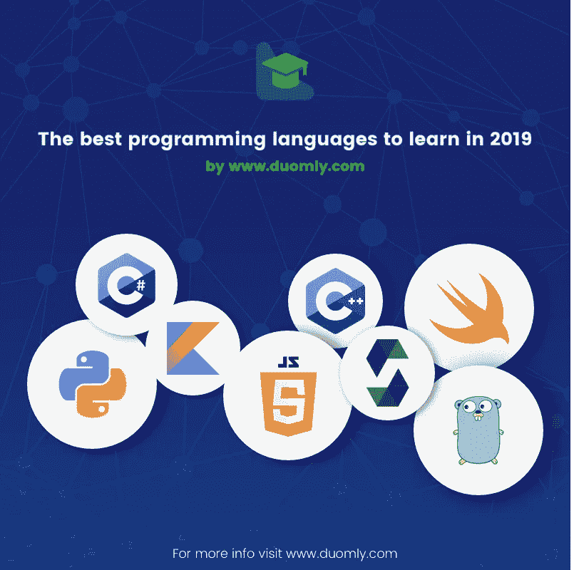
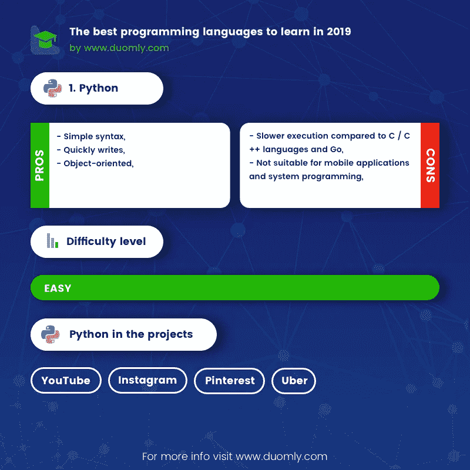
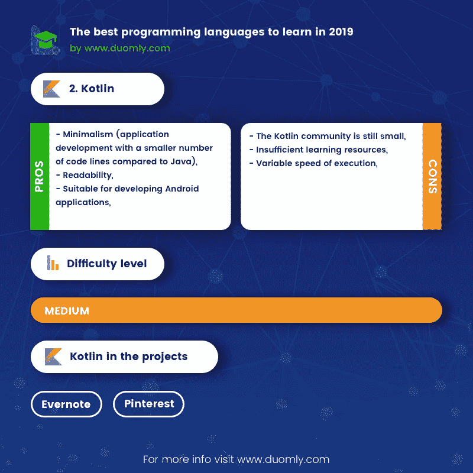
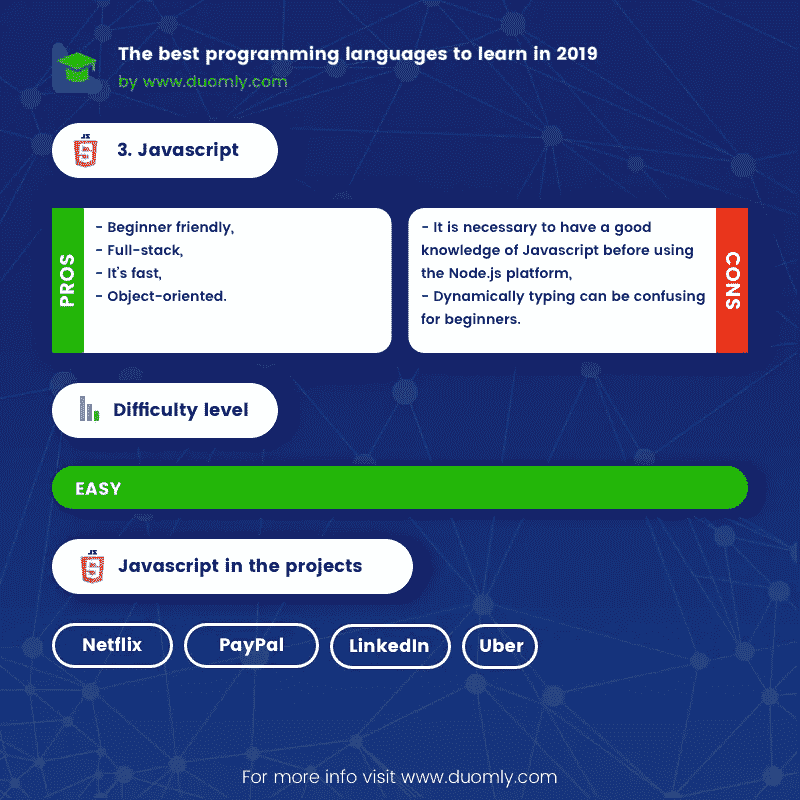
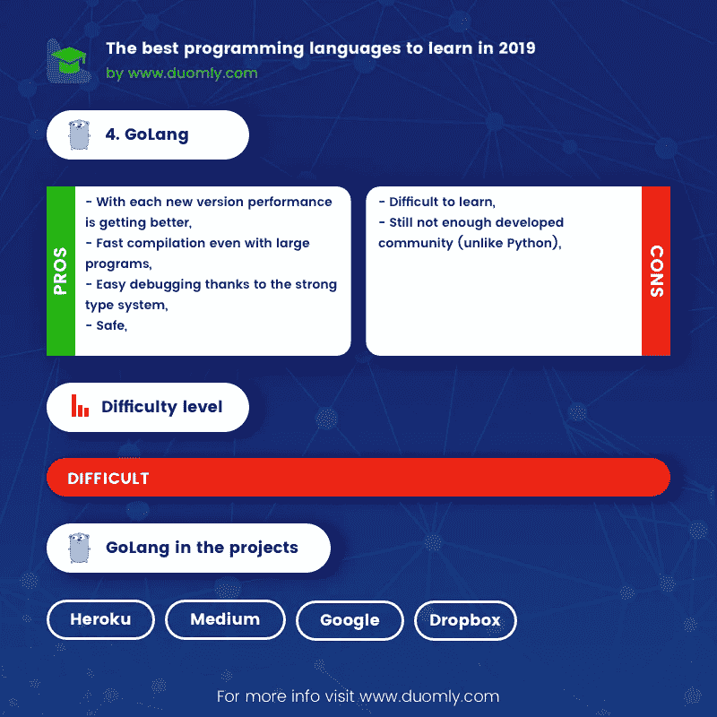
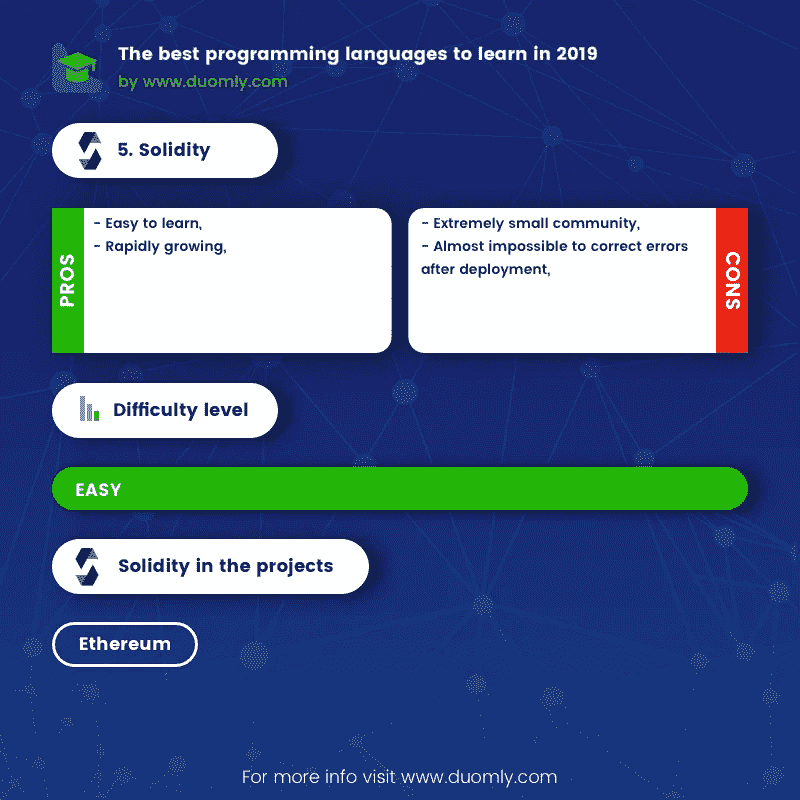
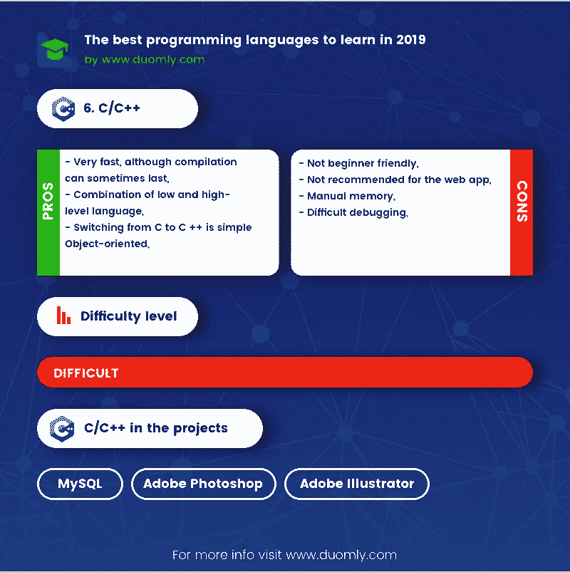
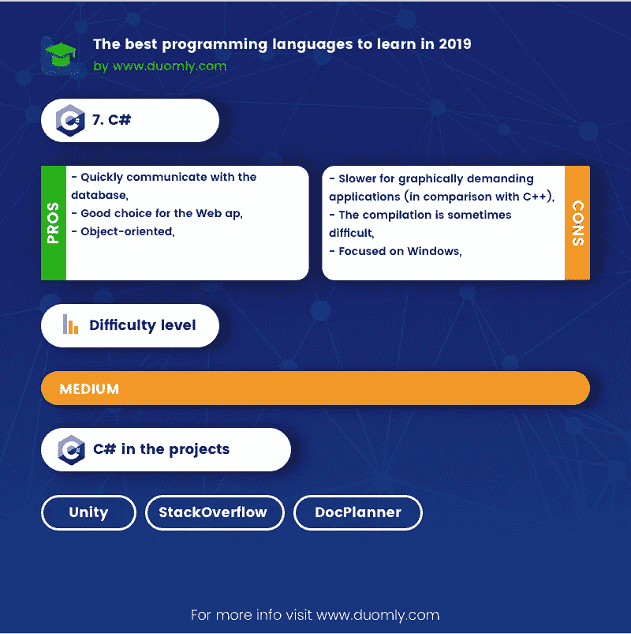
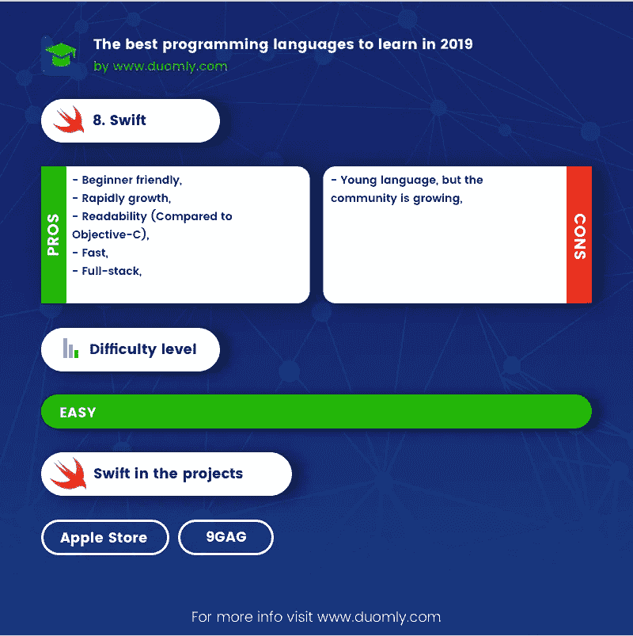

# 2019 年最值得学习的编程语言

> 原文：<https://medium.com/duomly-blockchain-online-courses/the-best-programming-language-to-learn-in-2019-466986db384e?source=collection_archive---------0----------------------->

[Duomly — programming courses online](https://www.duomly.com/)

本文最初发布于:[https://www . blog . duomly . com/which-programming-language-is-the-best-in-2019/](https://www.blog.duomly.com/which-programming-language-is-the-best-in-2019/)

编程是现在和未来的职业。我们每个人对此都很熟悉。

到目前为止，您已经有了对您和整个社区都有用的想法或创建了对您和整个社区都有用的应用程序和软件。想想像脸书、Instagram 和 Twitter 这样的应用。然后考虑 Exel、Adobe Illustrator、Photoshop 之类的程序。我们每个人都至少见过或听过一次蛇和井字游戏。

我为什么这么说，因为我会用以下几个词来描述编程:有创意，令人兴奋，收益。

无论您是编程初学者还是正在考虑提高现有技能，在本文中，我将分析八种流行的语言，它们互不相同，但都有相同的任务:程序的开发和执行。

**1。Python**

[Duomly — programming courses online](https://www.duomly.com/)

Python 是一种解释型和动态类型的编程语言。
其简单的语法、可读性和广泛的应用使其成为当今最流行的编程语言之一。

**用在哪里？**

Python 用于编写标准应用程序和 web 应用程序。然而，使用 Python 最近在人工智能和机器学习领域尤为突出。因此它非常适合开发基于检测、识别和推荐系统的应用程序。

除此之外，这种语言在用于数据处理和可视化的数据科学中越来越受欢迎。

**大项目/公司谁用？**

一些最著名的基于 Python 的应用是 BitTorrent、YouTube、Pinterest、Instagram 和优步。我提到的应用程序使用 Django 和 Flask 框架。有趣的是模拟人生 4 视频游戏是用 Python 写的代码。

**难？和什么东西相似吗？**

由于 Python 是用 C 语言编写的，所以它与 C/C ++编程语言有相似之处，但也有不同之处。 [Python 易学](https://www.duomly.com/course/python-course)，写起来很快，适合初学者。初学者在学习过程中肯定会遇到很多困难，但是我们要记住，Python 社区是众多的。

**优点**

—简单语法，
—快速书写，
—面向对象。

**缺点**

—与 C / C ++语言和 Go 相比执行速度较慢，
—不适合移动应用和系统编程。

**2。科特林**

[Duomly — programming courses online](https://www.duomly.com/)

Kotlin 是征服了开发人员社区并经历了不断扩展的编程语言之一。他是静态打字，在 JVM 上工作。

**用在哪里？**

它的目的是一种通用类型，用于开发、服务器端、客户端、web，但在 Android 应用程序开发中最为显著。谷歌在 Android 的开发应用中支持这种语言的事实将科特林推到了风口浪尖。

**大项目/公司谁用它？**

Pinterest 和 Evernote 等公司在 Android 应用程序中使用了 Kotlin。我可以假设越来越多的同伴会及时采用它。

**难？和什么东西相似吗？**

科特林处于中等水平，尤其适合初学者。我必须指出，目前没有足够的资源和学习材料。对于 Java 开发人员来说要简单得多，因为所有的 Java 框架都与 Kotlin 兼容。

**优点**

—极简主义(与 Java 相比代码行数更少的应用开发)，
—可读性，
—适合开发 Android 应用。

**缺点**

Kotlin 社区仍然很小，
—学习资源不足，
—执行速度不定。

**3。JavaScript**

[Learn programming with Duomly](https://www.duomly.com/)

我可以坦率地说，目前，Javascript 在 web 开发中没有竞争对手。考虑到 Node.js 平台是基于 Javascript 的，这种编程语言涵盖了前端和后端两个领域。

Javascript 是由多个框架和库支持的解释型和动态类型化语言。最著名的库之一是 jQuery，它使编码更容易(简化它)。此外，由谷歌和脸书等公司开发的一系列框架也影响了 Javascript 使用限制的转变。

**用在哪里？**

主要目的是指网站的功能、动态和互动。除此之外，Javascript 越来越多地被用于 web 应用程序的开发。在这种背景下，Node.js 在构建实时 web 应用程序、多任务处理和聊天应用程序方面变得非常流行。我只想指出，用 Angular/React/Vue 这样的框架开发的 app，可以变成渐进式的 web app (PWA)。

使用 Javascript 的相对较新的现代领域是机器学习，现在有了 TensorFlow.js 库的支持。

**大项目/公司谁用？**

PayPal 的后端基于 Node.js，除了众多其他技术，Instagram 和网飞也是基于 Javascript 和 React 框架。

**难？和什么东西相似吗？**

Javascript 是特定且独特的。语法类似于其他一些语言，但不是编程语言本身。虽然它是最简单有效的语言之一，但有时初学者很难理解异步过程、原型和类似的东西。了解计算机科学是很有必要的，尤其是谈到 Javascript 的中级或高级水平。

不过很适合新手。这样做的原因是广泛的可用课程，如 Duomly 的 Javascript 课程、教程和材料。你可以更深入地研究这个问题。

**优点**

—初学者友好，
—全栈，
—速度快，
—面向对象。

**缺点**

—在使用 Node.js 平台之前有必要对 Javascript 有一个很好的了解，
—动态键入对于初学者来说可能会比较混乱。

**4。戈朗**

[Learn programming with Duomly](https://www.duomly.com/)

Go 是由 Google 开发的，融合了实践中表现最好的概念。他被编译和静态类型化。

这种语言很年轻，但是在编程社区中很受欢迎。从效率的角度来看，Go 代表了 Python 的一个很好的替代品。

**用在哪里？**

这种语言是为了监控现代软件和 web 应用程序的需求而开发的。有大量的框架。它在图形和机器学习领域越来越受欢迎。

**大项目/公司谁用？**

加入 Go 的一些最著名的公司有 Heroku、Medium 和 Google。从其他编程语言移植到 Go(在某些部分)是很常见的。比如 Airbrake 和 Ruby to Go 互换，Dropbox 和 Python to Go 互换。

**难？和什么东西相似吗？**

虽然 Go 语言属于 C 语言家族，但它是以许多其他语言为模型的。其他语言如 Java、JavaScript、Python 负责其功能和效率，但也负责减少负面特性。

对于有经验的程序员来说，学习围棋不是问题而是挑战。尤其是当我们谈到分析，以及将它的性能与他们以前使用的语言的性能进行比较的时候。由于理解不同概念的复杂性，不建议初学者使用 Go。重要的是要强调他的特殊文件。

**优点**

—每一个新版本的性能都越来越好，
—即使是大型程序也能快速编译，
—由于强类型系统而易于调试，
—安全。

**缺点**

—难学，
—还是不够发达的社区(不像 Python)。

**5。坚实度**

[Learn programming with Duomly](https://www.duomly.com/)

Solidity 是一种静态类型的语言。这个程序是以太坊开发的，在以太坊虚拟机上执行。

**用在哪里？**

稳固性仅用于智能合约。考虑到数字的扩张，智能合同是未来的趋势，将会得到更多的体现。

**大项目/公司谁用它？**

目前，Solidity 只使用以太坊，其中一个流行的应用程序是 CryptoKitties game。

**难？和什么东西相似吗？**

语法就像 Javascript，所以学习这种语言更简单。

**优点**

—简单易学，
—快速成长。

**缺点**

—非常小的社区，
—部署后几乎不可能纠正错误。

**6。C/C++**

[Learn programming with Duomly](https://www.duomly.com/)

C/C++是编译型和静态类型语言。在这个列表中，这些语言代表了最古老的语言。然而，我必须指出，它基于 C 语言的许多语言和最近的一些其他技术。C 的品质是教出来的，因为它流传至今。

C 和 C++的语法属性几乎相同。两者的基本区别在于 C++是面向对象的函数式语言。由于 C++更好的特性，今天它已经战胜了 C。

**用在哪里？**

对于需要速度的程序，像游戏和系统，C/C++是一个很好的选择。我还必须强调 C++无与伦比的 GUI。在这方面，与 Java 相比，它的突出之处在于代码的效率和优雅。总之，对于复杂的实时 app，推荐使用。

**大项目/公司谁用？**

我已经提到 Python 是用 c 写的，除了 Python 和 PHP。最著名的

而最常用的数据库 MySQL 是基于 C/C++语言的。

说到在其中占主导地位的 GUI 和 C++，提到 Adobe (Photoshop 和 Illustrator)就够了。

**难？和什么东西相似吗？**

这两种语言都很难学，但是如果你懂 C，从 C 转换到 C++或者其他语言是很容易的。此外，由于它的基础和多年来的使用，许多学习材料是可用的。

初学者很可能会因为硬度而避开 C++，会先向 Python 或者 Java 低头。

**Pros C++**

—非常快，尽管编译有时会持续
—低级和高级语言的结合
—从 C 转换到 C ++很简单
—面向对象。

**Cons C++**

—对初学者不友好，
—不推荐 web app 使用，
—手动记忆，
—调试困难。

**7。C#**

[Learn programming with Duomly](https://www.duomly.com/)

除了 C++，C #是另一种流行不了多少年的语言。微软创建它是为了统一 C/C++和 Java 语言。我必须强调，一些 C #编译器(例如 MS)是用 C++编写的。

**用在哪里？**

C#是一种通用语言，但主要用于 Windows 桌面应用和 web 开发。对于需要与数据库通信的程序和站点，它是突出显示的(在这一点上，它比 C ++更好)。流行的 ASP.NET 是 C #和 HTML 的结合。

还有，重要的一点是，很多游戏都是基于 C #语言的，但是 C ++肯定更适合这个领域。

**大项目/公司谁用它？**

创建游戏的 Unity 平台使用 C#。ASP.NET 框架是堆栈溢出的基础。接下来著名的医疗保健平台 DockPlanner 也是走 C #。

**难？和什么东西相似吗？**

比 C/C++容易学，但是我不能把它归为 Python 和 Javascript 之类的容易学的语言。

**优点**

—快速与数据库通信，
—Web app 的好选择，
—面向对象。

**缺点**

—对图形要求高的应用程序较慢(与 C ++相比)，
—编译有时很困难，
—主要针对 Windows。

**8。Swift**

[Learn programming with Duomly](https://www.duomly.com/)

Swift 成为了 iOS 应用的代名词。

由 Apple 根据现代概念和需求开发，反映了编程语言的构建效果，也反映了现代 app 的要求。Swift 吸取了其他语言(如 Python、C#)的许多积极特征。

他是一种编译的静态类型语言。

**用在哪里？**

它用于开发苹果系统中的 iOS 应用、Linux 应用和其他应用。我必须提到，Swift 涵盖后端和前端。

**大项目/公司谁用？**

Apple store 基于 Swift。除了苹果，最著名的社交媒体网站之一 9GAG 也是将 Swift 作为技术之一。

**难？和什么东西相似吗？**

鉴于 Swift 是一门很有潜力的年轻语言，新手跟上它的发展会很容易。重要的是 Swift 框架正在快速发展。

Swift 最常被比作 Python。我可以说它是不难学的语言之一。对于从 Objective-c 迁移到 Swift 的开发人员来说尤其如此。

**优点**

—初学者友好，
—快速增长，
—可读性(相对于 Objective-C)，
—快速，
—全栈。

**缺点**

-年轻的语言，但社区正在成长。

**工作数量最多的语言排名**

1.JavaScript — 12，548 (17.27%)

2.C# — 11，999 (16.52%)

3.python-7984(10.99%)

4.C/C++ — 3，635 (5.00%)

5.去——842 人(1.16%)

6.Swift — 390 (0.54%)

7.科特林——319 人(0.44%)

8.坚实度— 27 (0.037%)

薪资最高的语言排名

为了估算薪酬最高的技术，我们采用了过去 3 个月的工资中位数。我必须说结果很有趣。

1.可靠性—11.3 万美元

2.go—7.6 万美元

3.python——6.7 万美元

4.科特林——6.7 万美元

5.swift——6 万美元

6.C/c++——5.9 万美元

7.JavaScript——5.6 万美元

8.c#——5.6 万美元

**易学排名**

1.固态

2.计算机编程语言

3.Java Script 语言

4.迅速发生的

5.科特林

6.C#

7.C/C++

8.去

**将军**

上述每一种编程语言都有自己的特点。无论是关于目的、性能还是受欢迎程度，语言的选择和使用主要取决于你的兴趣和工作领域。因此，我认为一些编程语言比竞争对手更有优势。

根据所附的统计数据，Javascript、C #和 Python 位于工作列表的顶部。Javascript 工作在 web 开发领域，目前还没有竞争。

让我们考虑所有三个列表。Python，由于其简单性和广泛的用途，缓慢但肯定地取代了其他竞争语言的绝对赢家的位置。如果我们将 Python 与 C #和 Go 进行比较，优势在于:

1.简单易学
2。凡事多付出
3。他的级别逐年上升

关于稳健，我希望你能关注他。目前最简单最赚钱的语言。如果我们问“什么在几年内肯定会经历扩张？”确保这将是智能合同。与此相关的是，固体专家的数量很少，赤字巨大，需求将越来越大。所以，不管你是不是初学者，有了扎实，你肯定不会出错。

**赢家:Solidity 和 Python**

[Learn programming with Duomly](https://www.duomly.com/)

感谢阅读，

内容由我们的队友安杰拉提供