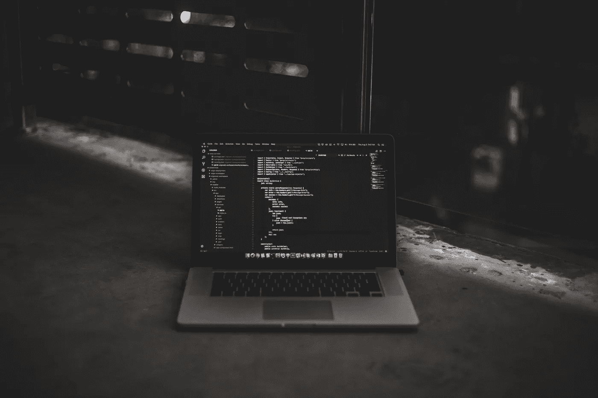
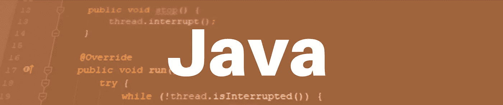

# 2022 年最值得学习的编程语言

> 原文：<https://medium.com/quick-code/the-best-programming-languages-to-learn-in-2021-5708c1a9d95c?source=collection_archive---------0----------------------->

Photo by [Blake Connally](https://unsplash.com/@blakeconnally?utm_source=unsplash&utm_medium=referral&utm_content=creditCopyText) on [Unsplash](https://unsplash.com/collections/3577942/programmer?utm_source=unsplash&utm_medium=referral&utm_content=creditCopyText)

就像其他专业领域一样，编码语言也在不断发展。一些技术成为顶级的，一些失去了它们的首要地位，花时间学习它们不再是明智的。对于一个努力学习编程的技术新手来说，决定选择哪种技术可能有点复杂。让我来帮你。作为一名资深 Java 开发人员和长期导师，我可以分享一些关于最流行的编程语言的建议。这是我列出的获胜者名单。

# 最值得学习的 5 种编程语言

# Java 语言(一种计算机语言，尤用于创建网站)

**平台**:网络、移动、桌面

**年薪预测**:7.9 万美元左右(如[玻璃门](https://www.glassdoor.com/Salaries/java-developer-salary-SRCH_KO0,14.htm)所称)

# 技术是关于什么的

这是世界上最顶尖的编程语言之一。Java 创建于 1995 年，现在归全球科技巨头甲骨文公司所有。它是一种面向对象的语言，几乎在任何地方都被广泛使用。让它脱颖而出的是，这是用于大型服务器端企业级应用的技术。这是非常安全和便携以及高度结构化。Java 被大型 IT 公司广泛使用，包括 Google、Amazon 和 Twitter 等等。Java 编码技能几年来一直很受欢迎，现在仍然如此。

# 去哪里学

1.  [CodeGym](https://codegym.cc/) 是一个游戏化的 Java 学习平台。这是一门组织良好的课程，注重在实践中学习。玩起来非常有趣！该平台有超过 1200 个不同级别的任务。当您完成一项任务时，您的解决方案会立即得到验证。你可以用桌面版，也可以用手机版，这样你就可以在任何地方用你的智能手机编码。在这个过程中，你就像在游戏中一样从一个关卡移动到另一个关卡。到了一定程度，你就可以开始自己创作游戏了。试着看看你自己。

[2。Java 基础 by Pluralsight](https://www.pluralsight.com/courses/java-fundamentals-language) 。该平台提供了对设计模式的深入了解。这是新手程序员的绊脚石之一。在本课程中，您可以从一开始就以正确的方式建立这些知识。该平台还有许多其他优秀的学习功能，值得一试。

[3。Codecademy](https://www.codecademy.com/) 是我建议查看的另一个资源。这个项目是免费的，而且结构简洁。这样你就可以创建自己的课程，走自己的学习道路。每门课程包含 50 多个讲座和互动测验。此外，还有机会向社区中的人寻求个人代码审查。

# 计算机编程语言

**平台** : Web、桌面

**年薪预测**:[:76500 美元](https://www.glassdoor.com/Salaries/python-developer-salary-SRCH_KO0,16.htm)

# 技术是关于什么的

有三个核心因素使得 Python 成为一项值得学习的摇滚明星技术。首先，它是免费和开源的。其次，它是可读的，这使它成为最容易学习的编程语言之一。第三，这是数据科学和机器学习的高需求领域背后的技术。这里非常缺乏技术和专业人员。此外，Python 为基于 GUI 的应用程序提供了强大的模块，这对于可视化加载的项目来说非常方便。

# 去哪里学

1.  [Learnpython.org](https://www.learnpython.org/)。这个资源是从头开始掌握 Python 的一个很好的选择。这是一个全球超过 500，000 名学习者的互动教程。这些课程结构严谨，很容易理解这个平台的内容。

[2。艰难地学习 Python](https://learnpythonthehardway.org/book/)。虽然这个项目的名称听起来很有挑战性，但现实却完全不同。在这里，没有编码经验的你也可以开始学习 Python。此外，它教会你从一开始就看到代码的结果。一种在代码任务中实现的解决问题的方法。

[3。用 Python 发明](https://inventwithpython.com/)。该课程旨在给你创造的能力和编码的熟练程度。除了学习语言本身(顺便说一句，是免费的)，你还可以借助新获得的技能发明自己的游戏。

# 科特林

**平台**:网络、移动、桌面、服务器

**年薪预测**:约[13.6 万美元](https://www.ziprecruiter.com/Salaries/Kotlin-Salary)

# 技术是关于什么的

Kotlin 是一种相对较新的编程语言。它于 2016 年首次正式发布，很像 Java 的一个小兄弟。它实际上是为了超越老的那个。但是我想说还有一段路要走。Kotlin 广泛用于 Android 开发。并且得到了谷歌的大力支持。但是这是最近的事情，所以 Java 已经有的一些工具仍然需要为 Kotlin 重新创建。然而，像 Coursera 或 Pinterest 这样的大公司更喜欢 Kotlin。新手可能会觉得科特林有点复杂。但是如果你先学习 Java，然后用 Kotlin 提高你的技能，你会比一般的开发者高很多。

# 去哪里学

1.  Udemy 面向 Java 开发人员的 Kotlin。该课程是一个很好的选择，可以用移动开发的前沿技术来增强 Java 技能。它是专门以一种帮助 Java 开发人员立刻掌握这门语言的方式创建的。

[2。完整的 Kotlin 开发者课程](https://www.udemy.com/course/kotlin-for-java-developers/)。这是另一门 Udemy 课程，它将让你深入了解 Android 移动开发。它还深入探讨了一般的 OOP 概念，这对于初学者来说是非常必要的。

[3。Kotlin 初学者:用 Kotlin](https://www.udemy.com/course/kotlin-course/) 学习编程。在这里，你可以从编程的基础开始，一步步走向自信的移动应用开发。

# 迅速发生的

**平台**:移动(特别是 iOS 和 macOS 应用)

**年薪预测**:[:96，000 美元](https://www.glassdoor.com/Salaries/ios-developer-salary-SRCH_KO0,13.htm)

# 技术是关于什么的

这种编程语言是众所周知的 Objective-C(苹果世界背后的技术)的继承者。该公司在 2014 年发布了 Swift，就像 Kotlin 一样，这是一种相对较新的代码语言，但它已经非常受欢迎。WordPress、SoundCloud 或 Mozilla FireFox 等科技巨头将 Swift 用于其 iOS 应用。随着 Objective-C 的衰落，Swift 成为 iOS 和 macOS 开发的官方语言。

# 去哪里学

1.  [用 CoreML 完成 iOS 14、Swift 5 和机器学习](https://www.udemy.com/course/coreml-course-for-everyone/)。该课程的创建者承诺，在学习结束时，你将能够构建任何你想要的应用程序。嗯，也许没那么快。但是你一定会学习 Swift basic，获得一些有用的编码经验，掌握机器学习。

[2。SwiftUI Masterclass 2021 — iOS 14 应用开发& Swift 5](https://www.udemy.com/course/swiftui-masterclass-course-ios-development-with-swift/) 。这一个更深刻和复杂一点。在这里，您将掌握原型制作的基础知识，创建具有出色 UI 的应用程序，并学习如何在 AppStore 上发布您的应用程序。

[3。破解编码面试&Swift(2021)](https://www.udemy.com/course/cracking-coding-interview-algorithm-design-in-swift-2020/)中的算法设计。本课程以面试的形式进行。你一步一步地找出如何克服障碍，并逐渐学习新的编码方法。

# C#

**平台**:跨平台，包括移动和企业软件应用

**年薪预测**:[:68500 美元](https://www.glassdoor.com/Salaries/c-net-developer-salary-SRCH_KO0,15.htm)

# 技术是关于什么的

这是一种有历史和声誉的编程语言。对于 Windows 开发和任何基于。NET 平台。它是由微软创建的，现在仍然是企业级开发的最佳技术之一。但不仅如此！C#也用于 Unity 游戏引擎，这反过来也是游戏行业的顶级开发环境。

# 去哪里学

1.  [tree house 的 C#基础](https://teamtreehouse.com/library/c-basics-2)。在这里，您可以学习基本概念和代码实践，完成挑战并创建您的第一个简单程序。或者，如果你决定深入挖掘，事情可能就没那么简单了。

[2。C#初学者基础:通过编码学习 C#基础](https://www.udemy.com/course/csharp-tutorial-for-beginners/)。课程创建者以非常清晰的方式详细地解释了一切。这使得在 6 小时内学会 C#基础知识的承诺听起来很合理。不过，要做好超越这段时间的准备:它仍然是成人级别的编程。

[3。Scott Allen 的 C#基础(Pluralsight)](https://www.pluralsight.com/courses/csharp-fundamentals-dev) 。在这里，您将了解 C#和。NET 平台。课程导师一步一步地带你了解编码和创建你的第一个 C#项目的要点。您还将了解如何调试您的应用程序以及测试代码的可使用性。

# 包裹

新手学编程有很多选择。同时也有数百种代码语言。但是这里回顾的是世界上最顶尖的技术，而且多年来一直如此。作为一名经验丰富的 Java 教师，我相信这些是最好的编程语言。

对于一个考虑开始软件开发职业生涯的人来说，这五个中的任何一个都是很好的选择。它们在全球范围内需求量很大，而且显然在未来仍将如此。如果你已经有编码技能，你可以更新知识或者开始学习新的邻近技术。无论你选择什么，重要的是要花固定的时间学习。并且在需要的时候寻求帮助。在某个时刻，你会发现自己很轻松，不费力地编码。现在，在这条路的开始，它可能看起来不是这样。但我以前和你一样。所以相信我，成为一名伟大的软件开发人员是完全可以实现的。