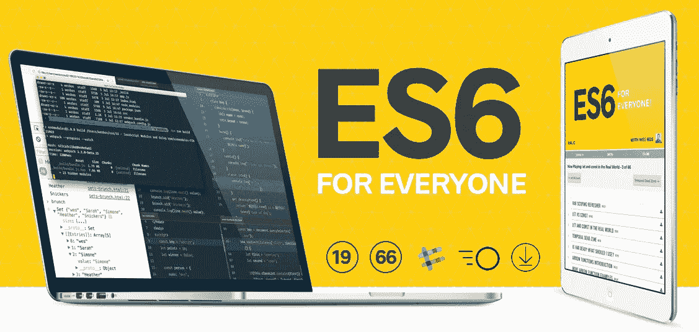

# 10 个最佳 ECMAScript 初学者教程[2023 年 3 月] —在线学习 ES6

> 原文：<https://medium.com/quick-code/the-best-tutorials-to-learn-ecmascript-es6-for-beginners-55fe602382cd?source=collection_archive---------0----------------------->

## 用 2023 年最好的 ECMAScript 初学者教程学习万维网上客户端脚本的 ES6。

JavaScript 是世界上构建网页和应用程序使用最多的语言。今天最流行的框架和 MVC 都是基于 javascript 的，所以你需要掌握 JavaScript 来创建一个符合今天标准的项目。使用 ES6 (ECMAScript 第 6 版)，您可以为 web 编写代码。ECMAScript 是 JavaScript 的另一个名称。ES6 具有 JavaScript 引擎实现的标准化特性。ES6 在不同的 web 浏览器上都得到了很好的支持。让我们从下面的课程开始学习 javascript。

*披露:如果你通过本页的链接购买课程，我们可能会得到一小笔会员佣金。谢谢你。*

## 1.[完整 JavaScript & ES6 教程—(包括 ES7 & React)](https://coursesity.com/r/site/the-full-javascript--es6-tutorial---including-es7--react)

ES6 上最深入的课程。从 JavaScript 开始，深入到 ES6，甚至更多(Webpack、ES7 和 React)。

本课程包含大量创造性内容，因此您将通过一种刺激、丰富和有趣的方式深入学习 JS 和 ES6。

视频教程会让你自己编码。这些视频将确保你理解每一句新台词和关键词背后的原因。

可选测验和编码挑战强化了关键概念。接下来，每个部分的编码休息允许你以你自己的速度接近课程。

如果你是新手，那么这门课程会很好地介绍 JavaScript 作为第一编程语言。如果你有很多经验，那么你会发现一个很好的 JS 概述和深入的 ES6 主题。

## 2.[用 JavaScript ES6+](https://linkedin-learning.pxf.io/c/1137078/646189/8005?u=https%3A%2F%2Fwww.linkedin.com%2Flearning%2Flearning-functional-programming-with-javascript-es6-plus&subId1=quickcode) 学习函数式编程

想要编写更健壮、可维护的代码吗？在本课程中，您将了解如何使用函数式编程来实现这一点，并了解许多 JavaScript 框架和程序的核心函数概念。

在本课程中，您将学习:

*   什么是函数式编程。
*   函数式编程与面向对象编程的比较。
*   JavaScript ES6+中使用一级函数的基础。

它首先解释什么是函数式编程，以及它与面向对象编程的比较。然后介绍了在 JavaScript ES6+中使用一级函数的基础知识，讨论了高阶函数和闭包等概念。

本课程还展示了函数式编程如何使数据结构的处理更加简单明了；深入高级概念，包括部分应用和递归；并提供了一些挑战，可以帮助您测试对关键函数式编程概念的理解。

## 3.[学习使用 ECMAScript 构建应用](https://www.eduonix.com/courses/Web-Development/learn-to-build-apps-with-ecmascript-es2015/UHJvZHVjdC0zMjMyMDA=)

本视频教程将分解 ES2015 的所有新功能和最新语法，让你成为 JavaScript 高手。它将涵盖 JavaScript 基础、对象和类、面向对象编程、循环、函数、数组、变量、迭代器、模块、生成器等概念。

本课程还将涉及其他 JavaScript 相关技术，如 Node。JS，数据流，Babel/Traceur 等等。

在对最新版本有了大致的了解之后，您将进一步学习 JavaScript E6 的许多细节特性，之后您将通过使用您刚刚学习的所有特性创建一个功能项目来将其全部付诸实践。

## 4. [JavaScript 实践:ES6 及更高版本](https://www.educative.io/courses/javascript-in-practice-es6-and-beyond?affiliate_id=5088579051061248)

JavaScript 是任何 web 开发人员的基本资产。

该课程包括:

*   函数范围、块范围、常数
*   箭头功能
*   默认参数
*   解构
*   展开运算符和静止参数
*   ES6 中的对象
*   ES6 中的尾部调用优化和其他功能特性
*   标志
*   for-of 循环
*   字符串和模板文字
*   集合、地图及其弱版本
*   迭代器和生成器的深度
*   ES6 承诺
*   使用 Webpack 配置 ES6
*   反射 API
*   实践中的代理
*   数学和数字扩展
*   ES2016
*   ES2017

本课程提供了 ES6 中所有组件的实用视图。

您将了解每个组件的重要性，了解它如何以及为什么使 Javascript 变得更简单。互动练习和测验将帮助你采用这些现代的 JavaScript 编码实践。

ES6 越来越受欢迎，对于任何想完全沉浸在 JavaScript 中的人来说，这门课程都是必不可少的。

## 5. [ES6 Javascript:完整的开发者指南](https://coursesity.com/course-detail/es6-javascript-the-complete-developers-guide)

ES6 Javascript 开发从零开始。通过实例进行实践，并准确了解在哪里应用 ES6 功能。

这就是你一直在寻找的掌握 ES6 Javascript 的教程。

掌握 ES6 语法可以让你在 web 开发中获得一个职位，或者帮助你建立你一直梦想的个人项目。这是一项在现代 web 开发行业中更受欢迎的技能，尤其是随着 React 和 Angular 2 等现代 web 框架的发布。

本课程将帮助您快速入门，并教您深入理解和使用 ES6 引入的每一条新 Javascript 语法构建应用程序所需的核心知识。

首先，您将通过使用“forEach”、“map”和“reduce”等助手来掌握数组迭代的基础知识。在介绍了数组助手之后，我们将直接进入高级 ES6，涵盖增强的对象文字、默认函数参数和类等主题。每个主题包括多个现场代码练习，以确保您理解每个新概念。

如果你是 Javascript 或 ES6 的新手，或者如果你一直在努力学习它，但有时觉得你还是不太“理解”，这是为你准备的 Javascript 课程。要学习 ES6，你必须理解它，并且准确理解为什么每一个语法都被添加到语言中。

*   了解巴别塔的目的和为什么创建 ES6
*   掌握将当前的 ES5 代码重构为超级 ES6 的过程
*   掌握“rest”和“spread”运算符之间的区别
*   通过掌握高级 ES6 设计模式，开发可扩展复杂性的复杂应用程序
*   使用生成器更深入地研究迭代。不需要花里胡哨的条款！

## 6.[JavaScript ES6 的完整参考指南](https://click.linksynergy.com/deeplink?id=Fh5UMknfYAU&mid=39197&u1=quickcode&murl=https%3A%2F%2Fwww.udemy.com%2Fjavascript-es6-a-complete-reference-guide-to-javascript-es6%2F)

掌握 Javascript 的 ES6 语法，并开始在你的现代 Angular JS、React JS、Meteor JS 或 Vue JS 应用中使用 ES6 语法。

ES6 是 JavaScript 的一个重大更新，包括几十个新特性。本课程侧重于简单性和可读性，是了解 JavaScript 新特性的有效途径，最重要的是了解何时以及如何使用它。

这不是从头开始的 JavaScript，所以如果你正在寻找一个初学者课程，这可能不是它。你应该对函数、变量、对象、数组和其他基础知识有所了解。如果你刚刚开始学习 Javascript，你可以看看我的其他课程。

这就是你一直在寻找的掌握 ES6 Javascript 的教程。学习 Javascript ES6 的新概念，这将帮助您以简单有效的方式构建可靠、快速和最新的项目。

*   依赖 jQuery 的人，希望更好地掌握 JavaScript 的核心特性。
*   现有的 JS 开发人员想要弥补他们的个人学习差距并学习 ES6。
*   Java、Python、PHP & WordPress 开发者希望在客户端变得更强大。
*   任何想要更好地学习 JavaScript 并从实践中学习基础和高级概念的人。

## 7.[ES6 JavaScript 加速训练](https://coursesity.com/r/site/accelerated-es6-javascript-training)

今天就学习和使用 JavaScript 的未来。

JavaScript 的下一个版本 ES6 (ECMAScript 6)是 JavaScript 世界的**下一个大事件**。它增加了大量的新特性、方法、对象和助手，你越早有信心使用它们，效果越好。

本课程采用实例驱动的实践方法来展示和解释 JavaScript 新增的所有重要特性。这包括重要的语法更改和添加，如 let、const、Rest & Spread 操作符，并继续介绍 Promises、Reflect API、Proxy API、Maps & Sets、大量新方法和函数等等。在课程结束时，我们甚至会使用课程中展示的许多新功能来构建一个完整的项目。

## 8.[初学 JavaScript、ES6 和 JQuery 的完整课程](https://click.linksynergy.com/deeplink?id=Fh5UMknfYAU&mid=39197&u1=quickcode&murl=https%3A%2F%2Fwww.udemy.com%2Fmaster-javascript-programming-extended-course%2F)

从头开始学习 javascript，并使用 Jquery、JSON、Ajax、ES6 构建自己的应用程序。

掌握 JavaScript 并开始构建丰富的网页和应用程序。

你将从头开始。来自"..我不知道 JavaScript 是什么…”来实际构建几个应用程序和调试代码。我们将把这一旅程分成不同的模块，随着课程的深入，我们将增加难度。

在每个模块之后，我们将做一些练习，然后一起回顾我是如何解决这些练习的。

总结本课程中您将学到的所有内容，我们将学习:

*   。javascript 的基础知识。变量、运算符、数组、对象、函数、循环、控制结构。
*   我们将学习如何使用 DOM、事件、监听器、创建元素、插入元素等操作屏幕。
*   当我们进入高级部分时，我们将深入介绍数组、对象、原型和函数，这样您就可以像专业人员一样进行编码。
*   我们将做练习，最后我们将把所有东西付诸实践，构建三个真实的应用程序。
*   当然，我们还会讨论一些额外的特性，比如请求，其他框架，比如 Jquery，我们还会讨论一些可以用来改进代码的第三方库。
*   ES6，我们将讨论 ES6 提供的大部分工具和更新。

## 9.[完整的 Javascript ES6 课程](https://click.linksynergy.com/deeplink?id=Fh5UMknfYAU&mid=39197&u1=quickcode&murl=https%3A%2F%2Fwww.udemy.com%2Fthe-complete-javascript-es6-course%2F)

将您的 javascript 知识升级到 6.0。

在 web 开发行业，对 REACT、Angular 或 VUE 等现代 web 框架的需求正在增长。因此，掌握 ES6 语法将使您能够创建令人惊叹的 web 应用程序并满足当今的标准。

这个新版本的 JavaScript 提供了许多新特性，并对旧方式进行了大量更新。我们将涵盖 ES6 提供给我们的每一个新语法，以及使这种语言变得伟大，但现在变得更好的更新。

从 JS 数组的基础开始帮助器如“ *foreach* ”、“ *map* ”、“ *reduce* ”、“for..在中，我们将学习用"*对象文字*"、"*模板字符串*"、"*默认参数* s "、"*类*"与我们的代码交互的新方法，我们将结束学习 ES6 的硬东西，如"*生成器*"和"*模块*"。

我们将讨论哪些主题？

*   常量和变量
*   模板字符串
*   数组助手(foreach，map，filter，reduce，every and some，reduce，for..的)
*   粗箭头函数
*   对象文字和默认函数参数
*   休息和伸展操作员。
*   如何使用类
*   通过析构使代码简单
*   承诺和获取
*   如何使用模块
*   发电机
*   地图和布景

## 10.[完整课程:2018 JavaScript Essentials 从零开始](https://click.linksynergy.com/deeplink?id=Fh5UMknfYAU&mid=39197&u1=quickcode&murl=https%3A%2F%2Fwww.udemy.com%2Fjavascript-essentials-course%2F)

新手到忍者:在这个完整的课程中学习掌握 JavaScript。包括 JavaScript 项目、实时代码、考试和 ES6。

它将带你从 JavaScript 新手到 JavaScript 忍者。您将学习如何编写 JavaScript，您将获得可移植的技能，您可以将这些技能用于 PHP、Node.js、Python 和许多其他编程语言……所有这些都是为了一个目的:让您获得现实世界中有用的编程技能，帮助您获得一份开发人员的工作。

在这里，您不仅会学到 JavaScript“如何”工作，还会学到它“为什么”工作。此外，您将了解到作为一名开发人员更温和的一面，例如处理冒名顶替综合症。

为了实现成为一名前端 web 开发人员的目标，我们将把理论与现实世界的实践和项目结合起来，然后进行期末考试。成为一名正式的开发人员意味着从里到外地编写和了解 T21 的 JavaScript。这就是这门课将要发生的事情！

这门课不仅仅是写代码。而是成为一名真正的开发者。我分享我在这个行业的成功秘诀。在编写代码、代码示例、3 个项目、期末考试和学习软技能之间，你将为申请前端 web 开发工作做好充分准备。

本课程结束时，你将成为一名自信的 JavaScript 开发人员，因为你将能够编写、阅读、调试并完全理解 JavaScript:世界上最常见、最流行的编程语言。

以下是您将在本课程中学到的内容:

JavaScript 和编程基础，如变量、比较、编程逻辑、数据类型、if/else 语句、函数、对象、数组、try/catch 语句、类等。

获得前端 web 开发人员工作所需的一切。

本课程结束后，你应该学到什么，为什么当其他开发人员给你“某些建议”时，你可能不想听他们的(提示:在脸书小组中有很多不好的建议)

如何使用 JavaScript 使您的网页具有交互性。

更高级的 JavaScript 主题，如闭包、提升、继承、自调用函数和匿名函数。

带箭头指针、const、let 和适当类的 ES6 简介。

如何在学习编程的同时体面地谋生。人们说破产一两年后你才能付清账单:他们绝对错了。

开发人员经常面临冒名顶替综合症等问题。你会学会如何处理的。

## 11.[高级 JavaScript 初学者指南& ES6 — ES2017](https://click.linksynergy.com/deeplink?id=Fh5UMknfYAU&mid=39197&u1=quickcode&murl=https%3A%2F%2Fwww.udemy.com%2Fadvanced-javascript-course%2F)

学习棘手的话题，如:“这个”、范围、“新”、吊装、ES6 等。让你的 JS 知识更上一层楼。

本课程涵盖:

*   JavaScript 中最新最棒的:
*   ES 2015 (ES6)、ES 2016 和 ES 2017
*   关键字“this”及其工作原理
*   “新”关键字
*   运算符和运算符优先级
*   领域
*   Var、let 和 const
*   递归
*   关闭
*   复试
*   还有很多很多。

## 12.[ES6 编程初学者。JavaScript 中的网络代码。](https://click.linksynergy.com/deeplink?id=Fh5UMknfYAU&mid=39197&u1=quickcode&murl=https%3A%2F%2Fwww.udemy.com%2Fbeginners-es6-programming-code-for-the-web-in-javascript%2F)

面向有抱负的 Web 开发人员和企业家的 ES6 编程初学者指南。学习用 JavaScript 编码。

在本课程中，您将学习 JavaScript 编码的基础知识，包括 ES6。您将学习如何使用 JavaScript 改变网页上显示的内容。

不需要 JavaScript 方面的经验。我们将深入探讨 ES6，并涵盖它的许多新功能。您将了解 JavaScript 的最新可能性和基本构建模块。

> 感谢您阅读本文。我们策划了更多主题的顶级教程，您可能想看看:

 [## 15+初学者最佳 React Js 教程—在线学习 React Js

### 学习 React Js，用 2022 年最好的 React Js 初学者教程创建快速 web 应用

medium.com](/quick-code/top-tutorials-to-learn-react-development-online-ca95164d9617)  [## 10+最佳 Vue JS 初学者教程—在线学习 Vue JS

### 学习 VueJS 开始学习前端应用程序开发，最好的 VueJS 初学者教程在…

medium.com](/quick-code/top-tutorials-to-learn-vue-js-for-beginners-6c693e41091d)  [## 面向初学者的 15+最佳 Node.js 教程—在线学习 Node.js

### 学习 Node.js 从 2022 年最好的 Node.js 初学者教程开始学习 web 开发

medium.com](/quick-code/the-best-tutorials-to-learn-node-js-34818d757013) 

*披露:如果你通过本页的链接购买课程，我们可能会得到一小笔会员佣金。谢谢你。*