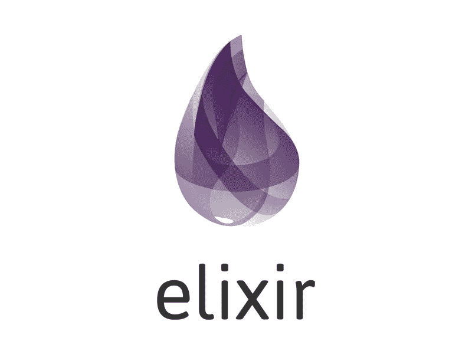
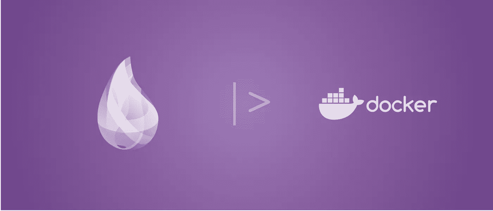
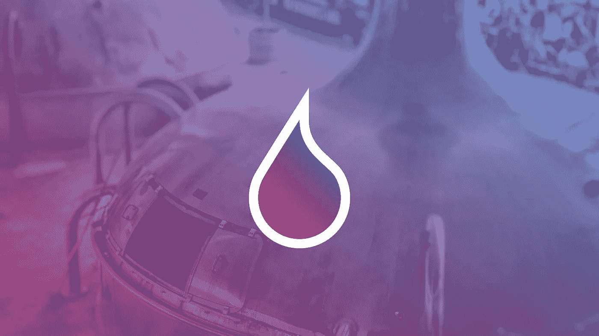

# 初学者的 7 个最佳灵药教程[2023 年 3 月]——在线学习灵药

> 原文：<https://medium.com/quick-code/the-best-tutorials-to-learn-elixir-for-beginners-3d805ebfe5d3?source=collection_archive---------2----------------------->

## 用 2023 年初学者最佳灵药教程学习 web 应用开发灵药。

**Elixir** 是一种功能性的、并发的、通用的**编程语言**，它运行在 Erlang 虚拟机(BEAM)上。 **Elixir** 构建在 Erlang 之上，并共享相同的构建分布式容错应用程序的抽象。基于评级、评论和质量，顶级灵药教程列表由专家策划。先从以下课程开始学习仙丹吧。

## 1.[完整的仙丹和凤凰训练营](https://coursesity.com/r/site/the-complete-elixir-and-phoenix-bootcamp-)

掌握使用 Elixir 和 Phoenix 的函数式编程技术，同时学习构建引人注目的 web 应用程序。

本课程将帮助您快速使用 Elixir 和 Phoenix，并教您深入理解和构建速度惊人的 web 应用程序所需的核心知识。

我们将从掌握使用 Elixir 进行函数式编程的基础开始，包括函数、模块和奇妙的“管道”操作符。您将通过各种不同的实际例子了解 FP 与经典面向对象编程的不同之处。一旦你对 Elixir 有了坚实的理解，我们将讨论如何用 Phoenix 框架和一个深入的应用程序构建速度惊人的应用程序。每个讲座都提供了源代码，因此您可以随时了解最新的课程进度。

如果你是第一次接触长生不老药，或者你一直在努力学习它，但有时觉得你还是不太“明白”，这是为你准备的长生不老药课程。要学习长生不老药和凤凰，你必须了解它们。

*   了解如何使用 Elixir 的内置库来清理代码
*   掌握函数式编程和面向对象编程的区别
*   掌握常见 Elixir 程序中所有不同的语法片段
*   建立有实际用途的有趣和有挑战性的项目
*   使用 Phoenix 开发一个可以以多种不同方式扩展的 web 应用程序
*   深入 Phoenix 的幕后，了解其内部是如何工作的
*   通过使用 Github 公共 OAuth 服务对用户进行身份验证来掌握 OAuth 流程
*   通过将 Postgres 集成到您的应用程序中来练习使用数据库

## 2.[使用 Elixir 的函数式编程—完整教程](https://www.eduonix.com/functional-programming-using-elixir-the-complete-course/UHJvZHVjdC0zMjMyMDA=)

学习前沿的函数式编程语言 Elixir，构建容错软件。

在本课程中，您将学习:

*   函数式编程基础
*   仙丹基础
*   如何使用流程、节点、任务、代理
*   如何使用 GenServer、应用程序和监控程序
*   混音工具简介
*   Elixir 中的元编程

在这里，您将学习如何在 Elixir 的帮助下执行函数式编程。

## 3.[仙丹入门](https://pluralsight.pxf.io/c/1137078/424552/7490?u=https%3A%2F%2Fwww.pluralsight.com%2Fcourses%2Felixir-getting-started&subId1=quickcode)

使用 Elixir 比以往任何时候都更容易编写分布式和可伸缩的应用程序。本课程将教授 Elixir 的基本语法，并最终创建一个功能应用程序。

该课程包括:

*   为什么是长生不老药？
*   基本类型
*   模块和功能
*   控制流
*   仙丹生态系统
*   创建应用程序
*   测试药剂
*   现在去哪里

在本课程中,《Elixir 入门》重点介绍如何使用 Elixir。首先，您将学习 Elixir 的基本语法，以及它与其他语言的不同之处。

接下来，您将了解如何构建自己的模块并以函数式编程风格编写代码，您将通过编写和测试应用程序来结束本课程。

学完本课程后，您将对 Elixir 的基本概念有一个很好的理解，并且能够编写可供其他开发人员使用的容错应用程序和库。

## 4.[灵丹妙药:在最佳并发语言上开始编程](https://click.linksynergy.com/deeplink?id=Fh5UMknfYAU&mid=39197&u1=quickcode&murl=https%3A%2F%2Fwww.udemy.com%2Flearn-elixir-beginner%2F)

了解如何开始使用基于 BEAM VM 的最佳可伸缩并发编程语言 elixir。

Elixir 运行在 Erlang VM 上，使开发人员能够完全访问 Erlang 的生态系统，Heroku、WhatsApp、Klarna、Basho 等公司使用它来构建分布式容错应用程序。Elixir 程序员可以调用任何 Erlang 函数，而无需运行时成本

## 5.[初学仙丹](https://click.linksynergy.com/deeplink?id=Fh5UMknfYAU&mid=39197&u1=quickcode&murl=https%3A%2F%2Fwww.udemy.com%2Felixir-for-beginners%2F)

Elixir 语言、工具和函数概念的初学者指南。

也许你只是想学习一门编程语言，它会教你构建并发的、功能性的和容错的软件的技术。

Erlang 是从头开始构建的，旨在获得分布式和容错计算“权利”。Elixir 继承了这些品质，并用一种漂亮的现代语言将其打包，并提供了优秀的工具和对所有现有 Erlang 库的访问。

*   这是学习 Elixir 编程语言的初学者指南。您将学习如何读写 Elixir 代码，理解递归、数据不变性和模式匹配。
*   本课程为学习函数式语言奠定基础，并给你建立知识的信心。

通过本教程为初学者打下坚实的基础。

未来的开发者需要有构建功能性和并发性软件的经验。随着物联网的兴起以及对可扩展和容错系统的更大需求，开发人员将需要构建能够应对这些挑战的软件的经验。

理解一门优雅的函数式语言(如 Elixir)将极大地提高你在面向对象语言(如 Ruby、Python、Java 和 C#)中的编程技能。它也将作为学习其他函数式语言的基础。

长生不老药是未来的语言，它将使你具备我们未来工作所需的技能。

*   从你自己的书桌上学习长生不老药代码。
*   适合有编程经验希望学习函数式语言的学生，也是学习速度较快的用户的理想选择。
*   视觉训练方法，为用户提供更多的记忆和加速学习。
*   将原则分解成简单的步骤。

## 6.[仙丹入门](https://click.linksynergy.com/deeplink?id=Fh5UMknfYAU&mid=39197&u1=quickcode&murl=https%3A%2F%2Fwww.udemy.com%2Fgetting-started-with-elixir%2F)

了解如何使用 Elixir 构建可伸缩、容错和可维护的应用程序。

Elixir 是一种动态的函数式语言，旨在构建可伸缩和可维护的应用程序。Elixir 利用 ErlangVM，ErlangVM 以运行低延迟、分布式和容错系统而闻名，同时也被成功地用于 web 开发和嵌入式软件领域。

在本课程中，您将学习 Elixir 的基础、语言语法、如何定义模块、操作常见数据结构的特征等等。本课程的重点是确保安装了 Elixir，并且您可以成功运行 Elixir 的交互式 shell 及其构建工具 Mix。在本视频结束时，您将学会如何使用 Elixir 编程语言，并知道如何使用其工具集轻松构建自己的应用程序。

## 7.[灵丹妙药:可扩展且高效的应用程序开发](https://click.linksynergy.com/deeplink?id=Fh5UMknfYAU&mid=39197&u1=quickcode&murl=https%3A%2F%2Fwww.udemy.com%2Felixir-scalable-and-efficient-application-development%2F)

探索用于构建可维护应用程序的 Elixir 编程概念。

Elixir 是一种动态、友好、易于使用的函数式语言，旨在构建可扩展和可维护的应用程序。Elixir 利用 Erlang VM，该 VM 以运行低延迟、分布式和容错系统而闻名，同时也成功地用于 web 开发和嵌入式软件领域。

您将深入到函数式编程范例中，并知道为什么这种语言如此特别。

然后，本课程将继续介绍 Elixir 的核心编程概念。您将通过学习语言语法、定义模块、操作通用数据结构的特征等来提高自己的技能。

您将学习如何安装 Elixir，以及如何成功地运行它的交互式 shell 和它的构建工具 Mix，该工具用于搭建、构建和测试项目。

接下来，您将了解执行复杂计算的 Elixir 数据类型和集合，并熟悉用于从复杂结构中提取数据的模式匹配概念。

本课程将教你 IO 概念，让你以更有用的方式呈现数据。您还将获得对 OTP 基础知识的牢固理解。

我将从这门课程中得到什么？

*   了解函数式编程，了解仙丹的由来
*   使用混合工具集创建应用程序
*   从程序内部与外界交流
*   探索灵药以创建弹性、可伸缩的应用程序
*   创建容错应用程序
*   设计程序-分布式应用和系统
*   学习使用 Elixir 的元编程做更少的事

> 感谢您阅读本文。我们策划了更多主题的顶级教程，您可能想看看:

 [## 初学者的 15 个最佳 Web 开发教程——在线学习 Web 开发

### 用 2022 年最好的新手网页开发教程学习网页开发

medium.com](/quick-code/top-tutorials-to-learn-web-development-for-beginners-4023595ebaa0)  [## 15+初学者最佳 Bootstrap 4 教程—在线学习 Bootstrap 4

### 2022 年，用最佳初学者引导教程学习 web 开发的引导

medium.com](/quick-code/top-tutorials-to-develop-responsive-websites-using-bootstrap-4-c934172f3ebd)  [## 15+最佳新手 PWA 教程—在线学习 PWA

### 学习 PWA，在 2022 年为网站创建即时应用程序，为初学者提供最佳 PWA 教程

medium.com](/quick-code/top-tutorials-to-learn-progressive-web-app-pwa-57bdf06af328) 

***披露:*** *如果您通过本页面的链接购买课程，我们可能会获得一小笔附属佣金。谢谢你。*