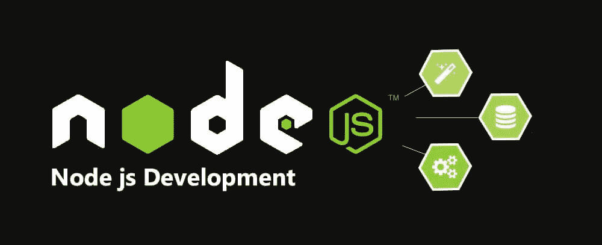
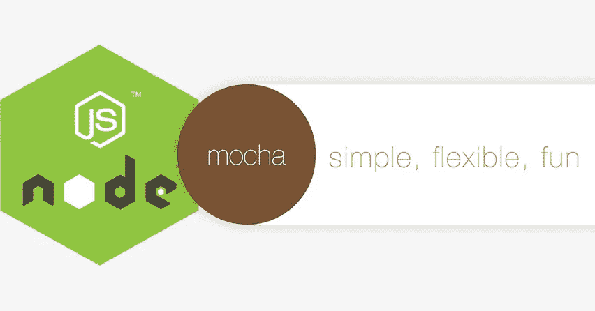

# 15 个最佳 Node.js 初学者教程[2023 年 3 月] —在线学习 Node.js

> 原文：<https://medium.com/quick-code/the-best-tutorials-to-learn-node-js-34818d757013?source=collection_archive---------0----------------------->

## 学习 Node.js 从 2023 年最好的 Node.js 初学者教程开始学习 web 开发。

NodeJS 是一个允许开发人员编写服务器端高性能和网络化应用程序的平台。这也是使用优秀的旧 Javascript。

我为什么要学 NodeJS？嗯，首先，学习新的东西不会有坏处。但最重要的是，学习 NodeJS 很棒，因为:

1.  Node 允许您编写部署在云上的高度可伸缩的网络应用程序！
2.  使用 Node，您实际上是在不同的应用程序设计级别上工作，这意味着您不是在堆栈上编写应用程序，而是从服务器开始设计堆栈。虽然这听起来令人望而生畏，但事实并非如此，你会明白为什么。
3.  您的代码在服务器和前端都使用同一种语言！我们都是通晓多种语言的人(我们在大多数项目中使用多种编程语言和语法)，但是在后端和前端用同一种语言管理代码从来没有坏处，事实上在调试时可以节省大量时间。
4.  NodeJS 被 LinkedIn、雅虎和微软等公司使用。它非常新，因此您可以从呈指数增长的 NodeJS 和 Javascript 开发人员社区中获得优势，这真的非常有趣！
5.  如果你一直在用 Javascript 编程，你可以利用你现有的知识和技能，把它带到一个全新的水平！

以下是从由专家策划的 [**顶级 node js 教程**](https://www.quickcode.co/best-tutorials-learn/Node-Js/5) 列表中选择的一些课程你应该花些时间深入研究 Node Js 开发。

## 1.[完整的节点。Js 开发者课程](https://coursesity.com/r/site/the-complete-node-js-developer-course-3rd-edition)(第三版)

通过使用 Node、Express、MongoDB、Mocha 等构建真实世界的应用程序来学习 Node.js。

***课程评分:5.0 分中的 4.7 分(总计 37569 分)***

完整的 Node.js 开发人员课程 2 在深入研究 Express、Mongoose 和 MongoDB 等优秀工具之前，涵盖了 Node 的基础知识。

整个课程都围绕着一个目标:将您变成能够开发、测试和部署实际生产应用程序的专业节点开发人员。

您将构建四个项目:

1.  一款让你双脚沾水的笔记应用。
2.  一个与谷歌地图和黑暗天空 API 交互的天气应用。
3.  一个包含用户账户和认证的待办事项 REST API。
4.  一款带有客户端伴侣的实时聊天应用。

Top Node Js Tutorials

## 2.[使用 NodeJS、Express 和 MongoDB 进行服务器端开发](https://coursera.pxf.io/c/1137078/1213622/14726?u=https%3A%2F%2Fwww.coursera.org%2Flearn%2Fserver-side-nodejs&subId1=BotTutorials)

本课程涉及服务器端的所有内容。整个课程围绕 NodeJS 平台展开。

***课程评分:4.8 分(总分 904 分)***

您将从 Web 协议的简要概述开始:HTTP 和 HTTPS。您将研究 NodeJS 和 NodeJS 模块:用于构建 web 服务器的 Express。

在数据库方面，您将学习基本的 CRUD 操作、NoSQL 数据库，特别是用于从 NodeJS 访问 MongoDB 的 MongoDB 和 Mongoose。您将研究 REST 概念并构建一个 RESTful API。我们触及认证和安全。最后，您将回顾后端即服务(BaaS)方法，包括移动 BaaS、开源和商业 BaaS 服务。

本课程结束后，您将能够:

*   展示对服务器端概念、CRUD 和 REST 的理解
*   使用 NodeJS 框架构建和配置后端服务器
*   为前端构建一个 RESTful API 来访问后端服务

## 3.[学习使用 NodeJS 和 Angular 构建应用](https://www.eduonix.com/learn-to-build-apps-using-nodejs-and-angular/UHJvZHVjdC0zMjMyMDA=)

课程从 NodeJS、MongoDB 和 Angular 的基础知识开始。

***课程评分:4.5 分(总分 386 分)***

本课程的重点是建立一个图书馆数据库，允许你添加、编辑和删除数据库中的书籍。该课程将帮助您学习如何使用 NodeJS 和创建一个基于 API 的应用程序。您还将学习如何从头构建一个 API，然后构建一个可以在 API 上无缝工作的前端。

学习 Nodejs 编程从未如此简单。这个在线 Nodejs 课程打破了困难的部分，使课程非常互动和实用，让你掌握。

## 4.[使用 Node.js 和 React 开发云应用](https://www.awin1.com/cread.php?awinmid=6798&awinaffid=466009&clickref=quickcode&ued=https%3A%2F%2Fwww.edx.org%2Fcourse%2Fdeveloping-cloud-applications-with-nodejs-and-react)

了解如何使用 JavaScript 框架开发和部署 web 应用程序。使用 Node.js 创建服务器端应用，使用 React 开发前端。在云上部署应用程序。

在本课程中，您将学习如何:

*   用 Node.js Javascript 框架创建服务器端应用。
*   练习 DevOps 并利用 Git 的连续交付管道。
*   将您的 web 应用程序部署到 IBM 云平台。
*   使用第三方包扩展 Node.js 应用程序。
*   利用 Express web 应用程序框架。
*   与云上的 Watson APIs 集成，将 AI 添加到您的应用程序中。
*   使用 ES6 和 React 构建丰富的应用程序用户界面。
*   开发回调函数，解析 HTTP 消息中的 JSON 数据。

您将学习如何使用几个 JavaScript 框架开发和部署全栈 web 应用程序。您将从使用 Node.js 和 Express 创建后端服务器端应用程序开始。

然后，您将使用 ES6 和 React JavaScript 库开发一个前端用户界面(UI ),并将您的应用程序部署到 IBM 云平台。

您将学习如何调用 Web 服务、解析 JSON 数据以及与云 API 集成，从而为您的应用程序添加人工智能功能。

您还将练习 DevOps 和 GitHub 概念，以支持应用程序的持续交付。

## 5.[学习 Node.js](https://www.pjatr.com/t/TUJGR0lLR0JHR0pMSUtCR0ZISk1N?sid=quickcode&url=https%3A%2F%2Fwww.codecademy.com%2Flearn%2Flearn-node-js)

本课程介绍了服务器端 web 开发的概念。

在本课程中，您将学习:

*   关于 web 应用程序后端的不同组件，并探索 Node.js JavaScript 运行时环境。

您将了解构成网站或 web 应用程序后端的不同部分，并熟悉 Node.js 运行时环境。

本课程结束后，您将开始探索流行的节点框架，如 Express.js，以构建强大的应用程序。

## 6. [Node.js:入门](https://pluralsight.pxf.io/c/1137078/424552/7490?u=https%3A%2F%2Fwww.pluralsight.com%2Fcourses%2Fnodejs-getting-started&subId1=quickcode)

Node.js 运行时为 PayPal、网飞、LinkedIn 甚至 NASA 等大公司的后端服务器提供支持。本课程将教你这个非常流行的运行时的基础知识，让你轻松地为 Node 编写代码。

该课程包括:

*   介绍
*   Node 入门
*   现代 JavaScript
*   NPM:节点包管理器
*   模块和并发
*   使用 Web 服务器
*   使用操作系统

在本课程 Node.js:入门中，您将学习使用 Node.js 创建可伸缩后端服务所需的基本技能。

首先，您将探索 Node 内置的工具以及社区提供的一些工具。

接下来，您将了解包管理、模块依赖性、事件驱动的并发策略，以及如何编写代码与服务器上的操作系统进行交互。

最后，您将发现现在可以与 Node.js 一起使用的现代 JavaScript 特性。完成本课程后，您将能够轻松地为 Node 创建和执行代码。

## 7.[学习和理解 NodeJS](https://coursesity.com/course-detail/learning-and-understanding-nodejs)

深入 NodeJS 的引擎盖下。学习 V8、Express、均值堆栈、核心 Javascript 概念等等。

***课程评分:4.5 分满分 5.0(******21545 分总评分)***

在本课程中，您将深入了解 Node，了解 NodeJS 如何在幕后工作，以及这些知识如何帮助您避免常见的陷阱和*大幅提高您调试问题的能力*。

在本课程中，您将了解 C++编写的 V8 Javascript 引擎如何工作，以及 NodeJS 如何使用它来扩展 Javascript 的功能。您将学习如何构建代码以便重用，如何使用模块更容易理解、管理和扩展，以及如何理解模块的实际工作方式。

您将了解异步代码如何在节点和节点事件循环中工作，以及如何使用事件发射器、流、缓冲区、管道和文件。我们将看到如何在 Node 中构建一个 web 服务器。

您将使用 Express 深入了解网站、web 应用程序和 API，并了解 Express 如何节省我们作为节点开发人员的时间。

## 8. [Node.js:构建 RESTful APIs 的完整指南](https://coursesity.com/course-detail/node-js-the-complete-guide-to-build-restful-apis-2018)

从安装到生产，学习使用 Node、Express 和 MongoDB 构建快速、可伸缩和安全的 RESTful 服务

***课程评分:4.6 分(总分 6，718 分)***

在本课程中，您将:

*   为你的网络和移动应用构建后台。
*   使用现代 JavaScript 特性(ES6、ES7)。
*   实现 CRUD 操作。
*   以正确的方式处理和记录错误。
*   编写单元和集成测试。
*   实践测试驱动开发(TDD)。
*   在 MongoDB 中存储和检索复杂数据。
*   实现身份验证和授权。
*   将节点应用程序部署到生产环境中。
*   应用最佳实践来构建快速、可扩展且安全的应用。

在本课程中，您将涉及以下节点 Js 主题:

*   节点模块系统
*   节点程序包管理器(NPM)
*   异步 JavaScript
*   有用的 ES6+功能
*   实现 CRUD 操作
*   在 MongoDB 中存储复杂数据
*   数据有效性
*   认证和授权
*   以正确的方式处理和记录错误
*   单元和集成测试
*   测试驱动开发(TDD)
*   部署

## 9. [Node.js，Express，MongoDB &更多:完整训练营 2022](https://click.linksynergy.com/deeplink?id=Fh5UMknfYAU&mid=39197&u1=quickcode&murl=https%3A%2F%2Fwww.udemy.com%2Fcourse%2Fnodejs-express-mongodb-bootcamp%2F)

通过构建真实世界的 RESTful API 和 web 应用程序(具有身份验证、Node.js 安全性、支付等)来控制节点

***课程评分:5.0 分中的 4.8 分(总计 1518 分)***

在本课程中，您将:

*   掌握整个现代后端栈:Node、Express、MongoDB 和 mongose(MongoDB JS 驱动)。
*   从头到尾构建一个完整的、漂亮的&真实世界的应用程序(API 和服务器端渲染网站)。
*   构建一个快速、可伸缩、功能丰富的 RESTful API(包括过滤器、排序、分页等等)。
*   了解 Node 在幕后是如何工作的:事件循环、阻塞与非阻塞代码、流、模块等..
*   用 MongoDB 和 Mongoose 进行 CRUD 操作。
*   深入了解猫鼬(包括所有高级功能)。
*   如何使用 NoSQL 数据库中的数据(包括地理空间数据)。
*   高级身份验证和授权(包括密码重置)。
*   安全性:加密、净化、速率限制等..
*   使用 Pug 模板的服务器端网站渲染。
*   带条纹的信用卡支付。
*   发送电子邮件和上传文件。
*   将最终应用程序部署到生产环境中(包括 Git 速成班)。
*   项目的可下载视频、代码和设计资产。

以下是您将在本课程中学到的内容:

*   Node.js 基础、核心模块和 NPM(节点包管理器)
*   Node.js 如何在幕后工作:事件循环、阻塞与非阻塞代码、事件驱动架构、流、模块等。
*   Express 基础(Node.js 框架):路由、中间件、发送响应等。
*   具有高级特性的 RESTful API 设计和开发:过滤、排序、别名、分页
*   使用 Pug 模板的服务器端网站渲染(HTML)
*   在本地和 Atlas 平台(在云端)上使用 MongoDB 数据库进行 CRUD 操作
*   高级 MongoDB:地理空间查询、聚合管道和运算符
*   Mongoose 基础(MongoDB JS 驱动程序):数据模型、CRUD 操作、数据验证和中间件
*   高级 Mongoose 特性:地理空间数据建模、填充、虚拟填充、索引等。
*   使用 MVC(模型-视图-控制器)架构
*   如何处理 NoSQL 数据库中的数据
*   高级数据建模:数据、嵌入、引用等之间的关系
*   使用 JWT 完成现代身份验证:用户注册、登录、密码重置、安全 cookies 等。
*   授权(用户角色)
*   安全性:最佳实践、加密、净化、速率限制等。
*   使用 Stripe 接受信用卡支付:后端和前端完全集成
*   上传文件和图像处理
*   使用 Mailtrap 和 Sendgrid 发送电子邮件
*   高级错误处理工作流
*   使用 Heroku 将 Node.js 应用程序部署到生产环境中
*   Git 和 GitHub 速成班

Best Node Js development Courses List

## 10.[与 React: Fullstack Web 开发的节点](https://click.linksynergy.com/deeplink?id=Fh5UMknfYAU&mid=39197&u1=quickcode&murl=https%3A%2F%2Fwww.udemy.com%2Fcourse%2Fnode-with-react-fullstack-web-development%2F)

使用 NodeJS、React、Redux、Express 和 MongoDB 构建和部署全栈 web 应用。

***课程评分:4.7 分(总分 9936 分)***

在本课程中，您将:

*   使用 React、Redux、Express 和 Mongo 创建样板启动项目。
*   了解常见的 web 技术和设计模式，以便将它们连接在一起。
*   掌握生产和开发环境之间的部署技术。
*   做一个带 Google OAuth 认证的 app。
*   学习从后端服务器有效地创建和发送电子邮件。
*   接受和处理用户的信用卡付款。

注意:本课程假设你已经掌握了 React 和 Redux down 的基本知识。

在本课程中，您将构建一个大型的 web 应用程序，该应用程序描述 React、Redux、Express 和 Mongo 的高级特性。通过将每个概念放入一个真正的应用程序中，你会更好地了解何时使用每个独特而强大的功能。

在本课程中，您将涉及以下节点 Js 主题:

*   了解构建全栈应用的架构考虑
*   将前端 Create-React-App 服务器连接到 NodeJS 和 Express 后端
*   将数据从 Mongo 数据库传递到 React 应用程序
*   了解如何使用 React 路由器在前端路由用户请求，使用 Express 在后端路由用户请求
*   使用 Redux 表单构建可重用的用户输入，包括导航
*   使用 Stripe 处理信用卡并接收用户付款
*   通过自动化电子邮件吸引用户
*   使用 Google OAuth 身份验证增强应用程序中的身份验证流程
*   利用高级 API 密钥处理技术分离生产和开发资源
*   教育您的用户如何通过自定义构建登录页面使用您的应用程序

## 11.[升级 Node.js:高级 Node.js 概念](https://click.linksynergy.com/deeplink?id=Fh5UMknfYAU&mid=39197&u1=quickcode&murl=https%3A%2F%2Fwww.udemy.com%2Fcourse%2Fadvanced-node-for-developers%2F)

使用 Node 获得高级功能。Js！用 Redis 学习缓存，通过集群加速，用 S3 和 Node 添加图片上传！

***课程评分:4.7 分(总分 3686 分)***

在本课程中，您将:

*   绝对掌握事件循环，了解其每个阶段。
*   利用工作线程和集群显著提高节点服务器的性能。
*   使用 Redis 支持的 MongoDB 缓存来加速数据库查询。
*   向您的节点服务器添加自动化浏览器测试，并完成持续集成管道设置。
*   利用 AWS S3，将可扩展的图像和文件上传应用到您的应用程序。

在本课程中，您将学习以下高级节点 Js 主题:

*   掌握节点事件循环——了解节点如何执行源代码。
*   了解 Node 的用途，以及你写的代码最终是如何被 V8 引擎中的 C++代码执行的
*   通过集群和工作线程大幅提升节点应用的性能
*   通过添加由快如闪电的 Redis 实例支持的查询缓存来增强 MongoDB 查询
*   通过亚马逊 S3 文件服务支持的图像和文件上传，将您的应用扩展到无限
*   实现一个持续的集成测试管道，这样你总是知道你的项目功能正常
*   你认为你知道所有关于管理 cookies 和会话的事情吗？嗯，你可能会，但要学得更多！
*   使用 Jest 和 Puppeteer 进行自动化浏览器测试，确保应用程序按照您预期的方式运行
*   学习先进的 JS 技术，包括在哪里使用 ES2015 代理！

## 12.[node . js API master class With Express&MongoDB](https://click.linksynergy.com/deeplink?id=Fh5UMknfYAU&mid=39197&u1=quickcode&murl=https%3A%2F%2Fwww.udemy.com%2Fcourse%2Fnodejs-api-masterclass%2F)

为 bootcamp 目录应用程序创建真实世界后端

***课程评分:4.8 分(总分 639 分)***

在本课程中，您将:

*   Bootcamp 目录应用的真实世界后端 RESTful API。
*   HTTP 基础(请求/请求周期、状态代码等)。
*   高级猫鼬查询。
*   JWT/Cookie 身份验证。
*   Express & Mongoose 中间件(地理编码、身份验证、错误处理等)。
*   API 安全(NoSQL 注入、XSS 保护、速率限制)。
*   API 文档和部署。

这是一个基于项目的课程，我们将为 DevCamper(一个 bootcamp 目录应用程序)构建一个广泛、深入的后端 API。在本课程中，您将学习以下主题:

*   HTTP 基础
*   邮递员客户
*   RESTful APIs
*   快速框架
*   路由和控制器方法
*   MongoDB 地图集和指南针
*   猫鼬 ODM
*   高级查询(分页、过滤等)
*   模型和关系
*   中间件(Express 和 Mongoose)
*   MongoDB 地理空间索引/ GeoJSON
*   地理编码
*   自定义错误处理
*   用户角色和权限
*   聚合
*   照片上传
*   使用 JWT 和 Cookies 进行身份验证
*   通过电子邮件发送密码重置令牌
*   使用 JSON 文件的自定义数据库种子
*   密码和令牌哈希
*   安全性:NoSQL 注射液、XSS 等
*   创建文档
*   部署 PM2、NGINX、SSL

## 13.[最终节点。Js 开发者课程](https://click.linksynergy.com/deeplink?id=Fh5UMknfYAU&mid=39197&u1=quickcode&murl=https%3A%2F%2Fwww.udemy.com%2Fthe-definitive-nodejs-developer-course%2F)

Node js 是最流行的 Javascript 开源服务器框架，让您的编码更上一层楼。

***课程评分:5.0 分中的 4.5 分(总分 198 分)***

您将在不同的模块中学习 Node.js 背后的所有逻辑和实践，随着课程的深入，我们将增加难度。

*综上所述，你将在本课程中学习:*

*   Node js 的基础知识。如何安装和运行它。它是如何工作的，以及幕后发生了什么。
*   学习 Node js 提供的工具，让你的项目进行下去。
*   使用 Node js 的内置功能创建简单的 web 服务器。
*   使用 Express 和 HBS 呈现您的 web 应用程序，让事情更上一层楼。
*   了解 Mongo DB 的要领，深入了解 Mongoose。
*   应用安全性、身份验证、限制路由、散列密码和 JWT
*   了解如何使用 multi 和云服务处理上传。
*   使用带有套接字 io 的套接字提升您的应用程序
*   **ES6 全程课程。**

## 14.[通过建造 12 个项目学习 Nodejs](https://click.linksynergy.com/deeplink?id=Fh5UMknfYAU&mid=39197&u1=quickcode&murl=https%3A%2F%2Fwww.udemy.com%2Flearn-nodejs-by-building-10-projects%2F)

在构建真实世界的应用程序时成为 Nodejs 开发专家。

***课程评分:4.2 分(总分 1673 分)***

在构建 12 个项目的过程中，您将学习 JavaScript 服务器编程、节点和 NPM 模块、其他相关技术和框架的使用。课程涉及的技术包括 HTML/CSS 前端技术、Nodejs NPM、NoSQL 数据库、列数据库、数据库 ORM、Express 框架、异步编程、北海巨妖层、Drywall 用户管理、Bcrypt 加密、Socket IO 和 REST APIs。

项目 1:简单的 Web 服务器

项目 2:基本快递网站

项目 3:用户登录系统

项目 4:节点博客系统

项目 5:社区活动

项目 6:书店

项目 7:聊天 IO

项目 8:医生名录

项目 9:投资组合应用

项目 10:电子学习系统

项目 11:食谱

项目 12:相册管理器

## 15.[角度&节点 JS —平均堆叠导轨](https://click.linksynergy.com/deeplink?id=Fh5UMknfYAU&mid=39197&u1=quickcode&murl=https%3A%2F%2Fwww.udemy.com%2Fcourse%2Fangular-2-and-nodejs-the-practical-guide%2F)

通过构建一个真实的应用程序，了解如何将 Angular 前端连接到 NodeJS & Express & MongoDB 后端

***课程评分:5.0 分中的 4.6 分(总计 13679 分)***

在本课程中，您将:

*   构建真正的 Angular + NodeJS 应用。
*   了解 Angular 如何工作，以及它如何与后端交互。
*   用 NodeJS 后端连接任意角度前端。
*   使用 MongoDB 和 Mongoose 与后端的数据进行交互。
*   使用 ExpressJS 作为 NodeJS 框架。
*   通过在前端使用乐观更新提供良好的用户体验。
*   通过添加错误处理来改进任何角度(+ NodeJS)应用程序。

用 Angular 和 Node.js + Express + MongoDB 创建现代化、可扩展、高速的 Web 应用。

具体来说，您将学习如何:

*   借助 Angular CLI 设置一个 NodeJS + Express + MongoDB + Angular 应用程序
*   高效使用 NodeJS 和 Express
*   在 Angular 中构建可重用的组件，并使用 Angular 提供的工具创建一个反应式的用户体验
*   连接你的 NodeJS(或者任何其他语言！)通过 Angular 的 HttpClient 服务与您的 Angular 应用程序进行后端连接
*   在您的后端提供适当的端点，供您的前端使用
*   添加文件上传和分页等高级功能
*   通过实现用户、身份验证和授权，使您的应用程序更加安全
*   优雅地处理错误

## 16.[精英 NodeJS 课程—成为认证 NodeJS 开发者](https://www.eduonix.com/elite-nodejs-course-become-certified-nodejs-developer/UHJvZHVjdC0zMjMyMDA=)

***课程评分:4.5 分(总分 445 分)***

*   这个精英 NodeJS 课程更多的是动手而不是理论。
*   学习可以在编程行业使用的最新编码风格。
*   唯一的精英 NodeJS 课程，教你每一个细节和可怕的代码。

这是实现你成为 NodeJS 开发者梦想的最好课程。它将教会你更多的实践，从而更快地提高你的编程技能。它会保证你在更高级的模式下会学到更多，它会教你快速过去的模式，这样你会学到你真正需要的东西

## 17.[关于节点的一切。JS](https://click.linksynergy.com/deeplink?id=Fh5UMknfYAU&mid=39197&u1=quickcode&murl=https%3A%2F%2Fwww.udemy.com%2Fall-about-nodejs%2F)

在云上创建和部署高性能 NodeJS 应用程序等等。

***课程评分:5.0 分中的 4.4 分(总计 1387 分)***

在本课程中，我们将从零开始，一路构建并在云上部署一个成熟的 NodeJS 应用程序。

使用 NodeJS，您将构建两个成熟的应用程序。你将经历从概念创建、UI/UX 设计到编码和在云上部署我们的应用程序的所有过程。

**A. ChatCAT** —你可以用 NodeJS 做的一件有趣的事情是构建实时应用程序，允许大量并发用户相互交互。这种类型的例子包括聊天服务器、游戏服务器、协作工具等。您将构建一个多房间聊天服务器，允许用户通过脸书登录，创建他们选择的聊天室并实时聊天。您不仅要创建这个应用程序，还要将它部署在 Heroku 和数字海洋上。

您将了解如何使用 Websockets、以高效的方式构建您的应用程序、创建和使用开发和生产配置、使用脸书进行身份验证、在脸书上设置应用程序、管理会话、查询和使用托管的 MongoDB 数据库、使用 Heroku & Digital Ocean 的云服务等等

**B. PhotoGRID** —我们将在本课程中构建的第二个完整的应用程序是一个照片库应用程序，它允许用户将图像上传到照片库中，并能够为他们喜欢的图像投票。这个 NodeJS 应用程序允许用户上传文件，然后在服务器上将其调整为缩略图，并存储在亚马逊 S3 桶中，以优化前端界面的交付。整个应用程序运行在亚马逊 EC2 云服务器上，我们将从头开始创建并配置使用。

您将了解如何使用 NodeJS 和 AJAX 管理文件上传、在服务器上调整图像大小、在 S3 桶中访问和存储文件、查询和使用托管的 MongoDB 数据库、使用亚马逊的弹性 IP 服务和 Cloudfront 分发、确保即使服务器重启，NodeJS 应用程序也能自动运行等等。

> 感谢您阅读本文。我们策划了更多主题的顶级教程，您可能想看看:

 [## 10+初学者最佳 Angular JS 教程—在线学习 Angular

### 2022 年学习 Angular 构建客户端应用程序，为初学者提供最佳 Angular 教程

medium.com](/quick-code/top-tutorials-to-learn-angular-js-for-beginners-2f401566d5f1)  [## 10+最佳 Vue JS 初学者教程—在线学习 Vue JS

### 学习 VueJS 开始学习前端应用程序开发，最好的 VueJS 初学者教程在…

medium.com](/quick-code/top-tutorials-to-learn-vue-js-for-beginners-6c693e41091d)  [## 10+最佳 ECMAScript 初学者教程—在线学习 ES6

### 通过 2022 年面向初学者的最佳 ECMAScript 教程，在万维网上学习用于客户端脚本的 ES6

medium.com](/quick-code/the-best-tutorials-to-learn-ecmascript-es6-for-beginners-55fe602382cd) 

*披露:如果你通过本页的链接购买课程，我们可能会得到一小笔会员佣金。谢谢你。*