# 最佳 VS 代码主题 2023🤩

> 原文：<https://medium.com/quick-code/the-best-vs-code-themes-2022-9e9b648c4596?source=collection_archive---------0----------------------->

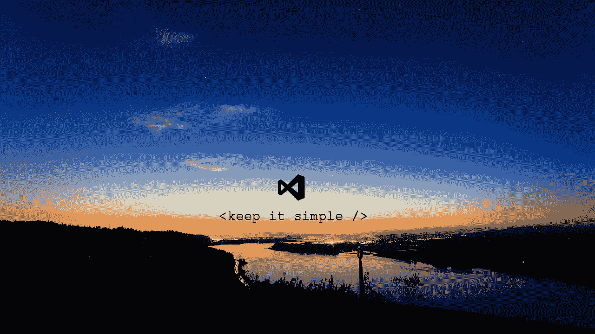

Image Credit: [https://visualstudiowallpapers.com/](https://visualstudiowallpapers.com/)

为你的下一个项目寻找最好的 VS 代码主题？然后是提供一些最流行的 VS 代码主题的列表。在开始列表之前，我们先来了解一下什么是 VS 代码。

## 什么是 VS 代码？

Visual Studio Code 是一个由微软开发的轻量级但功能强大的自由软件源代码编辑器。它在 web、移动和硬件开发人员中非常受欢迎，是微软创造的最好的产品之一。

它提供了对调试、智能代码完成、语法高亮、代码重构、丰富的扩展生态系统和无障碍定制的支持。它被广泛使用，开发人员喜欢它的每一个功能，包括智能感知、内置 Git 控件、快速导航、快速编辑和各种 vs 代码主题，这些功能最终会改善开发人员的体验和工作效率。

这里，在这个列表中，我们将讨论顶级 vscode 主题，包括浅色 vscode 主题、深色 vscode 主题、vscode 材料主题和其他流行的 VS Code 主题。

## 特点:

Visual Studio 代码提供了一些非常独特的功能，如下所示:

*   支持多种编程语言
*   智能感知
*   跨平台支持
*   扩展和支持
*   贮藏室ˌ仓库
*   网络支持
*   层级结构
*   改进代码
*   终端支持
*   多项目
*   GitSupport

## 为什么选择 Visual Studio 代码？

微软的 Visual Studio 代码无疑是最好的代码编辑器之一。提供大量社区支持的扩展，您可以使用 VS 代码来提高您的工作流程和生产力。该应用程序可以在 Windows、macOS 和 Linux 上使用，这使得它成为编写代码的完美程序，无论使用什么操作系统。VS 代码的一个重要方面是它的可定制性和健壮的主题化功能。

以下是使 Visual studio 代码令人惊叹的一些其他因素:

*   Visual Studio 代码提供了对数百种语言的支持，非常适合日常使用，还提供了一些高级功能，如自动缩进、智能感知代码完成、代码段、语法突出显示等。
*   Visual Studio 代码有一个交互式调试器，可以帮助查看调用堆栈、检查变量以及在控制台中执行命令。
*   对 Git 和其他脚本工具的内置支持使得用 VS 代码开发比以往任何时候都要快。
*   它适合现代 web 开发，对 JSX/React、HTML、CSS、JavaScript、TypeScript、Less 和 JSON 等技术提供了丰富的工具支持。
*   它可以用于广泛的应用程序和技术，包括跨平台的 web 和云应用程序。
*   它还提供了极大的灵活性和可定制的环境，帮助开发人员改善编辑-构建-调试体验。

现在，让我们开始收集 visual studio 的最佳主题..！！

[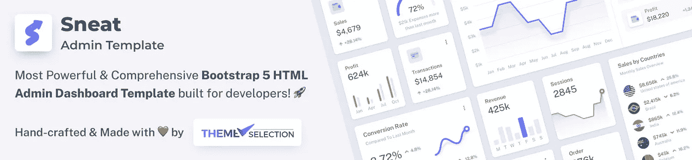](https://themeselection.com/products/sneat-bootstrap-html-admin-template/)

Must check our Best [**Bootstrap Dashboard Template**](https://themeselection.com/item/category/bootstrap-admin-templates/)**…!**

# 最佳 VS 代码主题:

visual studio 代码有许多主题，它们对代码的清晰性、维护和速度有重大影响。让我们探索一下最受欢迎、最具趋势性的 vscode 主题。

## [一个暗亲](https://marketplace.visualstudio.com/items?itemName=zhuangtongfa.Material-theme)

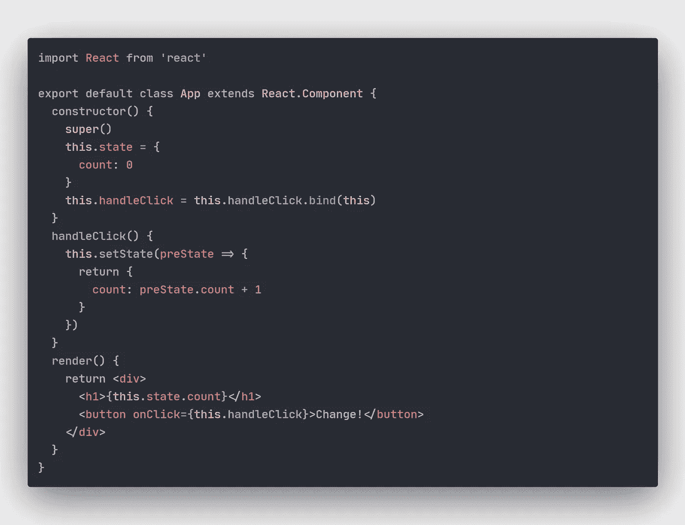

安装数:4，439，317

Atom 的 Visual Studio 代码的标志性 One Dark 主题非常适合喜欢黑暗模式的开发人员。这个主题是最常用的主题之一，因为它混合了很好的配色方案和视觉上令人愉悦的风格。

## [德拉库拉官方](https://marketplace.visualstudio.com/items?itemName=dracula-theme.theme-dracula)

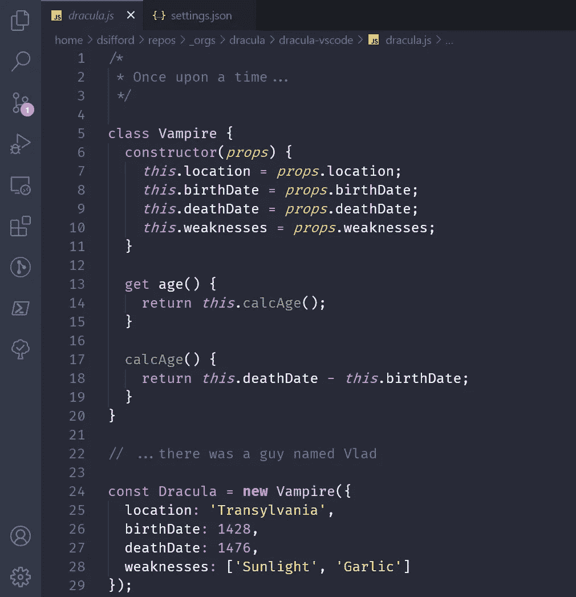

安装数量:2，886，381

名单中的另一个 VS 代码最佳黑暗主题是 visual studio 代码和其他 181+应用程序的 Dracula 官方。这是一个由芝诺·罗查创造的设计师友好的黑暗主题。此外，它是有史以来最受欢迎的 vs 代码主题之一。

## [GitHub 主题](https://marketplace.visualstudio.com/items?itemName=GitHub.github-vscode-theme)

安装数量:2，682，414

这个经典的 GitHub 主题有亮、暗、亮默认、暗默认和暗暗版本。这些主题类似于 GitHub 官方主题。在偏爱 GitHub 经典主题的开发者中颇受欢迎。

## [冬天来了主题](https://marketplace.visualstudio.com/items?itemName=johnpapa.winteriscoming)

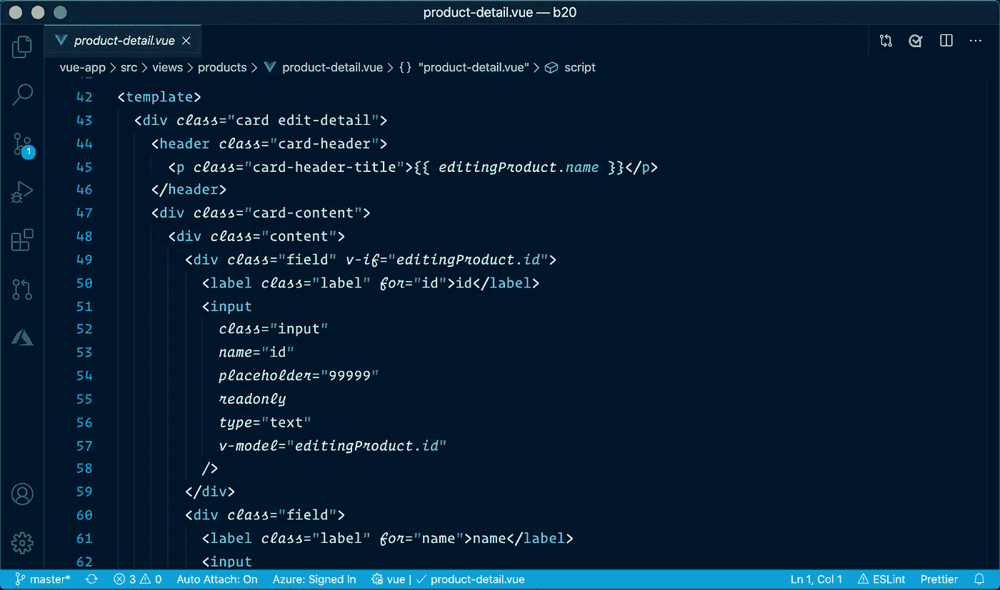

安装数:1，398，907

很熟悉的对话…！！

这个 Visual Studio 代码主题有深色、不带斜体的深色和浅色主题。此外，这个 VScode 主题的灵感来自 Visual Studio Dark+、Monokai 和达斯汀·桑德(Dustin Sander)为“一个古老的希望”创作的主题。这个主题的蓝色背景灵感来自莎拉·德拉斯纳的夜猫子主题。

## [夜猫子](https://marketplace.visualstudio.com/items?itemName=sdras.night-owl)

安装数量:1，128，643

献给夜猫子，这个主题适合喜欢深夜编码的人。颜色选择、背景和风格非常适合低光环境。还有一个灯光猫头鹰的主题，是为了在白天方便观看而设计的。如果你愿意，你可以禁用斜体，因为还有一个非斜体的主题。

除此之外，看看我们最受欢迎的 [**Vue js 管理模板**](https://themeselection.com/item/category/vuejs-admin-templates/) ，它可以立即创建响应迅速的 web 应用程序！

[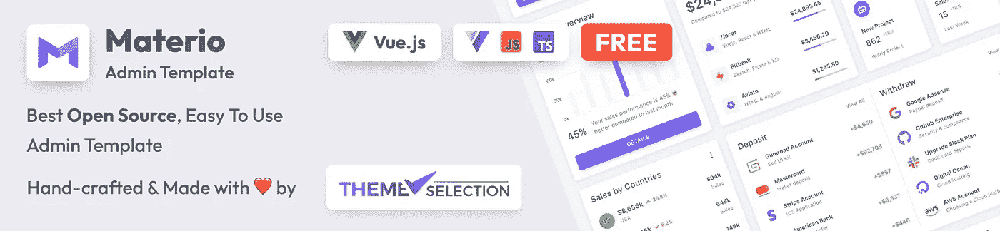](https://themeselection.com/item/materio-free-vuetify-vuejs-admin-template/)

[**Materio — Free Vuetify Vuejs 3 Admin Template**](https://themeselection.com/item/materio-free-vuetify-vuejs-admin-template/)

## [Monokai Pro](https://marketplace.visualstudio.com/items?itemName=monokai.theme-monokai-pro-vscode)

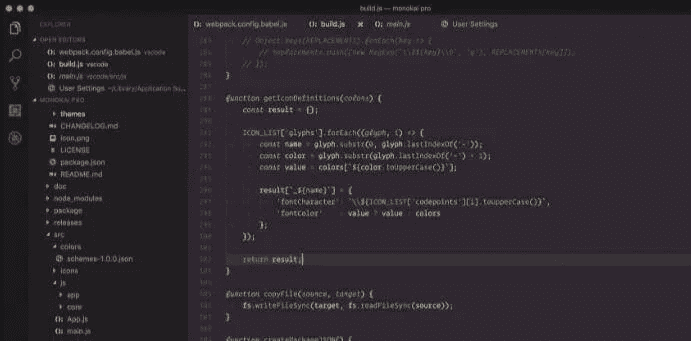

安装数:1，111，117

Monokai Pro 是一个配色方案，自定义的用户界面主题，以及 Visual Studio 代码的完整图标集。它是由原 Monokai 颜色的作者设计的。精心选择的色调是不妥协、不分散注意力的用户界面的基础。Monokai Pro 的唯一目标是让您专注于您的代码。

## [一个 Monokai](https://marketplace.visualstudio.com/items?itemName=azemoh.one-monokai)

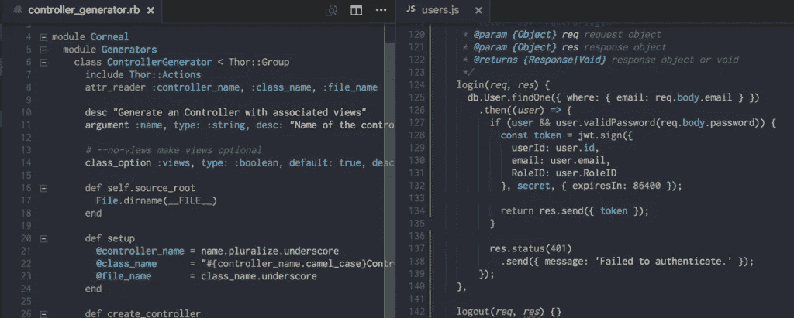

安装数量:1，053，867

一个莫诺凯是一个莫诺凯和一个黑暗主题的组合。它采用精心选择的混合颜色和最佳代码编辑功能进行设计，可以改善开发人员的体验。

这是由约书亚·艾泽拉斯创作的排名最高且最常用的黑暗 vscode 主题之一。对于 Visual Studio 代码来说，这是一个清晰、方便、迷人的主题。

## [深浅不一的紫色](https://marketplace.visualstudio.com/items?itemName=ahmadawais.shades-of-purple&ssr=false#overview)

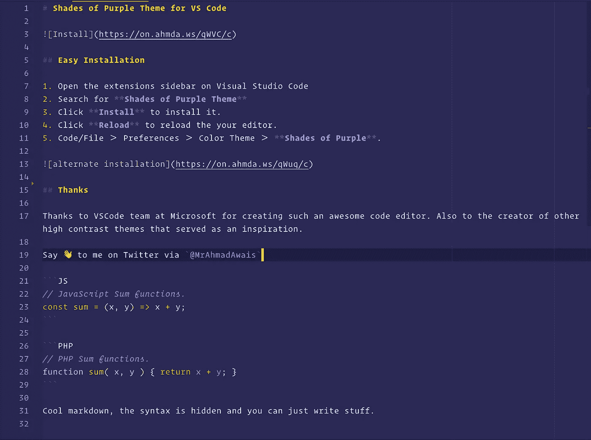

安装数量:1，049，423

《紫色阴影》是市场上下载量最大、排名最高的 VS 代码主题之一。它大胆的紫色阴影、markdown 编辑和出色的样式改善了开发人员的体验和扫描代码的能力。这个主题很好地混合了紫色和突出的特性颜色，使得开发者更容易快速地识别各种属性。

## [阿玉](https://marketplace.visualstudio.com/items?itemName=teabyii.ayu)

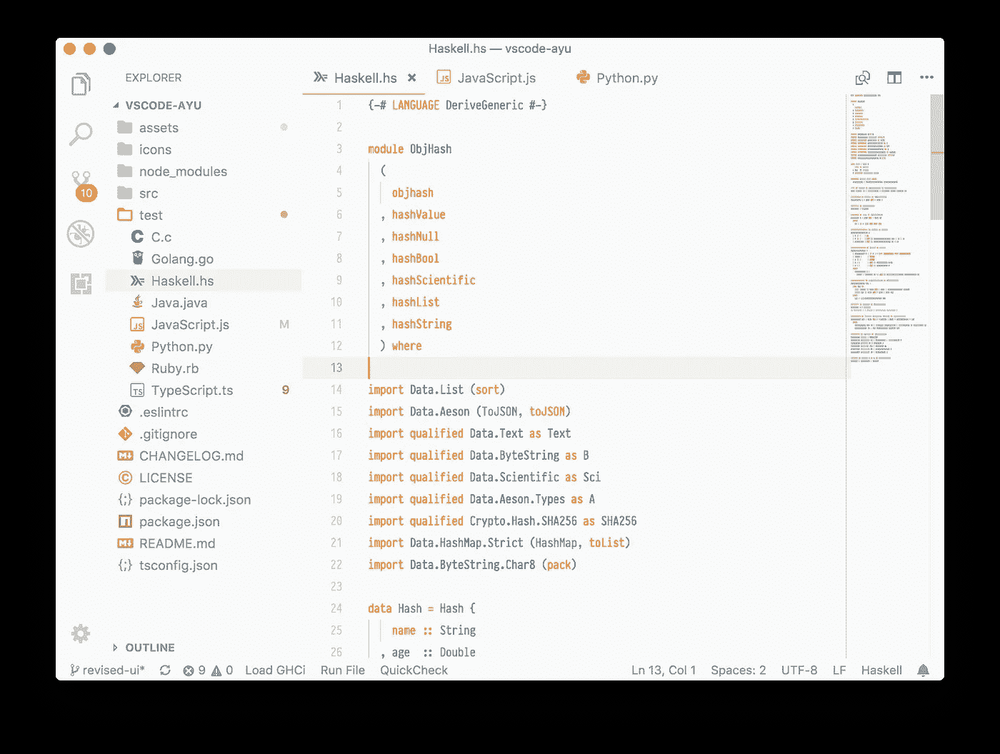

安装数量:991，415

Ayu 是一个流行的 VSCode 主题，有三个版本——黑暗、光明和幻影。这个简单、明亮、优雅的主题受到长时间编码的开发人员的赞赏。它是 Visual Studio 代码中收视率最高、下载量最大的主题之一。

## [黑夜](https://marketplace.visualstudio.com/items?itemName=whizkydee.material-palenight-theme)

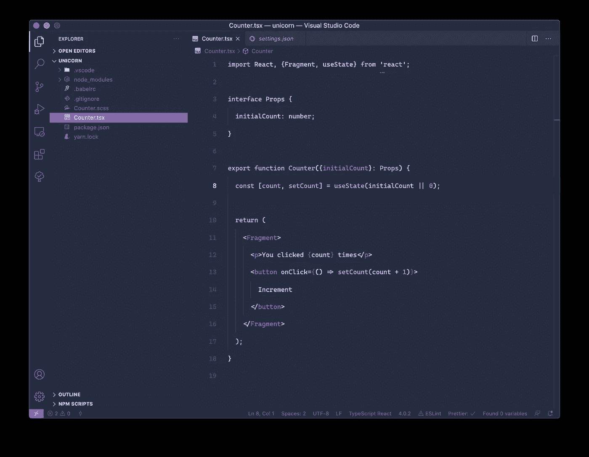

安装数量:716，039

这个有趣的材料启发的主题在前三个变体中使用了最小的对比。这是一个优雅的，干净的，美丽的主题，由 Olaolu Olawuyi 创作。

## [钴 2 主题官方](https://marketplace.visualstudio.com/items?itemName=wesbos.theme-cobalt2)

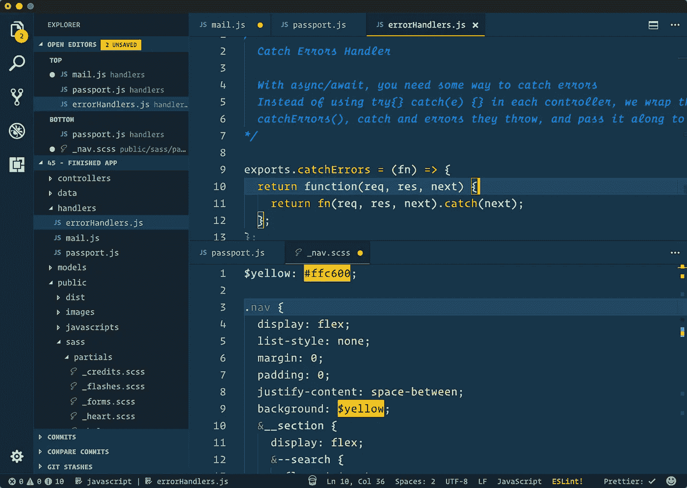

安装数量:674，471

这个 vscode 主题是 Wes Bos 创建的。它赏心悦目，设计精美，是市场上评价最高的主题之一。它精心挑选的颜色和风格有助于开发人员关注代码及其清晰度。

## [合成波 84](https://marketplace.visualstudio.com/items?itemName=RobbOwen.synthwave-vscode)

安装:636，558

这个实验主题受到音乐和现代 Synthwave 品牌封面艺术的影响，如 FM-84、Timecop 1983 和 The Midnight。这个简单的 CSS 主题是对现代 web 开发中 80 年代美学的一个小小的庆祝。它通过发光效果和调色板中混合良好的颜色实现了 80 年代的霓虹灯梦想，使其成为许多装置中经典优雅的主题之一。

## [夜啼](https://marketplace.visualstudio.com/items?itemName=liviuschera.noctis)

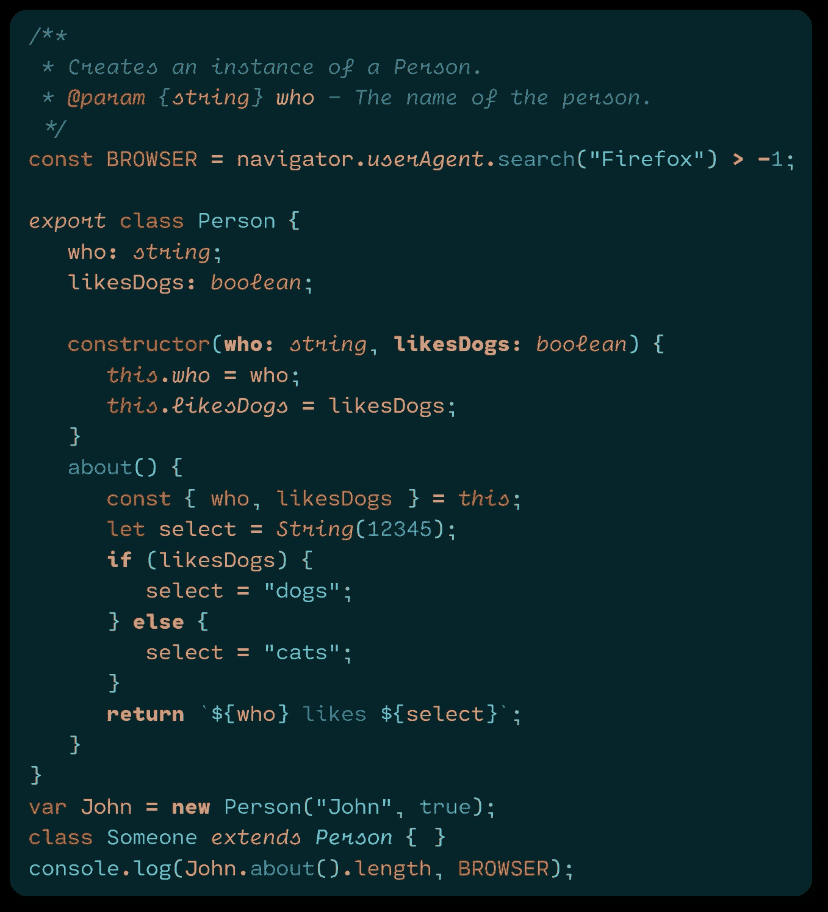

安装数量:511，688

Liviu Schera 的 Noctis 是一个明亮和黑暗主题的集合，具有良好的平衡和视觉吸引力的暖色和冷色的混合。

它的设计是为了让眼睛感觉舒服，从而减少眼睛的疲劳，并赋予这个主题中使用的颜色语义。有 8 个深色和 3 个浅色版本。通过各种颜色和最好的语法突出显示，这个主题获得了很好的评价和安装数量。

## [熊猫主题](https://marketplace.visualstudio.com/items?itemName=tinkertrain.theme-panda)

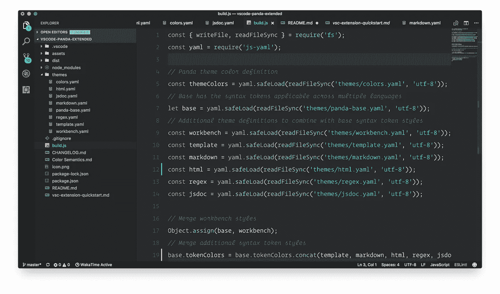

安装数量:483，485

一个极小的，黑暗的语法主题。这是最新版本的**熊猫语法**主题。这是一个专为 [Visual Studio 代码](https://code.visualstudio.com/)【新版本】打造的深色语法主题，带有微妙的颜色，意在赏心悦目。

## [诺德](https://marketplace.visualstudio.com/items?itemName=arcticicestudio.nord-visual-studio-code)

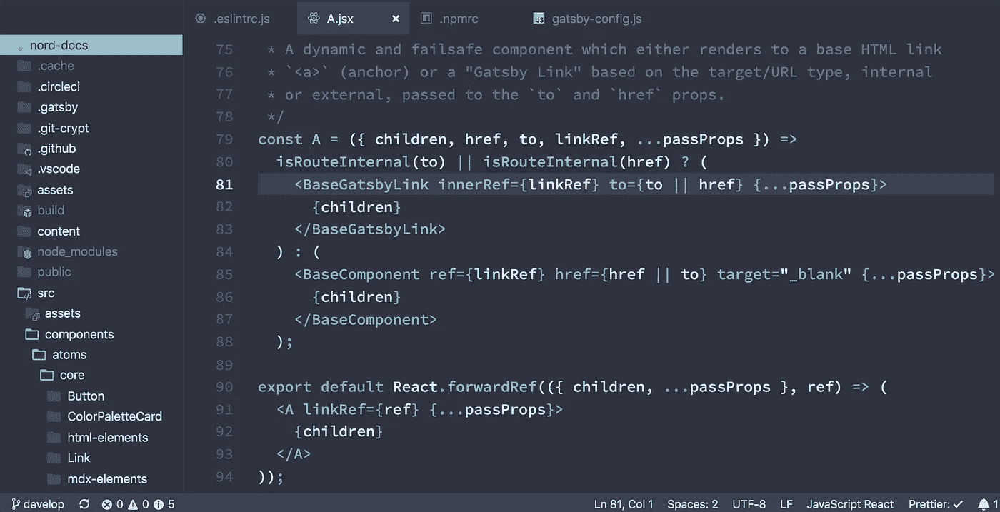

安装数量:477，732

Nord 是北极冰工作室设计的北极、偏北、干净、优雅的主题。

它旨在为开发人员提供流畅清晰的工作流程、出色的可读性，以及通过颜色的良好混合突出语法。它提供了整洁的、视觉上吸引人的、流行的代码编辑特性，深受开发人员的喜爱。

> 创建任何 web 应用程序时，建议使用 [**管理面板模板**](https://themeselection.com/item/category/admin-templates/) 和主题，因为预构建的组件和页面将帮助您节省大量时间和金钱……！

## [崇高的物质主题](https://marketplace.visualstudio.com/items?itemName=jprestidge.theme-material-theme)

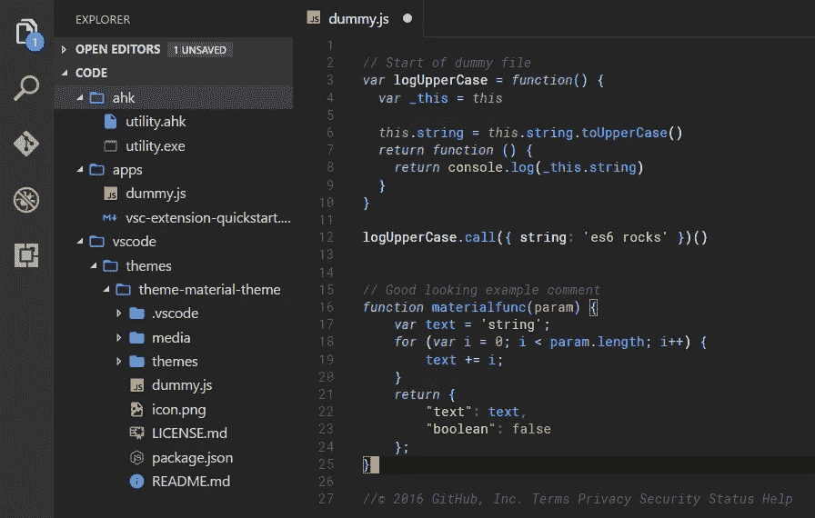

安装数量:458，955

这只是一个端口，用于将主题的样式与默认的 VSCode chrome 对齐，默认的 vs code chrome 不能在 atm 上更改。

# 结论:

这是 2022 年最佳 VS 代码主题集。

VS 代码非常有用，因为它们有助于加快工作流程和提高生产率。

在这个集合中，我们试图涵盖 VS 代码的主要主题。如果你使用的主题不在这个列表中，你可以通过下面的评论来分享！此外，我们想听听你的开发者经历。

在处理任何项目时，您可能需要一些管理模板。我们在 [**主题选择**](https://themeselection.com/) 提供精选的高质量、现代设计、专业且易于使用的[免费管理仪表板模板](https://themeselection.com/item/category/free-admin-templates/)、HTML 主题和 [UI 套件](https://themeselection.com/item/category/ui-kits/)来更快地创建您的应用程序！

让我们知道你最喜欢的编辑器和你使用的有助于提高工作效率的主题。