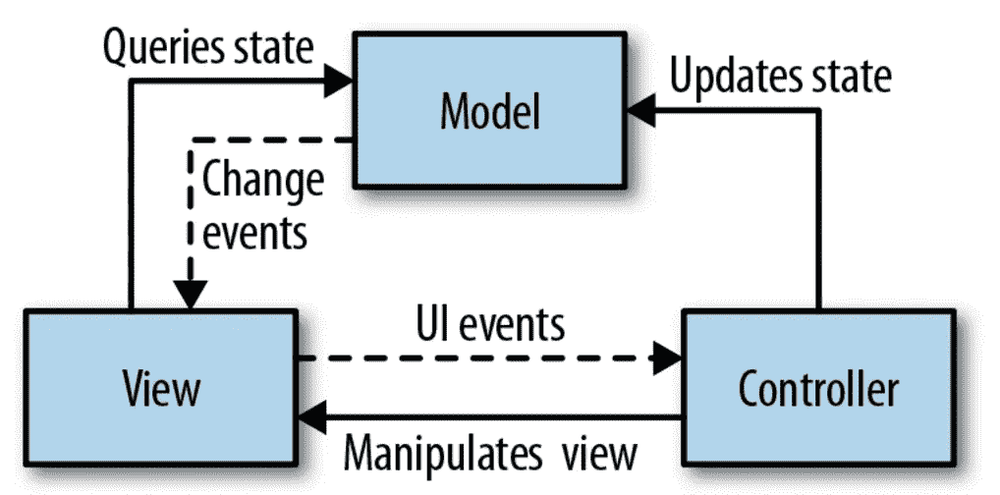
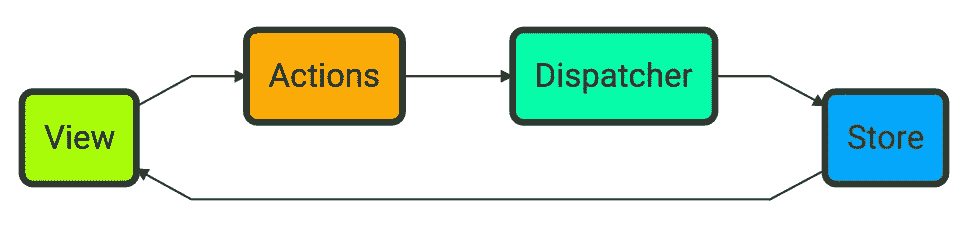
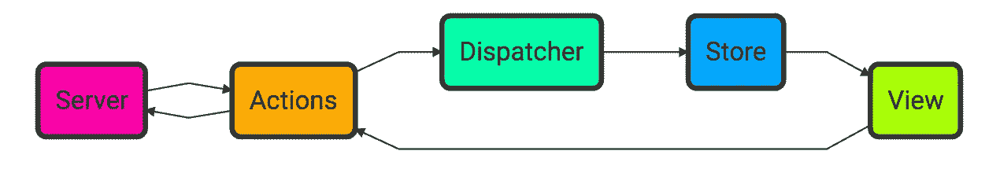

# 学习编码的最好方法是编码:通过构建应用程序来学习应用程序架构

> 原文：<https://medium.com/javascript-scene/the-best-way-to-learn-to-code-is-to-code-learn-app-architecture-by-building-apps-7ec029db6e00?source=collection_archive---------0----------------------->

Practice Makes Perfect by Benjamin Stäudinger (CC BY-NC-ND 2.0)

学习编码可能很难。我学习时面临的最大挑战之一是如何从[学习资源](/javascript-scene/learn-javascript-b631a4af11f2)和教你编码基础的小[实践挑战](https://www.freecodecamp.com/)跳到成熟的应用。

除此之外别无他法。最好的学习方法是投入并开始构建，但这可能会令人望而生畏。你从哪里开始？

## 用户和认证？

您可能认为用户管理和身份验证是学习的良好开端。你错了。首先，密码已经过时了，所以你所有的新应用都应该使用[无密码认证](/javascript-scene/passwordless-authentication-with-react-and-auth0-c4cb003c7cde)。

第二，用户认证是一个**巨大的安全风险**，任何情况下**都不应该留给新手**。数以亿计的登录凭证从大公司被盗，这些公司有专门的安全专家，他们除了昼夜不停地研究如何提高安全性之外什么也不做。您的一些登录凭证很有可能被盗。

如果你搞砸了用户认证，不仅对你的应用程序是危险的，对你的用户也是危险的，因为他们可能在其他应用程序上使用相同的登录凭据，比如他们的电子邮件提供商或他们的银行账户。换句话说，如果有人从你的应用程序中窃取密码，他们可能会使用它们在与你的应用程序无关的领域进行真正的破坏。

> 记住，用户认证是一个**巨大的安全风险**，任何情况下**都不应该留给新手**。

我建议大多数应用将认证任务委托给外部认证提供商，如脸书、Twitter 或类似的。即使是由大企业支持的大型应用程序，他们也有合理的理由和资源来管理自己的用户身份验证策略，应该使用流行的、经过战斗测试的库，而不是从头开始滚动自己的身份验证。

但是，你可以构建许多不需要用户认证的小型单用户应用程序，并且一些可以从用户认证中受益的应用程序可以在以后添加该功能。

开始向真正的应用过渡的一个好方法是使用 *`localStorage`* 构建基于浏览器的应用，只支持单个用户，然后在此基础上向上扩展。在掌握了现代客户端应用程序架构的基础知识之后，您可以在以后添加多个用户和数据库连接。

## 客户端应用架构介绍

那么现代客户端应用程序架构是什么样子的呢？就在短短几年前，它还被 MVC、MVP、MVVM 等 MV*架构所主导…

它们中的大多数处理如何在模型(数据)和视图(UI/表示)之间进行协调。应用程序架构中的一个重要概念是**关注点分离**。

以下是我们希望分开的一些关注点:

*   演示/视图(布局、样式、DOM 操作)
*   事件处理/动作(捕获用户输入和外部消息，并将其转换为应用程序中的动作)
*   路由/URL(将 URL 转换为操作)
*   业务逻辑(如何操作数据的规则)
*   客户端状态管理/模型/存储(内存中客户端数据结构)
*   数据持久性和服务器 I/O(长期数据存储、AJAX、SSE)

MVC 架构看起来像这样:

MVC Diagram from “Programming JavaScript Applications”

在 MVC 中，模型发出变更事件，视图通过查询当前状态和更新来响应。控制器监听视图事件，并通过更新状态做出响应，还可能操纵视图，或者选择新视图来响应路由更改。

通过**双向数据绑定**，对视图的更改直接反映在模型中，而无需通过控制器。想象一下，视图也可以直接更新状态，而不是简单地查询状态。简而言之，这就是双向绑定。

用户输入可能触发状态更新，这可能触发 DOM 更改，这可能触发另一个状态更新，这可能触发更多的 DOM 更改，等等。很快就很难理解变化是如何级联并影响应用程序的状态的，并且很容易意外地引入无限循环。

角度 1 就是一个例子。Angular 1 试图通过控制 UI 状态更新循环(称为**摘要循环**)来管理这种复杂性。为了避免无限的消息传递递归，digest 循环有 10 个周期的硬连接限制，但这仍然为单个事件发送级联事件留下了很多空间，这将导致大量 DOM 更改，从而触发更多的周期。除了复杂和难以理解之外，这也是 Angular 中性能问题的一个常见原因，因为一个单独的更改可能会触发大量的更新。

2013 年，脸书宣布了 React:一个用于构建用户界面组件的新开源框架。React 不关心您如何处理数据更新，但是它不支持双向数据绑定。相反，我们鼓励你使用**单向数据流**，对类似 Flux 架构的东西做出配对反应。

React & Flux 从根本上改变了我们构建 web 平台应用的方式，单向数据流的思想也已经扩展到 Angular 和 Ember 应用中。

通量架构看起来像这样:

Flux Architecture

回调函数被传递到视图中，而不是通过大量的事件侦听器来传播更改，回调函数与 DOM 事件侦听器回调挂钩。回调产生一个 action 对象，该对象被分派到管理状态更改的存储区。

当您将服务器 I/O 添加到组合中时，它可能是这样的:

Flux with Server I/O

除了视图回调之外，许多应用程序还会连接事件监听器来与服务器通信。UI 动作还可以分派服务器查询并将更新转发给服务器。因此，来自视图的操作回调可能会触发服务器查询或更新，而服务器发送事件的侦听器可能会触发进一步的操作，这些操作可能会被分派到存储，等等。

你可能听说过 Redux，它是目前最流行的助焊剂替代品。它为外挂操纵增加了纯函数的概念，称为**减速器**。reducer 通过确保每种状态更新都可以独立管理和测试，并且 reducer 没有副作用，简化了如何推理存储，这意味着很容易理解任何特定操作的影响。为了更好地了解 Redux 架构，请查看[这张幻灯片](http://slides.com/jenyaterpil/redux-from-twitter-hype-to-production)。

对于您的第一个应用程序，您可能不需要处理所有这些架构。我们通过构建大型应用程序来实现这些架构更新，在这些大型应用程序中，对应用程序状态的无限制共享访问可能会变得混乱不堪。这些抽象为应用程序中的所有状态变化提供了一个清晰的电路，但对于琐碎的应用程序来说，它们可能有些过头了。

最初，您可以连接事件侦听器并直接操纵应用程序状态作为响应，这是可以的。跑之前先学会走。当你准备好转向更复杂的应用程序时，请查看丹·阿布拉莫夫的优秀课程，[“Redux 入门”](https://egghead.io/courses/getting-started-with-redux)和[“用惯用的 Redux 构建 React 应用程序”](https://egghead.io/courses/building-react-applications-with-idiomatic-redux)。

## 实践应用

每个开发人员都需要一个代码组合。练习应用程序是建立一个的好方法。

当你学习上述课程时，你会接触到非常常用的待办事项示例应用程序。我建议你跟随教程，自己做一个。

但是你还能开发什么有趣的应用呢？学习编码最困难的事情之一是为要构建的应用程序想出好主意。

有一些网站[通过投票对应用创意](http://www.ideaswatch.com/startup-ideas/web-application)进行汇总和排名。如果你在寻找灵感，一定要看看这些。

“跟随 Eric Elliott 学习 JavaScript”的学生将会发现一个新的学生项目列表，里面有简短的特性列表。这些应用和功能都有难度等级，“基本”、“中级”和“高级”，以帮助学生根据他们当前的学习水平来应对挑战。

# 示例项目:拒绝

[的一个学生项目是和 Eric Elliott](https://ericelliottjs.com/) 学习 JavaScript。

想要团队合作吗？在[学生聊天](https://gitter.im/learn-javascript-courses/javascript-questions)里找一个编码的哥们。

你必须输才能赢。

训练自己:

*   加薪
*   卖出更多
*   发展更多业务
*   协商更好的交易

这个游戏有一个规则:

你必须每天至少被一个人拒绝一次。

向你舒适区之外的人要东西，你会发现自己赢得更多。

赢= 1 分。拒绝= 10 分。

你能让你的拒绝持续多久？

## 基础水平

建立一个用户界面，让你跟踪你的分数。包括提问的文本输入，你问了谁，以及两个按钮:“接受”或“拒绝”。对于邮件或消息等异步请求，在得到答案的时候记录分数，而不是在提问的时候。

使用 HTML+CSS 并在本地存储中存储数据记录。

持续记录用户的当前得分。请记住，每天的小计需要在每次接受或拒绝一个请求时重新计算，因此将列表保存在一个数组中是有用的，您可以随着每个新答案而[减少](https://developer.mozilla.org/en-US/docs/Web/JavaScript/Reference/Global_Objects/Array/Reduce)。

## 中等水平

*   添加一个 API 来使用 web 服务和数据库存储数据。
*   添加身份验证并跟踪多个用户。提示:Redis、Mongo 或 RethinkDB 是很好的数据库候选。
*   像脸书或推特这样的社交登录是很好的认证选择(比用户名/密码登录更容易也更安全)。

## 优等

*   分享您的分数，并在脸书上与您的朋友竞争。
*   对于每个用户，从他们的朋友圈中保留一个排行榜。

## 额外学分

*   添加移动应用

## 实施:

1.  叉回购
2.  实施您的解决方案。
3.  打开一个带有 fork 链接的问题。

要获得积分，您必须[打开一个带有 fork 链接的问题](https://github.com/learn-javascript-courses/rejection/issues/new?title=Challenge+completed+level:+basic/mid/advanced)。

[在 GitHub 上查看项目](https://github.com/learn-javascript-courses/rejection)。

# [跟随埃里克·埃利奥特学习 JavaScript】](https://ericelliottjs.com/product/lifetime-access-pass/)

***埃里克·艾略特*** *著有* [*【编程 JavaScript 应用】*](http://pjabook.com) *(奥赖利)，以及* [*【跟埃里克·艾略特学 JavaScript】*](http://ericelliottjs.com/product/lifetime-access-pass/)*。他为 Adobe Systems******Zumba Fitness*******华尔街日报*******【ESPN*******BBC****等顶级录音师贡献了软件经验******

**他大部分时间都在旧金山湾区和世界上最美丽的女人在一起。**