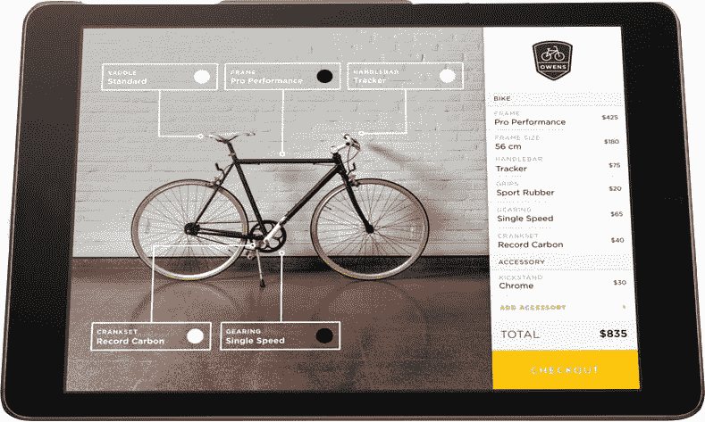
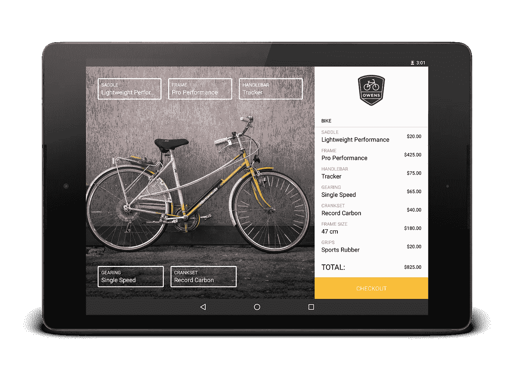
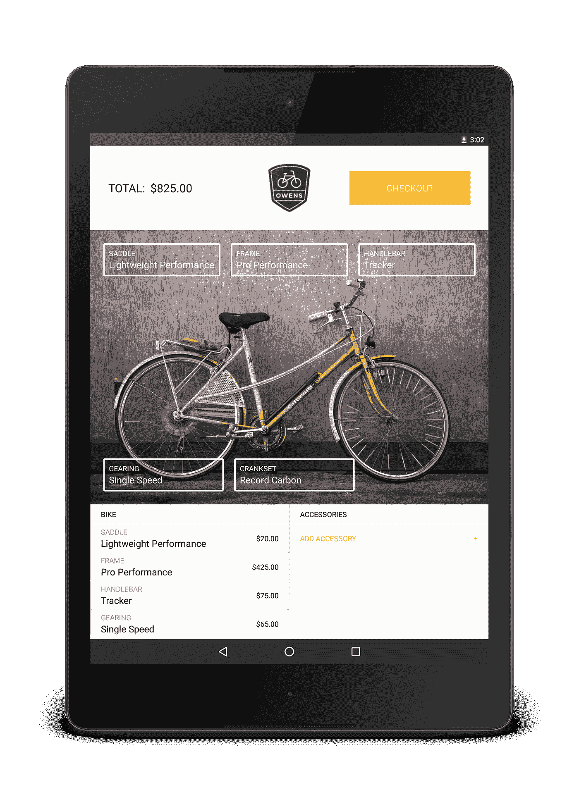

# 自行车店

> 原文：<https://medium.com/square-corner-blog/the-bikeshop-da7d52fc6317?source=collection_archive---------0----------------------->

## 稳步迈向更干净的代码。

> 注意，我们已经行动了！如果您想继续了解 Square 的最新技术内容，请访问我们的新家[https://developer.squareup.com/blog](https://developer.squareup.com/blog)

当我几周前加入 Square 的开发团队时，我被告知，作为入职的一部分，每个新成员都要使用我们的 API 制作一个示例应用程序。丰富的示例应用程序非常棒，因为它们不仅向开发人员展示了 API 是如何工作的，还激发了开发人员使用我们的工具可以做各种复杂事情的想法。制作这些示例应用程序让我们有机会获得 API 的第一手经验，感受与开发人员相同的痛点，并为团队提供关于产品的宝贵反馈。

Original designs for the bikeshop used for Register API promotion

我开发了一个名为 Bikeshop 的示例应用程序。我们的 API 宣传材料展示了一个名为 Owen's Bikes 的定制自行车商店的虚构销售点应用程序，我们决定将这些二维宣传图像融入生活，并构建一个真实的应用程序。

主屏幕上有一辆自行车，用户可以用许多硬件部件和附件对其进行定制。结账按钮触发 [Register Android SDK](http://squ.re/1ON8phj) ，将顾客带入 Square Register 完成交易。交易完成后，结果由 API 发送回自行车商店，并用于显示“订单完成”页面。

创建自行车店是一次宝贵的经历，原因有很多，包括开发速度非常快，然后不断迭代，直到代码可以开源。这个迭代是一个非常有趣的过程，因为它涉及到清理我的代码——谁不喜欢干净的代码呢？我和我知识渊博的新同事在设计和改进这个应用程序的过程中学到了一些东西，虽然它们是非常基本的概念，但我希望它们能帮助一些人寻找一个充满干净代码的 Android 应用程序。

Bikeshop screenshot in landscape

## 抽象出复杂性

我们设计的一个棘手的方面是两个显示列表的变化布局，分别标为“Bike”和“accessories”(在应用程序中标为“modifiers”和“Accessories”)。如截图所示，在纵向模式下有两个并排的列表，而在横向模式下它们是堆叠的。

我的第一个想法是创建两个独立的列表，然后将它们横向堆叠——但是看起来像一个列表但在两个地方滚动会造成糟糕的用户体验。考虑到这一点，我不得不创建两个纵向列表和一个横向列表。

这个怎么设置？好吧，碎片出来是因为[py⚔](https://medium.com/u/abe7df80fc76?source=post_page-----da7d52fc6317--------------------------------)提倡反对它们。所以我决定对列表使用几个 RecyclerViews。它们都将由一个适配器类填充，该类不知道它正在与哪种列表进行对话。在主活动中，我保留了三个 RecyclerAdapters，并根据方向使用了其中的一个或两个。

听起来很简单，对吧？没错。下面是我设置视图和适配器的初始代码。

这用许多令人困惑的样板文件阻塞了主活动——对我们的开发人员来说不是一个好例子。

此外，每当活动与适配器对话时，必须再次检查方向，以确保使用了正确的适配器。更烦人的 if/else 分支是这样的:

或者这个:

开始解决这个问题的第一个变化是将与适配器对话的代码移到一个名为 ItemManager 的新类中。这里的目标是让主要活动承担尽可能少的责任，因为这是很好的实践:参见[单一责任原则](https://en.wikipedia.org/wiki/Single_responsibility_principle)。

下一步:ItemManager 不需要知道设备是横向的还是纵向的来调用适配器上的方法。这需要一个接口，所以我们做了一个:

我们用两个类实现了这个接口，AdapterController。景观和适应控制器。肖像，以获得想要的行为。现在，当 ItemManager 想要获取注释、总计或适配器时，它可以调用适当的接口方法。当主活动创建静态 AdapterController 以传递给 ItemManager 时，只检查一次方向。

不再需要我们一直在调用的 isLandscape()方法，并且可以删除所有令人困惑的 if/else 语句。

## 不变性 FTW

在应用程序中，我们从静态目录中加载修改器和附件。每个项目都有一个选项列表。例如，项目“框架尺寸”包含框架尺寸的选项，从“42 厘米”到“62 厘米”。选项集永远不会改变，但是用户可以改变他们选择的选项。最初这反映在我的项目模型类中:

…并且不断地使用 getter 方法。然而，经过一点回顾之后，我们注意到这个模型对象有一些可以改进的地方。首先，getters 和 setters 是不必要的。我认为的最佳实践导致了应用程序中其他地方不必要的方法调用。第二，它看起来很像是一个不可变的对象。每次都从相同的目录中读取相同的项目，除了当前选择的选项之外，它们没有任何变化。这里的警告标志是，除了一个字段外，所有字段都是最终的。因此，我们决定将所选选项保存在 ItemManager 中，并让 BikeItem 类成为一个不可变的对象，表示目录中的一个项目，这是它最初的目的。

结果是这样的:

This is not technically immutable because we don’t copy the list of options, but the constructor is only ever used by Gson.

干净多了。

## 避免重复字符串常量

这是另一个有趣的清理。当 bikeshop 从 Register API 接收到 ChargeResult 时，它从 Intent 中获取 ORDER_NUMBER 字符串，并在新的 Intent 中传递它，以启动 TransactionSuccessActivity。然后，TransactionSuccessActivity 从意图中提取 ORDER_NUMBER 字符串，并将其显示给用户。这种模式导致 ORDER_NUMBER 常量被定义在两个地方。难看。

因为显示订单号的是 TransactionSuccessActivity，所以它应该负责字符串常量。所以我们把字符串从 MainActivity 中移除并放在那里。MainActivity 仍然需要传递字符串，所以我们在 TransactionSuccessActivity 中创建了一个静态方法。

那么 MainActivity 只需用上下文和订单号值调用 transactionsuccessactivity . start()，不需要知道字符串 ORDER_NUMBER。这是一个非常简单的改变，它消除了重复，防止了将来的错误，并使 MainActivity 看起来更加整洁。

## 结论

随着我们的迭代，这段代码的质量有了无数的改进。它们并不都很有趣，但它们确实帮助我接触了 Android，同时了解了代码质量，这是一名优秀的工程师应该做的。当然，还有很多额外的清理潜力——更不用说要添加无数的功能了！允许用户为自行车的每一部分定制颜色，或者获取不同自行车部件的图像，以便当用户做出选择时，我们可以交换它们，这将增强应用程序的体验。但是尽管我很想继续改进 Bikeshop，我们的 API 还有很多工作要做！

你可以通过注册 Android SDK 在 [GitHub](http://squ.re/2dm1sNQ) 上找到 Bikeshop 示例应用程序，并且有构建应用程序的说明，所以你可以马上开始使用它。欢迎反馈和贡献。GitHub 上还有一个 APK 可供下载，因此您无需 Square 开发人员帐户就可以使用该应用程序。

我们希望这只是我们的开发人员的许多成熟的示例应用程序的第一个。我们乐观地认为，有人可以利用自行车商店作为他们自己的可怕的销售点的出发点。让我们看看你能做什么！