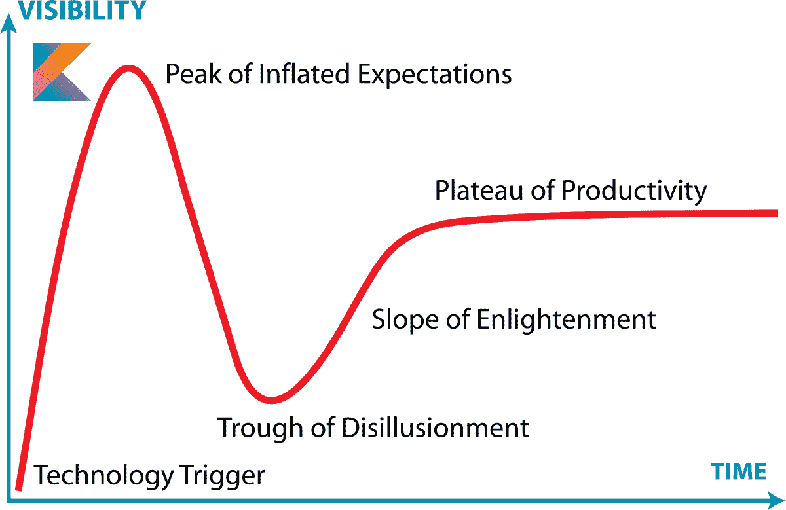
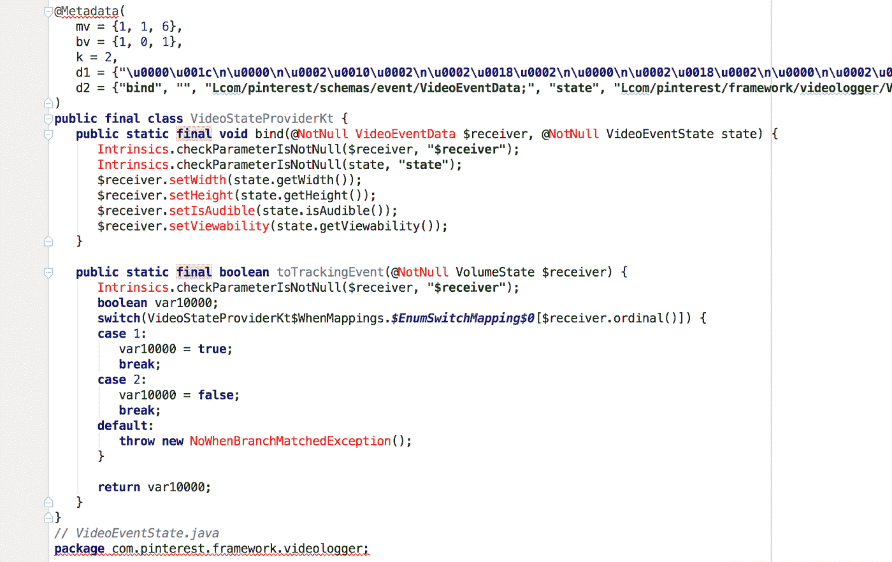

# 针对科特林的案子

> 原文：<https://medium.com/pinterest-engineering/the-case-against-kotlin-2c574cb87953?source=collection_archive---------0----------------------->

Ryan Cooke | Android 工程师，核心体验

在你的应用中开始使用 Kotlin 是一个重大决定。现在，科特林可能正接近炒作周期中的“膨胀预期的顶峰”。你可以找到无数关于科特林优点的高质量的[博客](/@Pinterest_Engineering/kotlin-for-grumpy-java-developers-8e90875cb6ab)、[播客](http://talkingkotlin.com/kotlin-at-pinterest-with-christina-lee/)和[视频](https://www.youtube.com/watch?v=fPzxfeDJDzY)。对于这篇文章，我们假设你理解它的好处。在这里，我们将深入探讨 Android 开发者在 Kotlin 上可能面临的挑战，并提供解决方案。采用任何新语言都要考虑实际成本，Kotlin 并不适合每个团队。我们希望这篇文章对认真权衡 Kotlin 的成本/收益的团队有用。

*(*虽然这篇文章着眼于采用 Kotlin 的一些挑战，但我们在 Pinterest 上热情地使用 Kotlin。查看我们的* [*有用提示*](/@Pinterest_Engineering/kotlin-for-grumpy-java-developers-8e90875cb6ab) *来完成从 Java 的过渡，并继续关注我们在 Kotlin 上的其他帖子。)*

Kotlin on the Hype Curve

## **问题:学习曲线**

客观地说，科特林语并不是一种流行语言。它最近才成为 50 种最流行的编程语言之一。如果你打算在你的代码库中使用 Kotlin，你需要教会你团队中的几乎每个开发人员如何使用它。也需要维护。即使它不再流行，你也需要继续培训开发人员(他们可能对学习 Kotlin 不感兴趣)。

所以说一下学习曲线。您将失去一些开发人员的学习速度，并且您的入职过程可能会变慢。我们发现，对于一个 Java 开发人员来说，通常需要大约一周的时间在 Kotlin 中积极工作才能感到舒适。开发人员需要很好地学习 Kotlin，以便自信地阅读这种语言。虽然一些开发人员会自学，但是团队仍然需要为每个人留出培训时间来提高速度。新开发人员需要学习 Kotlin，一次性的培训是不够的。此外，受过培训但很少接触 Kotlin 的当前开发人员，如果他们转到需要 Kotlin 的代码部分，可能需要复习。这意味着入职速度较慢，您可能会损失一些速度。

重要的是要明白，最初的一周都是为了适应 Kotlin，仍然会有很多学习要做。即使是最有经验的 Kotlin 开发人员仍然在学习一些技巧和方法来做得更好，这是整个团队都需要学习的。如果您的团队没有 Kotlin 专家，那么您需要认识到，对于确定最佳实践，没有与 [*有效的 Java*](https://www.amazon.com/Effective-Java-2nd-Joshua-Bloch/dp/0321356683) 等同的标准。如果您决定自己打造最佳实践，这可能会非常耗时且棘手，但对于解决类似问题来说，有必要采用一致的方法。

## **解决方案:学习曲线**

第一个解决办法就是保持警惕。将 Kotlin 添加到您的代码库是在赌 Kotlin 的长寿和持续增长。如果这个赌注是正确的，那么维护代码和学习通常会变得不那么具有挑战性。如果赌错了，那么科特林将是科技债。谷歌的官方支持是 Kotlin 继续存在的有力证据，但这种支持不会永远持续下去。

有很多学习 Kotlin 的资源，比如 Koans 和伟大的书籍。我们发现最有效的是一个 Kotlin 倡导者，指导和鼓励他们的直属团队。

开发者速度对我来说是 Kotlin 最初的卖点。当我意识到很少有开发人员真正看到开发速度的提高时，我有一种“这有什么意义”的感觉。我预计当团队需要 Kotlin 经验并拥有专门的 Kotlin 专家时，以及当稳定性不再是一个问题时，开发人员的速度将会提高。但是我们还没有到那一步。

## **问题:构建时间**

科特林会让你的建造时间变得更糟。我们有相当可观的渐进构建时间，增量构建时间略多于 30 秒，干净构建时间大约为 75 秒。Kotlin 占了我们干净构建时间的 25%和增量构建时间的 40%。

## **解决方案:构建时间**

处理好它。

更有用的是，我们测试了一个辅助项目的构建时间，比较了 Kotlin 前后的构建时间。我们发现大部分构建时间损失来自于转换一个 Kotlin 文件。对于干净的构建，随着我们将更多的文件转换到 Kotlin，我们继续看到构建变慢(但是额外的减速不是很大)。

好消息是，除了最初添加的 Kotlin 之外，无论转换了多少文件，增量和无更改构建时间都保持不变。通过转换一个文件，您可以很好地了解构建时间。我们使用 [Gradle-Profiler](https://github.com/gradle/gradle-profiler) 进行分析，这为我们提供了准确、客观的构建时间预测。

## **问题:开发稳定性**

在我们的团队中，不喜欢 Kotlin 的人不喜欢它，不是因为 lambdas 让他们害怕，或者因为他们宁愿等着看应用程序是否崩溃，以找出正确的空处理，甚至是因为`var`和`val`看起来相似。非 Kotlin 开发人员不喜欢它的最简单的原因是当有一个问题阻止他们写代码和生产时。

这种情况在我们身上发生过很多次，也很容易发生在你身上。例如，我们遇到了增量构建对一些开发人员不起作用的问题。我们遇到过其他问题，比如改变分支总是需要一个干净的构建。我们有构建随机失败的情况，因为`kapt` (Kotlin 注释处理器工具)有时会出现内存不足的错误。此外，Kotlin 不能很好地与[即时应用](https://developer.android.com/studio/preview/kotlin-issues.html)配合，我们已经看到当 Kotlin 插件启用时 Android Studio 崩溃的增加。发展方面，就在你觉得一切都稳定的时候，另一个问题就可能冒出来了。

因为 Kotlin 和`kapt`是大多数开发人员不熟悉的工具，这可能会导致大量时间浪费在转移注意力上，而这实际上并不是 Kotlin 的错。例如，我们会看到一个问题，比如开发人员遗漏了一个导入语句，构建失败，显示出许多`kapt`错误。由于不熟悉 Kotlin，开发人员立即认为是 Kotlin 导致了这个问题，并浪费时间去研究什么是简单的修复。这种“怪异”加上实际的稳定性问题意味着损失了大量的维护时间。

## **解决方案:开发稳定性**

最好的解决办法是把一切稳定下来，然后谨慎升级。Kotlin、Gradle、Android Studio 和其他一切都将达到一种状态，它们可以很好地协同工作，但这通常需要几个版本。如果你想使用最新的 Android Studio 或类似的东西，这是很困难的。如果你决定积极地升级，你可以对你遇到的问题提出错误，团队会非常积极地解决任何问题。如果你不想处理 bug，那就耐心升级，坚持稳定的版本。

## **问题:静态分析**

Java 是一种成熟的语言，有许多很棒的静态分析工具，可以提醒您注意问题。这意味着人类评审者不需要检查代码是否遵循规则和约定。现有的工具如 FindBugs、PMD、易错、检查样式和 Lint 都很棒。开发人员通常希望避免做导致问题的事情，但是我们意识到期望每个人都记住每件事，告诉新员工并检查每个代码审查中的这些小问题是不可持续的。毕竟，我们不是机器，这就是为什么我们给机器规则，如果我们错过了最佳实践或陷入困境，我们的构建就会失败。没有静态分析工具，开发人员犯错误的空间会更大。

## **解决方案:静态分析**

这是一个观望的问题。我的理解是 Lint 规则和检查应该在 Android Studio 3.0 上的 Kotlin 中工作。例如，我们最近在 Canary Android Studio 版本中测试了“移除所有未使用的资源”检查，该检查移除了 Kotlin 正在使用的资源，所以工具还没有完全到位。如果你是一个真正的英雄，你可以加入这项事业，开始研究你自己的静态分析器或兼容性方法。

为了(在某种程度上)平衡静态分析的缺乏，像空处理这样的主要 Kotlin 特性减少了代码审查人员和开发人员需要考虑的潜在问题。

## **问题:可逆性**

可逆性是一种轻松撤销改变或决定的能力。科特林是不可逆的。虽然将 Java 文件转换成 Kotlin 很容易，但是将 Kotlin 转换成 Java 的最佳方法是查看 Kotlin 字节码，进行反编译，然后修复异常。您也可以简单地重写该文件。反编译不会产生符合团队代码质量标准的代码。如果是的话，你可能要重新评估你的命名期望。

Decompiled data class. Not production quality Java.

让我们看一个可能发生的例子。假设你有五个工程师想要学习和评估 Kotlin，每个人转换五个文件，然后再添加五个文件。现在有 50 个 Kotlin 文件，甚至在你决定这种语言适合你之前。如果您决定不使用 Kotlin，您将花费大量时间繁琐地将文件转换回来，尤其是如果转换后的文件变化太大，版本控制变得无用。如果您使用 Anko 或另一个类似的 Kotlin 库，甚至是更高级的 Kotlin 功能，这又是一层复杂的回归。

沿着这条路，如果 Kotlin 开始引起一个问题，你将不得不解决这个问题，不管它有多困难或阻碍发展。从代码库中删除 Kotlin 不是一个选项。

## **解决方案:可逆性**

评估 Kotlin 时，可逆性是必须牢记在心的。这很容易添加，但你应该确保你没有使用 Kotlin 只是因为它太难删除。当评估一项新技术时，更改相当简单/可重写的代码，例如测试代码，总是一个好的起点。如果您开始转换应用程序文件，转换井单元测试文件。单元测试会让你有信心对文件进行重大修改，同时仍然知道你没有破坏任何东西。它们也使得改回 Java 变得更加容易。除此之外，要意识到撤销决定有多困难。

## **结论**

学习曲线、构建时间、开发稳定性和静态分析都会变得更好。谷歌正式支持这种语言，这是情况将迅速好转的迹象。如果你想等到他们更好，这并不疯狂。将 Kotlin 添加到您的代码库永远不会太晚，但删除它可能会太晚。

我们在 Pinterest 上使用 Kotlin，但我们这样做是因为我们知道并经历了这种语言的成长之痛。这篇文章有目的地关注你应该考虑的风险，但是这些问题中的许多将会随着时间的推移变得不那么沉重。

请分享我们可能忽略的注意事项，或在评论中提出反驳。如果你想了解更多关于 Kotlin 的信息，请给我们发邮件！如果你在三藩市，我们会定期在我们的办公室举办 [Android 编织午餐](https://www.eventbrite.com/e/android-knit-tickets-36444264777)，在那里城市里的团队谈论 Android。我们很乐意招待你！

还有，我们正在[招聘](https://careers.pinterest.com/careers/details/android-engineer_san-francisco_3879)！