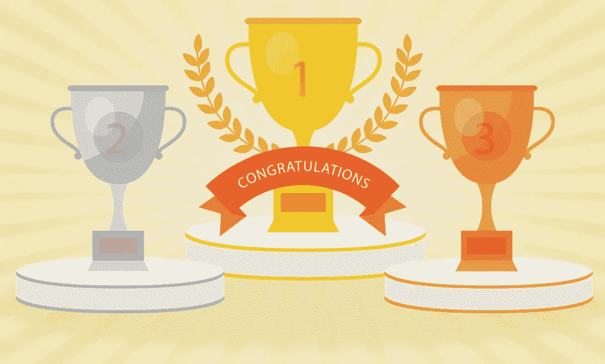
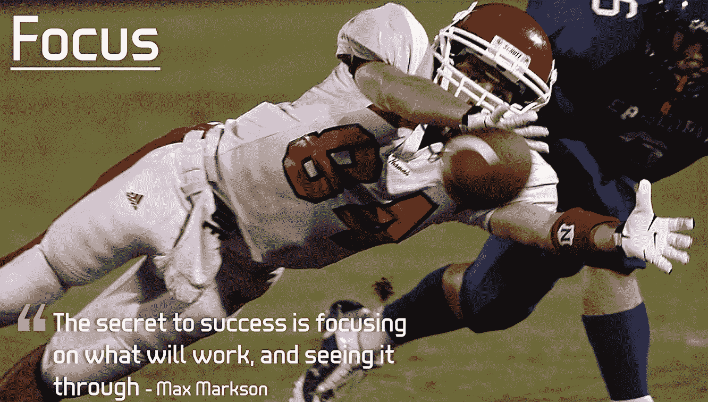
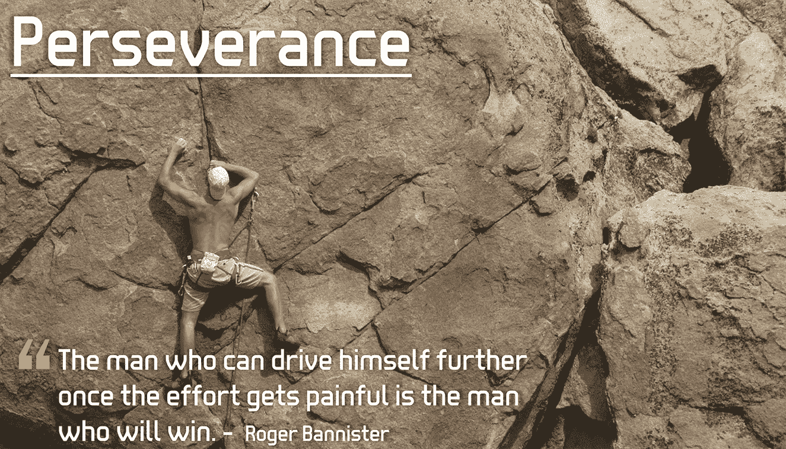
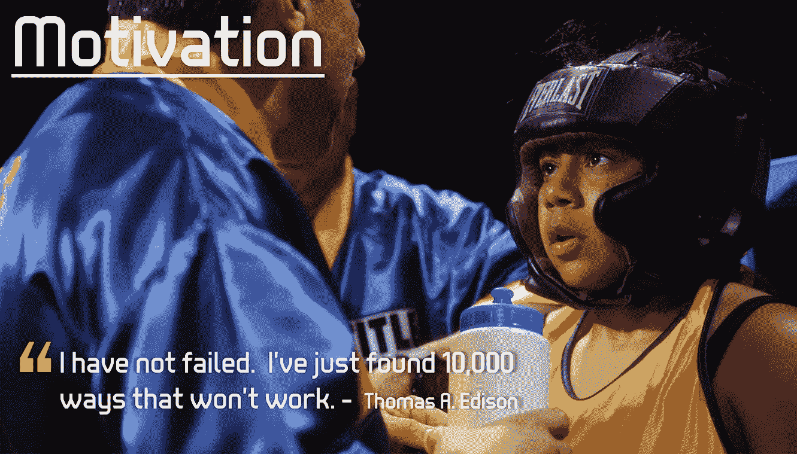
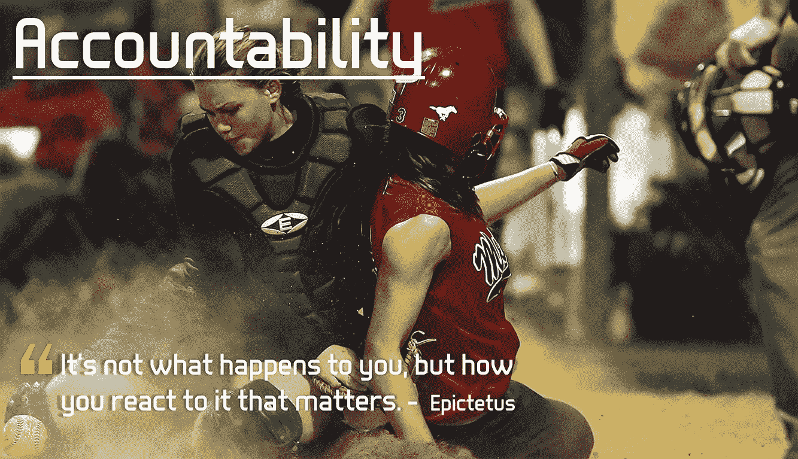
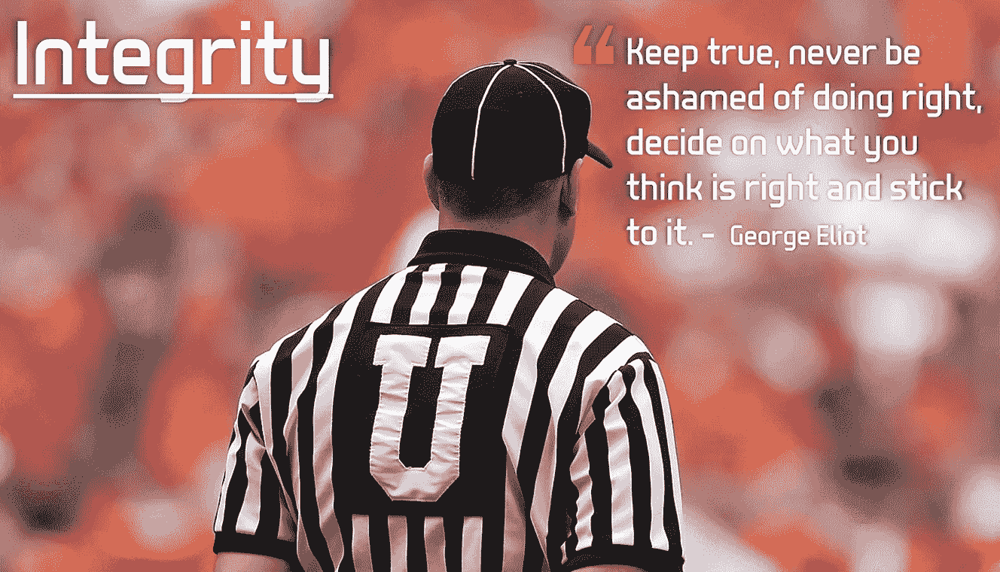
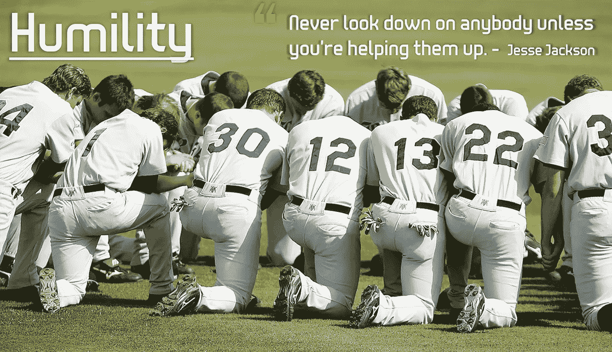

# 冠军之旅:提高工作效率的 6 个核心原则

> 原文：<https://medium.com/walmartglobaltech/the-champions-journey-6-core-principles-to-workplace-efficiency-fe32d64fff4d?source=collection_archive---------4----------------------->

Designed by [Freepik](http://www.freepik.com/free-vector/flat-golden-trophies_842192.htm)

工作环境相当复杂。一方面，它可以让你的贡献受到重视，并激励你在职业生涯中脱颖而出。另一方面，它可能会给人带来压力，令人沮丧，得不到回报。

后者听起来耳熟吗？你有没有坐在办公桌前，双手捂脸，想知道为什么？为什么事情这么难？如果你有，你并不孤单。

工作场所的效率是可以实现的，但是这个旅程并不适合温顺的人。你需要积极思考，适应变化，并理解在团队中工作意味着什么。

在我的职业生涯中，我已经确定了 6 条核心原则，并将其作为名为*冠军之旅*的激励系统的一部分。

当付诸实践时，我总是有更高的成功率来完成我的个人和职业目标。

# **冠军之旅**

冠军之旅是通过纯粹的态度、天生的能力和努力工作来完成或克服日常生活挑战的隐喻。它代表了一种自律的生活方式，这种生活方式将使你保持专注，在逆境中坚持不懈，激励他人，承担责任，展示诚信，并表现出谦逊。这些原则中的每一条，在实践中都会改变你对工作/生活的看法。

# **核心原则#1:专注**

Photo credit: [keijj44](https://pixabay.com/en/football-receiver-catch-catching-1582535/)

概述现实的目标，定义明确的执行计划，并跟踪渐进的进展是确保您的公司、团队和个人目标成功的第一步。然而，没有重点的准备就像没有目的地的旅行。

记住罗马不是一天建成的。试着为你的最终目标定义渐进的里程碑，记住你的最终愿景。

# 核心原则#2:坚持不懈

Photo credit: [spencerlikestorun](https://pixabay.com/en/rock-climbing-lead-climbing-403478/)

众所周知，无论你为实现目标做了多少计划、跟踪和风险缓解，你总会面临某种类型的障碍，无论是自己造成的还是你无法控制的。

当你走投无路时，要有创造性，要明白解决问题的方法不止一种。不要害怕改变方向来克服障碍，这是成功的必由之路。这个旅程可能会花更长一点的时间，但是你将会赢得奖励和经验去鼓励处于困境中的其他人。

# **核心原则#3:激励**

Photo credit: [skeeze](https://pixabay.com/en/boxer-males-boxing-sport-fitness-652403/)

老实说，有时候工作会是一种拖累。一个人在变得不知所措、紧张和精神沮丧之前，只能承受这么多的“T10”情况。当你意识到隧道尽头的光是一列全速前进的火车时，你推进日常任务的愿望可能会嘎然而止。

当这些“T0”情况“T1”发生时，生活会变得完全没有动力，如果没有一个强大的支持系统在你身后，这些挑战会变得难以应付。

激励你自己、一个团队或一个组织在恶劣环境下实现看似不可能的目标的能力是最强大也是最难掌握的品质之一。记得练习积极的意图和乐观的心态。如果做得正确，你将能够移山，成为任何环境下的变革推动者。

# **核心原则 4:问责制**

Photo credit: [keijj44](https://pixabay.com/en/softball-girls-game-sport-ball-1507299/)

在你职业生涯的某个阶段，错误是不可避免的。如果你已经在这个行业呆了一段时间，我敢肯定你已经有了这些哦****！以下瞬间:

*   低估项目的范围和复杂性
*   给 GMV 的预测多加了一个零
*   搞砸了一个重要的演示或设计评审
*   按下那封邮件的发送键有点太早了
*   将一个巨大的 bug 部署到生产中
*   只是因为害怕第二天早上没有工作而没有达到目标

当你是自己失败的根本原因时，你可能会经历一波情绪波动:尴尬、内疚、愤怒和害怕让团队失望。这些情绪可能会压倒一切，在这种情况下，掌控自己的行为，对问题保持透明，并在前进的道路上重新设定期望，可以帮助控制负面情绪，重新获得重返游戏所需的信心。

# **核心原则 5:诚信**

Photo credit: [keijj44](https://pixabay.com/en/umpire-football-american-football-1492493/)

谷歌对诚信的定义是:

> 诚实和有强烈道德原则的品质；道德正直。

在日常生活中，我们努力坚持坚定的道德原则:不偷窃、欺骗或利用他人。这同样适用于我们的工作/团队环境。

你在工作场所见过这些情况吗:

*   指责和指责错过最后期限的团队成员
*   背后说别人闲话和批评别人
*   在可能对下游产生负面影响的过程或质量检查中走捷径
*   办公室里的免费零食开始被囤积起来，导致其他人错过了一顿午餐
*   有人用完了公共浴室里的最后一点卫生纸，却没有更换纸卷，把任务留给了别人
*   将其他员工的工作归功于自己，或者在展示自己的材料时没有公开表扬同事的贡献

“*诚信行事*”没有秘方。这是一个需要付诸行动的有意识的想法。表现出正直的人会建立起可信赖和可靠的声誉。这些人在没人注意的时候会表现得很体面。

# **核心原则 6:谦逊**

Photo credit: [keijj44](https://pixabay.com/en/baseball-team-prayer-kneeling-1529412/)

当我们在团队环境中谈论谦逊时，重要的是个人要承认个人的局限性，愿意接受帮助，并在需要时帮助他人完成任务。谦逊也是使用“我们”、“团队”之类的包容性词汇，而不是“我”、“我”的做法。这种思维模式的转变对于创造一个开放的工作环境非常重要，在这样的环境中，人们朝着共同的目标努力。

表现出谦逊会帮助你赢得团队和同事的尊重，并让你在这个过程中感觉良好。

# 终点线

冠军的旅程并不轻松。跨越终点线需要专注、毅力、动力、责任感、正直和谦逊。掌握这些技能不仅有助于你的个人生活，还有助于你在职业生涯中塑造和建立一个健康的工作环境和团队环境，提高工作效率。

> 我是团队中的一员，我依赖团队，尊重团队，为团队做出牺牲，因为团队，而不是个人，才是最终的冠军。
> 
> 米娅·哈姆