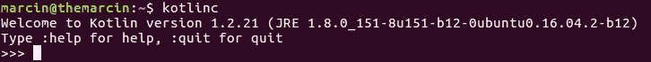
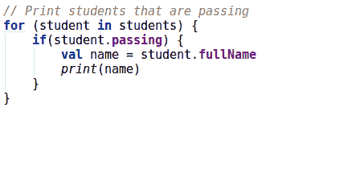
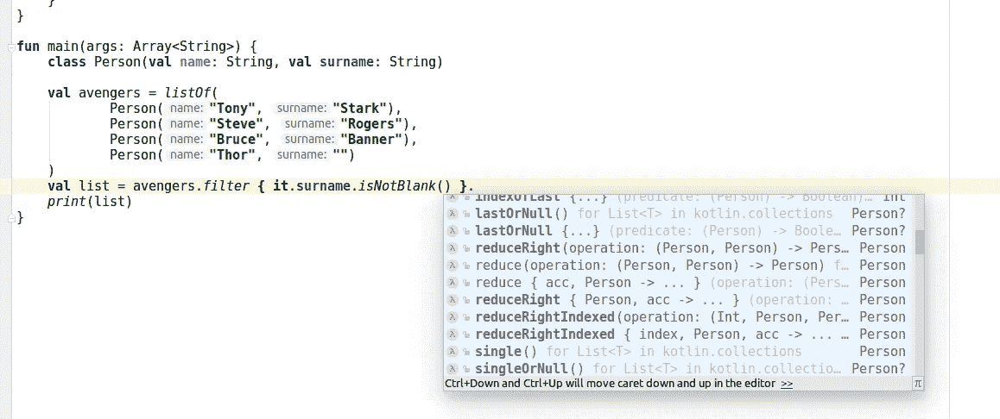

# 科特林的性格

> 原文：<https://blog.kotlin-academy.com/the-character-of-kotlin-a72193b822a8?source=collection_archive---------1----------------------->

我刚刚在七周内学完了七种语言的《T4》，作者是布鲁斯·泰特，我非常喜欢它！尽管我对所描述的大多数语言都有一些经验，但我真的很喜欢他呈现语言特征的方式以及它们对语言最终使用方式的影响。

这就是为什么我决定写另外一章。这将是一门我非常熟悉的语言，我知道它的优点和缺点:科特林语。

> 这篇文章的目的不是教语言，而是展示科特林的性格。你不需要什么都懂。相反，要集中精力思考呈现的特性会如何影响你的编程方式。

Kotlin 最典型的特点是，它并没有给编程语言家族带来任何新的东西。相反，它以一种非常棒的方式使用所有已经可用的东西。想起钢铁侠。托尼·斯塔克用简单的电子元件制造了钢铁侠。他没有超人或闪电侠那样的真正超能力。这看起来可能是一个弱点，但从长远来看，这是一个巨大的优势。我们以后再谈。让我们从基础开始。


# 基础

我们通常在 IDEA IntelliJ、Android Studio 或 CLion (Kotlin/Native)等 IDE 中进行 Kotlin 编程。这里我们将从命令行开始，在一个更简单的上下文中展示 Kotlin。一旦你[安装了 kot Lin](https://kotlinlang.org/docs/tutorials/command-line.html)，使用以下命令启动 REPL(交互环境):



让我们试试一些数字:

```
>>> 1
1
>>> 1 + 2
3
>>> 1.0 + 2
3.0
```

简单的数学工作。这是运行在 Java 虚拟机上的 Kotlin/JVM。整数是 Java 中的原语。科特林呢。让我们来看看数字的类型:

```
>>> 1::class
class kotlin.Int
>>> 1.0::class
class kotlin.Double
```

他们都是对象！其实科特林的一切都是对象。Java 呢？Kotlin 与 Java 完全互操作，但我们可以看到上面的类型是 Kotlin 类型。原因是一些内置的 Kotlin 类型覆盖了 Java 类型。我们可以使用`Class`的`java`属性或每个对象的`javaClass`属性来查看实际的 Java 类型:

```
>>> 1.0::class.java
double
>>> 1.0.javaClass
double
```

是`double`！`double`在 Java 中是原语。这怎么可能呢？当没有使用面向对象的特性时，Kotlin 使用优化来使用原语而不是对象。这是在幕后发生的，根本不会影响开发者。如果我们需要把`double`当作一个对象，那么就会用`Double`来代替。从我们的角度来看，我们仍然可以说一切都是物体。让我们定义一些属性:

```
>>> val a = 1
```

这是只读属性。我们还可以使用 var 定义读写属性:

```
>>> var a = 1
```

请注意，没有指定类型。不要误会，Kotlin 是强静态类型语言。属性的类型是从赋值的类型推断出来的:

```
>>> ::a.returnType
kotlin.Int
```

数学讲够了，让我们来看一些更高级的特性。

# 安全

钢铁侠之所以被制作出来，是因为警察和军队都无法将托尼·斯塔克从恐怖分子手中解救出来。托尼制作钢铁侠是为了提高自己的安全性，给自己更好的可能性。他也让自己更加出名和受欢迎。同样，Kotlin 是由 JetBrains 制造的。这是一家制作最流行的编程 ide 的公司。他们所有的工具最初都是用 Java 开发的，但是他们遇到了这种语言的缺陷。他们开始尝试其他语言，如 Scala 或 Groovy，但他们并不满意。他们最终决定开发自己的语言，这种语言应该提供最大的安全性(这样他们的产品就不会出错)和可伸缩性，这对他们来说很重要。科特林也让 JetBrains 更受欢迎。他们无处不在，但现在当人们可以使用他们令人敬畏的语言时，JetBrains 对他们来说甚至更酷更棒。(这个故事是巨大的简化。请收听本播客以获得更准确的版本。)

Kotlin 大大提高了 Java 的安全性。属性必须初始化:

```
>>> var a: String
error: property must be initialized or be abstract
```

默认情况下，类型不可为空:

```
>>> var a: String = null
error: null can not be a value of a non-null type String
```

我们说使用`?`类型是可空的:

```
>>> var a: String? = null
```

虽然不能显式使用可空类型:

```
>>> a.length
error: only safe (?.) or non-null asserted (!!.) calls are allowed on a nullable receiver of type String?
```

可空类型类似于 Scala 等其他语言中的选项类型。我们需要在使用前打开包装。当属性不是`null`时，我们可以使用像正常调用一样工作的安全调用。如果属性是`null`，它不调用方法，而是返回`null`:

```
>>> a = null
>>> a?.length
null
>>> a = "AAA"
>>> a?.length
3
```

我们也可以使用不安全的调用，当属性为空时抛出异常；

```
>>> a = null
>>> a!!.length
kotlin.KotlinNullPointerException
```

不安全调用是不好的做法，应该尽量少用。你很少能在 Kotlin 项目中找到它。这与 Java 有很大的不同，在 Java 中，每个调用都是不安全的。

[](https://www.kt.academy/#workshops-offer)

# 聪明的

酷钢铁侠的特点是，他的西装真的很潇洒。它分析情况并通知托尼危险。它也可以自我修复。Kotlin 也真的很聪明，对开发者帮助很大。

智能造型就是这种行为的一个例子。当我们检查属性是否不为空时，我们可以像它不为空一样使用它。我们将对文件进行操作，以展示更多高级功能。我建议使用 IDEA IntelliJ ( [查看如何入门](http://kotlinlang.org/docs/tutorials/getting-started.html))。或者，你可以在网上 REPL 查看所有的信息。让我们看看这个例子:

```
**fun** smartCastingExample(str: String?) {
    **if**(str != **null**)
        *print*(**"Length is "** + str.**length**)
}
```

可以看到`str`是显式使用的(没有不安全或安全调用)。这是因为在检查`**if**(str != **null**)`的范围内，它是从`String?`转换到`String`的。如果我们在相反的检查中退出函数，它也是有效的:

```
**fun** smartCastingExample(str: String?) {
    **if**(str == **null**)
        **return** *print*(**"Length is "** + str.**length**)
}
```

它不仅适用于可空性。我们还可以智能地转换类型:

```
**fun** smartCastingExample(any: Any?) {
    **if**(any **is** String)
        *print*(**"String with length "** + any.**length**)
}
```

Kotlin 在 IDEA IntelliJ、Android Studio 或 CLion 中得到高度支持。在这些 ide 上，您有许多技巧、建议和支持。这里有一个例子，Java 中典型的命令式集合处理被 Kotlin 中典型的声明式集合处理所取代。请注意，整个转变是由环境建议和做出的:



# 最小的

托尼·斯塔克在不需要的时候不会穿全套钢铁侠套装。他通常使用汽车或只是较小的零件。


科特林哲学的一部分是简单的事情应该简单。这里是科特林的 Hello World:

```
**fun** main(args: Array<String>) {
    print(**"Hello, World"**)
}
```

它只是一个打印文本的函数。其余常见的 Kotlin 案例也很简单。当我们不需要整个函数体时，我们可以只用单个表达式来代替:

```
**fun** add(a: Int, b: Int) = a + b
```

我们将在接下来的部分中一次又一次地看到这样的简约风格。

# 灵活性

与超人相比，钢铁侠缺少一些重要的特征。就像眼睛里的激光。超人生来就有它们，他需要的时候就用它们。托尼·斯塔克没有在《钢铁侠》中安装激光器，可能是因为他还没有看到对它们的需求已经足够迫切。重要的一点是，他仍然可以轻松地添加这个功能。事实上，每个钢铁侠用户都可以添加它们。但他们也可以添加其他功能，而不是以较低的成本提供更好的效果。这是灵活性的巨大力量。让我们在实践中看到它。大多数现代语言都提供了一些集合文字。在 Python、Ruby 或 Haskell 中，你可以这样定义列表:`[1,2,3]`。Kotlin 没有包含这样的集合文字，但它允许顶级函数(可以在任何地方使用的函数), Kotlin 标准库提供了可用于创建集合的顶级函数:

```
>>> listOf(1,2,3)
[1, 2, 3]
>>> setOf(1,2,3)
[1, 2, 3]
>>> mapOf(1 to "A", 2 to "B", 3 to "C")
{1=A, 2=B, 3=C}
```

为什么这很重要？当语言提供集合文字时，它定义了用户将如何使用集合。所有的收藏都有一些特点。一个大的讨论是我们应该更喜欢可变的还是不可变的列表。可变的效率更高，但是不可变的线程安全得多。关于这个话题有很多讨论和观点。考虑到这一点，你会选择 list literal 应该产生一个可变或不可变的列表吗？无论哪种方式，你都会影响人们使用语言的方式，因为他们更喜欢使用集合文字。科特林离开了这个自由。`listOf`、`setOf`和`mapOf`产生不可变集合:

```
>>> var list = listOf(1,2,3)
>>> list.add(4)
error: unresolved reference: add
list.add(4)
     ^
>>> list + 4
[1, 2, 3, 4]
```

虽然我们可以使用`mutableListOf`、`mutableSetOf`和`mutableMapOf`轻松地创建可变集合:

```
>>> mutableListOf(1,2,3)
[1, 2, 3]
>>> mutableSetOf(1,2,3)
[1, 2, 3]
>>> mutableMapOf(1 to "A", 2 to "B", 3 to "C")
{1=A, 2=B, 3=C}
```

请注意，每个人都可以定义自己的集合，并定义顶级函数来创建它:

```
**fun** <T> specialListOf(**vararg** a: T): SpecialList<T> {
    *// Code* }
```

> 上面你可以注意到我使用了泛型类型参数`T`。别担心。这样，我们说我们需要传递一组相同类型的元素来创建这种类型的集合。

由于 Kotlin 使用基本特性而不是内置文字，外部库拥有与 Kotlin 标准库相同的能力。另一个极大地解放了库和开发人员的特性叫做扩展功能。基本上，我们可以将函数定义为方法:

```
>>> fun Int.double() = this * 2
>>> 2.double()
4
```

请注意，它并没有真正向任何类添加方法。扩展函数就是以这种特定方式调用的函数。这个特性看起来很简单，但是它非常强大。例如，Kotlin 像其他现代语言一样提供了集合处理的函数:

```
**class** Person(**val name**: String, **val surname**: String)

**val** avengers = *listOf*(
        Person(**"Tony"**, **"Stark"**),
        Person(**"Steve"**, **"Rogers"**),
        Person(**"Bruce"**, **"Banner"**),
        Person(**"Thor"**, **""**)
)
**val** list = avengers
        .*filter* **{ it**.**surname**.*isNotBlank*() **}** .*sortedWith*(*compareBy*(**{ it**.**surname }**, **{ it**.**name }**))
        .*joinToString* **{ "${it**.**name} ${it**.**surname}" }** *print*(list) // Prints: Bruce Banner, Steve Rogers, Tony Stark
```

Kotlin 的巨大优势在于，这些和类似的函数都被定义为扩展函数。例如，你可以看到`filter`的实现:

```
**inline fun** <T> Iterable<T>.filter(
    predicate: (T) -> Boolean
): List<T> {
    **return** filterTo(ArrayList<T>(), predicate)
}**inline fun** <T, C : MutableCollection<**in** T>> Iterable<T>.filterTo(
    destination: C, predicate: (T) -> Boolean
): C {
    **for** (element **in this**) **if** (predicate(element)) destination.add(element)
    **return** destination
}
```

如果不能实现，您可以自己定义这个函数。如果您需要一些额外的函数来进行集合处理，您可以很容易地定义它。开发人员经常这样做。例如，你可以找到许多定义 Android 扩展功能的库。它们使得 Android 开发更加容易。这一决定的另一个结果是，您可以使用大量的集合处理方法:



你可以注意到的另一个重要事实是`filter`不是`List`类型的扩展函数。它是扩展`Iterable`接口:

```
**public interface** Iterable<**out** T> {**public operator fun** iterator(): Iterator<T>
}
```

您可以很容易地定义自己的集合类来实现`Iterable`，它将免费获得这些集合处理方法。甚至`String`都实现了。这也是为什么我们可以在`String`上使用所有收集处理方法的原因；

```
>>> "I like cake!".map { it.toLowerCase() }.filter { it in 'a'..'z' }.joinToString(separator = "")
ilikecake
```


# 第一天总结

托尼·斯塔克并非生来就有超能力，他也没有被任何放射性蜘蛛咬过。他用自己不可思议的知识和智慧创造了钢铁侠。类似地，JetBrains，一家为所有语言开发优秀编程环境的公司，已经利用他们的知识开发出了令人难以置信的编程语言。他们没有向编程世界引入任何新特性，而是一种真正设计良好的语言，它利用编程语言的整体知识优势来最大化开发人员的生产力和项目质量。

这种聪明设计的一个很好的例子可以在元组的故事中找到。Kotlin 还在 Beta 的时候，就支持元组。虽然当 Kotlin 团队分析元组的使用如何影响程序的开发时，他们发现这种影响不一定是积极的。这就是元组没有被释放的原因。Kotlin 有可以替代使用的`data`注释。它更加通用，Kotlin 团队确信它对一般的语言使用有积极的影响。元组仍在讨论中，可能有一天它们会得到本机支持，但在这发生之前，Kotlin 团队和社区需要确保这是一个好的决定。

这很能说明科特林的情况。它不是思想的汇集，相反，它是设计巧妙的语言。它有一个最小的强大功能集，提供了可怕的可能性。在我们解释 Kotlin 协程的第 3 天，这一点尤其明显。总的来说，Kotlin 给予了更多的自由，并为社区创造留下了更多的空间。

# 自学

如果你想学习更多的科特林语，我建议你查看[科特林文档](https://kotlinlang.org/docs/reference/)和[科特林考恩](https://kotlinlang.org/docs/tutorials/koans.html)。如果你想学习 Android 中的 Kotlin，可以看看[这本书](https://www.google.co.th/search?q=android+development+with+kotlin&stick=H4sIAAAAAAAAAONgecTozS3w8sc9YSmnSWtOXmO04eIKzsgvd80rySypFNLjYoOyVLgEpXj10_UNDVNSyovyKrOKNRik-LlQhXgAqNGJwlAAAAA&sa=X&ved=0ahUKEwjim8S5_qnZAhUBMZQKHUVCCKcQ6RMIiQEwCw&biw=1920&bih=965)。

# 然后

这并不是科特林伟大特性的终结。这只是第一周。钢铁侠的设计给了他一些超越其他超级英雄的超能力。有些不容易注意到，但都很重要。我将在其他文章中描述它们。

[](/the-character-of-kotlin-conciseness-2c70bc141985) [## 科特林的性格:简洁

### 在上一篇文章中，我解释了为什么科特林像钢铁侠。现在我想继续这个比喻并展示…

blog.kotlin-academy.com](/the-character-of-kotlin-conciseness-2c70bc141985) 

我要感谢[戴夫·利兹](https://twitter.com/adrien_pe)、[阿德里安·佩苏](https://medium.com/@apessu)和[安德烈亚斯·诺伊曼](https://ynet.bayern)审阅这篇文章。

你需要 Kotlin 工作室吗？请访问我们的网站，看看我们能为您做些什么。

了解卡帕头最新的重大新闻。学院，[订阅时事通讯](https://kotlin-academy.us17.list-manage.com/subscribe?u=5d3a48e1893758cb5be5c2919&id=d2ba84960a)，[观察 Twitter](https://twitter.com/ktdotacademy) 并在 medium 上关注我们。

在 Twitter 上引用我，用 [@MarcinMoskala](https://twitter.com/marcinmoskala) 。

[](http://eepurl.com/diMmGv)

喜欢的话记得**拍**。请注意，如果您按住鼓掌按钮，您可以留下更多的掌声。

