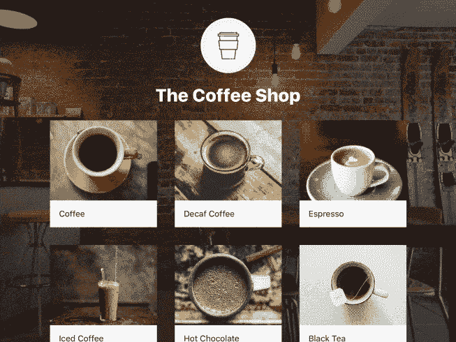

# 咖啡店售货亭

> 原文：<https://medium.com/square-corner-blog/the-coffee-shop-kiosk-68454b20ec53?source=collection_archive---------0----------------------->

> 注意，我们已经行动了！如果您想继续了解 Square 的最新技术内容，请访问我们的新家[https://developer.squareup.com/blog](https://developer.squareup.com/blog)

当我加入 Square 的开发团队时，我做的第一件事就是构建一个使用我们的 API 的应用程序。团队中的每个新工程师都这样做(你可以在这里阅读我同事的示例 Android 应用)，这样我们就可以站在客户的角度出发。在构建真实世界的应用程序时，它已经成为加强来自开发人员的反馈的一个很好的工具。对于我的项目，我选择构建一个面向客户的 kiosk 应用程序，因为我们看到对这种类型的定制应用程序的需求越来越多。对于我构建的应用程序，我使用了我们的销售点 API，它利用 iOS 应用程序切换 API，使应用程序能够接受使用 Square 销售点应用程序的当面支付。我们还提供了一个[销售点 SDK](https://docs.connect.squareup.com/api/point-of-sale/#navsection-point-of-sale) ，它是我们 API 的一个薄薄的包装，使它非常快速和容易地启动和运行。

咖啡店是一个面向客户的 kiosk 应用程序，允许客户在一个虚拟的咖啡店订购饮料并付款。

The Coffee Shop

售货亭的优势在于顾客可以自己下订单，让咖啡师有时间专注于制作饮料和与顾客互动，而不是管理收银台。因为这是一个面向客户的应用程序，所以界面需要既简单又快速。顾客应该能够轻松地选择饮料，定制它，并支付。

## 数据模型

饮料模型定义了一些基本属性，如名称和描述，以及一组 DrinkOptionGroups。

当你在咖啡店买饮料时，你通常有几个选择:

*   你想要多大的饮料？
*   你想要鲜奶油吗？
*   你想要什么样的牛奶？

DrinkOptionGroup 是一个简单的结构，可用于对这些用例进行建模:

它定义了一组可以应用于饮料的相关选项。例如，下面的 DrinkOptionGroup 定义了饮料的可用尺寸:

我添加了几种不同价位(以美分计)的不同尺寸，并指定客户必须选择一个且只能选择一个选项。您还可以定义一个 DrinkOptionGroup，其中有多个选项可供选择:

综上所述，咖啡的饮料定义如下:

在这个示例应用程序中，在一个[配置文件](https://github.com/square/SquarePointOfSaleSDK-iOS/blob/master/Examples/The%20Coffee%20Shop/Sources/Models/DrinkMenu.swift)中静态地定义了几种饮料，但是您也可以想象它们是从服务器中提取的。

## App 流量

该应用程序有两个屏幕，由 AppFlowController 类管理。AppFlowController 是一个 UIViewController 子类，负责应用程序中屏幕的显示和转换。它用一组饮料实例化，并通过显示 SelectDrinkViewController 来显示它们:

SelectDrinkViewController

一旦客户选择了一种饮料，CustomizeDrinkViewController 就会显示各种选项，可用于对其进行定制:

Customizing a drink

最后，当客户点击结帐按钮时，AppFlowController 启动销售点 API 请求，该请求将客户转换到 Square 销售点应用程序，以便他们可以为饮料付款。一旦客户完成支付，Square Point of Sale 应用程序会自动切换回咖啡店，接受下一位客户的订单。

Checkout

> 专业提示:在 iOS 设置中启用“减少运动”以改善应用程序切换体验

生产应用程序通常比这个简单的例子复杂得多。通过使用 Square 的 API，你不需要理解或担心接受支付的复杂性。相反，您可以专注于为您的客户打造卓越的体验。

这款应用的所有代码都可以在 Github 上获得，而 T2 的文档也可以在我们的开发者门户网站上获得。随意克隆回购，并尝试为自己建立一个类似咖啡店的信息亭！

我们相信商业正在发生变化，而这种变化伴随着需要解决的新的大问题。[来 Square](https://careers.smartrecruiters.com/Square/?search=Developer%20Platform) 加入我们，我们将打造一个商业平台，帮助开发者授权卖家启动、运营和发展他们的业务。