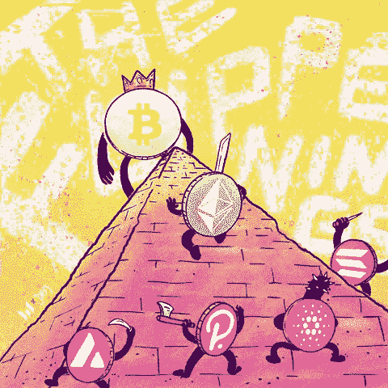
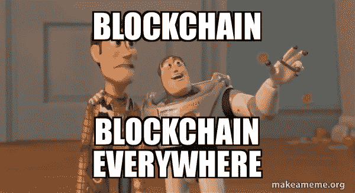
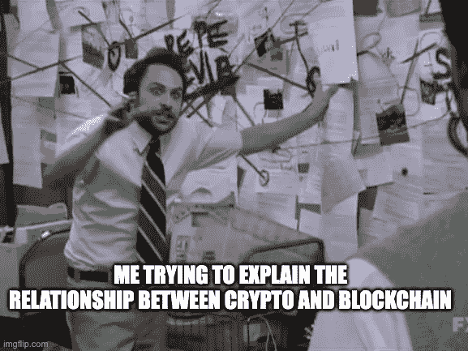
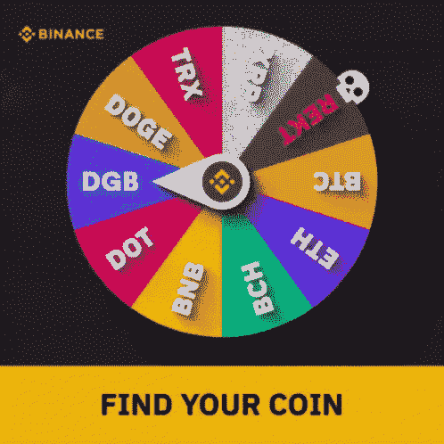
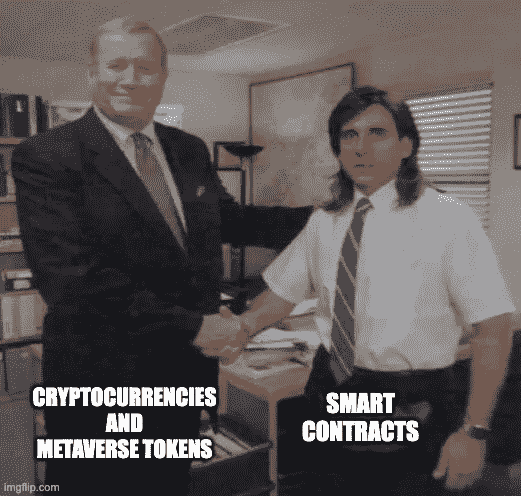
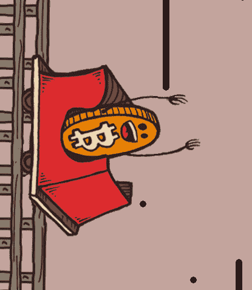
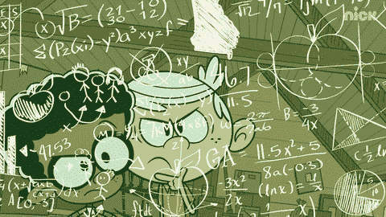
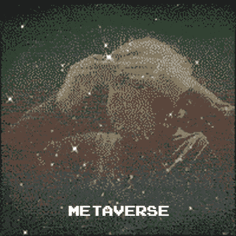

# 元宇宙和区块链世界加密完全指南

> 原文：<https://medium.com/globant/the-complete-guide-to-crypto-in-metaverse-and-the-world-of-blockchain-4c3a13b73fdf?source=collection_archive---------0----------------------->

Source: GIPHY

区块链及其数字货币的世界可能很复杂，但潜在的利益是巨大的。该技术可以简化流程，降低成本，并提高医疗保健或金融等行业的安全性。还有许多新的术语和短语进入常用词典，从区块链到空投，首次硬币发行(ico)到代币，这些都很容易被遗忘。

最近对加密的兴趣激增，导致许多人问这些概念对金钱、投资和信任的未来到底意味着什么。这些发展预示着价值交换的新思维方式，其影响远远超出了数字货币。

Source: makeameme.org

# **区块链引领的变革**

在我们进入加密货币的细节之前，我们应该首先了解区块链技术的基本原理。*区块链是一个记录所有加密货币交易的分布式分类账。*它是一个分布式数据库，这意味着它由全球数百万台计算机托管和更新，而不是在一个单一的位置。这与几个世纪以来一直是标准的中央集权制度有很大的不同。区块链技术有许多潜在的优势。它可用于任何必须记录信息并在未知方之间传输信息的情况。因此，它可以应用于广泛的行业，包括医疗保健、金融和供应链管理。

Source: imgflip.com

# 区块链和密码的关系

加密货币和区块链是两个相关但不同的概念。第一种是数字货币，它使用加密技术来保证交易安全，并控制额外单位的创建。加密货币通常由中央机构(如银行或政府机构)发行和管理。相比之下，区块链是一个分布式数据库，它维护一个不断增长的记录列表，称为“块”，使用加密技术来确保每个条目的完整性。区块链技术可以用来跟踪几乎任何有价值的东西，包括财产所有权、医疗数据、金融交易等等。

虽然有人将加密货币与区块链技术混为一谈，但它们是两种不同的东西，可以共存于同一个生态系统中。加密货币是一种可以作为交换媒介的资产；它由具有货币价值的数字代币或硬币组成。区块链是一个开放的网络系统，能够在生态系统中的多个参与者之间维护数字账簿。

Source: GIPHY

# **元宇宙对加密货币有哪些影响**

元宇宙是一个数字世界，它将现实世界的资产与虚拟资产结合在一起，创造了一种全新的与世界互动的方式。它是分散的、透明的、完全安全的。这可能会改变我们对金钱的看法。

以下是元宇宙如何改变加密货币:首先，没有准入门槛。任何人都可以创建一个钱包，并开始交易或投资各种虚拟资产。这消除了进入当前金融体系的最大障碍:成本。

元宇宙还解决了今天困扰加密货币的另一个问题:**流动性**。例如，如果你想购买比特币，你必须经历一个漫长的过程来验证你的身份，并确保你有足够的钱来支付交易费用。对于第一次交易的人和投资者来说，这可能是一个主要的障碍，因为他们可能没有时间或资源来做这件事。

最后，元宇宙提供了无与伦比的**安全感**。你不需要担心黑客窃取你的个人信息或被骗发送加密资金到骗子的钱包。消除这些障碍会让整个金融系统对任何有互联网连接的人开放。

Source: GIPHY

# 数字货币及其功能

加密货币最重要的一个方面是，区块链功能不需要加密货币。然而，它们确实有一个重要的用途。人们可以使用区块链发送和接收资金，而不必相互信任。是因为资金是加密的，只有正确的密码才能解锁。这意味着，即使有人获得了资金，他们也无法转移资金，除非他们有密码。这是一项重要的安全措施，可防止恶意行为者获取资金。加密货币是数字货币的一种形式，但它不仅仅如此。它保护区块链，防止恶意行为者篡改记录。

Source: Binance | GIPHY

# 加密文化正在转变:从比特币到以太网以及介于两者之间的一切

随着加密领域的不断变化和发展，关注的焦点也在不断变化。随着人们越来越意识到区块链固有的大量可能性，曾经是比特币狂热分子的领域，人们对什么是加密领域的良好投资的看法正在发生转变。

我们还见证了新一代密码爱好者的崛起，他们更关心货币的功能，而不是它是否会让他们变得富有。例如，以太坊不仅仅是一种数字货币，它正在迅速成为最重要的区块链技术之一。以太坊是一个用于智能合同创建和执行的分散平台。这可能看起来不多，但它有可能改变我们开展业务的方式。

Source: GIPHY

# **以太坊和元宇宙合伙**

元宇宙与以太坊建立了最重要的合作关系之一。这是因为以太坊是另一个众所周知的空间项目。尽管他们有所不同，但两人非常相似，足以成为良好的合作伙伴。这两个项目一起寻找共同点。然而，他们一直在讨论他们的分歧。这是有益的，因为它允许两个项目互相学习。元宇宙与以太坊合作的优势之一是智能合约的整合。这意味着元宇宙用户将拥有和以太坊用户一样的优势。

Source: imgflip.com

# **元宇宙加密货币和智能合约将是一个转折点**

***智能合约***

智能合同的概念并不新鲜，但我们现在开始看到它如何对商业和我们的日常生活产生巨大影响。智能合约本质上是嵌入在代码中的自动执行合约，旨在当满足商定的条件时(例如，当特定货物已交付或服务已完成时)自动转移付款。

智能合约的目标是为人们创造一种无缝、自动化和高效的互动方式。与传统合同相比，智能合同有许多优势，如降低成本、减少纠纷和降低风险。

为了最大限度地利用区块链技术，将加密货币内置于智能合同中非常重要。通过创建一个可以交易数字资产的生态系统，我们可以在人与人之间创建无信任和透明的系统，同时消除对第三方的需求。因此，加密货币可以用于金融机构、政府甚至企业之间的交易。

***加密货币和元宇宙代币***

最受欢迎的元纸币是 USDC(美元硬币)和维特币(维特币)。USDC 是一种稳定的货币，类似于美元，但由加密货币而不是法定货币支持。VTHO 是一个可以跨不同行业使用的令牌，使它在许多不同的情况下都很有用。Metaverses 的其他例子包括 MetalSwap (XMT)和 MetaMorph (METM)。XMT 是一种加密货币，其工作原理类似比特币，但增加了隐私功能，而 METM 是一种可以在不同行业使用的令牌。

这里有四个早期项目需要关注，它们正在弥合加密元宇宙鸿沟

**1。沙盒**(CRYPTO:SAND)——沙盒是一个用户创建的数字世界，用户在其中创建和销售数字内容。沙子是建立在以太坊区块链网络上的游戏内代币。沙子可以用来购买虚拟土地、建筑、配件和其他物品。

**2。分散之地**(CRYPTO:MANA)——分散之地(MANA)是一个使用以太坊区块链的虚拟世界。参与者可以使用本地令牌购买土地并将其开发用于游戏、化身和其他体验。分散地由分散地道控制。DAO 允许令牌所有者对计划和新开发进行投票。

3.**Axie Infinity**(CRYPTO:AXS)——Axie Infinity 是一款游戏，玩家训练被称为 Axie 的幻想怪物，与其他团队竞争。玩家可以通过参与游戏来获得代币，这些代币可以用于购买新的 axis，训练现有 axis 以改善其特征，以及虚拟土地。

**4。加密咖啡师**——NFT 的一个项目，加密咖啡师旨在连接数字和现实世界。拥有秘密咖啡师角色的人可以去咖啡兄弟，这是一家以咖啡为主题的元宇宙，其他咖啡爱好者可以在这里见面。这个例子演示了如何在现实世界中使用 NFTs。

在当前的熊市中，元宇宙令牌的表现优于所有其他加密类别，同比增长近 400%。根据北海巨妖情报公司和 coin gecko 2022 年 5 月市场报告的数据，分散地的 MANA(上涨 41%)、沙盒的 SAND(上涨 470%)、Axie Infinity 的 Axie Infinity Shards (AXS)(上涨 511%)和 Stepn 的 GMT(上涨 746%)涨幅领先。

Source: coinrivet.com

# **加密的利弊**

加密是一种虚拟货币。它与美元或欧元等传统货币完全不同，也不与各国货币挂钩。这意味着加密货币的价值可以随时变化。你不需要为了使用它们而把你的传统货币换成密码。

使用加密有很多好处。首先，他们是匿名的。您可以使用 crypto 支付商品和服务，而无需向商家或服务提供商提供任何个人信息。你对自己的钱也有更多的控制权。你可以在你想要的时候买你想要的东西，而不是必须等一段时间才能把钱花在像信用卡这样的东西上。最后，它们非常安全。与传统的纸币和硬币不同，没有伪造者，黑客也没有办法获得你的私人密钥来窃取你的资金。

然而，也有一些缺点。加密货币已被证明是一种高度不稳定的资产，价格波动迅速，崩溃惊人。这有许多原因。首当其冲的是加密货币的投机性质。早期采用者希望在新的加密货币成为主流之前通过投资它们来快速致富。这吸引了许多人，他们在价格上涨时看到了巨大的利润。然而，总有一些人也渴望参与进来，所以一旦价格开始下跌，每个人都开始蜂拥而入。因此，价格面临巨大的下行压力。

接下来会发生什么也有很多不确定性。没有人知道比特币是否会成为主导的加密货币，或者是否会被另一种更适合市场条件的货币取代。没有人知道随着时间的推移，还有哪些加密货币会变得流行和有价值。因此，很难预测任何特定的加密货币在充满未知的市场中会有怎样的表现。

此外还有波动性本身的问题。当某些东西具有高度投机性和波动性时，它很有可能会突然出乎意料地崩溃。即使没有人试图使价格下降，价格也会下降。加密货币也不例外；它们都可能在没有任何警告的情况下随时崩溃，有时风险巨大。

另一个原因是，与信用卡或银行转账费用等传统支付方式相比，使用加密货币的成本更高。最后，有些人可能会对使用匿名形式的货币购买食品、汽油等日常物品感到不舒服。

Source: GIPHY

# 现有区块链技术的问题

为了充分理解元宇宙的潜力，我们必须首先检查现有区块链技术的缺点。区块链技术面临的一些最大挑战包括安全问题、有限的可扩展性、处理能力要求、能耗、可靠性问题以及缺乏用户友好性。

可扩展性(Scalability)—虽然最受欢迎的区块链网络每秒可以处理数万笔交易，但其他网络却难以处理数百笔交易。即使区块链网络成功扩展，也往往是以速度和/或效率为代价的。这使得它们不适合主流应用。

**对隐私和安全的担忧**——尽管区块链的交易是加密的，但它们仍然会留下数字指纹，可以用来跟踪交易。此外，区块链技术还不够成熟，不足以保证其用户完全信任和透明。

**缺乏互操作性—** 当两个或多个区块链由于构建在不同的架构上而无法相互通信时，就会出现这种情况。

Source: GIPHY

# 元宇宙如何改变这种情况？

加密货币和元宇宙一起成长，就像一个整体的两半。这两种技术都旨在创造虚拟空间，让用户能够以不同的方式相互交流。随着加密货币变得越来越主流，它们也越来越与更广阔的世界融为一体。

***可扩展和透明的生态系统****——*元宇宙的主要目标是通过将区块链连接在一起，解决与现有区块链平台相关的问题，如可扩展性和透明性。通过建立在近地天体区块链提供的开源基础设施上，元宇宙旨在为用户提供低交易费用、快速确认时间和高 TPS(每秒交易次数)。

与比特币和以太坊等其他流行的加密货币不同，元宇宙建立在公共区块链的基础上，因此所有用户都可以看到所有交易。这允许开发人员构建更健壮的应用程序，能够通过智能契约、自毁令牌等与用户交互。

***信任不是问题***——加密货币和元宇宙有无数种方式可以改变未来。一种方法是通过增加信任。通过创建用户可以控制的基于加密的数字身份，您可以建立人与人之间的信任。这对企业尤其有用，因为企业可以使用数字身份来证明其合法性并防止欺诈。

元宇宙区块链提供了一个分布式和不可信的分类帐，允许用户创建自己的智能合同、令牌和数字资产。元宇宙区块链也存在于世界各地的多个地区，以分散交易并增加其效用。它还通过使用智能合约来验证交易，从而解决了第三方信任的问题(例如，“该产品是在 ISO 14000 认证的工厂制造的”)。

***DApps 的崛起*** —元宇宙支持 DApps，DApps 可以在元宇宙区块链上运行，可以用来创建在线游戏或投票系统等去中心化的应用。

***业务转型的机会*** —房地产资产的业务和交易在现实生活中因涉及银行、监管机构等中间商而复杂。一种在元宇宙进行房地产交易和商业运作的新想法被引入，这种想法现在正在全世界流行。由此，大量的商业机会被打开，大量的商业想法正在产生。从游戏、体育和娱乐到虚拟世界平台，元宇宙的增长和扩张以及加密货币的发展正在创造一些非凡和有利可图的东西。

Source: GIPHY

# 结论

随着我们在这个实验和探索时期的进步，区块链及其相关技术很可能会成为日常生活的一部分。这将意味着从一个集中的系统向一个分散的系统转变，从一个人们支付的世界向一个他们交换代币的世界转变。

加密货币的前景正在向好的方向发展。新项目正在开发，现有项目正在改进。元宇宙是一个正在改变世界的加密货币项目。元宇宙的区块链是可扩展的，可以被广泛采用。区块链具有内置的令牌功能，使其适用于广泛的应用程序。有很多理由对元宇宙充满热情。这是一个有可能改变加密货币世界的项目。

元宇宙正处于互操作性的早期阶段。预计不断的发展和创新将引入数以千计的支持互操作性的元宇宙项目，这些项目可以相互作用，相互补充。分散技术和互操作性将增强元宇宙的能力。如果没有互操作性，元宇宙将会受到某些限制，这将阻碍它的大规模采用。

资产和服务的令牌化将改变游戏规则，随着越来越多的人意识到区块链技术的潜力，需求将会飙升。这几乎肯定会导致加密资产价值的持续增长，以及我们相互交往和开展业务方式的重大变化。这不仅仅是我们如何看待金钱和商品的转变；这也改变了我们对信任的看法。这将意味着信任根植于一切事物之中，我们将不再需要依赖中央权威机构来验证真实性。这也意味着人类联系和合作的可能性将是无限的。