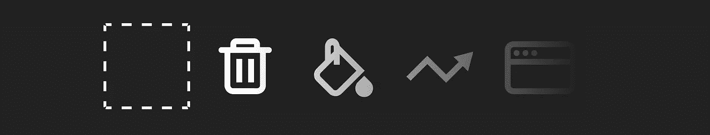

# 图标和门迪克斯完全指南

> 原文：<https://medium.com/mendix/the-complete-guide-to-icons-and-mendix-426936a533ee?source=collection_archive---------1----------------------->


The Complete Guide to Icons and Mendix

## *如何将自定义图标映射到 Mendix Glyphicon 集合。*

> 这首歌献给[威廉·格里斯](https://www.linkedin.com/in/willem-gorisse-b2002867/)，让我们看看在 2023 年之前，我们能否在 Mendix 中获得伟大的偶像支持！
> 投票支持这个[创意帖子](https://forum.mendix.com/link/ideas/2060)，帮帮威廉。

*24–5–22 编辑:将所有“context-icn”更改为“icn-context ”,以便更好地适应未来发展*


The Complete Guide to Icons and Mendix

Mendix 中的图标似乎有些混乱。因此，通过这个博客，我希望我们可以创造一些最佳实践，这样如果一个前端改变团队，他们明白已经做了什么。

> 从这里开始，Mendix Studio Pro 9 将被称为 MXSP9

# 图标类型。

如果图标有一种单一的格式，生活会变得容易得多，但话又说回来，多样性是生活的调味品。有 4 种主要的图标类型，每一种都有其优缺点(**图标-字体、CSS 图标、SVG、png**)。

> **MX 最佳实践**
> MX UX 社区认为图标字体是实现图标的最佳实践。
> [点击这里](https://join.slack.com/t/mendix-ux/shared_invite/zt-4j76hu1d-QUGLLAGtDgzJXGVbP59f2Q)加入 MX UX slack


## 图标字体

图标-字体是用来显示某个图标的**字符。这使它们能够像字体一样通过 CSS 进行操作(比如根据品牌颜色改变颜色或者给它们提供悬停状态)。因为它们是一种字体，所以它们也是一种矢量，无论大小都是清晰的。**

**优点**
门迪克斯
地段内的最佳做法可供选择。
通过 CSS 容易操纵

**缺点**
好的不免费(但也不贵)。
配置起来会比较别扭。([此处阅读如何](/p/9307c2634392) )
不在 MXSP9 内渲染。

**图标包**
Glyphicon (MXSP9 默认)
[字体牛逼](https://fontawesome.com/)
[https://icomoon.io/](https://icomoon.io/)
[https://themify.me/themify-icons](https://themify.me/themify-icons)
[https://zurb.com/playground/foundation-icon-fonts-3](https://zurb.com/playground/foundation-icon-fonts-3)

**Mendix**
[字体牛逼 appstore 模块](https://marketplace.mendix.com/link/component/119189)


## CSS 图标。

CSS 图标可能是这个列表中最不为人知的，并且曾经是我的首选图标类型。最好的例子就是 css.gg 图标包。它们对我来说工作得很好，因为许可证模型对顾问来说很友好，而且因为它们是纯 CSS，它们很容易加载，也很容易改变颜色和大小。

缺点是可供选择的不多，如果是在小众领域工作，有时很难找到符合语境的图标。

> 这些不再是我的最爱，因为 MX UX 社区认为图标字体是最常见、最容易使用的，而且还有开源版本。

**优点**
可以用动态类改变大小/颜色。
易于装入。
可以轻松重映射。

**缺点
限制选择**

**图标包**
css.gg


## SVG 图标

使用 SVG 的主要原因是显示包含多种颜色的图像，如插图、公司徽标、表情符号或贴纸。

关于 SVG 的棘手之处在于，它们可以通过 3 种不同的方式加载到 Mendix 应用程序中(SASS/CSS，在 MXSP9 中& inline)。

**SASS/CSS**
前端实现的第一种也是最常见的方式是通过 **SASS** 加载图标。当你有像公司标志这样的东西时，这是很棒的。如果命名正确，它们可以很容易地映射到“brand-logo”类。这也允许您轻松地在一个位置更改图标，它会在项目中的任何位置更改。

**在 MXSP9**
中，加载它们的第二种方式是通过 MXSP9，就像你加载**图像**一样。最棒的是，你可以在 MXSP9 中看到图标，这有助于开发者了解他们的 Mendix 页面中有哪些图标。这里有一些安全问题，因为 SVG 可能包含恶意脚本，所以要小心。

**内联**最后是**内联** SVG。内联 SVG 可以通过 HTML 小部件加载，有时被硬编码到小部件中。这是实现 SVG 的最差方法，因为它使得操作、重新着色或替换图标变得困难。**不惜一切代价避免这种情况。**

**优点**多色
。
轻量级文件大小。
在不同的尺寸下都能很好的渲染。

**缺点** 不能有悬停状态。
不能用 SASS 变量重新命名。
如果从不可信的来源下载，SVG 可能包含恶意脚本。

**icon packs**
[https://app.streamlinehq.com/illustrations](https://app.streamlinehq.com/illustrations)


## png、jpg、gif 和插图

长久以来，像素格式一直是在网络上实现图像的最佳方式。如果说到照片，这还是要走的路。

图标通常没有照片复杂，因此现在通常以矢量格式创建和加载，这样无论大小都保持清晰。

这些图标的好处是它们可以有多种颜色。
加载到 Mendix，可以在 MXSP9 内部渲染。

另一件很酷的事情是，如果你使用 gif，它们可以包含动画，这可能会给你的用户带来一点“*愉悦*”。

**优点**多色
。
可在 MXSP9 中渲染。gif 可以制作成动画

**缺点** 不能有悬停状态。
不能用 SASS 变量重新命名。
文件尺寸略大。
调整大小时看起来像“像素”。

**icon packs** [https://www.flaticon.com/](https://www.flaticon.com/)


# 上下文图标与名词图标。

简而言之；
一个图标可以被命名来描述它所传达的**动作**或者以它所代表的**图像**来命名。

移除 vs 垃圾桶。
编辑 vs 钢笔。
单选 vs 单选。

我个人倾向于使用上下文命名约定。这样做的原因是这使得管理和维护你的图标变得容易。这方面的一个例子可能是:你的设计系统发生了变化，现在所有的垃圾桶图标必须变成十字图标。在你的应用程序中找到所有的垃圾桶。如果你的 CSS 中有一个名为“context-remove”的上下文图标，你可以把任何你想要的图标重新映射到这个图标上，并在一个地方改变它。

这就把我们带到了**“图标映射”**。



# 图标映射(最后，好东西)

什么是图标映射？
简而言之，图标映射就是告诉浏览器，如果看到某个类，就需要显示某个图标。

> 本节分为两个部分:
> -上下文映射
> -图标重映射

## 上下文映射

上下文映射是一种可以将上下文传达给设计系统和用户的方法。

HTML 已经支持基本的上下文状态，如悬停/焦点状态，Mendix 中默认的其他状态(如列表视图中的选定状态)，其他形式的上下文通常过于具体或抽象，必须手动设置。

[动态类](https://docs.mendix.com/refguide/common-widget-properties/#dynamicclasses)是根据特定条件何时满足来设置上下文的好方法。

通常，当手动完成时，会有一个名为“context-X”的类，这样所有开发人员都知道某些元素会因给定的上下文而改变。

上下文也可以在不同的“层次”上给出。
**顶级**上下文影响其自身和所有底层元素，例如带有 class .card.context-success 的卡片。
**Specific-contex** t 只影响自身，例如，一个带有类的容器。icn-context.context-chevron。


## 让我们看一个例子

对于我们开发的清单，我们需要传达 3 种状态。待定/接受/拒绝。还没有最终的视觉设计，但是线框已经完成，所以我们可以开始建造了。


Initial wireframe

在这个例子中，我们使用了顶级上下文，因为我们希望在需要时能够改变的不仅仅是图标。


dynamic class on the card.

```
.icn-context{
  @extend .fa-xl;
  @extend .far;
  line-height: 1;
}

.context-default{
  .icn-context{
    @extend .fa-circle;
  }
}
.context-success{
  .icn-context{
    @extend .fa-check; 
    color: $cl-semantic-success;
  }
}
.context-danger{
  .icn-context{
    @extend .fa-xmark;
    color: $cl-semantic-danger;
 }
}
```

在开发过程中，我们决定改变背景颜色以匹配状态，并将干净的图标替换为周围有圆圈的图标。因为我们使用了上下文方法，所以用新图标替换图标和给元素添加背景颜色是非常简单的。

```
.icn-context{
  @extend .fa-xl;
  @extend .far;
  line-height: 1;
}

.context-default{
  .icn-context{
    @extend .fa-circle;
  }
}
.context-success{
  .icn-context{
    //@extend .fa-check;
    @extend .fa-circle-check;
    color: $cl-semantic-success;
  }
}
.context-danger{
  .icn-context{
    //@extend .fa-xmark;
    @extend .fa-circle-xmark;
    color: $cl-semantic-danger;
 }
}.card{
  &.context-default{
    // has default card background color
  }
  &.context-success{
    background-color: $cl-bg-semantic-success;
  }
  &.context-danger{
    background-color: $cl-bg-semantic-danger;
  }
}
```


Screenshot from the Mendix application

> 当与动态类结合时，上下文图标工作得非常好。
> 但是如果有多个上下文图标，这可能并不总是工作得很好。


## 象形图映射

> 要获得所有图标的完整列表(映射到 css.gg，但很容易重新映射)，使用这个[。如果你想要一个带有所有图标的 Mendix 模块，开始在 slack 上烦我吧。](https://www.dropbox.com/s/xxgxz25xdaqwjaj/_glyphicon_mapping_template.scss?dl=0)

Mendix 在很多地方使用字形图标，分组框的打开和关闭，或者作为导航和链接中的图标。
如果您正在使用自定义图标包，最好从重新映射 Mendix 字形图标开始。

这些图标现在和将来都是“名词图标”，所以要确保你有严格的指导方针，什么时候使用垃圾桶，什么时候使用十字图标。

为了重新映射图标，我们需要加载您的新图标集，并使用新图标覆盖图标(根据图标集的不同，这可能会有所不同)

```
.glyphicon-ok {
  @extend .fa-check !optional;
}
```

也可以使用 sass 中的@each 函数对多个图标执行此操作。
参见[该文件](https://www.dropbox.com/s/xxgxz25xdaqwjaj/_glyphicon_mapping_template.scss?dl=0)了解所有的雕刻

```
$icons:
asterisk        asterisk        false,
plus            math-plus           true,
euro            euro                true,
minus           math-minus          true;@each $icon in $icons {
  .glyphicon-#{nth($icon, 1)} {
    @extend .fa-#{nth($icon, 2)} !optional;
    @if #{nth($icon, 3)} == 'true'{
      &:before{
        content: none;
      }
    }
  }
}
```

> **重映浮雕的弊端？** 目前，将一个图标放入 mendix(不在默认小工具中)的唯一方法是创建一个链接，删除文本并选择一个图标。从 HTML 的角度来看，这是非常糟糕的做法。另一个缺点是，如果你使用的图标没有对应的 glyphicon，前端会选择隐藏经常不使用的图标(如冰棍),现在你可能会在你的 Mendix 应用程序中有随机的冰棍图标。最后，动态类不能很好地处理 Mendix 通过链接按钮实现的 glyphicons。


一些随意建议的遗言。

## 设计属性

这个博客越来越大，但简而言之，你可以为你的图标类设计属性。
在这里阅读[设计属性](https://docs.mendix.com/apidocs-mxsdk/apidocs/design-properties)


[https://nucleoapp.com/](https://nucleoapp.com/)

# 图标管理器

如果你经常使用图标，使用某种图标管理器是个好主意。

有了图标管理器，你可以导入你的图标集，搜索，重新着色，导出，直接拖放到 Figma，Powerpoint 或大多数其他应用程序中。

对于 Windows: [Nucleo](https://nucleoapp.com/)
对于 Mac: [Iconjar](https://geticonjar.com/)


css.gg icon rendered at 24px vs 30px


1:1 size

# 图标大小和像素网格

“我的图标是矢量的，所以它们看起来总是很好”是很多人容易上当的谬论。
屏幕是由像素构成的，如果一条线正好位于一个像素上，它看起来会很清晰。图标倾向于用一定大小的边框来创建(例如 24*24px)。当图标针对特定尺寸进行了优化，并且其边界框以该尺寸显示时，图标的像素将与屏幕像素精确对齐，从而创建清晰的渲染图标(如果图标创建正确)。

# 创意论坛

最后，一些想法供你投票，让你在 Mendix 中更好地管理图标。

**图标经理
https://forum.mendix.com/link/ideas/2060**

**使添加图标到输入字段变得容易** https://forum.mendix.com/link/ideas/2612

如果你喜欢这个博客，在 LinkedIn 上分享它，并在它上面给我加标签:D
[我的 Linkedin](https://www.linkedin.com/in/jason-teunissen-537a9327/)

*来自发布者-*

如果你喜欢这篇文章，你可以在我们的 [*中页*](https://medium.com/mendix) *找到更多喜欢的。对于精彩的视频和直播会话，您可以前往*[*MxLive*](https://www.mendix.com/live/)*或我们的社区*[*Youtube PAG*](https://www.youtube.com/c/MendixCommunity/community)*e .*

*希望入门的创客可以注册一个* [*免费账号*](https://signup.mendix.com/link/signup/?source=direct) *，通过我们的* [*学院*](https://academy.mendix.com/link/home) *获得即时学习。*

有兴趣更多地参与我们的社区吗？加入我们的 [*闲散社区频道*](https://join.slack.com/t/mendixcommunity/shared_invite/zt-hwhwkcxu-~59ywyjqHlUHXmrw5heqpQ) *。*