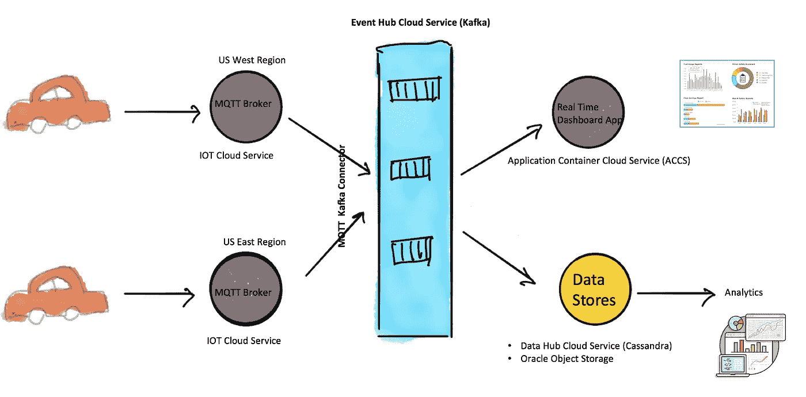
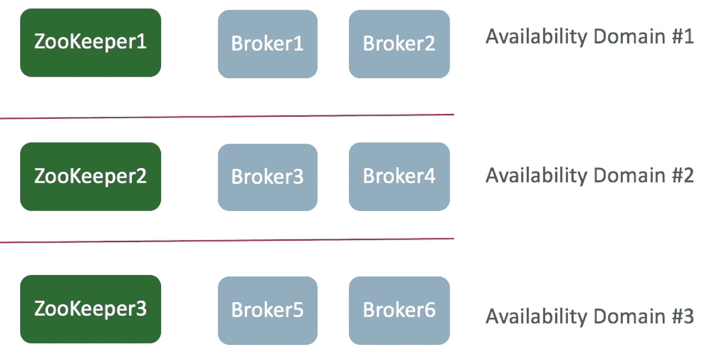
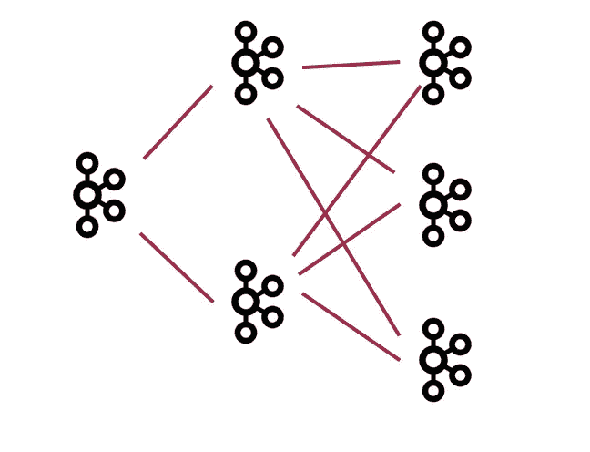

# 采用甲骨文活动中心云服务的互联汽车

> 原文：<https://medium.com/oracledevs/the-connected-car-with-oracle-event-hub-cloud-service-4b59cea90a8c?source=collection_archive---------0----------------------->

**简介**

我们最近一直在与一些全球最大的汽车制造商、汽车经销商和汽车保险公司合作，这些公司现在比以往任何时候都更愿意提供包含应用、分析和服务的互联汽车体验，作为其用户移动“车内”体验的一部分。

Oracle Event Hub Cloud Service 是所有此类用例的默认数据接收机制。Oracle Event Hub Cloud service 建立在开源 Kafka 的基础之上，由于非常活跃的开发社区，它在该领域获得了巨大的发展势头。

本博客描述了联网汽车领域的大多数参与者在甲骨文 PAAS 上设想和实现的一个非常常见的设计模式。

**用例**

内置于汽车中的支持 GPS 的设备不仅能够为安装在仪表板上的应用程序提供 Wifi 热点体验，还能够解释驾驶模式、提供汽车诊断信息和提供道路救援。

这些设备支持 4G/5G 无线，并通过 Kafka 的本地(轻量级)API 将数据发送到 Oracle Event Hub Cloud Service，这些 API 基于 TCP/IP 而不是 HTTPS(尽管这是可能的)。

一些汽车制造商已经选择使用 MQTT，如果他们的无线覆盖预计不稳定，他们要求他们的设备功耗非常低，如果他们的数据集预计很小。对于所有其他场景，Kafka 原生 API 是传输的选择。

MQTT 与 Kafka 协同工作，一个示例架构(不要被误认为是精确的蓝图)如下所示:

作为 Oracle IOT 云服务的一部分部署的 MQTT 代理终止 MQTT 连接，部署在 Event Hub Cloud Service 的内置 Kafka Connect 运行时上的 MQTT Kafka 连接器使用消息并将它们推送到 Kafka 主题。

可以部署多个 MQTT 代理，每个代理服务于特定的地理区域。

Kafka 将生产者与消费者分离开来，在成百上千辆汽车每隔几秒钟发送一次数据，生成高速数据集供具有不同数据速率摄取需求的消费者使用的场景中特别有用。

互联汽车发送的数据通常包括诊断 OBDII 故障代码。如果您打开了检查发动机灯，那么通常会有一个或多个代码处于“激活”状态。

示例代码:**p 0301****:1 号气缸**失火

当我们处理商业车队管理用例时，在 ACCS 上运行的应用程序中实现的实时仪表板将实时显示一组车辆的活动故障代码/维护需求。来自同一个 Kafka 主题的数据可以被推送到 Oracle Data Hub Cloud Service(Cassandra )(一个高度可扩展的 NoSQL 数据库)或数据湖(Oracle Object Storage ),用于商业智能或 Spark Analytics ( Oracle 大数据云)的后处理。

像上面这样的联网汽车用例需要处理 Pb 级数据，事件中心云服务就是牢记这一点而构建的。

在联网汽车用例中，高度可用的 Kafka 集群不仅是理想之选，而且也是重中之重。Kafka 本身提供了高可用性，内置了对 Broker/ZooKeeper 集群和带有主题/分区复制的自动故障转移的支持。Oracle Event Hub Cloud Service 更进一步，实施了一个扩展集群，将 Kafka 集群拆分到多个可用性域，从而解决了整个可用性域的故障。

此外，使用 Kafka Mirror Maker 的可选灾难恢复解决方案确保了针对区域数据中心故障的保护。

一种众所周知的网飞实施的分层 kafka 集群方法也可以用于 Event Hub 云服务——专用于在 Oracle 公共云基础架构上部署具有 SSH 访问权限的整个私有可配置 Kafka 集群。

有关调整活动中心集群的参考信息，请参考:[https://medium . com/Oracle devs/sizigeventhubcluster-dbb 639 e 42094](/oracledevs/sizingeventhubcluster-dbb639e42094)

**总结**

人们对联网汽车领域的兴趣越来越大，这使得 Oracle Event Hub Cloud Service 成为高性能数据获取服务的首选，原因如下:

*   Event Hub Cloud Service 基于开源的 Kafka，它提供了由非常活跃的开发社区构建的大量可重用的工具集
*   具有内置 Kafka HA 选项的高可用性，以及 Oracle Event Hub Cloud Service 针对 AD/区域数据中心故障的扩展集群和镜像选项带来的额外高可用性。
*   高性能—通过在同类最佳的 Oracle 云基础架构上使用 Kafka 原生 API 来实现
*   与 Oracle IAAS 和 PAAS 服务集成，提供端到端的解决方案体验