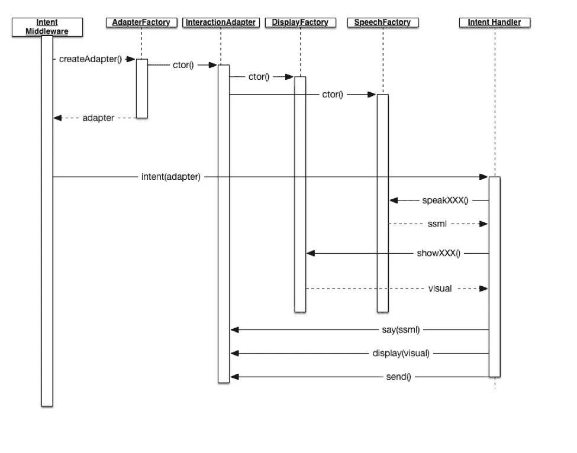
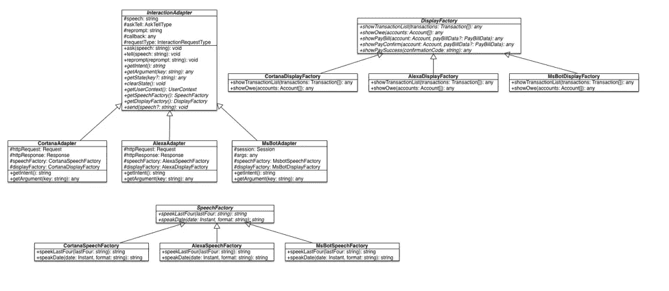

# 对话工厂

> 原文：<https://medium.com/capital-one-tech/the-conversation-factory-68310ff24748?source=collection_archive---------4----------------------->

## 多种设备类型的高级架构和开发实践


通往互联网的大门正在移动和扩大。随着人工智能和人机界面处于早期革命阶段，语音和多模式对话界面正在爆炸式增长。一年半前，当我在 Capital One 的团队开始研究反应式回合制对话用户界面时，我们发现几乎所有的界面都有类似的结构。我们利用这些构造，创建了我们称之为*对话工厂*的东西，它是一组模式和抽象，可以应用于所有符合这种范式的对话 ui。这些模式和抽象允许我们在开发新的渠道和多模式设备时保持速度和质量，这些渠道和设备结合了语音和视觉体验。

我们的代码库是使用可靠的工程原理和实践设计的，允许我们引入对话工厂，而不会在整个技能中产生连锁反应。技能设计的其余部分超出了本博客的范围，但是必须理解深思熟虑的设计必须应用于代码库的所有层。

使用序列图，我们展示了对话工厂组件之间的交互:



*   **意图中间件** — Express.js 中间件组件，负责将传入的请求路由到适当的意图处理器。它使用 AdapterFactory 为请求的通道创建一组适当的交互工厂。这个适配器被传递给匹配的意图处理程序。
*   **AdapterFactory** —该组件负责检查传入的请求，以确定应该创建哪个通道特定的 InteractionAdapter。
*   **InteractionAdapter** —抽象出获取关于传入请求的信息所需的交互:用户上下文、意图、插槽/实体等。
*   **DisplayFactory** —用于创建平台特定显示的接口。
*   **SpeechFactory** —用于创建平台特定的 SSML/语音的接口。
*   **IntentHandler** —每个意图都有一个处理程序，用于根据用户上下文和入站实体确定适当的返回响应。

# 工厂

类图快速展示了我们的实现是什么样子的。为了简洁起见，这不是一个完整的类图，只是用来显示一些实现细节:



下面是一些类型脚本代码片段来说明我们的抽象。

## 语音工厂

虽然所有的声音平台都支持 SSML，但并不是所有的平台都同样支持 SSML。对于我们的技能，我们说一个账号的最后四位数字用于多账户响应:*“…你的风险账户以 1 2 3 4 结尾。”* SSML 允许我们通知语音引擎把数字*【一二三四】*说成字符，而不是把它们说成数字“*一千二百三十四。”*除了这种特定于 Capital One 的需求之外，我们发现每个平台上的日期表示也有所不同。我们只对这两个进行了抽象，但是有了 SpeechFactory，我们可以在需要的时候很容易地添加新的实现。

```
**export interface** SpeechFactory { speakLastFour(lastFour: **string**): **string**; speakDate(date: **string**, format?: **string**): **string**;}
```

## 显示工厂

随着 Cortana 的全面上市和 Echo Show 等多模式设备的发布，我们还必须抽象出我们的技能如何向客户显示相关信息。它可以像技能卡上的文本一样简单，也可以是 Cortana 画布或 Echo Show 屏幕上的更丰富的 UI。我们抽象了所有用例，并在一个界面中表示它们，因此我们可以添加大量依赖于通道的实现，并在每个通道上显示支持。

```
**export interface** DisplayFactory { showTransactionList(transactions: Transaction[]): **any**; showAccountSummary(accounts: Account[], currencyType?: CurrencyType, balanceType?: **string**): **any**; showOwe(accounts: Account[]): **any**; showPayBill(account: Account, payBillData?: PayBillData): **any**; showPayConfirm(account: Account, payBillData?: PayBillData): **any**; showPaySuccess(confirmationCode: **string**): **any**; showSpent(transactionResponse: TransactionResponse, sessionData: TransactionSessionData): **any**; showFailure(): **any**; showHelp(): **any**; showAccountSelector(accounts: Account[]): **any**; showPayoff(accountList: Account[]): **any**; showEasterEgg(): **any**; showGoodbye(): **any**; showWelcomePin(): **any**; showWrongPin(): **any**; showLockout(): **any**; showWelcome(): **any**; showAbandonment(): **any**; showEntitlementsLockout(): **any**;}
```

我们的设计团队与我们的客户一起进行了大量的用户实验，以确定他们如何结合语音体验与视觉显示进行交互；这些发现令人着迷。我们发现，客户如何与技能交互很大程度上取决于设备和 UI 功能的接近程度。借助抽象层，我们可以提供依赖于通道和设备特性的适当体验。

## 交互适配器

对话工厂的核心和灵魂是交互适配器，它是负责检索必要数据以提供响应或代表客户执行任务的通道不可知代码和与该平台交互的通道特定实现细节之间的纽带。

我们发现了语音平台的响应回合制范例之间的共同行为，并将其抽象到这个基类中。

ask()方法接受语音响应，并识别适配器以保持对话打开，因为我们正在等待响应。

```
**public** ask(speech: **string**) { **this**.safeAppendSpeech(speech); **this**.askTell = "Ask";}
```

tell()方法接受语音响应，但不知道对话是否应该保持开放，这是由特定于通道的实现决定的，通常取决于调用技能的方式(Ask vs Open)。

```
**public** tell(speech: **string**) { **this**.safeAppendSpeech(speech); **this**.askTell = "Tell";}
```

此外，我们发现重新提示在各种渠道中很常见，并引入了一种方法来接受该语音，即 reprompt()。

```
**public** reprompt(repromptSpeech: **string**) { **this**.repromptSpeech = repromptSpeech;}
```

除了这些基本方法之外，我们还有一些其他方法来帮助支持各种原因的特定用例，例如保持对话框打开、抑制重新提示以及在发送响应后发送回调。

```
**public** sendCallback(callback: **any**) { **this**.callback = callback;}**public** shouldNotReprompt(value: **boolean**): **void** { **this**.doNotReprompt = value;}**public** shouldKeepDialogOpen(value: **boolean**): **void** { **this**.askTell = value ? "Ask" : "Tell";}
```

我们遵从特定于通道的实现来提供关于入站消息的细节，例如意图、参数(实体/槽)、对话上下文和用户上下文。除了提供关于入站消息的这些细节之外，适配器还负责为语音和显示提供特定于通道/功能的工厂。

```
**public abstract** getIntent(): **string**;**public abstract** getArgument(key: **string**): **any**;**public abstract** clearArgument(key: **string**): **void**;**public abstract** getState(key?: **string**): **any**;**public abstract** clearState(): **void**;**public abstract** getUserContext(): UserContext;**public abstract** send(speech?: **string**): **void**;**public abstract** getSpeechFactory(): SpeechFactory;**public abstract** getDisplayFactory(): DisplayFactory;**public abstract** getPlatformId(): **string**;**public abstract** showLinkingCard(): **void**;**public abstract** display(display: **any**): **void**;
```

# 示例实现

在上一节中，我们确定了如何抽象特定于通道的实现，以允许我们在对现有代码影响最小的情况下快速添加新的通道和功能。在接下来的几节中，我们将看一个部分具体的例子，然后看它们是如何联系在一起的。

## MsbotInteractionAdapter

构造函数接受 Bot 框架会话对象和参数，它们在传入的 intent 请求中提供。我们使用这些来提取意图、实体和用户信息，以帮助满足我们对 InteractionAdapter 的契约要求。我们还创建适当的显示和语音工厂。虽然我们只有一个用于 Cortana 的显示和语音工厂，但是我们可以询问传入的设备类型、支持的功能或用户偏好的请求，以实例化各种各样的实现，从而提供我们想要的确切体验。

```
**constructor**(**protected** session: builder.Session, **protected** botArgs: **any**) { **super**(); **this**.intent = botArgs.intent; **this**.state = JSON.stringify(botArgs.privateConversationData); **this**.speechFactory = **new** MsbotSpeechFactory(); **this**.displayFactory = **new** MsbotDisplayFactory(**this**, session); **this**.context = { clientCorrelationId: session.message.sourceEvent.clientActivityId, userId: session.message.user.id, } **as** UserContext;}
```

必须实现的其他 InteractionAdapter 方法都包含桥接我们的非通道特定方法调用和 MS Bot 框架特定会话和 botArg 对象的代码。请查看 [Bot Builder 框架示例](https://github.com/Microsoft/BotBuilder/tree/master/Node/examples)，了解如何询问会话对象以支持您的技能需求。

# 在实践中

现在我们已经看到了抽象，让我们看看它是如何在没有特定于通道的细节进入我们的意图处理程序的情况下结合在一起的。

## 帐户余额意向处理程序

我们将使用帐户余额的基本用例来说明。我们如何协调我们的 API、缓存集群和数据库来获取填充响应所需的信息，这超出了本讨论的范围。

*   **查询入站消息**

在这段代码中，我们提取了 ProductType 和 LastFour 的参数(实体),因为这将决定我们在响应中如何/向用户呈现什么。然后，我们使用一个服务来检索必要的数据，并引导数据响应为用户构建响应。

```
**const** lastFour = adapter.getArgument("LastFour");**const** productType = adapter.getArgument("ProductType");accounts.getAccount(adapter.getUserContext(), {accountType, lastFour, productType}) .then(accountList => buildAccountBalanceResponse(adapter, accountList, accountType, adapter.getArgument("CurrencyType"))) .catch(error => handleDataRetrievalError(error, adapter, **true**));
```

*   **大厦响应**

在构建响应时，会调用交互适配器提供的显示工厂，这样我们就可以构建适合通道的可视响应。然后我们调用另一个 helper 方法来汇总账户总数

```
**function** buildAccountBalanceResponse(adapter: InteractionAdapter, accountList: Account[], accountType: AccountType, currencyType: CurrencyType) { adapter.getDisplayFactory().showAccountSummary(accountList, currencyType); adapter.send(accountList .map(account => readAccountTotal(adapter.getSpeechFactory(), account, accountList.length > 1, isBank(account.accountType) ? currencyType : undefined)) .join(""));}
```

这个帮助器方法负责查看所有不同的帐户类型，并为该响应收集语音。我们在这里隐藏了一些代码，以保持它针对信用卡:

```
**function** readAccountTotal(speechFactory: SpeechFactory, account: Account, useMulti: **boolean**, currencyType: CurrencyType) { **const** balance = formatCurrency(account.accountBalance, currencyType); **const** balanceName = isBank(account.accountType) ? "available" : isCardAccountType(account.accountType) ? "current" : "principal"; **const** suffix = getSuffix(account.accountType); **const** productName = isLoan(account.accountType) ? "" : ` ${account.toSpeech(speechFactory, useMulti)}`; **return** `Your ${balanceName}${productName} balance is ${balance}${suffix}.  `;
```

最后，我们遵从帐户模型的 toSpeech()方法，传入语音工厂以确保最后四个被正确读取:

```
**public** toSpeech(speechFactory: SpeechFactory, sayLast4 = **false**) { **const** last4Speech = sayLast4 ? ` ending in ${speechFactory.speakLastFour(**this**.lastFour)}` : ""; **if** (**this**.accountType === AccountType.CREDIT) { **return** `${**this**.productName} card${last4Speech}`; } ...}
```

# 摘要

多模态对话界面正在爆炸，许多 AI/NLP 提供商正在这个领域涌现。在多模态对话和各种人工智能/自然语言处理提供者的背景下，为重用、速度和质量构建软件需要在几个层面上进行深思熟虑的决策。在 Capital One，我们利用解决方案架构以及模式和抽象，使我们能够在快速变化的环境中继续保持速度和质量。

*披露声明:这些观点是作者的观点。除非本帖中另有说明，否则 Capital One 不属于所提及的任何公司，也不被其认可。使用或展示的所有商标和其他知识产权都是其各自所有者的所有权。本文为 2017 首都一。*

*欲了解更多关于 Capital One 的 API、开源、社区活动和开发者文化，请访问我们的一站式开发者门户 DevExchange。*[](https://developer.capitalone.com/)