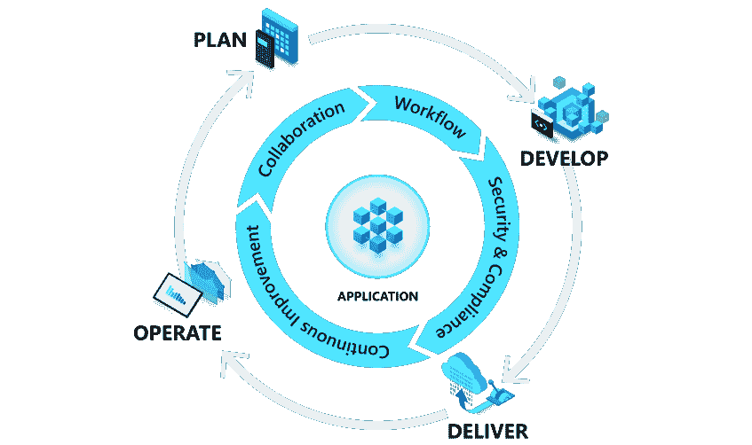

# 无所事事的成本—应用程序现代化

> 原文：<https://medium.com/version-1/the-cost-of-doing-nothing-application-modernisation-62e75413399c?source=collection_archive---------2----------------------->

软件开发人员 James Maguire 概述了不更新关键业务应用程序的风险。

在过去的 12 年里，我一直从事软件开发项目，当每个项目结束时，我会继续下一个项目，而不会经历应用程序生命周期中接下来会发生什么。我最近有了一些处理应用程序的经验，这些应用程序是 15 年前构建的，并且仍然提供关键的业务流程。

这让我思考:这是否表明最初的实施非常成功，并且允许应用程序保持不变并以较低的持续成本提供，或者这是否隐藏了成本，因为这些应用程序失去了与业务和新技术机会一起发展的机会？在我看来，是后者。

对于大多数企业来说，构建和维护应用程序资产的成本是一项相当大的任务。大多数企业从几个需要支持的业务流程开始其应用程序之旅，以优化其核心业务的运行。构建这个应用程序套件可能需要数年时间和相当大的预算。

一旦应用程序完成并支撑了业务，这些应用程序就需要由应用程序支持团队来维护。如果这些应用程序构建良好，并与业务保持一致，那么这可能是一个相对较小的操作。此时的诱惑是将应用程序视为完整的，并尽可能长时间地保持对它们的长期支持，而不进行任何现代化，直到某些业务事件导致这些应用程序需要替换。我现在将探索这种“无所事事的方法”与持续改进方法的无形成本。

让我们首先定义应用程序资产的哪些特征是重要的:

与业务流程保持一致

安全性

拥有成本

可用性

我们假设当应用程序构建完成时，如果构建正确，所有上述特征在发布时都将处于最佳或接近最佳的状态。现在让我们看看在这些领域无所作为的代价。

# 业务流程一致性

业务流程会随着时间的推移而发展，如果应用程序不能相应地进行调整，就会导致效率低下，因为业务需要与次优的流程进行交互。随着可用技术的进步，继续使用这些应用程序的开销会增加，这给企业带来了竞争劣势。在这方面无所作为是一种倒退，会影响你的业务效率。

# 安全性

应用程序的安全性也需要持续关注。底层操作系统需要修补，它们在某个时候也会寿终正寝。的版本。NET 或 Java 需要不断升级。这些事件可能会带来巨大的开销，除了符合安全最佳实践之外，对企业的价值很小。尽管这很重要，但是业务用户将看不到从工作中获得的业务价值，因此不愿意投资，从安全角度来看，这使得应用程序资产易受攻击。关于这种影响的更多信息可以从英国政府的国家网络安全小组这里找到。

# 拥有成本

稳定应用程序的初始维护成本很低，但随着时间的推移，随着技术资源的转移和知识的丢失，维护成本将会增加，从而使支持变得缓慢而富有挑战性。吸引合格人员来支持报废技术将成为问题。

# 可用性

随着时间的推移，任何应用程序界面都会变得过时，如果企业保留相同的人员，这可能不是问题，但随着新用户的加入，如果应用程序不符合现代设计原则，加入过程将变得更加复杂。

总之，IT 和业务运营的许多领域都可以感受到无所事事的成本。几年之内，每个特征都将退化，这将取决于环境如何影响这些应用程序所支持的业务流程。

# 持续发展/交付方法

上述风险可以通过持续开发应用程序资产来减轻。这允许应用程序随着业务发展，紧密地与业务流程保持一致，并利用最新的技术产品。按照云产品的发展速度，这将为业务优势提供机会，并且可以通过内部托管节省成本。

上图所示的来自[微软](https://azure.microsoft.com/en-us/solutions/devops/#tools)的持续发展模式将为重新构建解决方案提供机会，以利用云计算选项，如无服务器计算、无 SQL 数据库、人工智能工具和其他云服务。这些可以显著节约成本，这些机会是这种应用程序管理方法的真正价值。它允许您的应用程序支持业务，并为业务流程提供最大的价值和效率，而不是成为一个阻碍者。

作为持续开发方法的一部分，操作系统和平台的升级随着应用程序的发展而有机地发生，并与业务价值驱动的变化捆绑在一起。这些升级不再是由于产品生命周期结束或退役而需要发生的事件，这反过来会给业务带来变化，并且不会带来任何经济价值。

总之，持续发展方法在理论上看起来肯定成本更高，但“无所事事”的方法只是将成本推到未来，并在业务流程不再优化的情况下增加其他地方的成本。

改变的第一步是应用程序现代化。详见[https://www . version 1 . com/blog-app-modernization-business-benefits/](https://www.version1.com/blog-app-modernisation-business-benefits/)。