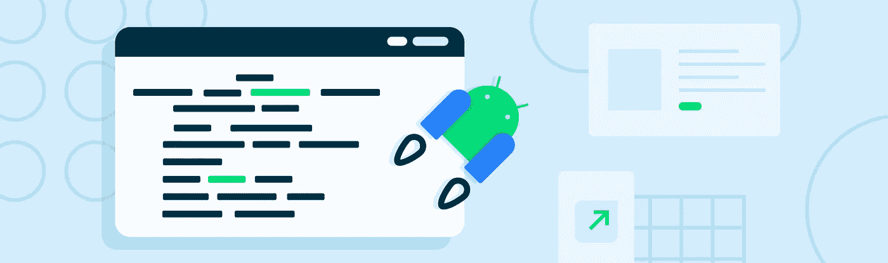
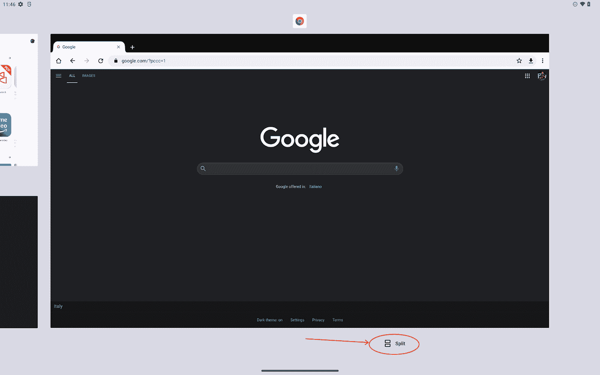
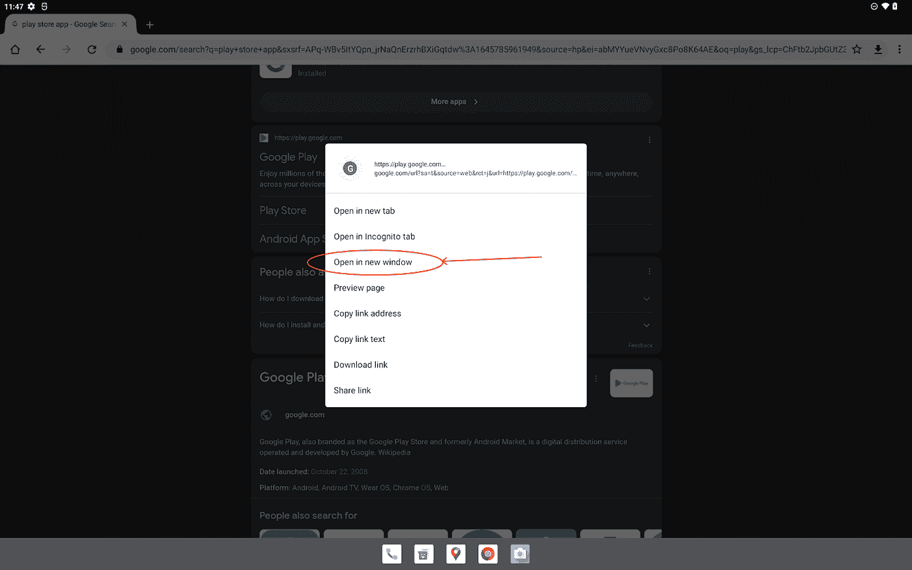
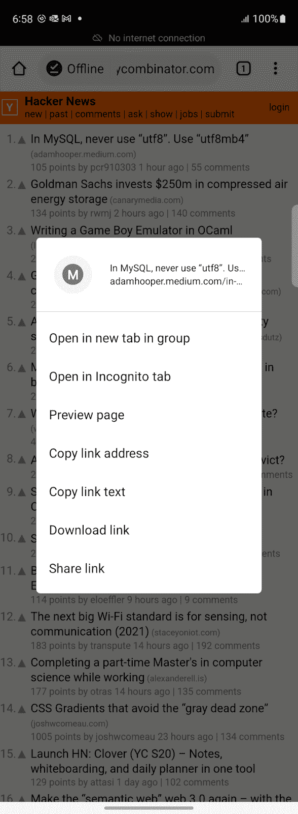
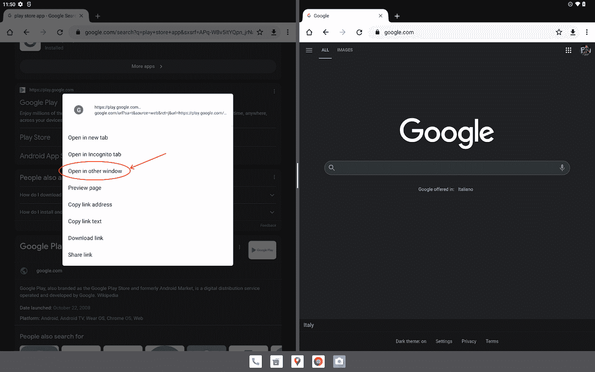

# 12L 中的 L

> 原文：<https://medium.com/androiddevelopers/the-curious-case-of-flag-activity-launch-adjacent-f1212f37a8e0?source=collection_archive---------4----------------------->

Illustration by Ocupop

12L 中的 L 代表大屏幕，这已经不是什么秘密了。

有很多运行 Android 应用程序的大屏幕设备，包括平板电脑和可折叠设备。然后，我们有更大的屏幕设备运行 Android 应用程序，即使它们的原生操作系统是其他东西，如 Chrome 操作系统。

12L 增加了新功能，以改善用户在大屏幕设备上的体验。其中一个改进是进入分屏多窗口模式(本文剩余部分中的分屏模式)的更简单的 UI:

*12L’s recents screen showing Split control*

> **注:**分屏模式是多窗口模式的特例。在分屏模式下，两个应用程序并排显示在屏幕上。参见[多窗口支持](https://developer.android.com/guide/topics/large-screens/multi-window-support)。

在本文中，我们将介绍一个特性，它可以让大屏幕用户更容易地构建多窗口体验。

如果您的应用程序需要通过一个意图打开一些其他内容，您可以使用`[FLAG_ACTIVITY_LAUNCH_ADJACENT](https://developer.android.com/reference/android/content/Intent#FLAG_ACTIVITY_LAUNCH_ADJACENT)`在一个新的相邻窗口中打开它。

这个标志是在 Android 7.0 中引入的，当设备已经处于分屏模式时，允许应用程序将意图指向相邻的窗口。

12L 的新功能是，标志现在允许应用程序进入分屏模式。

> **注意:**OEM 可以在旧的 Android 版本上启用 12L 行为。例如，三星在 Android 11+设备上启用了这一行为，微软在 Surface Duo 上也是如此。

如果设备的最小屏幕尺寸超过 600dp，您可以在 12L 上运行的最新版本的 Chrome 浏览器中看到这种行为。长按链接将显示一个上下文菜单，其中包含在新窗口中打开链接的选项:

*Chrome’s menu option to open link in a new window on screens larger than 600dp*

如果你在一个紧凑的屏幕上尝试同样的操作(由新的[窗口大小类别](https://developer.android.com/guide/topics/large-screens/support-different-screen-sizes#window_size_classes)定义)，选项不存在:

*Chrome’s menu option on screens smaller than 600dp*

如果您在设备已经处于分屏模式时打开上下文菜单，您将可以选择在另一个窗口中打开链接:

*Chrome’s menu option to open link in other window when already in split-screen mode*

# 给我看看代码

其核心是在启动第二个活动时使用`FLAG_ACTIVITY_LAUNCH_ADJACENT`:

我们还可以做的是，如果设备已经处于分屏模式(参见`[Activity#isInMultiWindowMode()](https://developer.android.com/reference/android/app/Activity#isInMultiWindowMode())`)或者如果设备有大屏幕，则添加`FLAG_ACTIVITY_LAUNCH_ADJACENT`:

我们可以使用来自 [Jetpack WindowManager](https://developer.android.com/jetpack/androidx/releases/window) 的`[WindowMetricsCalculator](https://developer.android.com/reference/androidx/window/layout/WindowMetricsCalculator)`来决定我们是否在 600dp 视口断点之上:

# 活动嵌入

`FLAG_ACTIVITY_LAUNCH_ADJACENT`非常适用于您只想打开一个新窗口来显示另一个应用程序或您自己的应用程序的另一个活动中的网页或其他内容的情况。这是一个火灾和遗忘的场景。

如果您需要对新活动的外观有更多的控制，或者您需要对应用程序中两个活动的集成有更多的控制，那么看看 [Activity embedding](https://developer.android.com/guide/topics/large-screens/activity-embedding) ，这是 Jetpack WindowManager 1.0 中的另一个实验性 API 提供的 12L 特性。

# 在你的应用中采用分屏模式

谷歌正在投入大量资源来改善大屏幕设备上的用户体验。Android 12L 功能的下降就是一个证明，用户正在采用这些允许更长时间和更复杂交互的设备。

现在是时候改善你的应用程序对分屏模式的支持了。