# 深度链接速成班，第 1 部分:深度链接介绍

> 原文：<https://medium.com/androiddevelopers/the-deep-links-crash-course-part-1-introduction-to-deep-links-2189e509e269?source=collection_archive---------0----------------------->

## “深度链接能做什么？”

欢迎来到我们的深度链接速成班。在 4 篇系列博文中，我们将向您介绍深层链接，向您展示如何创建和测试它们，为您提供故障排除提示，并了解深层链接如何帮助您的业务。

在本文中，我们看看什么是链接，介绍深层链接类型，并讨论一些安全问题。

如果你时间不够，想要一个快速总结，可以看看 YouTube 上的配套视频。

# 介绍

如果你以前没有遇到过深层链接，你肯定会有疑问，比如“我能用深层链接做什么？”、“深度链接是给谁的？”，“什么是链接？”，以及“什么是深度链接？”。

让我们从回答前两个问题开始:“我能用深层链接做什么？”以及“深层链接是给谁的？”我们可以一起回答这些问题:深度链接是让人们看到他们想看的内容。

如果人们不容易获得你的内容，他们可能会停止使用你的应用程序，并转向另一个应用程序。因此，在处理深层链接时，提供良好的用户体验至关重要。

现在你知道深层链接是干什么的了，让我们进入下一个问题，开始探索什么是链接。为了帮助解决这个问题，我们使用一个名为 Droidfood 的应用程序来展示深度链接代码的例子。Droidfood 是一款应用程序，用户可以在其中订购自己喜欢的食物。

所以…

# 什么是链接？

定义链接的方式有很多种。出于我们的目的，我们将使用这个:

*“链接是将我们带到某个地方的一系列字符。”*

例如，将人们带到 Droidfood 应用程序网站的位置部分的链接可能如下所示:

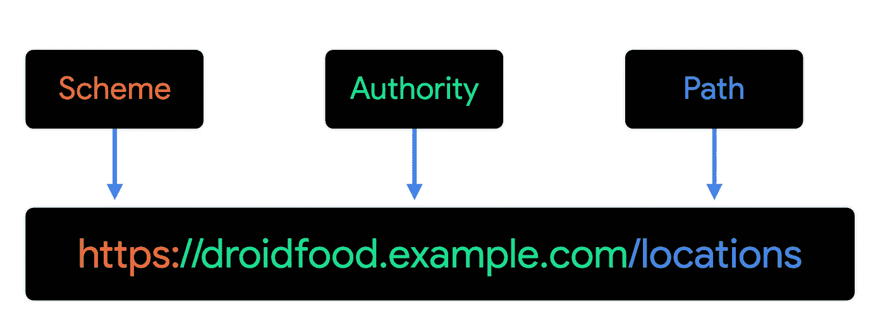

该链接由以下部分组成:

*   **方案**，在本例中是“https:”，它标识链接类型。这里，链接是安全超文本传输协议的一部分。
*   **权限**和主机名，在本例中是“droidfood.example.com”，它告诉我们链接要去的主要位置或域。它以分层形式表示，从顶级域到子域。
*   **路径**，在本例中为“/locations”；这是资源在机构或域中的位置。

# 什么是深度链接？

要回答这个问题，我们需要通过添加更多的细节来扩展我们之前的定义:

*“链接是将我们带到某个地方的一系列字符，它可以是一个* ***安卓应用*** *或互联网上的任何其他资源。”*

任何进入安卓应用的链接都可以是深度链接。

然而，有不同类型的深层链接。，每个深层链接类型都是另一种类型的特例，如下图所示:

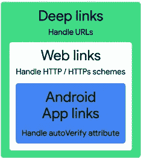

## **深度链接**

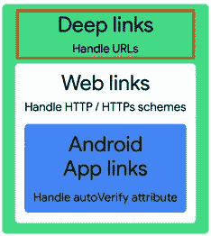

深层链接的创建有最少的具体规则。这里有两个来自 Droidfood 应用程序的深度链接示例。第一个将用户带到一个位置列表，第二个将用户带到附近的餐馆:

[https://droidfood.example.com/locations](https://droidfood.example.com/locations)

droid food://我的附近

创建这些深层链接之一的规则是:

*   **方案**可以是定义良好的方案——比如 https、mail 或 SMS——也可以是自定义的方案。
*   **机构**应该是一个域结构，这样很容易识别。
*   路径可以用来将参数传递给你的应用程序，并将用户发送到应用程序中的特定屏幕。

深度链接的定制方案可以帮助用户有效地到达你的应用内内容。然而，深度链接没有集中的所有权注册，所以任何应用程序都可以注册来处理特定的深度链接。当 Android 发现不止一个应用程序注册处理一个链接时，当用户跟随该深层链接时，消歧对话框就会出现。

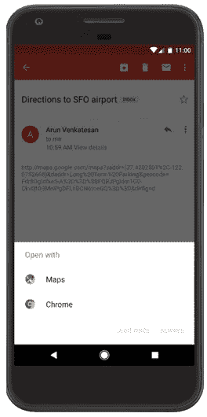

在 Android 12 之前，消除歧义对话框出现在以下情况:

*   你的应用程序定义了一个 Android 应用程序链接(我们稍后会查看这种类型的链接)，但该链接无法验证。
*   应用程序更新导致用户的“总是打开”请求被撤销。

有一些方案允许你在一个应用程序中使用 Android 的[意图](https://developer.android.com/guide/components/intents-common)之一开始一项活动。这些方案包括以下特点:

*   电话的“tel”
*   音乐或视频“文件”
*   电子邮件的“mailto”
*   地图的“地理”
*   用于信息传递的“sms”

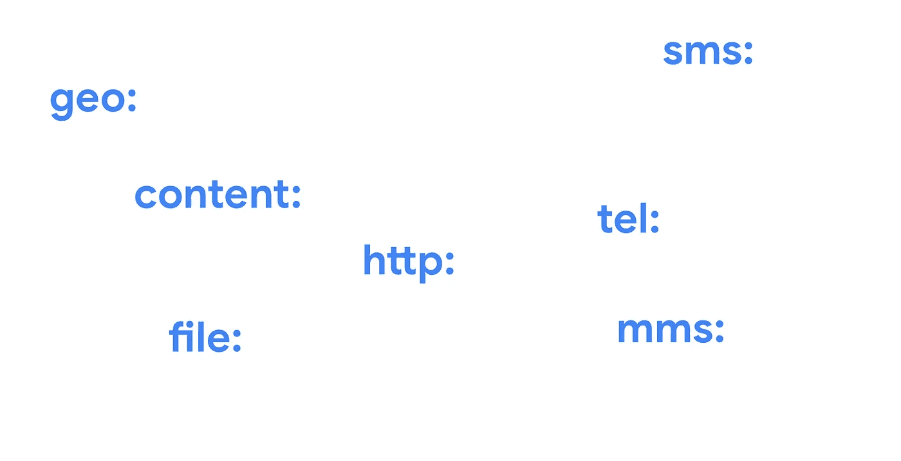

使用深层链接最常见的方式之一是帮助用户导航到某个活动。在 Droidfood 应用程序中，有 3 项活动:

*   位置活动
*   交付选项活动
*   关于我们的活动

所有这三项活动都以相同的方式工作，为了了解如何工作，让我们更仔细地看一下将人们带到位置活动。这里深层链接的例子工作得很好(除了可能出现的歧义消除对话框。)

当用户点击此链接时:

droid food://位置

他们被带进了定位活动。

导航是一个有趣的话题，对于深层链接非常有用。我们将在本系列后面的博客文章中讨论导航。你可能也喜欢看[导航:深层链接——疯狂技能](https://www.youtube.com/watch?v=XJgPIeolJu8)视频。本视频展示了如何使用 Jetpack 导航导航到深层链接。

## 网络链接

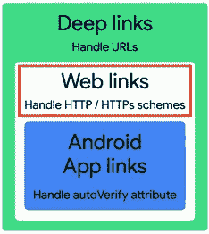

这些链接继承了深层链接的所有特征，尽管它们遵循更具体的语法规则。网络链接看起来也像互联网上的任何其他链接。这是 Droidfood 应用程序的一个例子:

[https://droidfood.example.com/about-us](https://droidfood.example.com/about-us)

这个链接把人们带到告诉他们更多关于 Droidfood 的使命和故事的页面。

为使系统正确处理 web 链接，必须对其进行如下配置:

*   **方案**组件**必须是** http 或 https。
*   **authority** 组件是您的 web 主机名，并且需要在互联网上可访问。
*   **路径**是可选的，取决于你如何配置你的网站。

从 Android 12 开始，所有网页链接都会在浏览器中打开，除非您的网站和 Android 应用程序之间已经配置了关联。这种关联是 Android 应用程序链接的基础。关于这一变化的更多细节可以在 [Android 12 行为变化文档](https://developer.android.com/about/versions/12/behavior-changes-all#web-intent-resolution)中找到。

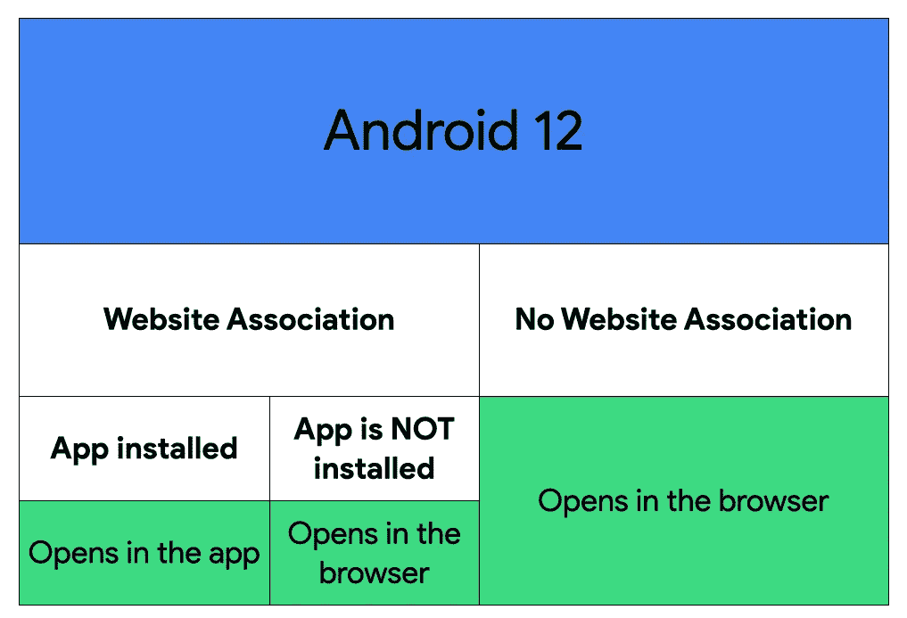

从 Android 12 开始，所有与你的 Android 应用无关的网页链接都在浏览器中打开。

如果 web 链接和 Android 应用程序之间存在关联，并且安装了该应用程序，则链接会在应用程序中打开。如果未安装应用程序，链接将在浏览器中打开。

在以前的 Android 版本中，如果网页链接有多个处理程序，如其他浏览器或应用程序，则可能会出现歧义消除对话框。

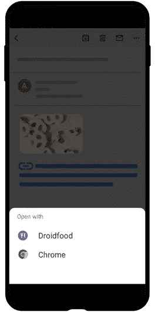

## **安卓应用链接**

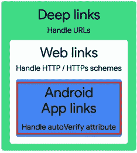

这是最专业的深度链接类型，有着最严格的规则。Android 应用链接是涉及更多配置步骤的网页链接。该过程验证链接的所有权。每次用户关注一个已经验证过的 Android 应用链接，总是会在你的应用中打开，不会出现消歧对话框。

因此，一旦通过验证，[https://droidfood.example.com/locations](https://droidfood.example.com/locations)总是会在 Droidfood 应用中打开，并列出餐馆的位置。

创建 Android 应用程序链接的规则是:

*   **方案，**与 web 链接一样，**必须是** http 或 https
*   **授权**和**路径**，类似于您为 web 链接提供的那些，必须反映您的 web 主机名，并且在互联网上是可到达的。

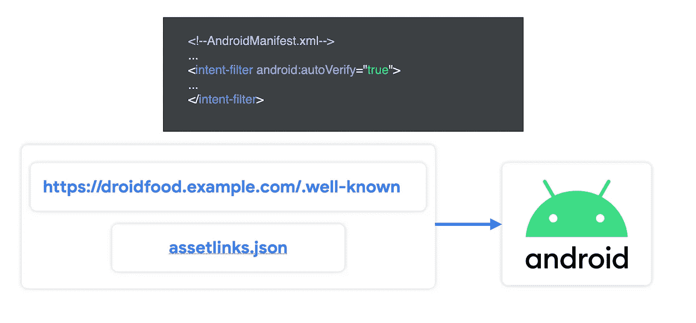

额外的配置需要以下细节:

*   **在你的应用的意图过滤器中，一个“自动验证”属性被设置为真**，这使得你的应用成为一种类型的链接的默认处理程序。
*   [**声明您网站上的页面与您的 Android 应用程序之间的关联**](https://developer.android.com/training/app-links/verify-android-applinks#web-assoc) 。它采用名为“assetlinks.json”的 JSON 文件的形式，必须通过。众所周知”的目录下，您的网站的根目录。

此外，值得注意的是，你必须确保你的网站响应链接，以便没有你的应用程序的用户最终在正确的页面上。

那么，与其他类型的链接相比，你为什么想要使用 Android 应用程序链接呢？让我们探索一下它们有用的几种情况。

## 链接共享

假设你想邀请一个朋友吃午饭，他们对你选择的餐馆的菜单很好奇。实现了 Android 应用链接后，您就可以共享 Droidfood 链接了。如果你的朋友安装了应用程序，链接会带他们到应用程序中的菜单；否则，他们会被带到 Droidfood 网站。

这是所有 Android 应用程序链接的常见场景，提供了最佳的用户体验。

## 路径参数解析

Droidfood 希望分享一个优惠券代码，享受晚餐外卖菜单 15%的折扣。(真划算！)在这种情况下，Droidfood 与其客户共享一个链接，以便该应用程序在结账时自动应用优惠券。

这个链接可能是这样的形式

【https://droidfood.example.com/delivery?code=15off 

在深层链接中，查询是可选的，这是包含查询的一个很好的用例。用户每次点击链接，都会被重定向到 Droidfood 应用。Droidfood 的逻辑接收代码参数，并可以应用它来结帐。这是包含查询的一个很好的用例。

# 一些安全注意事项

## Android 应用程序链接验证

在 Android 12 之前，如果你有一个链接验证失败，你所有的链接都会出现消歧对话框。这意味着其他应用程序可以将这些链接添加到它们的清单中，从而使您的用户面临风险。

例如，假设[https://droidfood.example.com](https://droidfood.example.com)没有被验证。然后，恶意应用程序可以将此链接添加到清单中，用户可以在消除歧义对话框中看到这两个应用程序。

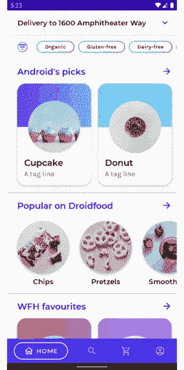

为了降低风险，请验证您的所有网页链接。参见[验证 Android 应用链接](https://developer.android.com/training/app-links/verify-android-applinks)了解更多关于如何验证您的链接的信息。

# 高度机密信息

生成包含敏感信息的链接时要小心。如果您需要在 URL 中包含敏感信息，请考虑使用服务器生成的不透明令牌，当不再需要这些令牌时，它们会失效。举个例子，

[https://droidfood.example.com/login?token = tdsze 6 rk 1 wfpvdtcqkgba](https://droidfood.example.com/login?token=tDsZE6rk1cwFPVDTCqkGbA)

# 链接拦截

用户可以在他们的设备上改变链接处理行为，这意味着链接可以被其他应用程序或浏览器拦截。人们也可以在任何地方复制和粘贴链接，设计你的深层链接。您想要在 Android 应用程序中打开的链接可能仍然会在浏览器或用户选择的其他应用程序中打开。

# 有副作用的动作

链接是帮助用户完成一个动作的好方法，但是你需要确保用户不会被骗去执行一个意想不到的动作。例如，你可以创建一个“添加小费”的链接，在你的应用程序中打开小费屏幕，但在用户在应用程序中确认小费之前，应用程序不应提交付款。

# 下一步是什么

希望你现在已经了解了深层链接，它们是什么，它们的用途，以及如何将它们包含在你的应用程序中，

在下一篇文章中，我们将进一步研究如何实现深层链接。第三部分讨论深层链接的常见问题以及如何修复它们。然后，在最后一篇文章中，我们看看深度链接如何帮助你的企业进行用户转化。

*   **第一部分:你能用深层链接做什么？**
*   **第二部:** [从零到英雄的深度链接](/androiddevelopers/the-deep-links-crash-course-part2-deep-links-from-zero-to-hero-37f94cc8fb88)
*   **第 3 部分:** [深层链接故障排除](/androiddevelopers/deep-links-crash-course-part-3-troubleshooting-your-deep-links-61329fecb93)
*   **第四部分:** *为您的业务提供深层链接* *(即将推出)*

快乐链接