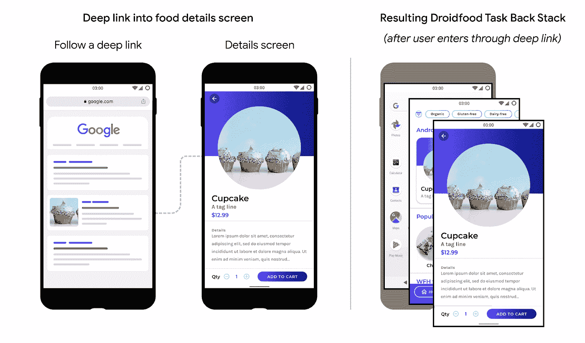

# 深层链接速成班，第 2 部分:从零到英雄的深层链接

> 原文：<https://medium.com/androiddevelopers/the-deep-links-crash-course-part2-deep-links-from-zero-to-hero-37f94cc8fb88?source=collection_archive---------0----------------------->

由 [@SKateryna](https://twitter.com/skateryna) 和 [Sabs](https://medium.com/u/e749f9d57dd8?source=post_page-----37f94cc8fb88--------------------------------)


# 介绍

当你想让用户更容易进入你的应用程序中的特定部分时，比如显示订阅优惠，要求用户更新个人资料，或者在购物应用程序中显示用户的购物车，你可以使用**深层链接**！

用户可以在应用内外点击这些链接，访问应用内的特定内容。它们可以在网页、快捷方式、通知中使用，也可以在应用程序的模块之间使用。

在本帖中，我们将仔细看看不同类型的深层链接。我们将讨论如何设置、测试它们，并围绕它们构建最佳用户体验。关于深层链接的更多信息，请查看本系列的第 1 部分。


您可以在 Android 应用程序中创建不同类型的深度链接:标准深度链接、网页链接和 Android 应用程序链接。图 1 显示了这些链接类型之间的关系:


**Figure 1.** Capabilities of deep links, web links, and Android App Links.

所有形式的深层链接都是 URIs，将用户直接带到应用程序中的特定内容。

*   [Web 链接](https://developer.android.com/training/app-links#web-links)是使用 HTTP 和 HTTPS 方案的深层链接。
*   **安卓应用链接**是经过验证仅属于你的应用的网页链接。

URIs 举了一些例子:

*   “example://droid . food . app”——带有“example”自定义方案的 URI。
*   ”[https://www.example.com/food](http://www.example.com/food)”—URI 与 HTTPS 的方案。

# 实现深层链接

当用户点击一个链接或一个应用程序以编程方式调用 URI 意图时，Android 会试图找到一个可以解析该链接的处理程序应用程序。


要确保您的应用程序可以成为处理程序，请执行以下 3 个步骤:

**第一步:** [**为进入的链接添加意图过滤器**](https://developer.android.com/training/app-links/deep-linking#adding-filters)

将[意图过滤器](https://developer.android.com/guide/components/intents-filters)添加到您的清单文件中，并将用户引导到您的应用程序中的正确位置，如以下代码片段所示:

Android intent filter

在本例中，我们添加了一个意图过滤器，将用户导航到 LocationsActivity。

让我们探讨一下这种意图的元素和属性值:

[**<动作>**](https://developer.android.com/guide/topics/manifest/action-element)

指定[动作 _ 视图](https://developer.android.com/reference/android/content/Intent#ACTION_VIEW)意图动作，以便可以从谷歌搜索中到达意图过滤器。

[**<类别>**](https://developer.android.com/guide/topics/manifest/category-element)

包括[可浏览的](https://developer.android.com/reference/android/content/Intent#CATEGORY_BROWSABLE)类别。这是从 web 浏览器访问意图过滤器所必需的。没有它，用户无法从浏览器中显示的深层链接打开你的应用程序。

还包括[默认的](https://developer.android.com/reference/android/content/Intent#CATEGORY_DEFAULT)类别。这允许你的应用程序响应隐含的意图。没有这个，只有意向指定你的 app，活动才能开始。

[**<数据>**](https://developer.android.com/guide/topics/manifest/data-element)

可以添加一个或多个<data>标签，每个标签代表一个解析到活动的 URI 格式。 [<数据>](https://developer.android.com/guide/topics/manifest/data-element) 标签必须包含 [android:scheme](https://developer.android.com/guide/topics/manifest/data-element#scheme) 属性。</data>

一旦你为你的应用清单文件添加了一个或多个带有 URIs 的意图过滤器，Android 就能够获取任何具有匹配 URIs 的[意图](https://developer.android.com/reference/android/content/Intent)，并在运行时将该意图路由到你的应用。要了解更多关于定义意图过滤器及其属性的信息，请查看[为传入链接添加意图过滤器](https://developer.android.com/training/app-links/deep-linking#adding-filters)。

**第二步:** [**从传入意向**](https://developer.android.com/training/app-links/deep-linking#handling-intents) 中读取数据

一旦 Android 系统通过意图过滤器开始你的活动，你可以使用由[意图](https://developer.android.com/reference/android/content/Intent)提供的数据来确定你需要呈现什么。以下代码片段显示了如何从意图中检索数据:

Read data from an intent

您还应该在创建活动后处理新的意图。如果用户想在活动被销毁之前打开一个链接，你可以用活动方法 [onNewIntent()](https://developer.android.com/reference/android/app/Activity#onNewIntent(android.content.Intent)) 获得一个新的意图。

Handling new intents

**第三步:** [**测试你的深层链接**](https://developer.android.com/training/app-links/deep-linking#testing-filters)

您可以使用 [Android 调试桥](https://developer.android.com/tools/help/adb)来测试深度链接解析到正确的应用程序活动。用 adb 测试意图过滤器 URI 的一般语法是:

```
$ adb shell am start 
      -W -a android.intent.action.VIEW 
      -d <URI> <PACKAGE>
```

例如，下面的命令尝试查看一个应用程序，其 package = "food.example.com "与 URI = "example://food "相关联:

```
$ adb shell am start
      -W -a android.intent.action.VIEW
      -d “example://food” food.example.com
```

对于隐式意图，可以跳过包名，但是对于显式意图，应该提供包名。有关命令选项的更多信息，请查看[呼叫活动管理器(am)](https://developer.android.com/studio/command-line/adb#am) 文档。

上面设置的清单声明和意图处理程序定义了应用程序和深层链接之间的连接。现在，让我们探索使用 HTTP 和 HTTPS 方案的链接，以及如何确保系统将您的应用程序视为默认处理程序。

# 网络链接

Web 链接是使用 HTTP 和 HTTPS 方案的深层链接。除了您的意图过滤器包括“http”或“https”方案之外，它们以相同的方式实现。

如果你拥有一个网络链接(拥有域名并有相应的网页)，那么就按照下面的说明进行 Android 应用链接。

如果你没有网络链接，而你的应用程序的主要功能可能是作为第三方打开链接，那么向用户解释这一点，并按照说明如何[请求用户将你的应用程序与一个域关联起来](https://developer.android.com/training/app-links/verify-site-associations#request-user-associate-app-with-domain)。在请求域批准之前，请为用户提供一些上下文。例如，你可以向他们展示一个屏幕，向用户解释为什么你的应用程序应该是特定域的默认处理程序。

# Android 应用链接

Android 应用程序链接是经过验证仅属于您的应用程序的网页链接。**当用户点击一个经过验证的 Android 应用链接时，你安装的应用会立即打开。不会出现消除歧义对话框。**

如果没有安装该应用程序，并且用户没有将另一个应用程序设置为默认处理程序，则您的链接将在浏览器中打开。

**安卓 App 链接实现**

要设置 Android 应用链接，除了上面的步骤 1、2、3 之外，你还需要做几个额外的步骤:

**第四步:** [**将“自动验证”属性添加到意图过滤器**](https://developer.android.com/training/app-links/verify-site-associations#add-intent-filters)

要允许系统验证 Android 应用链接是否与您的应用相关联，请添加符合以下格式的意图过滤器:

Add the autoVerify attribute for Android App Links

**第五步:** [**声明你的 app 与网站的关联**](https://developer.android.com/training/app-links/verify-site-associations#web-assoc)

通过在以下位置托管数字资产链接 JSON 文件，声明您的网站和您的意图过滤器之间的关联:

[https://food.example.com/.well-known/assetlinks.json](https://food.example.com/.well-known/assetlinks.json)

必须在您的网站上发布一个[数字资产链接](https://developers.google.com/digital-asset-links/v1/getting-started) JSON 文件，以表明与网站相关联的 Android 应用程序，并验证应用程序的 URL 意图。

以下示例 assetlinks.json 文件授予 droidfood.example.com Android 应用程序链接打开权限:

assetlinks.json file for the Droidfood app

验证您的签名是否正确，是否与用于签署您的应用的签名相匹配:

*   assetlinks.json 中有发布签名，也可以添加调试签名用于测试。
*   签名应该是大写的。
*   如果你使用的是 [Play 应用签名](https://support.google.com/googleplay/android-developer/answer/9842756)，确保你使用的是谷歌为你的每一个版本签名的签名。

您可以通过遵循关于[声明网站关联](https://developer.android.com/training/app-links/verify-site-associations#web-assoc)的说明来验证这些细节，包括一个完整的 JSON 片段。

**第六步:验证安卓应用链接**

确认要与您的应用程序关联的网站列表，并确认托管的 JSON 文件有效后，在您的设备上安装应用程序。等待至少 20 秒钟，让异步验证过程完成。使用以下命令检查系统是否验证了您的应用程序并设置了正确的链接处理策略:

```
$ adb shell am start
      -a android.intent.action.VIEW
      -c android.intent.category.BROWSABLE
      -d “https://food.example.com"
```

**注**:

从 Android 12 开始，你可以[手动调用安装在设备上的应用程序的域验证](https://developer.android.com/training/app-links/verify-site-associations#manual-verification)。无论应用的目标 SDK 版本如何，您都可以执行此过程。

如果有些东西不工作，请遵循这些关于如何修复 Android 应用程序链接的[常见实现错误的说明。也可以看看“深度链接视频系列速成班——第 3 部分:深度链接的挑战”](https://developer.android.com/training/app-links/verify-site-associations#fix-errors)

**导航最佳实践**

遵循这些最佳实践来改善用户体验:

*   深层链接应该直接把用户带到内容，没有任何提示，间隙页，或登录。确保用户可以看到应用程序内容，即使他们以前从未打开过该应用程序。在随后的交互中，例如当他们从 Android 应用程序启动器打开应用程序时，可以提示用户跳过一些步骤来获得深层链接内容。


*   遵循[带后退和向上导航](https://developer.android.com/guide/navigation/navigation-principles)中描述的设计指南，以便用户通过深度链接进入你的应用后，你的应用符合用户对[后退导航的期望。](https://developer.android.com/guide/navigation/navigation-principles#deep-link)

让我们看看 Droidfood 应用程序中打开食品详情屏幕的深度链接的例子。



**图 2。**使用深层链接替换 Droidfood 应用程序的现有后台堆栈。

在这个例子中，用户跟随打开“纸杯蛋糕细节”屏幕的深层链接。当用户点击返回时，应用程序显示“Droidfood landing”屏幕，而不是退出。该应用程序显示这个屏幕是因为，从“Droidfood landing”屏幕，用户可以导航回“Cupcake details”。这种导航帮助用户知道将来如何在应用中找到深层链接内容，而无需再次搜索深层链接。

如果你使用的是 Android Jetpack 的导航组件，请查看[为目的地指南](https://developer.android.com/guide/navigation/navigation-deep-link)创建深层链接。

**总结**

在这篇博文中，你已经学习了如何实现不同类型的深度链接。我们建议使用 Android 应用程序链接，这有助于避免歧义对话框，同时在用户没有安装您的应用程序时无缝工作。关于深层链接的更多细节，请查看指南[了解不同类型的链接](https://developer.android.com/training/app-links#understand-different-types-links)。

*   **Part 1:** [深度链接可以做什么？](/androiddevelopers/the-deep-links-crash-course-part-1-introduction-to-deep-links-2189e509e269)
*   ***第二部分:*** *从零到英雄的深度链接*
*   **第三部分:** [克服挑战创建安卓应用链接](/androiddevelopers/deep-links-crash-course-part-3-troubleshooting-your-deep-links-61329fecb93)
*   **第 4 部分:**为您的业务提供深层链接

让我们开始联系吧！