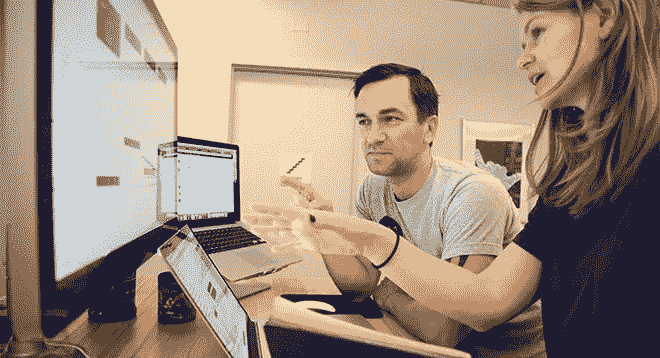
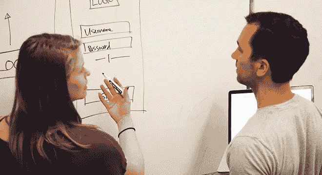

# 动态组合:开发者+设计师

> 原文：<https://medium.com/capital-one-tech/the-dynamic-duo-developer-designer-cbd495dd393f?source=collection_archive---------4----------------------->

来认识一下 Jesse Majcher 和 Amanda Legge，他们是旧金山 Capital One 的开发/设计团队。Jesse 和 Amanda [在 SXSW 上谈到了开发人员和设计师之间全力合作的 Capital One 文化](https://www.youtube.com/watch?v=ed4TqQlIDw0&feature=youtu.be)如何影响他们的工作。随着这种专业互动的增长，开发人员和设计人员之间的合作实际上正在帮助他们建立更好的用户体验。

为了弄清楚为什么会这样，我们和他们坐下来进行了一次简短的采访，了解他们的观点。

## Jesse，作为一名开发人员，你在职业生涯中与许多设计师合作过。与设计师的合作流程通常是怎样的？

**杰西(“J”)，开发者:**在 Capital One 之前，我习惯的基本上是不合作。这是一种静态的关系，设计师们各自为政；他们只是从一位经理那里得到了一套指导方针。我会通过电子邮件接收他们的资产，并附带一个 zip 文件。没有风格指南，不知道对象之间的距离。重要的细节都由我来决定，比如那些与设计相关的规格。

## Jesse，Capital One 的开发者和设计师之间的合作有什么不同？

> 这是一种共生关系:非常吸引人，面对面的。我们一起工作，不断充实想法。这不是一条戒律，也不是“这是我想看的。”我们一起想办法。我们不只是齿轮中的一个齿轮。这里的设计师非常乐于听取(开发者的)意见。实际上，我对应用程序的设计有发言权，最终结果是为客户提供更具吸引力的体验。

## 阿曼达，在你最近在 SXSW 的炉边聊天会上，你谈到了在 Capital One 参加一个名为“代码之路”的训练营课程说说 CodePath 类和你在里面设计的 app 吧。

**阿曼达(“A”)，设计师:**
CodePath 是为期六周的 iOS 设计师训练营。我基本上没有生活，(笑)但这完全值得。在过去的两周里，我们被分成几个小组，设计了自己的应用程序。我的小组是一个三人小组，我们想做一个应用程序来回报 Capital One 让我们上这门课，因为这是一次改变人生的经历。所以我们开发了一个名为 Munch 的应用程序，它可以让设计师们在 Capital One 和其他设计师一起吃午餐。你摇摇手机，它说，“你已经与这个设计师匹配，”然后你们一起去吃午饭。事实上，我们最终使用了为 Capital One 制作的面向消费者的应用程序中的一个动画。

## Jesse，你如何看待一个设计师在为期六周的 iOS 训练营后创建一个应用程序？

我认为这是惊人的。你很受鼓舞，你看到他们会说你的语言。我可以以工程师的身份说话，他们明白我在说什么。我可以非常具体地说明某些框架。(停顿)我知道有些人可能会受到威胁。一些工程师可能觉得编码员编码，设计师设计，但是你知道，这为公司节省了时间，也节省了开发人员的时间。[阿曼达]制作了一个动画原型，我真的用了它。它给了我更好的方向，而不仅仅是一个设计草图。我认为更多的设计师应该在他们设计的平台上工作，去感受它。

## 阿曼达，这是如何改善你们两个的合作方式的？

**答:**嗯，我交给杰西的 Xcode 中的动画原型只适用于 iPhone 6。一个真正的 iOS 开发者会使用通用的自适应布局，但我在课堂上没有学到这一点。所以杰西和我一起绕回来了，我们坐了下来。这个过程很棒，因为即使我已经不在 CodePath 班了，我仍然在学习。杰西和其他开发人员每天都在教我。

## 阿曼达，关于设计你都教了杰西些什么？

**答:**上个月，我为开发人员开设了一个如何使用 Sketch 的教程，这样他们就可以弄清楚页边距、字体大小和类型、分组和阴影。事实上，今天下午我正在为团队中的所有开发人员做一个更高级的草图教程，在那里我将会讲解一些具体的技术。

J: (插话)我们能够直接进入这个应用程序，这是我们大多数开发人员都没有的经验。她花了一两个小时让我们马上开始运作。我们能够理解元素在哪里排列——靠我们自己——而不是来回跑着问问题。我们对它的简单程度感到惊讶。

## 在这种合作中，“思想开放”有多重要？你必须接受什么样的事情？

答:我认为思想开放是最重要的。我没有所有的答案。因此，当开发人员带着建议来找我时，我必须对做新东西持开放态度。这是关于总是分享和发现新事物，即使它与项目无关。我们试着抱着一切皆有可能的态度。

我认为当设计师在他们的开发环境中工作时，工程师可以有一种“离开我的草坪”的方法。对批评超级开放很重要，你必须对知识分享开放。这对我来说是件大事。这是一个迭代平台。我们试图为客户创造最佳的用户体验。

## Jesse，这次合作对用户体验有什么影响？

**J:** 我们有能力迭代并找到我们正在失去与客户互动的瓶颈。我们不只是确定某样东西，并假设它对客户来说是最好的想法。我们实际的交流产生了这些新的想法。例如，如果没有这种协作，我们就不会为最近项目的应用程序中的某些流提出不同的原型。

## 你会给那些想从他们的开发/设计团队中获得最佳成果的经理们什么建议？

**答:**开发人员应该尽早参与进来。我认为很多团队错过了，因为他们认为开发人员没有输入，或者因为设计已经完成而太迟了。杰西和我从一开始就谈论事情。

**J:** 告诉设计师不要害怕在我们的环境中制作原型，并参与实际的工程讨论。它创造了一种完全不同的欣赏方式。应该鼓励设计师们以这样的方式进行实验。

很明显，开发人员和设计人员之间的共生关系可以创造更好的客户体验，但不仅仅如此。结果是一个开发人员/设计人员团队知道如何使用彼此的语言，预测彼此的需求，并互相反馈有见地的想法。两个脑袋肯定比一个脑袋好，这个充满活力的二人组创造的每个产品都证明了这一点。

*欲了解更多关于 Capital One 的 API、开源、社区活动和开发人员文化的信息，请访问我们的一站式开发人员门户网站 DevExchange。*[*https://developer.capitalone.com/*](https://developer.capitalone.com/)