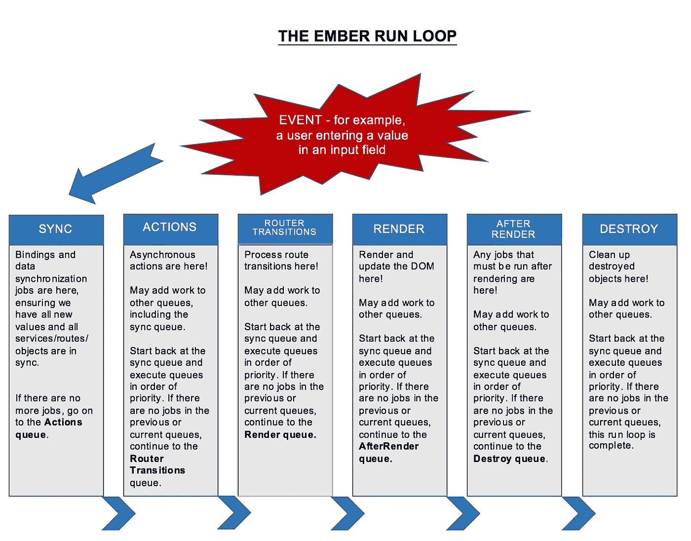
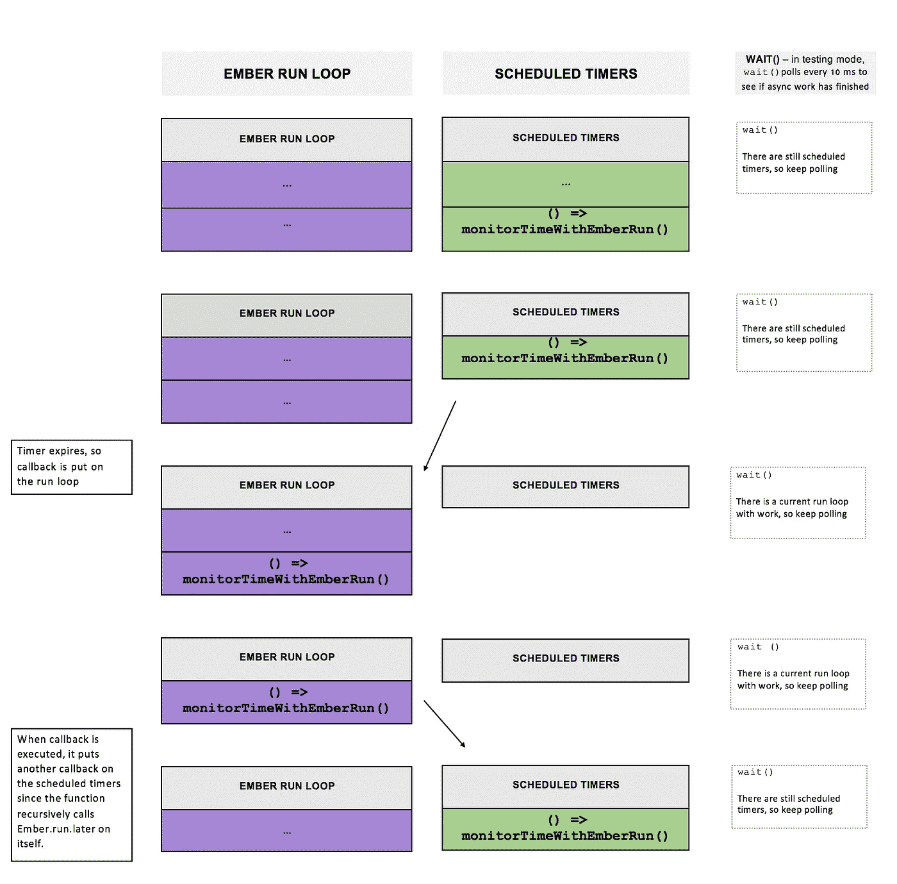

# Ember 运行循环和异步测试

> 原文：<https://medium.com/square-corner-blog/the-ember-run-loop-and-asynchronous-testing-c03326181623?source=collection_archive---------1----------------------->

## 你不能逃离跑步圈

> 注意，我们已经行动了！如果您想继续了解 Square 的最新技术内容，请访问我们的新家[https://developer.squareup.com/blog](https://developer.squareup.com/blog)

今年夏天，我在 Square Seller Dashboard 团队实习，该团队开发一个 web 应用程序，Square 的商家用它来做各种事情，从检查销售情况到管理他们的工资单，再到注册加入 Square Capital 。在某种背景下，我是芝加哥大学一名即将毕业的学生，在今年夏天之前，我从未做过 web 应用程序。


Image: A screenshot of the Square Seller Dashboard

Dashboard 是用 [Ember](https://www.emberjs.com/) 构建的——一个用于单页面 web 应用程序的开源 web 框架。在专注于如此大型应用的团队中工作意味着我可以深入了解 Ember——整个夏天我一直注意到的一件事是 Ember 处理异步工作的特殊、强大、有时令人困惑的方式。

# 我的项目

我参与的一个项目是在商家因不活动而被注销之前显示警告。

这需要在应用程序的整个生命周期中监控不同的状态，并相应地呈现组件。我使用了 Ember 服务，它允许我根据每 250 毫秒执行一次的代码来设置应用程序的全局状态。去掉 API 调用和一些复杂的服务，代码看起来像这样:

```
import Ember from 'ember';export default Ember.Component.extend({
  millisecondsElapsed: 0, didInsertElement(...args) {
    this._super(...args);
    this.set('initialTime', Date.now());
    Ember.run.later(() => this.monitorTimeWithEmberRun(), 250);;
  },

  monitorTimeWithEmberRun() {
    const dateNow = Date.now();
    // component renders the millisecondsElapsed
    this.set('millisecondsElapsed', dateNow - 
                                   this.get('initialTime')) 
   Ember.run.later(() => this.monitorTimeWithEmberRun(), 250);
  },
});
```

在开发中，它工作得很好。但是当我运行验收测试时，它们会挂起，然后超时，抛出一堆不可预测的错误。通过运行本 [EmberTwiddle](https://ember-twiddle.com/70ad399096b0b3488637824a10a6435d?openFiles=tests.acceptance.my-acceptance-test.js%2C) 中的测试，您可以看到这一点。

即使这应该是项目的简单部分，我也无法完成一个验收测试，更不用说通过了。原来，我的测试失败的原因是因为我使用了`Ember.run.later,`的方式，它应该在给定的毫秒后运行回调函数。找到问题的解决方案揭示了 Ember Run 循环有多棒，以及它与异步测试的交互方式。


Gif: Actress Meryl Streep waving her hand, with the text “Whoa, whoa, whoa, whoa..” ([Source](https://media.giphy.com/media/CURF5iPO5uY4U/giphy.gif))

# 等等，退后。什么是余烬运行循环？

在 Ember 世界中工作几乎不可能不提到运行循环，尽管[文档表明](https://guides.emberjs.com/v2.14.0/applications/run-loop/)许多开发人员不会直接处理它

> “在大多数 Ember 应用程序中，直接使用[Ember Run]API 并不常见，”

无论您是否直接使用 Ember Run API，Run 循环都是 Ember 应用程序的基础，并且通常是找出奇怪错误和意外副作用的核心。

一般来说，运行循环有效地组织和调度与事件相关的工作。由用户事件(即`mouseDown`、`keyPress,`等)触发的工作通常是异步的。在所有的副作用执行之前，Ember 可以做其他的工作。Ember Run 循环调度这些副作用并组织任何异步工作。这听起来很棒，但需要更多的上下文。

有点用词不当，Ember run 循环并不是真正的循环——也不一定只有一个。相反，一个运行“循环”有六个不同的队列来组织由事件触发的工作。所以，Run Loop(大写)更多的是一个概念，一个 app 会有多个 Run Loop 同时运行。

[文档](https://guides.emberjs.com/v2.14.0/applications/run-loop/)列出了队列的优先顺序:

```
Ember.run.queues
// => [“sync”, “actions”, “routerTransitions”, “render”, “afterRender”, “destroy”]
```

[文档](https://guides.emberjs.com/v2.14.0/applications/run-loop/)也给出了每个队列的简短说明

> **同步队列**包含绑定同步作业
> 
> **动作队列**是通用工作队列，通常包含预定任务，如承诺
> 
> **routerTransitions** **队列**包含路由器中的转换作业
> 
> **渲染队列**包含用于渲染的任务，这些任务通常会更新 DOM
> 
> **afterRender 队列**包含所有先前计划的渲染任务完成后要运行的作业。这对于第三方 DOM 操作库来说通常是好的，只有在更新了整个 DOM 树之后才能运行
> 
> 销毁队列包含完成其他作业计划销毁的对象的拆卸的作业

我对作业调度“算法”的简短解释是，Run 循环基于队列首先执行优先级最高的作业。这些作业可能会将工作添加到其他队列中，运行循环将返回到优先级最高的作业，直到所有作业都完成。

我真的很喜欢凯瑟琳·托恩沃尔对余烬运行循环的解释！它对每个队列都有精彩的深入解释，我使用了她的一些描述和例子来帮助说明这个运行循环。



Flowchart: The Ember Run Loop, Illustrated. [Link to plaintext version of chart.](https://gist.githubusercontent.com/arieljackson/295a09a02678d2c8502f04fc57dfa9bc/raw/ffd704668f7037bbdd494461a4d2b8163017cffe/ember_run_loop_flowchart.txt)

每个队列的内部细节很有趣，但最重要的细节是事件触发了一个运行循环，并可能将各种异步工作放到不同的队列中。例如，`mouseDown`事件可以启动一个运行循环，与之相关的其他工作将被放在适当的队列中。Ember 确保与数据同步相关的工作发生在任何渲染之前。如果数据同步发生在呈现之后，它可能会更改绑定到该数据的模板的呈现。那么，将需要更昂贵的重新渲染！

对于交互式演示，查看 Machty 的[运行循环可视化](https://machty.s3.amazonaws.com/ember-run-loop-visual/index.html)或 Ember 文档中的[简单示例。](https://guides.emberjs.com/v2.14.0/applications/run-loop/#toc_an-example-of-the-internals)

**Ember.run.later**

我的服务利用运行循环的方式是`Ember.run.later`众多 Ember.run API 中的一个。

> **Ember.run.later() :** 在指定的时间段后调用传递的目标/方法和可选参数。此方法的最后一个参数必须始终是毫秒数。
> 
> 每当您需要在一段时间后运行某个操作时，都应该使用此方法，而不是使用 setTimeout()。这种方法将确保在同一个脚本执行周期中到期的项目都一起执行，这通常比使用真正的 setTimeout 更有效。

`Ember.run.later`确实比`setTimeout`或其他替代计时器有优势——它生活在“余烬世界”，所以它可以利用所有运行循环提供的优势(效率、组织)。`Ember.run.later` 也尊重 Ember 内部的定时器队列(正常的 javascript 定时器就不能说[)。](https://johnresig.com/blog/how-javascript-timers-work/)

如果我们回头看看我的组件，我们会看到我在其中一个方法中递归地调用了`Ember.run.later`:

```
...
monitorTimeWithEmberRun() {
   const dateNow = Date.now();
   // component renders the millisecondsElapsed
   this.set('millisecondsElapsed', dateNow - 
                                   this.get('initialTime')) 
  Ember.run.later(() => this.monitorTimeWithEmberRun(), 250);
  },
...
```

最终，正如我后来发现的，正是这些对`Ember.run.later` 的递归调用导致了测试超时。

# 那为什么我的测试被搁置了？


Gif: A monkey puppet looking wide-eyed and confused ([Source](https://media.giphy.com/media/KrLqtbe8PGEDe/giphy.gif))

我有预感是`Ember.run.later`导致了我的问题，因为用`setTimeout`替换它阻止了测试挂起(稍后会有更多关于它的缺点)。当我在周围搜索[时，我意识到我的测试失败的原因与 Ember.run.later 令人敬畏的原因相同——因为总是有工作安排在未来的运行循环中。](https://discuss.emberjs.com/t/proper-way-to-handler-timers-w-ember-testing/4693)

我怎么知道的？一开始我不确定是什么问题，所以在四处搜索了一番后，我查看了源代码。[在源代码](https://github.com/emberjs/ember.js/blob/9654d2a5c8588dff5edb553d53873bbc11831ba4/packages/ember-testing/lib/helpers/wait.js#L52)中，我们可以看到`wait()`测试助手检查以确保所有的运行循环都已完成，并且没有排队的计时器。


Image: Screenshot of source code where wait() checks for run loops or scheduled timers. ([Source](https://github.com/emberjs/ember.js/blob/9654d2a5c8588dff5edb553d53873bbc11831ba4/packages/ember-testing/lib/helpers/wait.js#L52))

但是为什么呢？最初，它似乎不方便。事实证明，Ember 测试希望确保所有异步工作在完成之前完成。在内部，这意味着[Ember](https://www.emberjs.com/api/ember/2.14/classes/Ember.Test/methods/wait?anchor=wait)`[wait()](https://www.emberjs.com/api/ember/2.14/classes/Ember.Test/methods/wait?anchor=wait)`[helper](https://www.emberjs.com/api/ember/2.14/classes/Ember.Test/methods/wait?anchor=wait)检查以确保所有的运行循环都已完成，并且不再有排队的计时器——如果检查失败，显然还有工作要做。

因为我递归地调用了`Ember.run.later`，所以在运行循环中总是有*或者*一个任务或者一个预定的定时器，所以测试永远不会结束。



Flowchart: Recursive Ember.run.later. [Link to plaintext version of chart.](https://gist.githubusercontent.com/arieljackson/eed02ddc57294b9f5e43d45965274ab8/raw/9e6cc42a088e4bf20275b4d3ff0bfc839b3505ec/recursive_ember_run_later_flowchart.txt)

# 一个特性，而不是一个 Bug。

等待所有工作完成是 Ember 测试异步代码的基本方式。当然，这不是测试异步代码的唯一方法。例如， [capybara 对异步调用使用最大等待时间](https://robots.thoughtbot.com/write-reliable-asynchronous-integration-tests-with-capybara)，并在该时间过去后自动结束测试。

这可能会导致自身的问题。例如，假设我们点击关闭一个模态，想要断言这个模态是关闭的。在水豚中，当时间用完时，如果关闭模态的异步工作发生在时间限制之后，测试将结束并失败。另一方面，Ember 可以确保与关闭模态相关的异步工作在调用 assert 之前完成。


Gif: Actor Tom Hanks frowning with his hand over his mouth ([Source](https://media.giphy.com/media/3o7TKTDn976rzVgky4/giphy.gif))

# 接下来呢？又一个错误

既然我理解了这个错误，我需要找出一个解决方案。我反复思考了一些想法，尤其是在开始的时候。即使我想使用`Ember.run.later`，我的第一反应是尝试使用`setTimeout`

```
...monitorTimeWithSetTimeout() {
   const dateNow = Date.now();
   // component renders the millisecondsElapsed
   this.set('millisecondsElapsed', dateNow - 
                        this.get('initialTime')) ;
   setTimeout(() => this.setTimeout(), 250);
},...
```

再次运行验收测试，我得到了这个臭名昭著的错误:

`Assertion failed: You have turned on testing mode, which disabled the run-loop’s autorun. You will need to wrap any code with asynchronous side-effects in an Ember.run`

为什么会这样？嗯，我认为在你的 Ember 应用程序中有两个世界:Ember 世界和 Ember 之外的世界。Ember 世界使用 run 循环，Ember 之外世界的异步工作，像 websockets，ajax 调用，也要包装在一个`Ember.run`中，这样 run 循环才能正确处理副作用。

事实上，实际上有很多事情会产生异步副作用，甚至在绑定到模板的属性上调用“Ember.object.set”。Ember 聪明地将你的代码包装在一个“自动运行”中，基本上是一个`Ember.run`，它在开发和生产中运行，所以副作用发生在运行循环中。

但是，在测试中自动运行被禁用。成员文件列出了几个原因:

> 如果您在计划回调之前忘记打开运行循环，自动运行是不会在生产中惩罚您的一种方式。虽然这在生产中很有用，但是这些情况仍然应该在测试中揭示出来，以帮助您找到并修复它们。
> 
> Ember 的一些测试助手承诺在解析之前等待运行循环清空。如果你的应用程序有在 runloop 之外运行的代码，这些将会过早地解决，并给出难以发现的错误的测试失败。禁用自动运行有助于您识别这些场景，并有助于您的测试和应用程序！

这意味着如果你试图使用`setTimeout`，进行 ajax 调用，或者甚至设置具有异步副作用的属性，你将在测试中得到一个错误。这样，您可以在潜在的不可预测的副作用发生在生产中之前捕捉到它们。

# **有什么解决办法？**

[一位评论者](https://discuss.emberjs.com/t/proper-way-to-handler-timers-w-ember-testing/4693)称递归`Ember.run.later`的问题是一个“有害的问题”，我明白为什么。这个问题没有完美、优雅、简洁的解决方案。正确的解决方案需要深入思考您自己的应用程序和测试。

Ember 论坛上经常出现的一个建议是将回调包装在 Ember 中。

```
monitorTimeWithSetTimeoutInRun() {
   const dateNow = Date.now();
   // component renders the millisecondsElapsed
   this.set('millisecondsElapsed', dateNow - 
                        this.get('initialTime')) ;
   setTimeout(Ember.run(() =>       
              this.monitorTimeWithSetTimeoutInRun()), 250);
},
```

这种解决方案的优点是，在测试中，计时器的工作方式与生产中相同。

这个解决方案的缺点是`setTimeout`仍然生活在 Ember 之外的世界，并且如前所述，不尊重内部定时器队列。在我的项目中，我发现这比我希望的更加不可预测。有时，由于 run 循环的执行，下一个`setTimeout()`会在本该停止它的元素被销毁后执行。如果你在做类似`if (!this.get(‘isDestroyed)`的事情，你可能会遇到这样的错误。

## 更好的解决方案

由于我的代码处理大量应用程序范围的状态，我真的想利用 Ember Run 循环。

我转到 Square #ember Slack 频道，立刻有人建议我看看 rwjblue 的 [Ember Lifeline](https://github.com/rwjblue/ember-lifeline) 。谢谢，slack 频道英雄。Ember Lifeline 在`pollTask`功能中有一个创新的方法——而不是杂乱地合并`setTimeout` , `pollTask`在测试和开发/生产中处理工作的方式不同。在开发/生产中，`Ember.run.later`被递归调用。但是在测试中，下一个异步`run`被保存，您可以手动`tick`转发轮询器。

由于我在一个尚不支持使用 Ember 插件的应用程序中工作，并且我不需要整个 Ember Lifeline 库，我只是将一些关键的想法融入到我自己的应用程序中。我可以手动启动计时器，准确控制我正在做的工作。我的测试最终没有挂起，没有出现任何问题，并且我为我所有的错误找到了一个令人满意的解决方案。

```
import Ember from 'ember';// Used for testing
let _asyncTaskToDo = null;export function runNextAsyncTask() {
  // Used in testing
  // to manually call next recursive call
  _asyncTaskToDo();
}export default Ember.Component.extend({
  millisecondsElapsed: 0,

  didInsertElement(...args) {
    this._super(...args);
    this.set('initialTime', Date.now());
   Ember.run.later(() => this.monitorTimeWithEmberRun(), 250);;
  },

  monitorTimeAndSaveCalls() {
   const dateNow = Date.now();
   // component renders the millisecondsElapsed
   this.set('millisecondsElapsed', dateNow - 
                        this.get('initialTime')) ;
   this.queueAsyncTask(() => {
      Ember.run.later(() =>   
                      this.monitorTimeAndSaveCalls(), 250);
   });

  },

  queueAsyncTask(taskToDo) {
    // if testing, save next work to do
    // so that we don't block the run loop
    if (Ember.testing) {
      _asyncTaskToDo = taskToDo;
    } else {
      taskToDo();
    }
  },
});
```

对我来说，计时器在我的测试中没有“实际”运行并不重要。我更关心的是在每个时钟周期执行的函数是否被正确监控，并以正确的频率进行 API 调用。这有一个额外的好处，那就是我的计时器不会在其他人测试的背景下运行。在测试中运行不同于生产中的代码，这种犹豫是可以理解的。但是关于依赖时间的项目，测试几乎不可能和生产一样。即使你在使用`setTimeout`，你也会经常使用 [Sinon 的假定时器](http://sinonjs.org/releases/v1.17.7/fake-timers/)——所以你的代码已经不会像在生产中那样精确地执行了。编写简洁的、可测试的、实际上不依赖于任何时间的代码意味着更高的测试覆盖率，并使时间不再是问题。


Gif: Four people dancing on stage in celebration. ([Source](https://media2.giphy.com/media/Hd3GXtH7xs1CU/giphy.gif))

我花了一段时间为我的项目找到正确的解决方案，虽然它对我有用，但它可能不是每个人的正确选择。我很想看看 Ember 社区在未来处理这个问题时会提出什么样的不同解决方案！

# 外卖食品

这个夏天我学到了很多关于 Ember 的知识，也学到了如何解决一般问题。我不能用几个要点概括我学到的所有东西，但我要说的是:

## 余烬的想法:

1.  将您的异步代码包装在`Ember.run`中。你将省去许多奇怪的、不可预测的测试失败。
2.  即使您认为不会直接与 Run 循环交互，这也是值得了解的。我认为在现实世界的应用程序中，你不可能没有一些存在于 Ember 世界之外的异步工作。
3.  如果你允许的话，Ember 可以非常强大和高效。充分利用它所提供的一切。

## 其他想法:

1.  你可以看看其他项目的源代码来获得灵感，即使你不能直接使用它。即使我不能使用 Ember Lifeline，它也帮助我为一个丑陋的问题找到了一个优雅的解决方案。
2.  就这一点而言，源代码可能是事实的最终来源。很多时候，对运行循环的其他解释已经过时或者含糊不清。阅读 [backburner.js](https://github.com/BackburnerJS/backburner.js?files=1) 改变了游戏规则。学习阅读和理解源代码是这个夏天的一大教训。
3.  你在网上读到的解决方案并不总是最好的选择。我读过很多关于投票者的例子，他们有复杂的投票对象或者使用了`setTimeout()`或者`setInterval()`。虽然这些选项对一些人有用，但更简单、更有余烬风格的对我来说更好。为我的项目写点特别的东西是值得的。
4.  了解其他人是如何学习的。看着其他团队成员解决问题教会了我很多东西:不同的开发、调试、搜索、使用键盘快捷键的方式——甚至以 1.5 倍的速度观看视频以更快地完成它们。
5.  但是即使是你团队中最聪明的人也不会什么都知道，也不能回答你所有的问题。因此，如果你真的花时间深入研究一个问题，一定要分享这些知识——无论是在演示文稿、电子邮件还是博客文章中(10/10 推荐)。

# 荣誉


Gif: Dwight Schrute from the Office tearfully looking up mouthing “Thank you”, with text “Thank you” ([Source](https://media.giphy.com/media/IcGkqdUmYLFGE/giphy.gif))

这个夏天太棒了。非常感谢我的团队在我的工作和这篇博文中对我的鼓励和支持。还要特别感谢乔治，他总是提醒我这个项目有多重要。玛丽·查特菲尔德(Marie Chatfield)，导师、灵感、余烬女王。还有 Lenny，他令人难以置信的知识只有在他分享知识的能力面前才显得黯然失色，他和我一起坐了无数个小时调试，通读 backburner.js，讨论我午夜的 slack rants。总之，感谢 Square 是一个如此美好、包容、聪明的地方。

# 进一步阅读和来源

*   [背景燃烧者. js](https://github.com/BackburnerJS/backburner.js?files=1)
*   [余烬测试源代码— wait()](https://github.com/emberjs/ember.js/blob/9654d2a5c8588dff5edb553d53873bbc11831ba4/packages/ember-testing/lib/helpers/wait.js)
*   [灰烬论坛:处理计时器的正确方法](https://discuss.emberjs.com/t/proper-way-to-handler-timers-w-ember-testing/4693)
*   [Github 问题:用余烬计时器进行余烬测试失败](https://github.com/emberjs/ember.js/issues/3008)
*   [余烬运行循环手册](https://github.com/eoinkelly/ember-runloop-handbook)
*   [会员运行 API](https://emberjs.com/api/ember/2.15.0/namespaces/Ember.run)
*   [成员运行循环文件](https://guides.emberjs.com/v2.14.0/applications/run-loop/)
*   [杰森·麦德森在盐湖城 Ember Meetup 上的 Ember Run Loop](https://www.youtube.com/watch?v=G4DdNMLubgQ)
*   [Rizwan Reza 的 ember . js Run Loop](https://www.youtube.com/watch?v=LSCislCKMBw)
*   [堆栈溢出:什么是 Ember RunLoop，它是如何工作的？](https://stackoverflow.com/questions/13597869/what-is-ember-runloop-and-how-does-it-work)
*   [Ember Run Loop 初学者指南](https://teamgaslight.com/blog/a-beginners-guide-to-the-ember-run-loop)