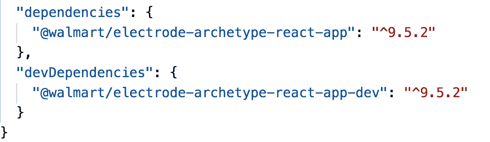
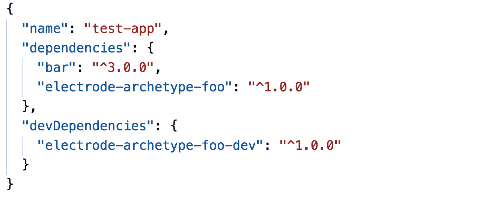
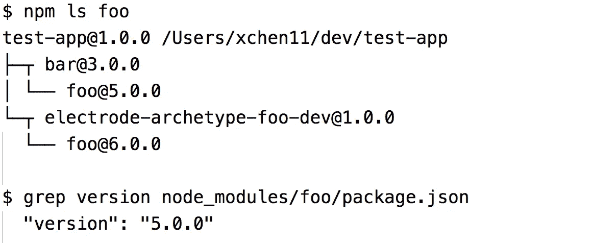
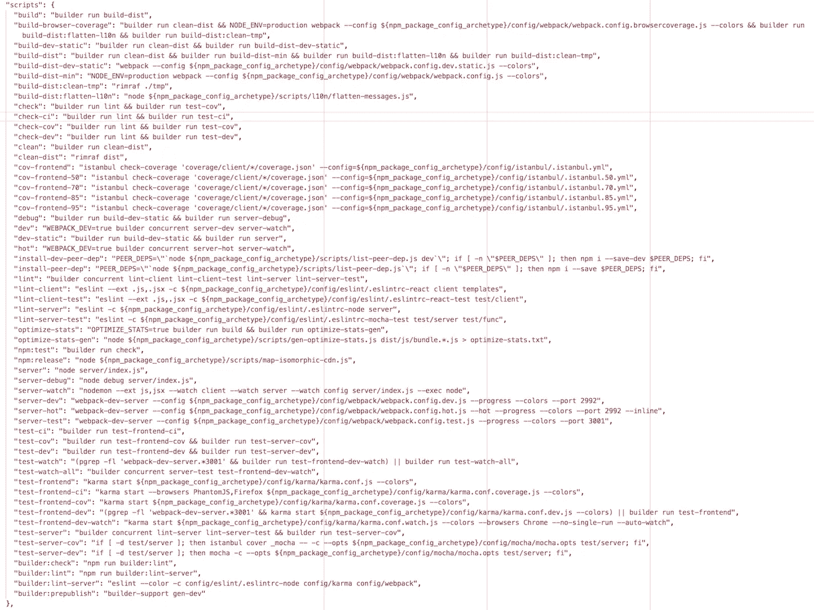
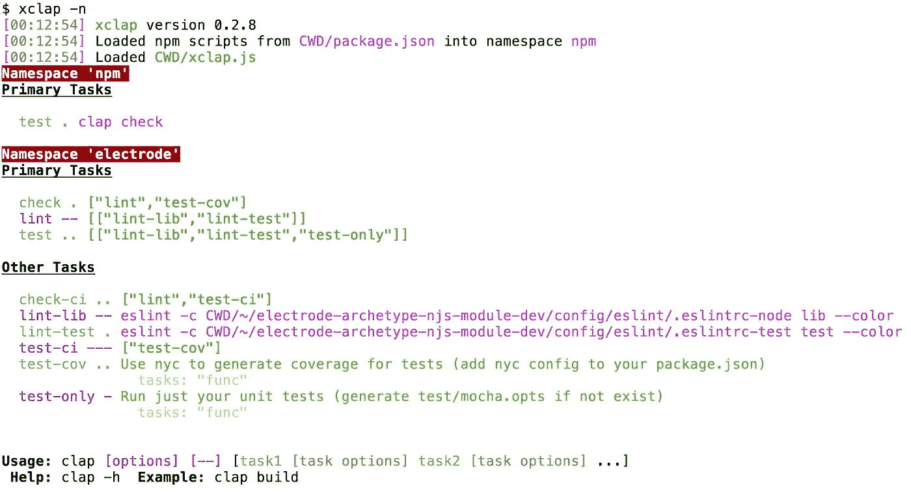

# 电极原型的演变

> 原文：<https://medium.com/walmartglobaltech/the-evolution-of-electrode-archetype-d61a5dcc90c9?source=collection_archive---------3----------------------->

# 介绍

使用来自 [@WalmartLabs](https://medium.com/u/c884135151a4?source=post_page-----d61a5dcc90c9--------------------------------) 的[电极平台](http://www.electrode.io/)，我们引入了一个名为[原型](https://github.com/electrode-io/electrode/blob/cd8e1fb94eac2fbc080bdc31d0fba73e90aa34b2/docs/overview/what-are-archetypes.md)的新概念，它在平台中发挥着重要作用。对于尝试过电极的人来说，你可能对原型很熟悉。原型是在拥有数百名开发人员的组织中提高开发人员生产率的需求的结果。在这篇文章中，我将讨论它们从开始，概念验证，过去的迭代，到当前版本，以及未来的发展。

# 初始和概念验证

什么是电极原型？它是一对 npm 模块，包含典型的标准内容，如配置、依赖关系以及用于开发应用程序或模块的工具和脚本。应用程序将原型作为依赖项来使用。详情请见我们的文档[这里](https://github.com/electrode-io/electrode/blob/0d7942ac91798cc7b48563e6c5cb67757c294bbc/docs/chapter1/intermediate/app-archetype/what-are-archetypes.md)。

我们想要解决的最初问题是快速地让团队加入并支持我们的平台。通常情况下，生成器会创建一个具有标准设置的基本应用程序，但是我们如何将更新和修复传播到已建立的应用程序呢？

我们通过创建一个名为 bolt 的工具开始了一项实验，该工具包含一组针对`linting`、`transpiling`、`bundling`和`testing`的常见任务。回购现在已被弃用，但在这里仍然可用。结果是令人鼓舞的，并有助于基于原型`npm scripts`的开始。

# 构建器迭代

我们喜欢使用`npm scripts`来构建。它们简单且容易获得。我们希望在我们的构建中利用它们，所以我们将它们作为我们最初原型的基础。

强大的为我们创造了一个名为 [builder](https://github.com/FormidableLabs/builder) 的工具。它从原型和应用程序加载`npm scripts`，并允许您用`*builder run*`调用它们。

我们带着建造者的原型踏上了土地。当我们解决遇到的问题时，这个工具随着原型概念一起改进和成熟。有许多小事情，但最大的问题与`node_modules`的依赖有关。

## 依赖关系与开发依赖关系

我们希望像`babel`、`webpack`、`karma`等依赖项成为应用程序的`devDependencies`，因此它应该消费我们的原型。

好吧，与此同时，有些东西我们想在生产中提供给应用程序，所以我们也需要原型在应用程序的`dependencies`中。

所以我们把原型分成两个模块。一个主文件和另一个带有`-dev`后缀的文件，这两个文件只用于引入依赖关系，所以它主要只包含一个`package.json`文件。双模块的消耗如下:



Loading the dual archetypes in our getting-started sample app.

## node_modules 依赖树

我们遇到的最大问题大多与`*npm*`安装的模块的不确定嵌套有关。我们无法让它与`npm@2`一起工作。幸运的是，带有模块扁平化的`npm@3`已经可用，我们改用它。

`npm@3`的扁平化将模块提升到依赖关系树中尽可能高的位置，但是如果另一个模块依赖于同一事物的不同版本，我们的原型的依赖关系可能不会得到提升。

举个例子，如果我们的原型需要`foo@6`，但是应用程序需要`bar`来引入`foo@5`，那么我们可能会在`node_modules`的顶层得到`foo@5`，而`foo@6`嵌套在 dev 原型中。如果我们从主原型中`require` `foo`，那么它就会得到`foo@5`——不完全是我们想要的。



The package.json of a test-app that pulls in bar which pulls in foo@5 to the top level.



And foo@5 being promoted to the top level, while foo@6 got nested inside the `dev` archetype.

解决办法很简单。因为 NodeJS 为每个模块创建了一个`require`的实例，我们可以传递它，它总是需要来自原始模块的位置。

所以我们在 dev 原型中创建了一个简单的文件，它简单地导出了它的`require`。在主原型中，我们在任何需要的时候都使用它，而且效果很好。

```
module.exports = require;
```

它仍然没有完全解决问题，因为一些工具从它自己的上下文内部`require`模块。幸运的是，这种情况很少见，到目前为止都很容易解决。

*顺便说一下，基于这个解决方案，我创建了一个* [*小模块 require-at*](https://github.com/jchip/require-at) *让你调用* `*require*` *假装你在任何你想去的目录。*

## 推广开发原型

最终我们意识到，我们原型中的大多数东西只是与开发相关的任务，它们真的应该在开发原型中。因此，我们将所有的配置设置和脚本从主原型移到了开发原型，这从一个只有`package.json`文件的空模块得到了很好的提升。

# 吞咽迭代

随着时间的推移，我们原型中的`npm scripts`变得非常大，很难维护。我们在一个`JSON`字符串中有超过 50 个 shell 脚本。另一个问题是他们中的许多人可能会打破窗户。

虽然我们用 JavaScript 实现了更复杂的东西，并从 shell 脚本中调用它们，但仍然很难维护。在这一点上，`npm scripts`不再那么吸引人了。



A peek of how it’s like with all shell scripts inside package.json (wordwrap set at column 200)

我想找到一种方法来摆脱在`JSON`字符串中维护这些 shell 脚本。显而易见的答案是 JavaScript。

我发现`gulp`可以执行 JavaScript 中的任务，但只能并发执行。幸运的是，有一个插件[可以串行执行任务。](https://www.npmjs.com/package/run-sequence)

接下来，我需要一种简单的方法将 shell 脚本转换成 JavaScript。所以我写了一个[简单的加载器](https://github.com/electrode-io/electrode-gulp-helper)把它们放到`gulp`里，用`[shelljs](http://documentup.com/shelljs/shelljs)`执行。结果出乎意料地简单却有效，我们切换到基于`gulp`的原型。

# xclap 迭代

有时候，一些用户希望在调用原型任务之前注入他们自己的代码来完成设置或其他工作。但是，如果他们将一个同名的任务添加到 gulp 中，那么原型的任务就会丢失。为此，类似任务名称空间的东西会很有用。

为 gulp 实现任务命名空间并不简单，而且 gulp 中的任何改变都是不可能的。所以我创建了一个具有更多特性的替代任务执行器`[xclap](https://www.npmjs.com/package/xclap)`,其中之一显然是任务的名称空间。

在来自`xclap`的名称空间的支持下，用户可以从原型中定义具有相同名称的任务，但仍然可以调用原始任务。

另外，`xclap`可以串行或并发地加载和执行`npm scripts`，并适当地嵌套执行层次。它有一个事件驱动的执行生命周期，因此可以开发不同的可视化进度报告。它还为任务提供了更好的集成，让它们更灵活地影响其他任务的执行。



xclap showing tasks from package.json and our archetype electrode-archetype-njs-module-dev.

# 未来

偶尔，我们仍然会遇到模块依赖混淆的问题，应用程序必须明确依赖某些模块才能在顶层安装它们。目前真的没有简单的方法来解决这个问题，我们将继续寻找更好的解决方案。

此外，我们正在不断改进和更新我们现有的原型，以提高开发人员的生产力，如果我们确定了一个新的项目类别，那么我们可以开发新的原型，使他们的开发更简单。

# 结论

电极原型是需要提高开发人员生产力的结果。在它们的开发过程中，我们解决了与节点模块和实现任务的不同方法相关的问题，并开发了不同的工具来满足这些需求。我们一直在寻找更好的工具和方法，让我们的开发人员摆脱重复性的工作，让他们更快更容易地开发他们的应用程序。

## 承认

[令人生畏的](https://medium.com/u/900ee8ad3db9?source=post_page-----d61a5dcc90c9--------------------------------)在原型的发展和演变中起了重要作用。为 [@WalmartLabs](https://medium.com/u/c884135151a4?source=post_page-----d61a5dcc90c9--------------------------------) 工作的开发人员为帮助将电极和原型带到今天的位置做出了很多贡献。