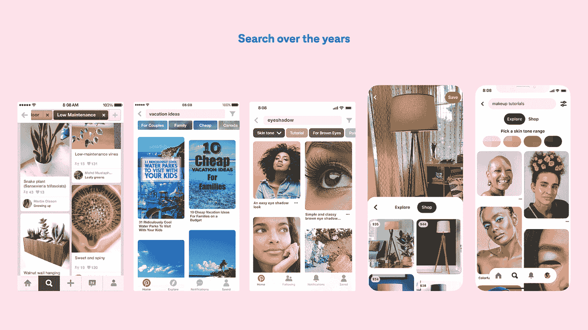

# Pinterest 搜索的演变

> 原文：<https://medium.com/pinterest-engineering/the-evolution-of-search-at-pinterest-c69e78ff2698?source=collection_archive---------0----------------------->

SVP 纳文·加维尼的产品

当 Pinterest 首次推出时，它为人们从网络上收集和组织想法提供了一种新的方式。最初是一个保存的地方，现在变成了一种独特的发现服务。2014 年，Pinterest.com 推出四年后，一小群工程师和设计师问，“如果没有一个正确的答案，搜索引擎会是什么样子？”。

我们意识到，在你知道自己想要什么之前，Pinterest 可以帮助你找到想法。对诸如今晚做什么晚饭这样的问题的回答？如何为你的家设计风格？去哪里度假？这么多的可能性，有时候直到看到才知道自己想要什么。这是我们认真开始寻找旅程的时候。

今天，Pinterest 通过计算机视觉和个性化为全球搜索提供了动力。现在 Pinterest 上每个月有超过 50 亿次搜索。

随着人们为大流行后的生活做准备，[搜索](https://newsroom.pinterest.com/en/post/genz-and-the-reopening)服装、度假和家居装修的次数创下历史新高。而且，对婚礼的搜索已经达到了疫情之前的水平。

对于 Z 一代，人均搜索次数同比增长了 31%。受众中的搜索数量同比增长了近一倍(+96%)。在购物方面，产品搜索同比增长超过 20 倍(在 Q1 年末)。

## **盒子外搜索**

作为 Pinterest 的第一批工程师之一，我有机会开发我们第一个版本的搜索引擎——引导搜索。引导式搜索允许进一步细化或缩小搜索范围。从一些普通的东西开始，比如 *BBQ* ，到一些更可行的地方结束，比如*夏日烤鸡食谱*，或者*素食 DIY BBQ* 。

> 当你知道你在找什么的时候，搜索引擎是很棒的。但互联网缺少一种探索的方式，一种从几个关键词开始，然后获得帮助扩展查询以探索可能性的方式。

引导式搜索的设计成为整个行业点击主题的一种方式。该产品为基于计算机视觉的视觉搜索铺平了道路。在 [2015](https://newsroom.pinterest.com/en/post/our-crazy-fun-new-visual-search-tool) 年，我们开始了我们在物体识别方面的工作，后来又将这项技术应用于相机搜索。这使得搜索和找到你在网上或网下看到的任何东西的推荐成为可能。

Search at Pinterest over the years, from Guided Search to search with skin tone ranges and Lens camera to shop. High-resolution image [here](https://www.dropbox.com/s/nevad86h98czm6z/Search_Timeline.png?dl=0).

## **搜索的未来是可见的**

多年来，Pinterest 上的搜索变得更加可视化，在帮助人们从灵感到行动方面更加有用。我们把文本和视觉搜索甚至购物的世界结合在一起。我们还将继续努力，使搜索更加基于他人的相关兴趣。因为人们正在拍摄相同的图像并将其放在不同的板上，所以我们可以学习图像的更深层次的语义。然后我们可以训练我们的系统模仿 Pinners 分类图像的方式。每次我们改进模型，我们都会看到参与度上升。

为了使技术有用，它必须是相关的。这就是我们继续专注于包容性产品开发的原因。这包括根据肤色范围过滤美容搜索的能力。我们也将这项技术应用到 AR 中，我们努力通过多样化的数据集来减少人工智能中的偏见。

随着我们继续投资于我们的[搜索框架](/pinterest-engineering/manas-realtime-enabling-changes-to-be-searchable-in-a-blink-of-an-eye-36acc3506843),在正确的时间将相关 pin 呈现给正确的人，我们的团队将会做出更多贡献。

** Pinterest 上每月有超过 50 亿次搜索(搜索包括文本搜索和视觉搜索，其中包括放大大头针中的对象以查看视觉上相似的大头针。)这一统计反映了自 2021 年 4 月以来任何 30 天内的全球搜索量。*