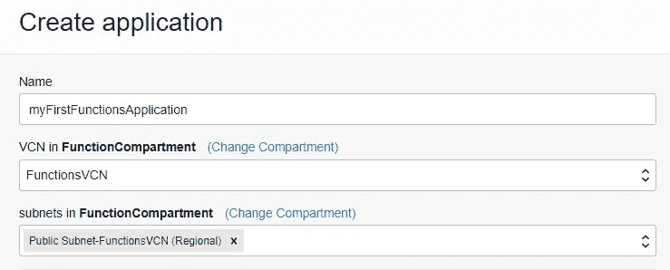

# Oracle 函数的应用

> 原文：<https://medium.com/oracledevs/the-faascination-with-oracle-functions-2dee461ce91d?source=collection_archive---------0----------------------->


Oracle 在 Oracle 云中提供功能即服务(FaaS)。它被命名为 Oracle 函数。

Oracle Functions 基于一个名为 Fn Project 的开源项目。

> Fn Project 是一个开源、容器原生、无服务器的平台，可以在任何地方运行——任何云或内部。

[](https://fnproject.io/) [## Fn 项目

### 开源。原生容器。无服务器平台。Fn 项目是一个开源容器——原生无服务器…

fnproject.io](https://fnproject.io/) 

因此，Oracle Functions 将 Fn 项目作为其核心。

**Oracle 函数和云外壳**

在设置 Oracle 功能时，可以从您的工作站进行设置。但是，需要进行大量的安装。

因此，出于评估目的，开始使用 Oracle Functions 服务的最简单方法是通过控制台和云 Shell 进行设置。

这些说明详述了设置 Oracle 函数的 4 个步骤。设置 Oracle 函数的完整说明如下:

[](https://docs.oracle.com/en-us/iaas/Content/Functions/Tasks/functionsquickstartcloudshell.htm) [## 云壳上的功能快速入门

### 3.创建 VCN 和子网如果不存在合适的 VCN 来创建网络资源:登录到…

docs.oracle.com](https://docs.oracle.com/en-us/iaas/Content/Functions/Tasks/functionsquickstartcloudshell.htm) 

下面的内容只是一个总结，其中包含一两个提示，让您了解设置 Oracle 函数有多简单。

**1。为 Oracle 职能部门建立租赁关系**

在此阶段，您将设置组、用户和隔离专区。您还将创建一个 VCN 和一个子网，然后创建一个策略。

所有的东西都在完整的说明中解释了。

为 Oracle 功能设置租用后，下一步是创建应用程序。

**2。通过控制台**创建应用程序

在这一步中，您将创建一个应用程序。

从菜单开发者服务中，选择函数，然后你将有机会创建一个 HelloWorld 应用程序。例如，我们将选择应用程序的名称为“myFirstFunctionsApplication”。



后来，该功能将被放置在此应用程序中。

**3。在云壳环境中完成设置**

既然已经创建了应用程序，控制台现在将指导我们接下来的操作。

这些说明实际上是为我们的租赁定制的，列在应用程序的“入门”页面中。大多数指令都是在云外壳中执行的。


因此，第一步是在浏览器中创建一个 shell 会话，方法是单击“启动云 Shell”。


几秒钟后，将出现云 Shell 命令提示符。

现在，从这里开始，您只需复制页面上显示的命令，并将它们粘贴到云 Shell 中。


其中一项任务是为 Oracle 云基础设施 Docker 注册表提供前缀名称。

*重要—您定义的前缀名称必须全部小写。*

您还需要生成一个令牌，您需要记录下来供以后参考。这个令牌将用于登录 Docker 注册中心来下载 java 映像(即 Hello-java)。

**4。创建、部署和调用您的函数**

现在只剩下 4 项任务:

*   生成一个“hello-world”样板函数。
*   切换到生成的目录。
*   部署您的功能。
*   调用您的函数

hello-java 函数(在 myFirstFunctionsApplication 内部)将被调用，如下所示:

```
fn invoke myFirstFunctionsApplication hello-java
```


如果一切正常，那么您将收到“Hello，world！”的输出。

然后，您可以将定制的文本传递给应用程序:

```
echo -n 'John' | fn invoke myFirstFunctionsApplication hello-java
```


现在，您将收到“Hello，John！”的输出。

在这里，您可以通过从控制台启动内置的代码编辑器来检查该函数运行的代码。(请参见下面以黄色突出显示的图标。)


使用代码编辑器，您可以检查函数配置文件。


同样通过代码编辑器，您可以检查函数的源代码。


这是完整的设置。

出于评估目的，一切都可以通过控制台、云外壳和代码编辑器获得。

如果你对甲骨文开发人员在他们的自然栖息地发生的事情感到好奇，来[加入我们的公共休闲频道](https://bit.ly/odevrel_slack)！我们不介意成为你的鱼缸🐠

*Paul Guerin 出席了一些世界领先的甲骨文会议，包括甲骨文 2013 年世界开放大会。自 2015 年以来，他的工作一直是 IOUG 最佳实践技巧小册子以及 AUSOUG、Oracle Technology Network、Quest 和 Oracle Developers (Medium)出版物的主题。2019 年，他被授予 My Oracle 支持社区最有价值贡献者。他将继续参与 Oracle ACE 计划。*