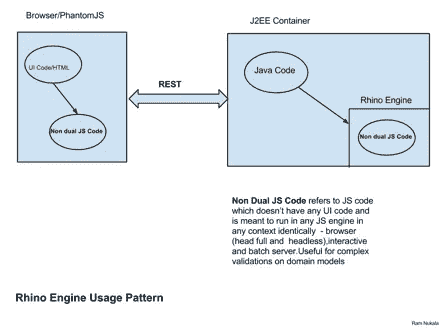
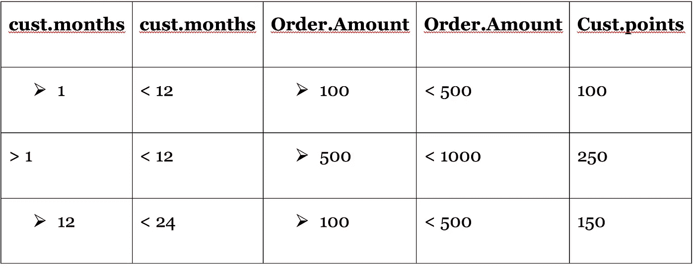

# 第一个服务器端 JavaScript 引擎

> 原文：<https://medium.com/capital-one-tech/the-first-server-side-javascript-engine-15658c7244c9?source=collection_archive---------0----------------------->

## ***(提示:不是 Node.js)***

Rhino 是第一个在非浏览器环境中运行的 JavaScript 引擎。由 NetScape 在 1997 年推出，它被设计成在混合语言环境中运行，其中主语言是 Java。

11 年后，Rhino 如何仍然与企业世界相关，在企业世界中，mindshare 目前由*insert-your-favorite-new-client-side-JavaScript-library*主导。js？

## **Rhino 在 AJAX/REST 世界中的相关性**

现实情况是，大多数服务器端企业应用程序仍然是用 Java 编写的。虽然在服务器上使用 Java 的承诺仍然很强，但我们看到的是对 JSP 和 ASP 等服务器端页面技术的控制有所松动。

**我们正在快速迈向这样一个世界:服务器仍将使用 Java，但客户机将使用客户端 JavaScript 库编写，REST 是首选的数据交换格式。**

在这些类型的架构中，Rhino 提供了在服务器端和客户端运行相同代码的能力，从而简化了维护。如果您的客户端 JavaScript 函数没有引用任何浏览器对象，它们可以在 Rhino 中运行。

**犀牛精华**

Rhino 允许您在 Java 程序中运行 JavaScript 代码，将 Java 对象传递给脚本，操纵它们，并返回 Java 对象。这允许您创建可以返回到调用 Java 程序的 JavaScript 对象，允许您的程序比普通 Java 更具动态性(因为 JavaScript 是动态类型的，而 Java 是静态类型的)。

## **什么犀牛不是**

Rhino 不是在浏览器中运行的 JavaScript 引擎。这意味着它不了解浏览器世界，包括组成这个世界的对象和概念。没有 DOM，没有窗口，当然也没有事件处理程序。

# **Rhino 的一种企业使用模式**

上述架构模式可用于在服务器端和客户端运行验证。一段简单的代码可以用来演示 Rhino 调用。

*(完整项目位于***)**

## ***Rhino 的应用领域***

*下面是 Rhino 可以非常有效地应用的两个应用领域。*

# ****Rhino 在业务规则/决策表中实现****

*大多数软件系统都有某些需要由业务规则驱动的组件。这些可以是特定日期、特定地理位置或特定供应商。此外，这些规则有有效的开始日期和结束日期。将这些业务规则建模为决策表是相当容易的。这些决策表可以从数据库表中加载，并由 Rhino 脚本执行。*

**客户框(有属性:'名字'，'姓氏'，'月份以来客户'，'点数')**

*订单(具有属性:*‘订单 id’，‘订单日期’，‘金额’*)*

***示例决策表:***

**

*注:上表客户指*‘客户’*类，订单指*‘订单’*类。*

*在 Rhino 中可以很容易地实现自定义解释器，并且可以用来执行任何类型的决策表，包括上面这样的表。*

# ****犀牛中的电子表格和计算器****

*计算器和电子表格无处不在，出现在各个领域，尤其是在银行和保险领域。(想想你的抵押计算器、支付计算器、偿还计算器等。)通常，计算器通过用户界面(web 或胖客户端，如。并且需要在服务层的后端重新执行相同的计算。如果这些计算器的实现使得核心计算模块化，并且没有 UI 依赖性，那么 Rhino 可以用于在服务层执行相同的代码，而基于浏览器的 JavaScript 可以用于在前端执行计算。*

*如果前端是胖客户端，Rhino(针对 Swing)或者微软 Jscript(针对。NET)可以用来执行相同的操作。*

## *【Rhino 入门的重要伪代码片段*

*以下是伪代码片段的备忘单，可以帮助您开始使用 Rhino。这段代码应该在生命周期中执行一次。如果在容器中运行，最好每个线程运行一次。最好使用线程局部变量或并发散列映射。*

**伪代码片段#1**

***Context 上下文= org . Mozilla . JavaScript . Context . enter()；***

**获取对表示正在执行的脚本的运行时上下文的上下文对象的引用*

**上下文 a [线程安全对象](https://en.wikipedia.org/wiki/Thread_safety)*

**伪代码片段#2**

***org . Mozilla . JavaScript . scriptable scope = context . initstandardobjects(null)；***

**从上述上下文创建一个范围*

**伪代码片段#3**

***scriptableobject . put property(作用域，“someglobalvariablewhisthablabletorhinoscript”，<某对象>)；***

**上面的伪代码允许您传递可以被 Rhino 脚本引用的全局变量*

**伪代码片段#4**

***String code = "将代码从一个 JS 文件读入一个单独的字符串。确保您保留了换行符(\n)，以便在出现错误时，Rhino 引擎会打印出正确的行号"；***

*和*

***context.evaluateString(范围，代码，"< cmd "，1，空)；***

**上面一行将把 JS 代码编译到具有相应//上下文的作用域*

**以下代码将在每个请求中执行一次(比如每个 servlet 请求)*

**伪代码片段#5**

*假设 JavaScript 代码有一个名为“performComplexCalculation”的函数*

***func func =(Function)scope . get(" performComplexCalc "，scope)；***

***Object[] args = …..//用函数**的参数初始化对象数组*

***Object result = func . call(context，scope，args)；***

**从 JavaScript 到 Java(反之亦然)的对象转换是透明处理的。*

***现在您开始使用 Rhino！***

# ***结论***

*在理想软件世界的一个流行观点中，所有系统都是用单一的编程语言/系统构建的。然而，在现实世界中，我们不得不处理异构的语言和系统。在 web 世界中，由于 AJAX 和 REST 服务的概念以及升级的浏览器，JavaScript 获得了非凡的重要性。*

*使用 Rhino，我们可以将客户端 JavaScript 与服务器端 JavaScript 和服务器端对象协调起来，以实现某些使用其他技术很难实现的用例。*

*当然，如果您的项目有幸使用 Node.js，那么这些都不适用于您。*

## ***延伸阅读:***

*Rhino 文档位于:[https://developer . Mozilla . org/en-US/docs/Mozilla/Projects/Rhino # Rhino _ Documentation](https://developer.mozilla.org/en-US/docs/Mozilla/Projects/Rhino#Rhino_documentation)*

*如需了解更多关于 Capital One 的 API、开源、社区活动和开发人员文化的信息，请访问我们的一站式开发人员门户网站 DevExchange。[*https://developer.capitalone.com/*](https://developer.capitalone.com/)*