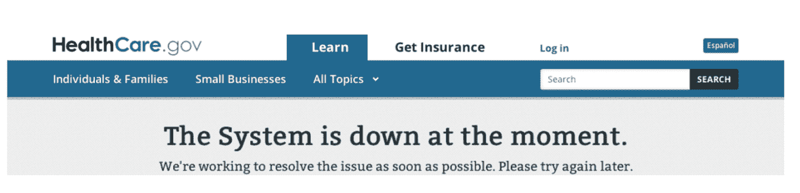
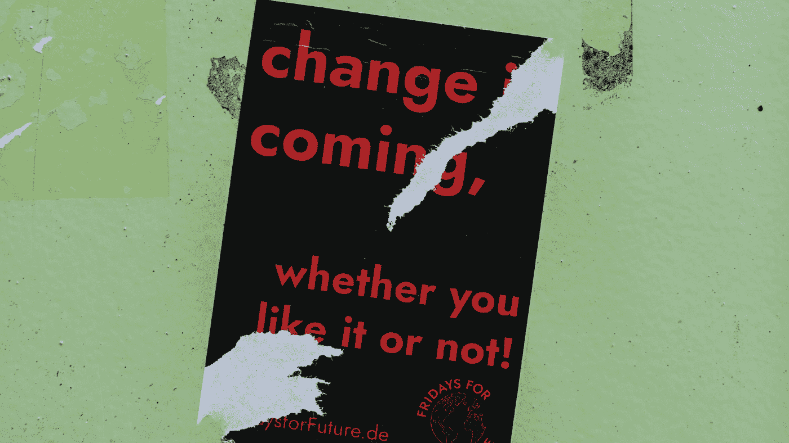

# 成功软件的五大原则

> 原文：<https://medium.com/capital-one-tech/the-five-principles-of-successful-software-cb182a935dba?source=collection_archive---------0----------------------->

## 遵循这些实践来减少故障并构建持久的系统

# 什么是工程？

我们称自己为“软件工程师”，但我不知道我们花了多少时间去思考什么是工程。我们认为工程师是设计和建造东西的人，不管是桥梁、电路还是软件。虽然这是真的，但它并不是使它成为工程的建筑部分。

从很小的时候，人们就被驱使去建造东西，无论是乐高房子还是“你好，世界”程序。随着我们的成长和学习，我们建造了更复杂的东西，比如真实的房子和处理关键数据的程序。工程师们的不同之处在于，他们考虑的是如何造出不管世界扔给他们什么都能存活下来的东西。从本质上讲，工程就是如何处理失败。

因为不管我们的计划有多完美，事情总会出错。

失败有很多种。并不是每一个工程失败都是因为[火箭爆炸](https://www.nytimes.com/2021/03/30/science/space/spacex-starship-launch.html)或者[healthcare.gov 网站不能发射](https://digital.hbs.edu/platform-rctom/submission/the-failed-launch-of-www-healthcare-gov/)。如果您有一个由于内存泄漏而需要定期重启的服务，这仍然是一个失败。如果你有一个很难浏览的网站，以至于把顾客都吓跑了，那也是失败的。作为工程师，我们有责任尽我们所能来确保我们尽可能正确和健壮地设计和构建了我们的软件。

这让我们回到系统设计。我们必须设计我们的系统，使它们不仅满足产品经理概述的功能需求。我们必须设计对失败有弹性的系统。那么，我们该怎么做呢？

Screenshot from HBS Digital Initiative — [https://digital.hbs.edu/platform-rctom/submission/the-failed-launch-of-www-healthcare-gov/](https://digital.hbs.edu/platform-rctom/submission/the-failed-launch-of-www-healthcare-gov/)

你会从高级工程师那里听到三个神奇的词。“嗯，看情况。”你花在编写软件上的时间越长，你越会意识到没有什么硬性的规则可以保证成功。然而，我发现有五个原则对构建弹性系统很有帮助。它们是:

1.  无聊很好
2.  坚持你的核心竞争力
3.  非功能性需求是需求
4.  可测性设计
5.  没有什么是永恒的

你可能会注意到，这里没有任何关于微服务或 Kubernetes 或任何特定技术的内容。我不会告诉您部署多少个可用性区域，或者您应该选择 REST 还是 GraphQL。这是因为系统设计原则处于更基础的层次。他们指导您的技术选择，而不是相反。

所以，让我们一条一条地来看这些原则。

# 1.无聊很好

第一，无聊是好事。在之前，我已经写过关于无聊技术的文章。无聊是优秀工程的基础。它意味着依靠在你之前的每个人积累的知识。你可能不是第一个遇到设计问题的人。研究常见的模式和成功的系统。看看其他人是如何解决这个问题的，以及他们是如何在实现选项之间做出决定的。找到关于失败和人们如何重新设计他们的系统作为回应的报告。总之，站在巨人的肩膀上。

无聊这个想法的创始人可能是英国作家兼哲学家 GK·切斯特顿。他因一个名为[切斯特顿的栅栏](https://fs.blog/2020/03/chestertons-fence/)的思想实验而闻名。我来解释一下他说的话，因为 150 岁的英国哲学家很罗嗦。

*假设有一道栅栏挡住了一条路。你可能会说，“这个栅栏没用，它挡着我的路，我们把它拆掉吧。”但是切斯特顿说这是错误的。如果你不明白为什么栅栏在那里，你绝对不应该把它拆掉。你需要弄清楚为什么栅栏被放在那里。一旦你这么做了，你就可以考虑把它拿下来。*

这如何应用于系统设计？首先，确定你需要建立一个新的系统。如果，一旦你理解了旧系统在做什么，你意识到它在按照设计和需要运行，*不要管它*。工程师们有一种趋势，用最新的技术重建事物，只是因为它们有趣。一些工程师甚至挑选他们的技术堆栈，这样他们就可以在简历中添加一些新的和酷的东西(但我肯定不是你)。避免诱惑。

第二，如果你真的在构建什么东西，在采用新技术时要小心。看看[选择无聊技术](https://mcfunley.com/choose-boring-technology)，丹·麦金利 2015 年写的一篇很棒的博文。他引入了*“创新代币”*的概念，来限制你想尝试的新事物的数量。他认为一家小公司可以安全地花费最多三个创新代币。对于大企业的团队来说，我每年花在一个项目上的时间不会超过一个。

有人可以挑战科技的极限。然而，对于大多数发生在企业的项目来说——稳定性比酷更受重视——这些创新标志将会很重要。

# 2.坚持你的核心竞争力

选择无聊的技术是不够的。你还必须让你的团队专注于开发别人做不到的东西。虽然构建软件和基础设施很有趣，但不要构建任何已经由他人创建的东西，无论是在你的公司内部还是外部。

在你寻求重复使用别人的东西时要毫不留情，因为重复使用可以为你赢得时间。在一个项目中，时间是最宝贵的东西，因为没有办法让它回来。花时间研究如何解决一个问题是一种投资，因为它可能会为你节省大量的时间。与此同时，花时间重建已经存在的东西意味着你有更少的时间做其他事情——包括只有你能做的事情。

重建现有系统的成本不是一次性的时间损失。在不太长的时间内，维护您的系统花费您的团队比初始开发多得多的时间。如果你使用广泛共享的技术，你的成本会分摊到所有的项目中。你的项目中所有独特的东西都是时间成本，只由你的团队承担。

重用其他人的工作是如此重要，以至于你应该尽力使你必须设计的系统适应你可以重用的系统和代码。避免意外失败的最好方法之一是利用他人的经验。有些问题看起来似乎很简单，你可能认为重新创建解决方案比修改你的设计想法更容易，但是那些现有的系统已经在你甚至没有想到的极限情况下经过了战斗测试。

重用现有技术时需要权衡利弊。你越依赖某个特定的库、API、数据库或操作系统，就越难改变。尽最大努力准备换人。如果某项技术不再满足您的需求或者变得不受支持，您将需要找到一种方法来分离。确保你的东西和你的依赖之间有清晰的界限。就当是起草一份法律合同吧。你不仅要明确你们将如何合作，还要明确你们将如何分开。

# 3.非功能性需求是需求

为了支持功能性需求，非功能性需求必须是真实的。其中包括:

*   您的系统需要多长时间来返回响应？
*   您的系统需要处理多少个并发请求？
*   如果系统不能处理更多的请求，该怎么办？
*   当一个依赖项没有响应时，系统应该做什么？
*   运行这个系统要花多少钱，我如何最大限度地降低成本？
*   为了省钱，可以牺牲响应速度或同时请求的数量吗？

正确定义这些非功能性需求非常重要。工程师应该就可行性提供意见(你不能要求从美国到欧洲的请求有 50 毫秒的响应时间，因为网络没有那么快)，但是产品负责人有责任了解性能、正常运行时间和成本要求。

在指定非功能性需求时，要小心避免意想不到的后果。假设您正在为一个 API 定义非功能性需求。您希望确保它能够快速响应用户请求，因此您指定系统必须在平均 50 毫秒内返回一个响应。这听起来不错，但是平均值掩盖了差异。一个一半的请求需要 1 毫秒，另一半需要 99 毫秒的系统不是我们想要的目标。

更好的方法是使用百分位数，假设您希望 99%的请求花费 50 毫秒，但即使这样也是不完整的。你不想要一个 99%的请求需要 50 毫秒，1%的请求需要 1 秒的系统。

相反，您应该限制最坏情况下的时间，指定 99%的请求应该花费 50 毫秒或更少，如果请求花费的时间超过 100 毫秒，则返回一个错误。这有助于您定义一个性能范围，即最终用户发出请求所允许的总时间。当*性能包络*已知时，产品经理可以在处理请求所需的所有服务之间划分可用时间。这将告诉您是否能够满足用户的性能需求。

非功能性需求很难，因为它们都是关于系统如何处理故障的。描述黄金路径很容易，建造它也很容易。思考事情可能出错的所有方式意味着思考你可能出错的方式。请注意，错误不仅仅是代码中的错误。您还必须考虑系统的第三方依赖可能会让您失望的方式。很难不为自己辩护。担心承认潜在错误会让自己看起来很糟糕是人之常情。但是最好在失败发生之前搞清楚这些事情，因为失败总是会发生的。

# 4.可测性设计

那么，您如何知道您的系统是否满足您的需求，无论是功能性的还是非功能性的？*你测试一下。当你有时间限制时，我们总是有时间限制，诱惑是尽可能少做测试。事情是测试总是会发生的——唯一的问题是它是发生在 QA 环境中，还是由您的客户在生产中完成。用户很擅长发现所有你从未发现的错误。你认为通过不测试或者只测试黄金路径来节省时间是一种错觉。如果你以前认为你的时间有限，想象一下，当问题出现时，你解决问题的时间会减少多少。*

即使你确实想避免让你的客户首先发现你的错误，你也不能在发布之前花太多时间测试你的系统。人们不在生产前进行测试的一个原因是，很难配置您的系统所依赖的所有东西。所以你需要弄清楚如何设计一个易于测试的系统。这又回到了对模块化和你的软件系统如何组合在一起的思考。

许多人推荐使用测试驱动开发，或者 TDD，来确保代码是可测试的。TDD 背后的思想是，您应该首先编写您的测试，然后编写测试失败的存根代码，最后编写使您的测试通过的实现。虽然这可能是理想的，但团队严格遵循这一点仍然不常见。

无论是否使用 TDD，都需要编写可测试的代码。那么，你是怎么做的呢？以下是一些建议:

*   不要硬编码配置信息。将其存储在配置文件或环境变量中。
*   将加载配置信息的代码与您的业务逻辑分开，这样您就可以独立于逻辑最终运行的环境来测试逻辑。
*   避免全局状态，因为很难(但不是不可能)放入不同的值来测试失败。
*   正如您应该确保在应用程序启动时将配置信息注入到应用程序中一样，您应该使用依赖注入来关联应用程序的组件。这允许您连接模拟和存根进行测试。
*   最重要的是，确保你的测试涵盖了出错的部分。如果服务没有响应会发生什么？如果用户输入不正确会发生什么？如果负载高于预期会发生什么？所有这些事情都会发生在生产中。这取决于你确保你知道在那之前会发生什么。

如果你不确定会发生什么样的故障，并且你的系统涉及多个进程或服务，看看分布式计算的[谬误](http://nighthacks.com/jag/res/Fallacies.html)。这些原则最早是在 90 年代初由 Sun Microsystems 提出的。谬误是人们在设计系统时认为理所当然的东西，这些东西会在生产中反噬他们。尤其是前三个测试时机已经成熟:

1.  网络是可靠的
2.  延迟为零
3.  带宽是无限的

# 5.没有什么是永恒的

最后说一下改变。软件的好处和坏处是它很容易改变。我喜欢用桥来做类比，因为它们与软件非常不同。改变物理基础设施是缓慢、痛苦和昂贵的。一旦一座桥建好，没有人会在六个月后回来告诉建造者他们有一周的时间把它接到下游 10 英里的另一条路上。然而，每个软件工程师都可以讲述一个关于在最后一分钟修改一个工作系统或库以使用一个意外组件的故事。唯一没有被修改的软件系统是那些没人使用的系统。

你需要为变化设计你的系统，否则当*不是如果*你被要求这样做的时候，就会有奇怪的失败。幸运的是，到目前为止我们谈论的所有事情都使我们能够做出改变。如果您已经使用了很好理解的技术，适当地隔离了第三方依赖性，考虑了非功能性需求，并进行测试来验证您已经做好了一切，这将变得非常容易。当不可避免的新特性出现时，不要损害这些原则。对变更进行一次性的例外是很容易的，但是您应该弄清楚如何最好地使新的组件和代码适应已经存在的组件和代码。

为变化而设计的另一个原因是你可能需要变回来。这里还有一些我们所有人都会在某个时候经历的事情:发布一个中断生产的更新。一旦发生这种情况，您需要重新部署旧系统，同时找出问题所在。如果向后兼容性被破坏，您将有额外的停机时间。为了确保向后兼容性，支持旧 API 和新 API。如果您有一个数据库，请确保任何数据库更改都是向后兼容的，不要重新定义或删除列或表。

您还需要为另一个变化进行设计:系统的最终替换。软件是一个如此新的领域，以至于我们仍在研究如何正确地做事。当有人替换你的代码时，不要把它当成一种侮辱。如果你创造了一个持续五年的系统，那是令人印象深刻的。总有一天，你写的每一点代码都将被关闭，而你设计系统的部分工作就是让它尽可能无缝。希望更换你的系统的人是按照切斯特顿的篱笆，了解你的系统和它做什么，以便更换是合理的和实际的改进。如果没有，给他们发一个这篇文章的链接。

*披露声明:2021 首创一号。观点是作者个人的观点。除非本帖中另有说明，否则 Capital One 不隶属于所提及的任何公司，也不被这些公司认可。使用或展示的所有商标和其他知识产权是其各自所有者的财产。*

【https://www.capitalone.com】最初发表于**。**