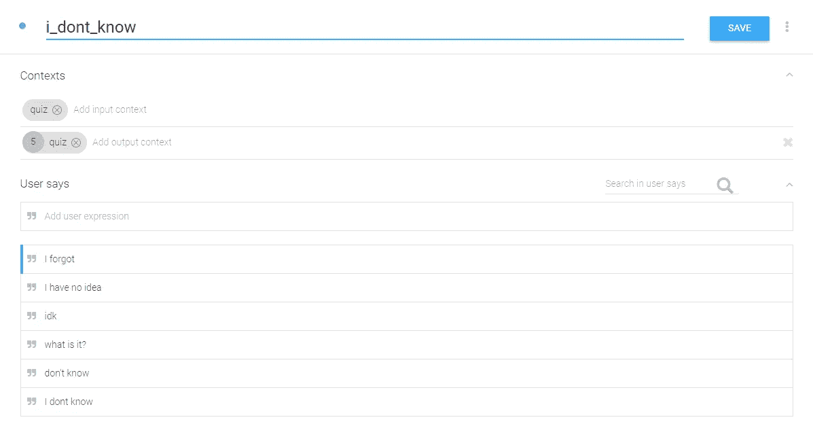
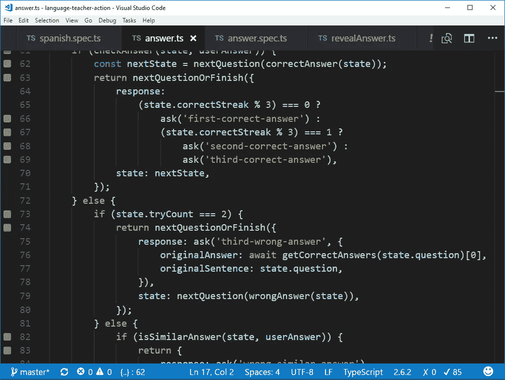
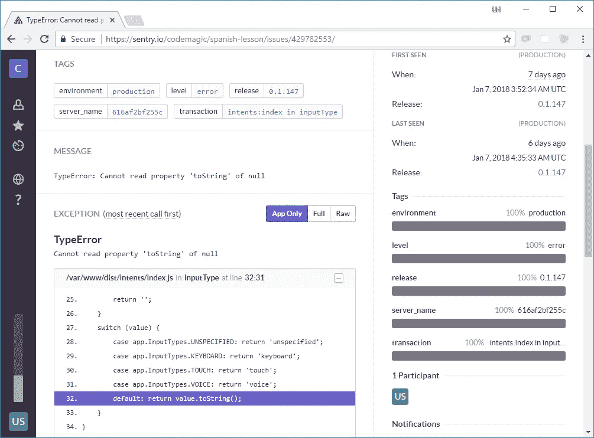
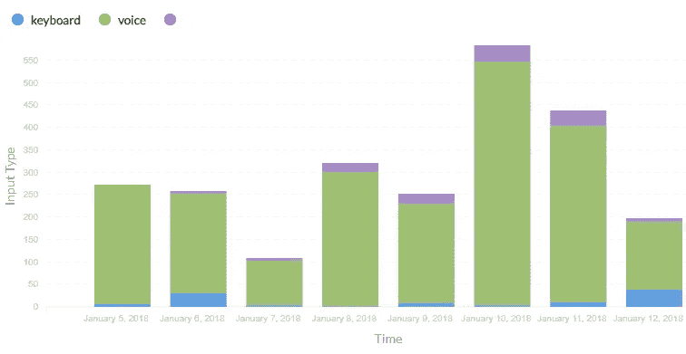
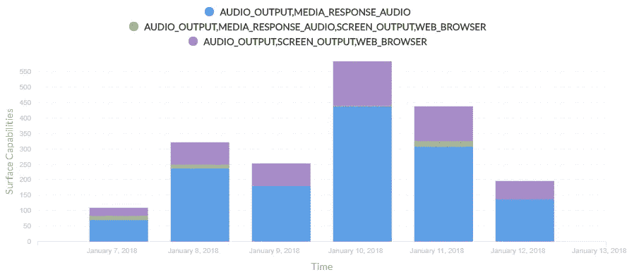
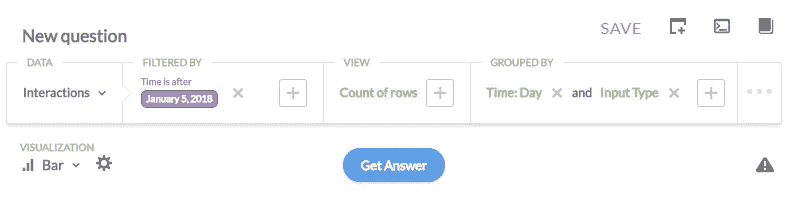
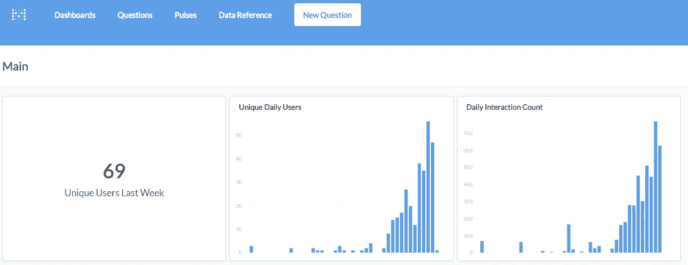
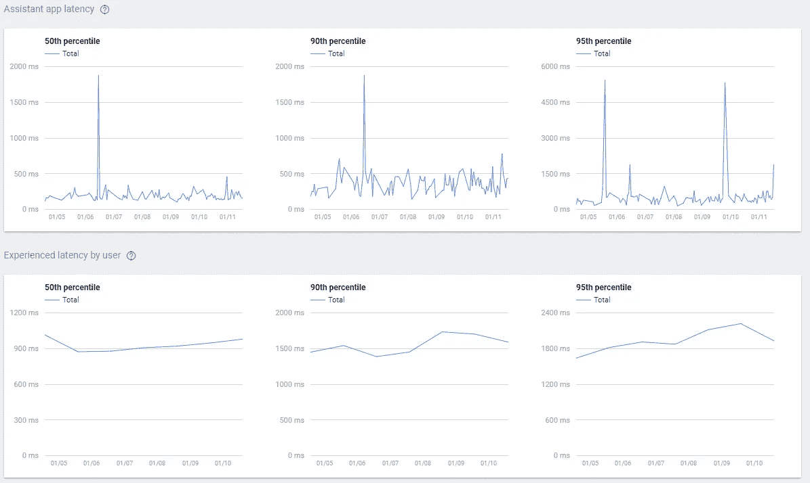
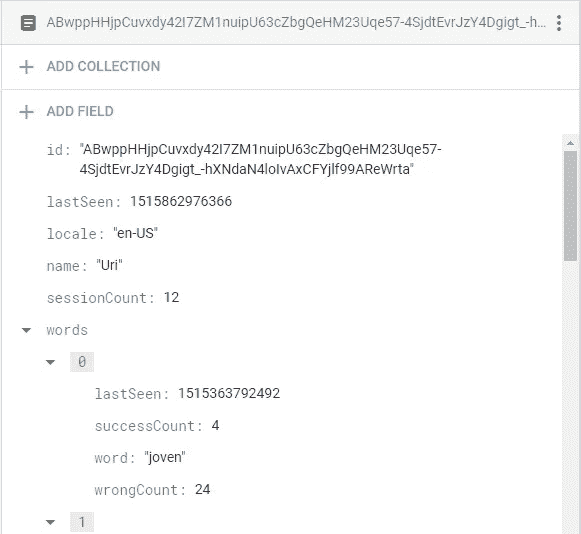
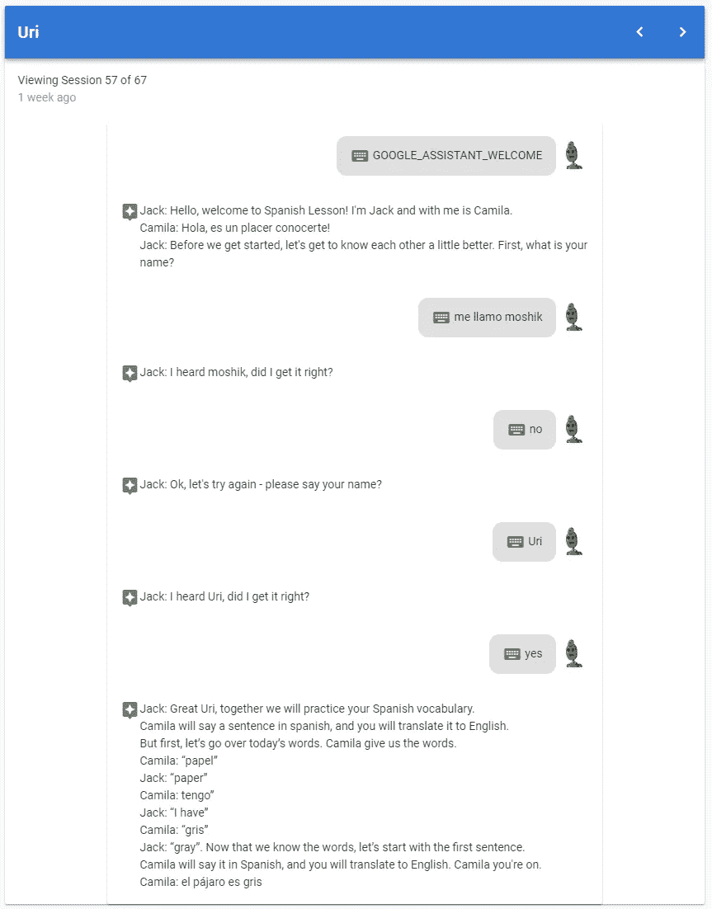

# 谷歌助手全栈操作指南

> 原文：<https://medium.com/google-developer-experts/the-full-stack-guide-to-actions-for-google-assistant-e1765edd075b?source=collection_archive---------1----------------------->

## 另外:我们如何教谷歌助手教你西班牙语

如果你目前正在构建或考虑开发一个自定义的谷歌助手操作，这篇文章就是为你准备的！

我的朋友 Daniel Gwerzman 和我最近发布了[西班牙语课](https://assistant.google.com/services/a/id/78ef501ffbad84c8?hl=en)，这是一个助手，它将通过每天教你一些新单词，并为你朗读西班牙语例句，让你翻译成英语来帮助你学习西班牙语。

由于我们在构建应用程序时获得了如此多的乐趣，我们想向您展示我们是如何做到的，包括一些有趣的代码片段。我们的目标是帮助您在开发自己的行动时节省一些宝贵的时间，并向您展示创建这些行动是多么有趣！

The Spanish Lesson Logo :)

## 那么这整件事是怎么开始的呢？

几个月前，我的生活伴侣 Ariella 得到了一个新的 Google Home 设备。她对此非常兴奋，尝试了各种各样的东西。在某个时候，我听到她问设备:“嘿，谷歌，教我西班牙语”，设备回答说:“对不起，我还不知道如何帮助那个*。*

巧合的是，在同一天的早些时候，我读了丹尼尔·格威兹曼的文章，他在文章中解释了为什么现在是在谷歌上采取行动的好时机。他有一些非常好的观点——人们很懒，宁愿说话也不愿意打字，由于这仍是平台的早期阶段，因此有很多机会在技术领域产生重大影响。

因此，当助手回答 Ariella 说它还不能教她西班牙语时，我突然想到:为什么我不这样做呢？！

第二天，我打电话给丹尼尔，问他是否准备好开始新的冒险。丹尼尔对这个想法非常兴奋，我们开始合作。我们坐在一起，[设计了一个人物角色](/@zps270/designing-personas-for-google-action-bdfdcd2b4abc)，这是创建文本和可能的对话流的基础。我们在这个过程中学到了很多，几周后我们可能会从产品/ UX 的角度发表另一篇文章。

然而，这篇文章的重点是创建助手动作的技术部分——我们遇到的挑战，我们选择的堆栈，基本上是与您分享如何在 Google Assistant 上提供真实、复杂的动作的完整解决方案的架构。

我们将报道我们做出的技术决策，并分享我们的经验和我们选择的结果。

# 模板、对话流还是动作 SDK？

目前有三种构建助手动作的方法:现成的模板、Dialogflow 和 Actions SDK。

[现成的模板](https://developers.google.com/actions/templates/first-app)非常适用于创建小游戏或闪存卡应用程序等用例。当您使用模板时，您不需要编写一行代码，只需填写一些电子表格，就会根据您填写的信息为您创建操作。这对于学校教师来说非常有用，他们可以很容易地为学生创建游戏。

然而，在我们的例子中，我们需要更多的功能:我们希望能够跟踪用户的进度，实际上在一个应用程序中混合西班牙语和英语是一个相当大的挑战，正如你马上会看到的那样。所以我们必须在 Dialogflow 和 Actions SDK 之间做出选择。

Dialogflow 为您提供了一个很好的用户界面来构建对话流(在某些情况下，您甚至可以不写任何代码就离开)，并且还结合了一些人工智能来帮助您理解用户意图。

Actions SDK 为您提供了对用户输入的“基本”访问，并且由您提供一个后端来解析该输入并生成适当的响应。

我们决定使用 Dialogflow，因为它可以为我们处理一些流(例如，问用户一个是或否的问题，并理解用户的反应)，而且它还可以让我们快速地构建原型。

Dialogflow 的内置功能证明对我们非常有用。例如，如果用户不知道如何翻译给他们的句子，他们可以说“我不知道”来得到答案并跳到下一个。

在我们发布这款应用后，我们很快意识到用户有很多方式来表达他们不知道这句话——“我不知道”、“我忘了”、“这是什么”，甚至是老一套的“idk”。

“I don’t know” — Dialogflow in Action

将这些备选方案添加到应用程序中很容易，因为 Dialogflow 允许我们在进行中快速添加新的变化。这意味着我们可以很容易地改进我们的应用程序，因为我们可以从用户对应用程序的实际评论中学习。既然快速迭代这么简单，我们就一直这么做！

# 后端和持续集成

作为一名 Web 开发人员，JavaScript 是我的谋生之道，所以在选择后端技术时，我选择了 Node.js，这一决定也是基于这样一个事实，即有一个官方的 Node SDK 可以使用 dialog flow(Google 上的[操作](https://www.npmjs.com/package/actions-on-google)包)来开发 Google 上的操作。丹尼尔已经有过使用它的经验，[全心全意地推荐了它](/@zps270/building-google-action-with-javascript-bb5c136d3cdc)。

为了补充开发经验，我还建立了 [TypeScript](https://www.typescriptlang.org) ，这是现在我对任何大于几行代码的项目的首选解决方案。方便的是，Actions SDK 带有完整的类型定义，所以我使用了自动完成和类型检查。最后，我用来自脸书的测试框架 [Jest](https://facebook.github.io/jest/) 建立了单元测试。我将它与 [Wallaby.js](http://google search Wallaby.js) 结合使用，这是一个持续运行您的测试并在您键入代码时向您显示执行结果和代码覆盖率的解决方案。我感谢 Artem 创造了它。

Excerpt from our answer verification logic — the green bullets on the left is how Wallaby indicates our coverage

除了测试应用程序逻辑，我们还使用单元测试来验证我们的西班牙语单词课程的一致性，例如，下面是一个测试的摘录，该测试验证了数据库中的每个单词至少有 3 个句子出现:

拥有一个坚实的测试基础是持续集成的一个关键因素，这也是我们在行动中所采用的。我们使用 [CircleCI](https://circleci.com/) ，并对其进行设置，以便每当我将变更推送到`master`分支时，测试套件就会被执行，代码会用 [tslint](https://palantir.github.io/tslint/) 进行检查，如果一切顺利，新版本会立即部署并投入生产。

我们使用 Docker 创建一个包含 transpiled 应用程序的容器，然后将它推送到[Google Container Registry](https://cloud.google.com/container-registry/?)，然后部署到我们为此设置的一台小型机器上(还有 Metabase，见下文)。对于将代码部署到 [Firebase Functions](https://cloud.google.com/functions/) 、 [Google App Engine](https://cloud.google.com/appengine/docs/flexible/) 、 [Google Cloud Run](https://cloud.google.com/run/) 或 [Google Kubernetes Engine](https://cloud.google.com/kubernetes-engine/) ，我们有一些备选方案，但是我们决定在我们的服务器上简单地运行 Docker。

这是我们的 Dockerfile，它使用了 Docker 17 中引入的[多阶段构建](https://docs.docker.com/engine/userguide/eng-image/multistage-build/)特性。首先，我们构建一个容器，在其中运行我们的测试并用 JavaScript 传输源代码。成功完成后，我们将进入第二阶段，在此阶段，我们将基于更精简的 Node-Alpine 映像构建实际的生产容器:

最后，我们使用名为 [Sentry](https://sentry.io) 的服务来跟踪错误。它收集我们生产环境中发生的任何异常的信息，并向我们发送包含信息的电子邮件。您还可以在 docker 文件的第 32 行中看到，我们用当前版本的标签定义了一个环境变量，然后 Sentry 使用它来跟踪在我们部署新版本后是否还会出现问题。我们用 CircleCI 构建号填充`${BUILD}`变量，方法是在构建映像时将`--build-arg`参数传递给`docker`命令。

Example for an error we had, tracked by sentry down to the exact source code line

总的来说，我们目前的设置包括测试和哨兵作为安全网，我们相信这一点，这样我们就可以做出很大的改变，将东西部署到生产中，而不用进行大量的手动测试，也不用担心我们会破坏应用程序。我喜欢这样工作。

# 分析学

作为一名企业家，如果生活教会了我一件事，那就是每当你开始一个新产品时，你拥有的每一个用户都是一个学习你的产品的新东西的巨大机会。

在原型制作时，我坐在 Ariella 旁边，观察她使用应用程序，我们从这样做中得到了非常有价值的反馈。例如，这就是我们如何决定添加上面提到的“我不知道”场景。

有鉴于此，我们很清楚，我们希望跟踪所有用户与我们的应用程序的交互，也希望有一种简单的方法来查询这些交互，分析它们并将其可视化，以帮助我们了解模式。我们希望从第 0 天开始收集分析，并寻找一个简单的解决方案，不需要太多的编码，并且能够随着应用程序的发展而发展。我们选择了 Google 的数据仓库解决方案 [BigQuery](https://cloud.google.com/bigquery/) ，它可以轻松扩展到海量数据，并支持我们熟悉的 SQL 查询语言。

我们使用 BigQuery 的方式是使用一个称为“流插入”的特性直接向它报告任何用户交互，这个特性允许您在新行出现时逐个插入新行。您可以在下面看到报告用户交互的代码片段:

基本上，你用`DialogflowConversation`实例调用这个函数，以及你发送给用户的响应(如果有的话)，就都设置好了。这是我们如何定义 BigQuery 表模式的:

最初，我们只跟踪输入和响应，但当我们开始看到用户与应用程序交互时，我们看到许多应用程序似乎没有正确理解用户的情况，因此我们想了解用户如何与应用程序交互，以及他们来自世界的哪个地方。

这就是我们开始收集`locale`、`inputType` 和`surfaceCapabilities`零件的地方。后两种方法不是很直接，因为在我们将它们存储到数据库之前，它们需要一些预处理:

我们了解到，绝大多数用户使用语音与我们的应用程序互动:

通过查看表面功能，我们还可以看到许多用户使用仅具有音频输出和媒体响应音频功能的设备与我们进行交互，我们认为这是 Google Home(与支持屏幕输出的设备，如智能手机形成对比):

总的来说，设置 BigQuery 大约需要一个小时的编码和测试，然后生成一个带有凭证的[服务帐户文件](https://developers.google.com/identity/protocols/OAuth2ServiceAccount#creatinganaccount)，并将其包含在我们的代码中。幸运的话，这是一个我们不需要很快重新访问的部分，因为整个数据库完全是为我们管理的。如您所见，我们已经产生了一些非常有用的见解，有助于我们塑造和改进我们的产品。

你可能想知道上面的图表从何而来。BigQuery 没有内置的数据可视化，虽然您可以将查询结果导出到 Excel，但这不是很方便。我们使用一个名为 [Metabase](https://medium.com/u/d8cd1c2343d5?source=post_page-----e1765edd075b--------------------------------) 的免费产品，它连接到 BigQuery 并允许您轻松地查询和可视化数据。例如，我是这样为第一个图设置查询的:

您还可以选择使用 SQL 编写查询，以防需要更复杂的聚合，或者连接几个表中的数据。最后，Metabase 允许您创建漂亮的仪表板，您可以设置它来显示您关心的指标:

Our Current Metabase Dashboard

嗯，根据上面的图表，你大概可以猜出我们在哪个时间点启动了这个应用程序:-)

更新:截至 2019 年 5 月，谷歌推出了自己的数据可视化工具， [Data Studio Explorer](https://support.google.com/datastudio/answer/9005651?hl=en) 。它仍处于测试阶段，但可以成为元数据库的可行替代方案，并且不需要任何设置。

谷歌还在谷歌控制台上的操作中的专用分析部分提供了一些对应用程序的见解，在那里您可以了解应用程序的健康状况、延迟、发现等。

Our latency stats from the Actions on Google console. How do they compare with your?

需要指出的是，建立一个分析解决方案非常简单，而且你可以从你的数据中学到很多东西，所以这绝对是你在启动应用程序之前要做的事情。

# 会说西班牙语

这一部分对于我们的用例来说有些特殊，所以我会尽量简短。我们希望该应用程序除了英语之外，还能说西班牙语。谷歌助手允许你使用一种叫做 [SSML](https://en.wikipedia.org/wiki/Speech_Synthesis_Markup_Language) 的语言定制回应，这种语言可以指定语音参数，如速度、音高，还可以给出如何阅读文本特定部分的提示，如添加[强调](https://www.w3.org/TR/speech-synthesis11/#S3.2.2)。

不幸的是，谷歌的 SSML 实现目前不支持不同语言之间的切换。然而，它允许你插入外部音频文件，所以理论上我们可以用不同的方法生成西班牙语语音。

然而，有趣的是，我们在一个相当意想不到的地方找到了解决方案:亚马逊云。它有一个名为 [Amazon Polly](https://aws.amazon.com/polly/pricing/) 的云 TTS 服务，免费等级很高:每月 500 万个字符。他们还支持 SSML，这意味着当用户要求重复一个句子时，我们可以要求它说得慢一些。

这个故事的寓意是，有时，如果您混合和匹配来自多个云提供商的服务来满足您的特定需求，您可以获得更好的结果。

# 用户数据的数据库

该应用的第一个原型只是给用户一个随机的西班牙语句子，让他们翻译成英语。当看着我们的#1 beta 测试员 Ariella 使用它时，我意识到这不是正确的方法，因为有许多单词她还不熟悉；让这个动作吐出一个随机的句子，而没有考虑到她目前的词汇量，这没有多大意义。

这时，我意识到我们需要使用某种数据库来存储每个用户的进度。

我们选择了新的 [Cloud Firestore](https://firebase.google.com/docs/firestore/) 数据库，因为它是完全托管和管理的，并且是无模式的文档数据库，这使得它非常适合快速原型开发。我仍然是 Firestore 的新手，但我真的很喜欢使用 Firebase(实际上，自从 2013 年他们公开测试以来，我一直是他们的用户，我甚至编写了自己的 [firebase-server](https://github.com/urish/firebase-server) 实现)，所以我决定尝试一下。

到目前为止，我很高兴:从 Node.js 连接到它是一件轻而易举的事情，在我们构建的小型前端应用程序中也是如此。他们的控制台是开发原型时浏览和管理文档的一种非常方便的方式:

Using the FireStore console to check on our users progress

在某个时候，丹尼尔问我为什么我们同时需要 BigQuery 和 Firestore。答案在于两者之间的根本区别:BigQuery 非常适合对大量数据进行复杂查询。无论数据大小如何，您都可以在几秒钟内得到答案。这也是它的弱点所在——即使你只想要一条记录，引擎仍然需要扫描整个表，你可以在几秒钟内得到答案。虽然等待 5 秒来获得复杂查询的结果是有意义的，但让我们的用户在每次与应用程序交互时等待 5 秒或更多不是我们想要的那种体验。

此外，在修改现有数据方面，big query[非常有限。因此 Firestore 非常适合快速读取/插入/更新操作，而 BigQuery 擅长存储和查询聚合用户数据。因此，就像我们最终如何使用多种服务来让我们的应用程序说西班牙语一样，这都是为了找到适合这项工作的正确工具。](https://cloud.google.com/bigquery/docs/reference/standard-sql/data-manipulation-language#quotas)

# 前端

现在你可能想知道:前端和辅助动作有什么关系？在某个时候，我们可能会为我们的用户建立一个网页，以便他们可以看到自己的进展，但现在，我们决定为自己建立一个小工具，以探索我们的用户如何与应用程序交互。没错，我们在 BigQuery 中有所有的数据，但是从表中读取对话不是很方便。

我决定抓住这个机会学习一项新技术， [Vue.js](https://medium.com/u/9b930cf6db26?source=post_page-----e1765edd075b--------------------------------) 。我从 [fuse-box-vue-seed](https://github.com/fuse-box/fuse-box-vue-seed) 开始，其中还包括[vue ify](https://vuetifyjs.com/)，一个用于 Vue 的材质设计组件库，以及 [fuse-box](https://fuse-box.org/) ，一个超快速的模块捆绑器，它是 Webpack 的一个很好的替代品。

然后，我使用 [Firebase 认证](https://firebase.google.com/docs/auth/?gclid=Cj0KCQiA-ebSBRC8ARIsAGuxJIpY4tsEkZVcVXbd1OXUrYUjBS7V9u75AvXdJYD0nmWuyd9Mpgo1BfYaAvXHEALw_wcB)添加了 Google 单点登录，使用 [Firebase 托管](https://firebase.google.com/docs/hosting/)将应用程序部署到 web，并使用 firebase-admin SDK 在我们的后端[验证用户身份](https://firebase.google.com/docs/auth/admin/verify-id-tokens)。

One of my testing sessions, visualized by our Vue.js frontend

总的来说，我对 Vue 非常满意——学习曲线很平缓，使用 Vuetify 很容易，我设法快速构建了一个我们现在日常使用的工具，并向其添加了新功能。

# 结论

我们的应用已经取得了一些成绩，但这仍是一个开始。基于现有技术并利用云服务，如 Dialogflow、BigQuery、Firestore、Sentry、Amazon Polly，同时使用 Jest、Docker、Circle CI 和 Google Container Registry 的持续部署设置，使我们能够快速启动并运行，即使应用保持运行，也能保持这种速度。

我们的应用程序发布已经两周了，我们已经为数百名用户提供了服务，并了解了许多我们可以改进的地方。一些较小的改进已经在应用程序中实现了，我们现在正在对课程结构进行彻底改革，以使其更加有效。在接下来的几周里，你可能会看到我们的另一个帖子，更多地从产品的角度来讨论。

看到用户每天都回到我们的应用程序来学习新单词，这给我们带来了极大的满足感，Ariella 在学习新的西班牙语单词方面也很开心！

# 听起来有趣吗？试试我们的行动吧！

哦，别忘了试试我们的[动作](https://assistant.google.com/services/a/id/78ef501ffbad84c8?hl=en)！你可以在 Google Home、Android 6.0+电视、Android 6.0+手机、iOS 9.0+手机或者你的 Chromebook 上查看。只要安装谷歌助手(如果你还没有的话)，然后说:

> “和西班牙语课对话”

迪维埃蒂特！(“玩得开心”，别忘了在评论区给我们留下任何反馈！)