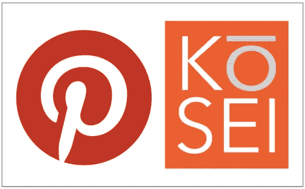

# Pinterest 机器学习的未来

> 原文：<https://medium.com/pinterest-engineering/the-future-of-machine-learning-at-pinterest-88e6d4bf1968?source=collection_archive---------2----------------------->

迈克尔·洛普| Pinterest 工程

我们提供相关和可扩展解决方案的一个关键方法是通过使用机器学习构建分布式系统。为了加快我们在发现和货币化方面的工作，今天我们宣布收购 [Kosei](http://kosei.com/) ，其中包括机器学习和数据科学领域的一些最优秀的人才。

在过去的一年里，Kosei 一直在建立一个独特的技术堆栈，通过提供高度个性化和强大的产品推荐来推动商业发展，并创建了一个包含 4 亿多种产品关系的系统。由于我们为所有对象构建发现引擎，Kosei 非常适合我们的团队。欢迎你，科塞！

## 展望未来

如今，机器学习在 Pinterest 的许多领域都得到了应用，例如:

*   黑色行动小组使用分类来检测垃圾邮件内容和用户
*   发现团队(包括搜索和推荐)提供推荐、相关内容，并预测用户锁定内容的可能性
*   我们的视觉发现团队正在与尖端的深度学习算法合作，进行对象识别和相关的对象推荐
*   货币化团队进行广告绩效和相关性预测
*   增长团队已经开始进入使用智能模型来确定发送哪些电子邮件和防止流失的领域
*   数据团队正在使用 [Spark](https://spark.apache.org/) 为机器学习构建一个分布式系统，因此学习可以是高效的，并且可能是实时的

随着人们使用 Pinterest 保存和发现他们未来想做的事情，我们拥有一个独特的、不断增长的数据集，超过 300 亿个 pin，随着时间的推移，这个数据集只会变得越来越强大。随着 Kosei 团队的加入，我们可以增强现有的图表，帮助品牌在正确的时间接触到人们，并改善 Pinners 的内容。

如果你对解决机器学习挑战感兴趣，[加入我们](https://about.pinterest.com/en/careers/engineering-product)！

迈克尔·洛普是 Pinterest 的工程主管

*获取 Pinterest 工程新闻和更新，关注我们的工程*[*Pinterest*](https://www.pinterest.com/malorie/pinterest-engineering-news/)*，* [*脸书*](https://www.facebook.com/pinterestengineering) *和*[*Twitter*](https://twitter.com/PinterestEng)*。有兴趣加入团队吗？查看我们的* [*招聘网站*](https://about.pinterest.com/en/careers/engineering-product) *。*