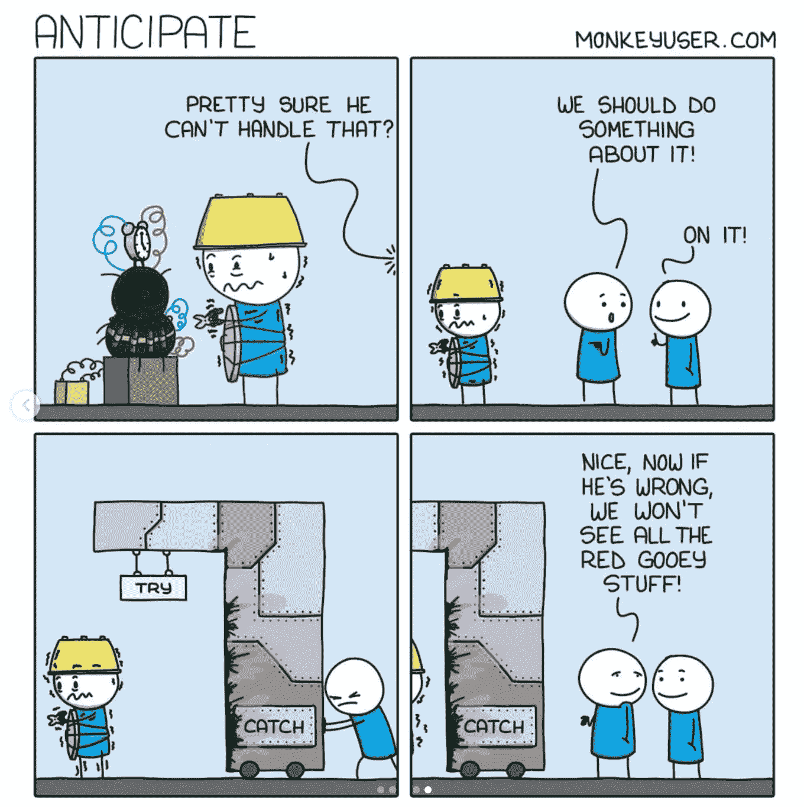
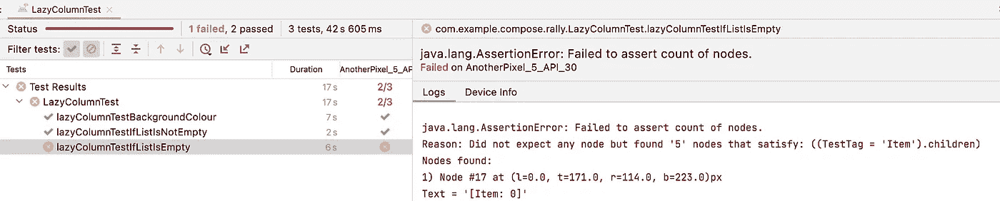
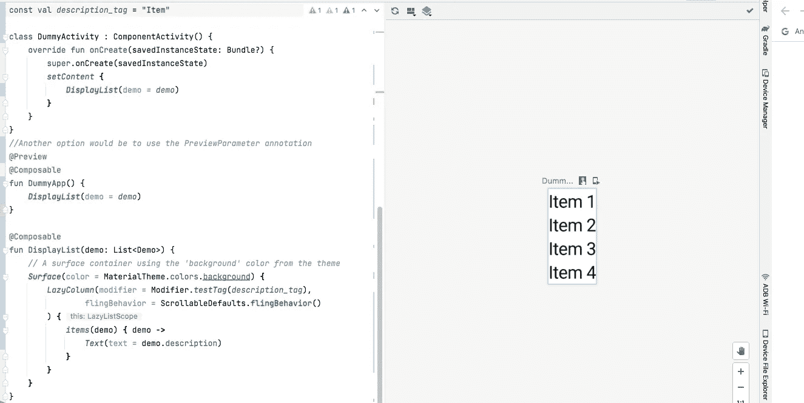

# 在 Android 中为 Jetpack Compose 编写测试的未来

> 原文：<https://medium.com/quick-code/the-future-of-writing-tests-for-jetpack-compose-in-android-45837a7eb0c0?source=collection_archive---------2----------------------->



Credits: [https://www.monkeyuser.com/](https://www.monkeyuser.com/)

你是刚刚开始使用 Android 的 TDD 吗？测试驱动开发或 **TDD** 是一种确保测试包含在任何新代码中的技术。使用这种方法时，在编写实现代码之前，先编写添加的测试。测试多少和如何测试一个组件没有严格的规则。在本文中，我将重点介绍一个实例，说明在使用 Jetpack compose 开发 Android 应用程序时，如何开始采用 **TDD** 。

1.  **插图—在屏幕上显示项目列表**
2.  **测试/验证什么**

*   *项目列表不存在*
*   *列表项存在*
*   检查列表中的项目是否为文本

**3。编写测试**

幸运的是，Compose 允许我们独立测试组件。以前，为了在 Jetpack Compose 之前在列表中显示大量的项目，您使用了 RecyclerView 和一个适配器。现在，您可以利用*懒人栏*或*懒人栏*分别垂直或水平显示列表。对于这个例子，您将使用`LazyColumn`来显示项目列表。要测试的一些[参数](https://developer.android.com/reference/kotlin/androidx/compose/foundation/lazy/package-summary#LazyColumn(androidx.compose.ui.Modifier,androidx.compose.foundation.lazy.LazyListState,androidx.compose.foundation.layout.PaddingValues,kotlin.Boolean,androidx.compose.foundation.layout.Arrangement.Vertical,androidx.compose.ui.Alignment.Horizontal,androidx.compose.foundation.gestures.FlingBehavior,kotlin.Boolean,kotlin.Function1))包括:

```
 **modifier:
    state: 
    contentPadding: 
    reverseLayout: 
    verticalArrangement: 
    horizontalAlignment: 
    flingBehavior: 
    userScrollEnabled:
    content:**
```

**步骤 1** —通过调用测试文件中`ComposeTestRule`的`setContent`方法，选择要使用的撰写 UI 内容。

**步骤 2** —从上面的列表中选择任意两个/三个参数，并传递您可以控制的假数据，以查看测试是否失败/通过。

这是你目前应该有的。

**步骤 3** —在 Android Studio 上运行测试以获得状态。

**第 4 步—** 现在，您可以继续验证前面提到的条件。记住以你想要测试的特定任务命名你的函数，例如`lazyColumnTestIfListIsNotEmpty`

使用这个示例代码，然后在 Android Studio 上运行它。

您会注意到`lazyColumnTestIfListIsEmpty`失败了，日志中有一个错误描述(这是应该的)



**步骤 5 —** 继续执行代码前的最后一次验证。假设您想要确定列表中的第一项是否是具有特定值的文本。对于这个例子，假设您将从一个虚构的演示数据类中检索数据。您需要手动添加一些虚拟数据。然后，您需要将这些数据附加到您的 LazyColumn，并使用 assert 验证操作来检查第一个值是否与特定的文本字符串匹配。

为了确保您的测试正常运行，请在 Android Studio 中运行下面的代码，并修改数据类中的文本值。

**4。实现实际代码**

很好，你走了这么远！现在，您可以实现主屏幕的代码来显示项目列表。它应该看起来像这样。

记得声明项目列表，例如:

```
val *demo* = *listOf*(
    Demo("Item 1"),
    Demo("Item 2"),
    Demo("Item 3"),
    Demo("Item 4")
)
```

此外，将数据类定义为:

```
data class Demo(val description: String)
```

**PS:** 在 Android Studio 上，通过在可组合函数前添加注释，可以看到我们的列表预览。



关于这方面的其他类似(更高级的)出版物，请查看[Paul alliances](https://medium.com/u/6c5d1b946a37?source=post_page-----45837a7eb0c0--------------------------------)关于[**TDD 入门的文章:Kotlin 和 Jetpack Compose**](https://paulallies.medium.com/getting-started-with-tdd-kotlin-and-jetpack-compose-887c04d733f9)