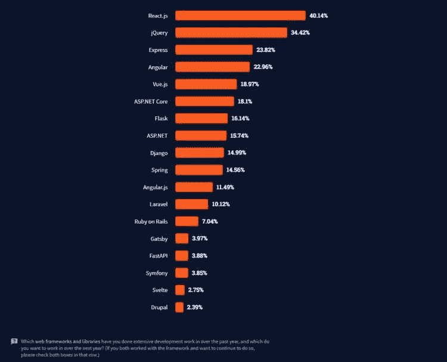
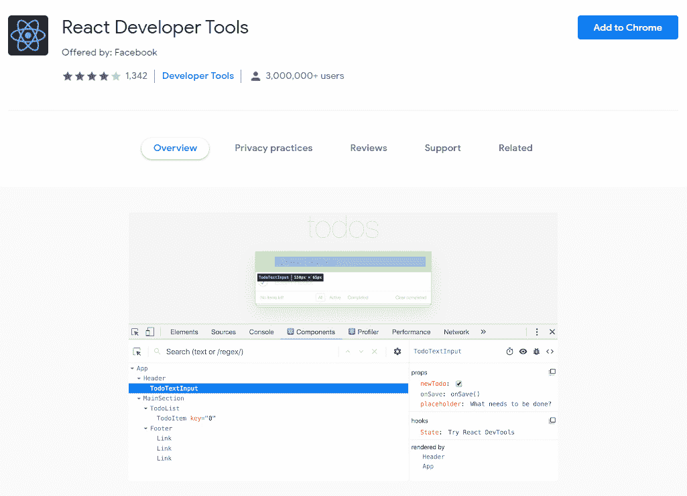

# ReactJS Web 应用程序开发的利与弊

> 原文：<https://medium.com/quick-code/the-good-and-the-bad-of-reactjs-web-app-development-d8ffe301e2c1?source=collection_archive---------0----------------------->

如何确保你在网络行业领先？答案是跟上现代技术的步伐。这也是为什么大多数企业都采用 [**React JS 进行 web 应用开发的原因。**](https://www.yourteaminindia.com/blog/guide-to-hire-reactjs-developers)

ReactJS 是领先的广泛适用的 JavaScript 技术。软件工程师 Jordan Walke(来自脸书)构建并发布了它，作为开发交互式动态用户界面组件的新视角。

然而，每一个好的技术都有一些缺陷。所以这篇博文重点强调了 React JS 的好与坏。让我们深入博客，详细探究一下。

# React JS —概述

React 是 2013 年发布的开源 JavaScript 库。该库由开发人员用于 web 应用程序开发，旨在帮助他们构建快速的单页面应用程序和用户界面。

超过 40%的 T4 开发者宣称 React JS 是他们的首选框架。但是，你要知道 React 是一个库，不是一个框架。

## **React JS 人气**

React JS 开发实现了应用程序开发过程，并改进了开发人员的日常任务。例如，在 web 框架方面，超过 1/3 的专业应用程序开发人员选择 ReactJS。它之所以流行，主要是因为它能够帮助开发人员快速构建单页面应用程序和用户界面。

上表展示了根据栈溢出进行的[最新调查。它强调了大多数开发人员使用并不断选择 React JS。但这并不意味着它是您项目的完美选择。](https://insights.stackoverflow.com/survey/2021#most-popular-technologies-webframe)

在选择 React JS 库之前，了解使用该库的主要优点和缺点至关重要。

# React JS 的利与弊

让我们深入探讨 React JS 的利弊。

# React JS 的优点

React JS 在 [web 应用开发](https://www.yourteaminindia.com/hire-reactjs-developers)方面提供了多种优势。下面列出它们是为了让您有一个大致的了解。

## **虚拟 DOM(文档对象模型)**

虚拟 DOM(文档对象模型)是改善用户体验的关键。它对 React 的性能和速度负责。它还[有助于使整个网络开发过程更快](/quick-code/tips-and-tricks-to-level-up-your-reactjs-web-development-aba41a1012e4)。

简单地说，DOM 是 XML、HTML 或 XHTML 格式的逻辑结构。此外，它比常规的 DOM 更新时间更少，这是一个巨大的优势。

## **好用**

它是 web 开发中最受欢迎的库的原因之一是因为它易于学习和使用。与 Angular & Vue 等其他流行的前端框架相比，你可以很容易地学习和理解它。

考虑到该库的多功能性及其更简单的学习过程，你可以预计对 React 的需求将会上升，因为[近 10，000 家公司](https://stackshare.io/react)正在使用它。

## **可重用组件**

可重用组件是增加 React 受欢迎程度的关键特征之一。它们使开发过程更加简单和容易，因为开发人员不必为类似的项目从头开始编码，并且可以在他们的其他项目中重用组件(只要有可能)。

事实上，你可以认为它们是 React 在 web 应用开发中最重要的特性之一。它们使编码更容易，并加快了开发过程，使 React 成为最好的技术之一。

## **搜索引擎优化友好度**

搜索引擎优化和内容本身一样重要，甚至在开发网站之前就应该考虑。但是为什么我们在关注 React 的时候提到 SEO 呢？因为这个 JavaScript 库是开发基于 SEO 的 web 应用程序的最佳工具！

使用 React JS 开发，您的网站在搜索引擎中变得更具可读性，包括 Google。它也减少了沉重的 JavaScript 问题，以使您的网站更加搜索引擎优化友好。

## **React 开发者工具**

React 是一个用于创建用户界面的著名库。适用于 Mozilla Firefox 和 Google Chrome 的浏览器扩展 React Developer Tools 也支持它。

这些工具由脸书开发，定期更新。此外，超过 2，000，000 名用户使用了它们。

# React JS 的缺点

尽管 React 有许多优点，但它也有一些您应该考虑的缺点。其中包括:

## **发展速度**

即使这看起来是好的一面，而不是不好的一面，它仍然会被认为是不好的一面。其原因是库在不断发展，导致开发人员对不断培训新流程或机制的需求不满意。

## **文件不足**

React 接收定期更新。虽然它适合库的性能，但它的容量减少了工程师编写完整文档的时间。留给设计师的唯一资源是基本的文本指南。

## **复杂的 JSX**

ReactJS 在更大范围内使用 JSX 语法扩展。该扩展有助于用 HTML 语法制作 JavaScript 对象。该过程有助于促进文档对象模型(DOM)修改的过程。此外，JSX 扩展创建了可读性更好的 DOM 修改代码。

但另一方面，这种扩展可能会让天真的和初学的工程师感到困惑。有些情况下，开发人员可能需要更多的时间来调整和理解扩展。这就是为什么新设计师认为 JSX 是 ReactJS 的缺点。

# 用 React 制作的 6 个流行的网络应用

多个[应用程序都是用 React](/quick-code/build-simple-react-js-application-in-5-minutes-f9abfc2d018a) 构建的，有些非常流行，有些不太出名。

*   脸谱网
*   网飞
*   纽约时报
*   照片墙
*   Dropbox
*   Whatsapp

# 反应还是不反应？

上述利弊已经清楚地展示了 React JS 何时以及为什么是开发人员的正确选择。React 被认为是影响长期支持的 web 应用程序的最安全的工具。

它以一种有意义的方式生成用户界面组件。对于逐步更新相关代码库来说，这是一个合适的选择。

React 代表了一种开发全功能 web 应用程序的混合方法，有助于管理数据逻辑，并在易于维护、适应性强和可扩展的结构中查看更改，而不会影响 UX。

在了解了 React JS 的优缺点之后，我们可以说值得一试。你还在等什么？在您的下一个 web 应用程序开发项目中使用 React.js！

但是建议在您的下一个项目采用 React JS 之前，先雇佣 React JS 开发人员。正确的指导将帮助您节省成本、时间和资源。