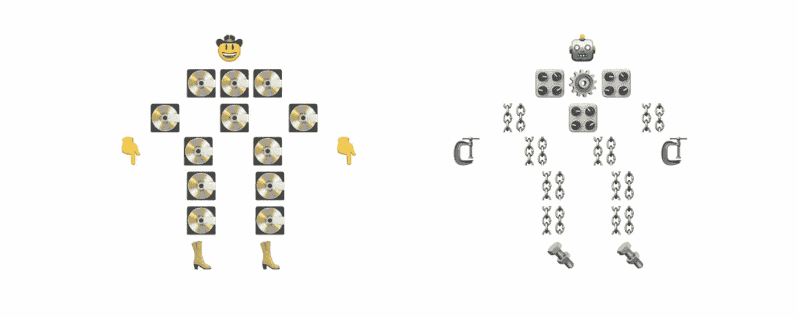

# 元数据大辩论

> 原文：<https://medium.com/capital-one-tech/the-great-metadata-debate-baf68848adca?source=collection_archive---------6----------------------->

## 一个警长和一个机器人在争论如何记录你的档案

古希腊继续对现代思想产生巨大影响的原因之一是一个简单的事实，即希腊人非常非常擅长记录。鉴于元数据是记录背后的记录，劫持最贪婪的文学形式(这个词中的 r 做了很多繁重的工作)来谈论这个看似简单的概念似乎是正确的。因此，我将做一点实验，召集两个固执己见的人物到博客世界进行一场老式的柏拉图式对话。

在桌子的一边(当然是一个圆圈),我们有一个时间旅行者，简称为警长🤠。这位警长来自古老的西部，在法律的保护下成长，他是 19 世纪一个边境定居点的法官的儿子。虽然他被拖入了我们的时代，但他成长的环境仍然是他的指南针。在一个目睹了一次又一次审判因法律漏洞而出错的人的抚养下，警长对复杂的系统没有什么信心，觉得没有人的判断来理顺它们，它们根本就不起作用。

对他来说，元数据意味着人类向其他人解释数据。有些系统元素必须包括在内，比如数据来自哪里，但最重要的是在描述中——尽可能清楚地说明每个数据点的含义的句子。

在另一边，我们有机器人🤖。虽然在语言模式上是人类，但他本质上是一个人工智能机器人，生活在对隐藏在他编程中的人类错误的恐惧中。他仍然记得他的兄弟，电子人 Byte，在他年轻的时候陷入了一个无限循环，这是由一个软件工程师介绍的，他忘记了写 ATDD 包括这一部分。电子人对人类保持组织和效率毫无信心，更喜欢自动化解决方案的可纠正缺陷，而不是人类监督的灾难性影响。

对他来说，元数据意味着生产者系统是透明的。他将血统和转化记录视为人类尚未认识到其重要性的灵丹妙药。电子人讨厌诗歌和小说，因为它们总是含糊不清，并且发现元数据描述更多的是相同的。电子人认为，人类有一种思维习惯，认为存在一个没有歧义的句子。没有，人类越是坚持一的观念，就越会被欺骗。

我们开始吧。

—

🤠**警长:**没有元数据，数据毫无用处。它也可能是一串随机的字母和数字，或者一堆非 ASCII 字符。事实上，没有元数据的数据会更好，因为没有人会使用它。取而代之的是，我们让人类试图凭直觉找到纠正数据使用的方法。

这在大规模上是行不通的。

当你捕捉元数据时，你必须是完整的。否则，您错过的数据点将会激增，当它从源中移除几个消费者时，它的意义将会被扭曲。如果这种扭曲的含义出现在错误的模型特征中，最终可能会影响成千上万的人。

🤖电子人:我同意。

🤠**警长:**这就是为什么我们需要让我们的数据管理员达到最高标准。

🤖**电子人:**我不再同意。虽然你之前的 101 个单词倾向于正确的结论，但你最终的决定是不合逻辑的。

大数据世界被扩展到需要 99.99999999%可靠性的水平。然而，你说所有这些数据都可以通过人工干预来跟踪。这两点互相矛盾。请解决。

建议的解决方案:断定元数据的自动化是必要的。

🤠治安官:我想我应该知道不该和一个荣耀的灭虫者争论。元数据不是自动化要解决的问题。句号。这就是*实现*自动化的原因。没有文档就不能自动化，没有自动化的东西，就有人类。

这就是为什么我们需要投资于元数据管理用户界面，强烈的管理激励，以及完全彻底地锁定没有元数据的数据生产。

我们有冲突！首先，看起来我们有一个典型的先有鸡还是先有蛋的情况。

警长认为，人类，在这种情况下是鸡蛋，首先要对自动化过程负责。因此，如果每次人们去自动化一个将创建数据的过程时，他们努力写下关于该数据的精确信息，那么元数据永远不会有问题。

电子人认为鸡已经跑掉并繁殖了，认为我们可以逆转时间的进程来跟踪我们已经拥有的所有数据的元数据，更不用说我们将拥有的数据了，这是天真的。我们唯一的希望是像对待任何其他 bug 一样对待元数据的缺乏:构建一些东西来修复它。

我们继续。

🤖**电子人:**考虑两个假设:

1.  系统 A 正在读取数据。
2.  系统 A 不知道数据来自哪里。

这些陈述不可能同时为真。

人类可以在不考虑具体细节的情况下查询数据库。电脑不能。他们需要血统来建立联系。一个数据元素，追溯到它的原始来源，加上它的所有转换标签，是透明的和有意义的。今天的数据环境是一个近乎无限的突变和计算字符串。如果 100%的系统都记录了它们的数据来自哪里以及执行了什么操作，那么理想的元数据系统就是一个人类可消费的谱系展示。

要求人类记录他们的数据既不能充分捕捉突变，也不能详尽地捕捉血统。他们既没有时间也没有动机在制作元数据时考虑这些事情；相反，他们写下多余的段落，所有这些段落都极易受到潜在变化的影响，其中最长的段落给消费者提供了一种虚假的安全感。要求人类记录他们的数据是短视的。

🤠警长:你的论点就像魔术师的手铐一样松开了。您说每个数据元素的变化都有变化，同时您又说跟踪这些变化对于审计来说已经足够好了？作为一名执法者，我可以告诉你那不符合要求。除了之外，拥有*血统是一件好事，其中最主要的是每个数据生产者编写的描述。没有错和正确是有区别的。准确、不完整的信息没有错，但也不对。专家之所以是专家，是因为他们的信息既准确又完整。*

此外，如果好的、直观的元数据工具不能解决不可靠数据问题的原因是发生了太多的数据转换，那么通过自动跟踪这些转换产生更多的数据只会加剧问题。你在以牙还牙，以数据对数据。

🤖随机选择一家公司，看看股票价格的五年历史，每天两次，在股票交易所的开市和收盘时。当你看这条曲线时，你正在处理 3，650 个数据点。然而，你是把它们理解为大量的信息，还是一条相对简单的曲线？只有因为信息是完整的、详细的、可靠的，它才能被有效地总结和消化。这就是反常现象变得明显的背景。

🤠治安官:然而，有一个清晰的总结本身并不能解决问题。总结可能有助于人们鸟瞰哪里有问题，但是要考虑到对遇到这些问题的人的影响。

想象一个数据元素被二十个不同的系统传递。然后想象使用五个数据元素，它们已经被传递了那么多次。您最终得到的是一个数据消费者一条记录一条记录地梳理，说，*“好的，这个数据元素在这里被转换成一个字符串…我认为这很好。这是它被这个算法标记的地方，好的，等等，这个算法和我们用的其他数据标记的是同一个算法吗？稍等，让我检查一下…”*

数据消费者会变得懒惰、匆忙，或者两者兼而有之，最终使用和扩散变异的数据。这个问题将把你带回到我一直在说的——数据元素需要有一个由专家撰写的简明描述。

仅仅是我，还是这个机器人并不像一开始看起来的那样看不起人类？他似乎有这样一种印象，当人类能够看到全貌的时候，他们在侦探工作上是伟大的。他的核心观点是，人类消费信息的效率远高于生产信息的效率，拒绝承认这一点是傲慢的表现。

另一方面，警长认为电子人关于第二层自动化的建议与核心问题无关。他确定元数据差距的根本原因是一个过程问题——元数据创作花费了过多的时间，所以人们放弃了它。警长认为，如果读取元数据花费了过多的时间，人们也会放弃。他认为电子人偏向于计算机容易理解的东西，而不是思考人类实际上是如何使用元数据的。

🤖**电子人:**困难是信号。如果一个数据元素很难调查，因为它有一个漫长而复杂的谱系，那么消费者会回避这样的数据。很有可能，如果谱系显示设计良好，消费者将点击树中最高的排列并使用该版本，从而减少对转换字段的依赖。位于更上游的数据将会激增，拥有大量的消费者和用途，而位于更下游的数据将会用于更特殊的情况。

🤠**警长:**这假设了一个完美、快乐的世界，在这个世界中，消费数据元素 A 和数据元素 Z 之间没有功能上的差异，但这不是我们生活的世界。数据元素 A 可能是原始的，但它也可能存在于一个无法承受宕机的系统中，这意味着将它作为一个源来增加系统的负担不是一个好主意。

另一方面，数据元素 Z 可能有 26 级，但是存在于已经建立了连接的数据库中，这使得工程团队非常容易使用它。交付和速度在每个公司都很重要，你不能假设一个人的动机总是围绕数据质量。

🤖你的担心只在短期内有效。久而久之，血统追踪的效果会是把世界的系统 Zs 做成系统 Ms，再做成系统 Es。跟踪意味着度量，度量意味着目标，目标意味着变化。

🤠警长:我认为你这样做是不对的。

🤖**电子人:**同样。

这是我让你失望的地方。我知道你想要一个公开的胜利者，他的胜利宣言揭示了这篇文章的结论。与其告诉你谁赢了，不如让我问你:

你希望谁赢？

注意我不是问谁赢了，我是问你支持谁。元数据是一个不方便的话题，你对它的结论可能与你的专业背景有关，就像电子人和警长的教养使他们每个人都倾向于这样或那样。你可能已经决定了一个胜利者，但是不要忘记想想你从失败者那里学到了什么。

## 有关系的

*   [思考流媒体的三种方式](/capital-one-tech/three-ways-to-think-about-streaming-6cc39b99a56e)
*   [数据的最大化方法——为什么所有数据和大部分数据之间存在巨大差异](/capital-one-tech/a-maximalist-approach-to-data-6e0f21529689)
*   [CICD 和数据——思考形式如何遵循功能](/capital-one-tech/cicd-pipelines-and-data-platforms-758b074b38b1)

*披露声明:这些观点是作者的观点。除非本帖中另有说明，否则 Capital One 不属于所提及的任何公司，也不被其认可。使用或展示的所有商标和其他知识产权都是其各自所有者的所有权。本文为 2019 首都一。*