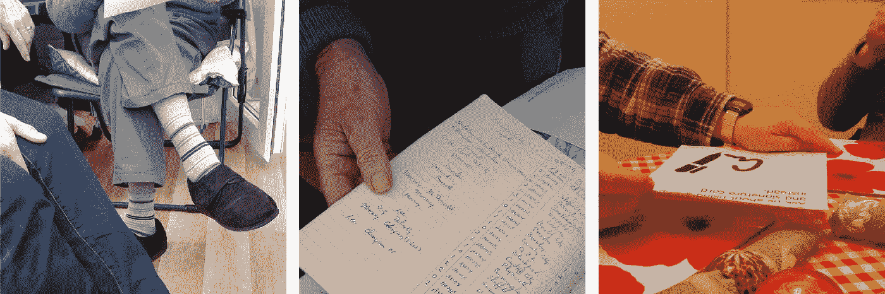
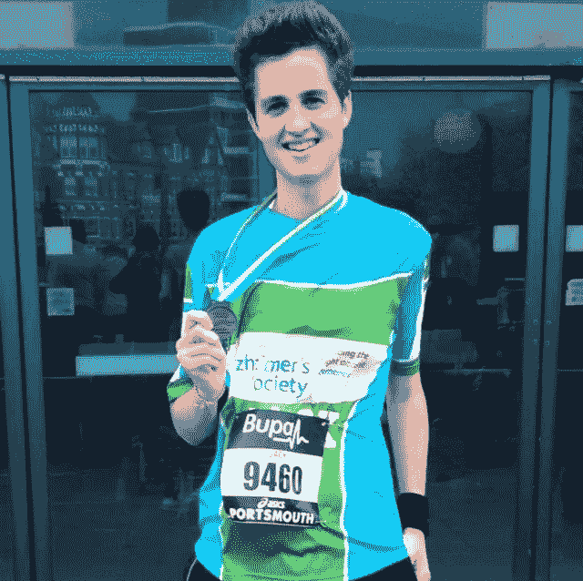

# 我主持的最难的用户研究

> 原文：<https://medium.com/globant/the-hardest-user-research-ive-done-yet-a2b6b2017979?source=collection_archive---------2----------------------->

他的眼睛开始充满泪水，他说话时颤抖着。"她拿走了他所有的积蓄，她利用了他和他的痴呆."他说着，一滴眼泪顺着他的脸颊流了下来。

我盯着他，冻僵了，浑身起鸡皮疙瘩，有点颤抖。沉默。

你试着采访用户，当他们向你倾吐心声时，你会发现他们的洞察力。当他们回忆和讲述他们和爱人一起度过的快乐时光时。当他们告诉你他们有多想念痴呆前的父亲时。这不容易，也不愉快。

这是我最近在对痴呆症患者及其护理人员进行用户研究时发现自己的情况。这是一次很有启发性的经历，也是我想分享的经历。

> “我告诉人们很多关于他痴呆症的事情。我不感到羞耻，我像以前一样爱他。”

## **缓和两人**

我主持了数小时的用户研究。从财富 500 强的首席执行官到学校老师再到首次购房者。但事实证明，这些观众是最具挑战性的。

我预料到了一些挑战，并努力做好准备。其他人让我大吃一惊，我永远也不会猜到他们会发生。其中之一是护理者，通常是家庭成员，无意中控制了用户访问。

从回答我向痴呆症患者提出的问题，到接受我的问题，并以一种他们认为自己能更好理解的方式向痴呆症患者提问。

护理人员习惯于帮助痴呆症患者做他们所做的一切。因此，我认为他们定期干预是很自然的，在他们看来，他们是在帮忙。

有时这很有用，护理人员比我更了解这个人，他们知道如何以某种方式表达事情，以获得回应。但是大多数时候，他们的努力以及他们的意义都不利于面试。

这会打断这个流程，不得不突然停下来听护理人员以稍微不同的方式问我问题。有时，护理人员会问一些诱导性的问题，或者发表一些诱导性的评论，这不可避免地会导致患者患有痴呆症。

为了克服这一点，我会礼貌地提醒护理人员，我们希望听到痴呆症患者的观点，而不是他们认为自己会说什么。我也很清楚我在向谁提问。全身心地投入到谈话中，并始终与痴呆症患者保持眼神交流，这让我们感觉就像是房间里唯一的人，就像这是一次私人谈话。

> “社会福利机构想把他从我身边带走。那是我第一次看到我爸哭。”

## **走钢丝**

我喜欢挖掘用户的态度、评论或信念，真正揭示他们的意思，并问 5 个为什么以获得其本质。

但是，当一个参与者谈论深刻的情感话题，并回忆非常坦率地令人心碎的故事时，这就很难了。你最终会在进一步试探以从对话中获得更多价值之间找到一条微妙的路线，但这样做可能会试探得太多，把对方逼得太远。从而使他们感到不舒服，并关闭。我最不想做的事。

在这些情况下，肢体语言是你的朋友。观察并发现参与者不愿意透露更多信息或告诉你某些事情的迹象。

我还觉得，知道什么时候进一步推进某个话题，什么时候停止谈话并迅速继续下去，是一种同理心和常识。如果参与者讨论了一个特别令人痛苦的话题，在继续之前给他们一个休息的机会。

> “奶奶已经不知道她的现实了，我们只好活在她的现实里。”

## **保持对话的重点**

护工是固执己见的人。这很好，而不是有人害羞，不愿意说出自己的真实感受。

但是，因为他们非常关心，因为他们有太多的意见，太多关于如何改进的想法，所以有时很难保持谈话的重点，并确保它符合研究目标。

在用户访谈中，你可以预期参与者会偏离与谈话主题无关的话题，我的工作就是让他们回到正轨。我发现过去这样做没有问题。

但是在这项研究中，情况有所不同。与会者正在分享深刻的个人和情感问题，我有什么资格打断他们并把他们带回我想谈论的话题？这似乎不是正确的做法，我在采访中判断这是错误的做法，可能会导致负面后果。

相反，我让他们说出来。让他们早点说出他们的抱怨和建议。我采纳了他们的意见，如果我觉得这些意见有价值，我会更深入地研究。

为了克服这个在接下来的面试中突然出现的问题，我确保我的问题简短、具体，并且直接涉及我想讨论的话题。它似乎起了作用。

> “是的，我是查理的看护人。但最重要的是，我是查理的妻子，我永远都是。”

这是我第一次就如此情绪化和个人化的话题进行用户研究，这是一次艰难且通常令人不舒服的经历。

在整个过程中，我和我的同事通过实践来学习，尝试新事物，并把学到的东西带到下一次面试中，等等。

> “你快 76 岁了。”
> 
> “是我！?"
> 
> “是的，你是！”

我奶奶去世前患有痴呆症，看到你爱的人和她一起生活是一种可怕的疾病。

因此，这个项目和研究对我来说非常特别。

我希望我们的工作能改善痴呆症患者及其护理人员的生活，哪怕只是一点点。

Running the Great South Run for the Alzheimer’s Society, and grandma. 2013.