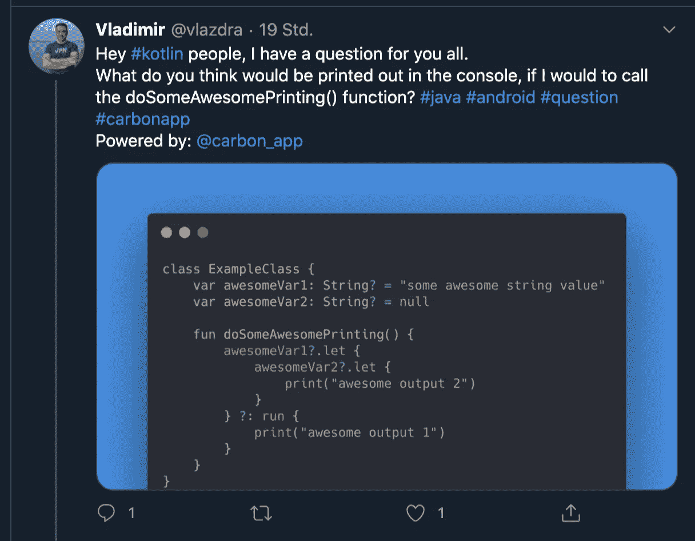
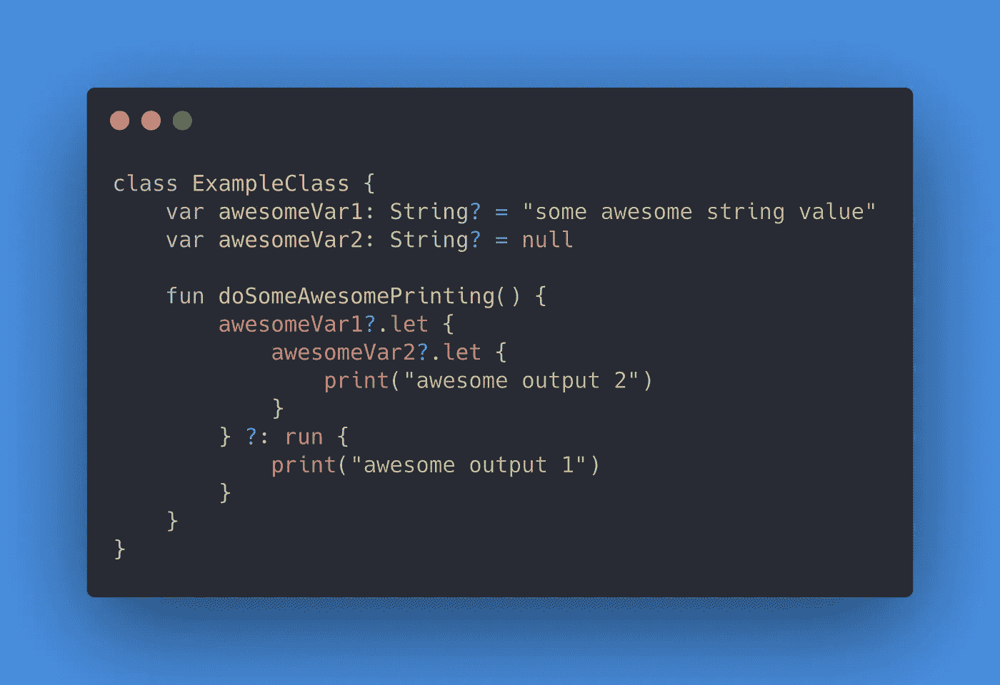

# 使用 Elvis 运算符时隐藏的陷阱

> 原文：<https://medium.com/google-developer-experts/the-hidden-pitfalls-of-the-elvis-operator-da536ba68161?source=collection_archive---------1----------------------->

我猜我们很多人都喜欢猫王，无论是科特林的艺术家还是经营者。但是如果你不知道它是如何工作的，它会导致一些隐藏的陷阱。


[https://unsplash.com/photos/1LCzr14Ah5U](https://unsplash.com/photos/1LCzr14Ah5U)

我最近才意识到，弗拉基米尔·兹德拉夫科维奇(Vladimir Zdravkovic)在 twitter 上发布了一些代码，让我们猜猜它在打印什么:



[https://twitter.com/vlazdra/status/1287366531987406848?s=20](https://twitter.com/vlazdra/status/1287366531987406848?s=20)

我假设有一个隐藏的谜题，但我看不出问题所在。我看不出为什么它会打印任何东西，但它确实打印了！
在思考了这个问题之后(Vladimir 写了一篇关于这个问题的[文章](https://dev.to/vlazdra/a-decompiled-story-of-kotlin-let-and-run-4k83)),我发现越来越多的案例可能会出错。但是让我给你看一些代码:

# 科特林的零安全

我想我们大多数人都喜欢用 Kotlin 轻松编写空安全代码的方式，就像这样:

```
presenter?.onDestroy()
```

或者

```
data?.let{ updateData(data) }
```

添加一个替代案例非常简单:

```
data?.let{ updateData(data) } ?: run { showLoadingSpinner() }
```

# 让我问你一件事

你觉得下面的代码和上面的基本一样吗？

```
if (data != null) { 
   updateData(data) 
} else { 
   showLoadingSpinner()
}
```

我相信我们大多数人都认为它们是等价的。但如果我告诉你不是呢？
`if/else`完全是二进制的，它是**非此即彼。**但是有了**猫王**操作员，就有可能**两个**！为了理解为什么我们必须更进一步了解它是如何工作的。

除了明确属于某个`if`的`else`之外，Elvis 操作符并不局限于单个`?`。请记住，我们可以用链条锁住它们:

```
someVariable**?**.someField**?**.doSomething()
```

如果我们现在在这里添加 Elvis 操作符，它将根据左边的表达式执行:

```
someVariable**?**.someField**?**.doSomething() ?: run { doSomethingElse() }
```

因此，如果**中有任何**表达式是`null`，Elvis 块就会被调用。在检查是否需要操作员之前，它将完成对左边的所有内容的评估。这个**包括** **最后一个** **表达式**。

所以这取决于`doSomething()`返回什么！如果是`null`，那么会对右侧进行求值。

或者以我们的例子为例:

```
data?**.**updateData(data) ?: run { showLoadingSpinner**()** }
```

如果`updateData`返回`null`，则**也将**显示装载旋转器！这可能不是你想象中的`if/else`。你可能会想，这个表达式是安全的，但是可能两个函数都被调用了。

这就是弗拉基米尔的例子:



[https://dev.to/vlazdra/a-decompiled-story-of-kotlin-let-and-run-4k83](https://dev.to/vlazdra/a-decompiled-story-of-kotlin-let-and-run-4k83)

由于第二个变量是`null`，它的`let`返回`null`，这导致了外部 Elvis 块的调用。

因此，如果您想要预期的行为，最好明确地做一些事情:

```
// Extension Function to handle else cases
fun <T> T?.whenNull(block: () -> Unit) = this ?: block()data?.updateData(data).**whenNull** { handleNull() }
```

记住，Kotlin 中的所有东西都被解析成某种类型，包括每个表达式。记住，`let`正在从您的块返回结果(就像`run`一样)。保持警惕！小心点！

PS:看看上面例子的反编译代码:[https://dev . to/vlazdra/a-decompiled-story-of-kotlin-let-and-run-4k 83](https://dev.to/vlazdra/a-decompiled-story-of-kotlin-let-and-run-4k83)

PPS:特别感谢[卢卡斯·诺比尔](https://medium.com/u/d8e8e655f6e4?source=post_page-----da536ba68161--------------------------------)和[阿图尔·拉托泽夫斯基](https://medium.com/u/9fbde7d7cabf?source=post_page-----da536ba68161--------------------------------)在此提供额外的投入，热爱群众的智慧🤗