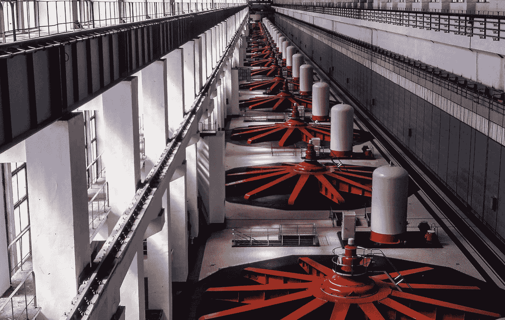

# ES6 发电机的隐藏能量:可观测的异步流量控制

> 原文：<https://medium.com/javascript-scene/the-hidden-power-of-es6-generators-observable-async-flow-control-cfa4c7f31435?source=collection_archive---------1----------------------->



The turbine room of the Volga Hydroelectric Station — Kent Kanouse (CC BY-NC 2.0)

在 [7 用 JavaScript](/javascript-scene/7-surprising-things-i-learned-writing-a-fibonacci-generator-4886a5c87710) 编写斐波那契生成器时我学到的令人惊讶的事情中，我介绍了 ES6 生成器函数的一个明显的用例:一次生成一个值的可迭代序列。如果你还没有读过，你应该读一读。Iterables 是 ES6+中许多东西的基础，理解它们是如何工作的对你来说很重要。

但是在那篇文章中，我有意回避了生成器的另一个主要用例。可以说，主要用例:异步流控制。

## 异步/等待

您可能听说过尚未正式成为 JavaScript 标准的 async/await 提案。

它没有进入 ES6。它不会进入 ES2016。它*可能*在 ES2017 中成为标准，然后我们需要等待所有的 JS 引擎实现落地，然后才能使用它。*(注意:现在在巴别塔也能工作，但不能保证。尾部调用优化在 Babel 中工作了几个月，但随后被删除)。*

尽管有等待，你仍然会找到一堆关于 async/await 的文章。为什么？

它可以把代码变成这样:

变成这样的代码:

注意，在第一个版本中，我们的基于承诺的函数有一个额外的嵌套层。async/await 版本看起来像常规的同步代码，但它不是。它产生承诺并退出函数，释放 JS 引擎去做其他事情，并且当来自 *`fetchSomething()`* 的承诺解析时，函数恢复，并且将解析的承诺值赋给 *`result`。*

*看起来和感觉上同步的是异步代码。对于每天进行大量异步编程的 JavaScript 程序员来说，这基本上是一个圣杯:异步代码的所有性能优势，而没有认知开销。*

我想深入探讨的是 async / await 如何在幕后使用生成器……以及如何在不等待 async / await 到来的情况下，现在就将它们用于同步风格的流控制。

## 发电机评论

生成器函数是 ES6 中的一个新特性，它允许函数通过返回一个对象来*随时间生成许多值*，该对象可以用一个 *`.next()`* 方法迭代 iterable，该方法返回这样的对象:

```
{
  value: Any,
  done: Boolean
}
```

*`done`* 属性表示生成器是否已经生成了它的最后一个值。

JavaScript 中的很多东西都使用迭代器协议，包括新的 *`for…of`* 循环、数组 rest/spread 操作符等等。

## 与发电机对话

这就是事情变得真正有趣的地方。与发电机的通信可以双向进行。除了从生成器接收值之外，还可以将值注入到生成器函数中。迭代器 *`.next()`* 方法可以接受要赋值的值。

还有一些其他方法可以与发电机通信。你可以向他们抛出错误。除了调用 next，您还可以调用 *`iter.throw(error)`，(例如，*)来通知为生成器获取数据时出错。还可以用 *`iter.return()`* 强制生成器返回。

这两者都可以方便地将错误处理添加到流控制代码中。

## 发电机+承诺=圣杯

如果有一个函数包装生成器，可以检测您何时做出承诺，等待它解析，然后通过后续的 *`.next()`* 调用将解析的值传递回生成器，会怎么样？

然后，您可以像这样编写异步/等待样式的代码:

事实证明，这样的图书馆已经存在。叫 [**Co.js**](https://github.com/tj/co) 。但是，与其教你如何使用 Co，不如让我们试着想出如何自己写这样的东西。看看上面的 *`crossBridge()`* 例子，看起来应该很简单。

我们将从一个简单的 *`isPromise()`* 函数开始:

接下来，我们需要一种方法来迭代生成器的 *`.next()`* 调用，解开承诺，并等待它们解决，然后再次调用 *`.next()`* 。这里有一个没有错误处理的简单方法。这只是一个想法的演示。您不希望在生产中使用它—您的错误会被掩盖，并且很难调试正在发生的事情:

如您所见，我们正在传递一个回调函数来返回最终值。我们通过将先前的值传递到函数顶部的 *`.next()`* 调用中来与生成器通信。这使我们能够将前面的 *`yield`* 调用的结果分配给标识符:

当然，这些都没有用，直到你把它全部踢开——那么真正返回最终值的承诺呢？

让我们一起来看看所有的内容…除了使用示例，整个内容大约有 22 行代码:

现在，如果你想在你的代码中开始使用这种技术，一定要使用 [Co.js](https://github.com/tj/co) 来代替。它有您需要的错误处理功能(我只是跳过了这一步，以避免混淆示例)，它经过了生产测试，并且它还有其他一些不错的特性。

## 从承诺到观察

上面的例子很有趣，Co.js 对于简化异步流控制确实很有用。只有一个问题:它返回一个承诺。正如你可能意识到的， ***一个承诺只能发出一个值或者拒绝……***

随着时间的推移，发生器能够发出 ***多种值。随着时间的推移，我们还知道什么可以产生许多值？一个**可观测的**。你可能还记得我在用 JavaScript 编写斐波那契生成器时学到的 7 件令人惊讶的事情:***

> 最初，我对生成器非常感兴趣，但是现在我已经和它们一起生活了一段时间，在我真正的应用程序代码中，我还没有发现很多好的生成器用例。对于我可能使用生成器的大多数用例，我选择了 RxJS，因为它有更丰富的 API。

因为*(不像生成器函数)*一个承诺只能发出一个值，而*(像生成器函数)*一个可观察对象可以发出多个值，我个人认为可观察 API 比承诺更适合异步函数。

什么是可观察的？


上表来自克里斯·科瓦尔的《GTOR:反应性的一般理论》。它在空间和时间上把事情分解得很清楚。可以同步拉取的值会占用空间(内存中的值)，但与时间无关。分别是 ***拉 API***。

依赖于某个时间事件的值不能被同步消耗。在消费这些价值之前，您必须等待它们产生出来。这样的值就是 ***推送 API***，并且总是有某种订阅或者通知机制。在 JavaScript 中，这通常采用回调函数的形式。

在处理未来值时，您需要在值可用时得到通知。就是这个 ***推*** 。

承诺是一种推送机制，它在承诺被解析或用单个值拒绝后调用一些代码。

一个可观察值就像一个承诺，但是每当一个新值变得可用时它就调用一些代码，并且随着时间的推移*可以发出许多值*。

可观察对象的核心特性是一个 *`.subscribe()`* 方法，它采用三个值:

*   **上一次** —每次被观察对象发出一个值时调用。
*   **onError** —当可观察对象遇到错误或无法生成要发出的数据时调用。出错后，将不会发出更多的值，也不会调用 *`onCompleted`* 。
*   **onCompleted** —在最后一次调用 *`onNext`* 之后调用，但前提是没有遇到错误。

因此，如果我们想为同步风格的异步函数实现一个可观察的 API，我们只需要一种传入这些参数的方法。让我们试一试，把 *`onError`* 留到以后:

我真的很喜欢这个版本，因为它给我的感觉是多功能的。事实上，我非常喜欢它，我对它进行了一些充实，将其重命名为 Ogen，添加了错误处理和一个真正的 Rx Observable 对象(这意味着您可以随心所欲地使用 *`.map()`* 、 *`.filter()`* 和 *`.skip()`* )。[除了别的事情之外](https://github.com/Reactive-Extensions/RxJS/blob/master/doc/libraries/main/rx.md#observable-instance-methods)。

在 GitHub 上查看 [Ogen。](https://github.com/ericelliott/ogen)

observables 有很多方法可以改进您的异步流控制，这可能是我很少使用生成器的主要原因，但是现在我可以用 Ogen 无缝地混合和匹配同步风格的代码和 observables，也许我会开始更多地使用生成器。

# 与埃里克·艾略特一起学习 JavaScript】

***埃里克·埃利奥特*** *著有* [*【编程 JavaScript 应用】*](http://pjabook.com) *(奥赖利)，以及* [*【跟埃里克·埃利奥特学 JavaScript】*](http://ericelliottjs.com/product/lifetime-access-pass/)*。他曾为****Adobe Systems*******Zumba Fitness*******华尔街日报、*******BBC****等顶级录音师和 Usher****

***他大部分时间都在旧金山湾区和世界上最美丽的女人在一起。***