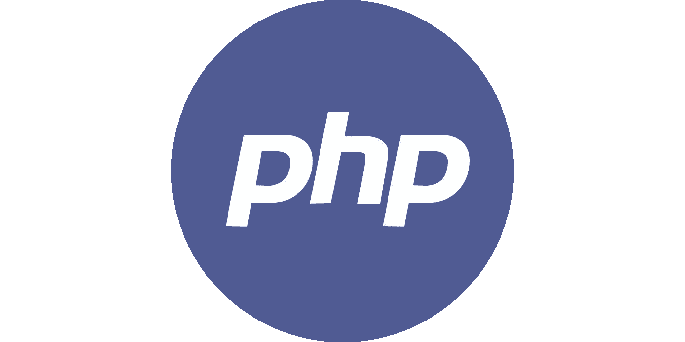

# PHP 的快速历史

> 原文：<https://medium.com/quick-code/the-history-of-php-ffb920ba4555?source=collection_archive---------7----------------------->

超文本预处理器。听起来熟悉吗？如果你和我一样，那就说不通了。然而，您可能知道它的缩写:PHP。

当然，PHP 是网络上最流行的语言之一，是 WordPress 的支柱，也是脸书的一部分(尽管是作为它自己的语言黑客)。由于 PHP 构成了这些网络巨头基础设施的关键部分，这种语言成为了 HTML 和 CSS 之后的网络命脉。

