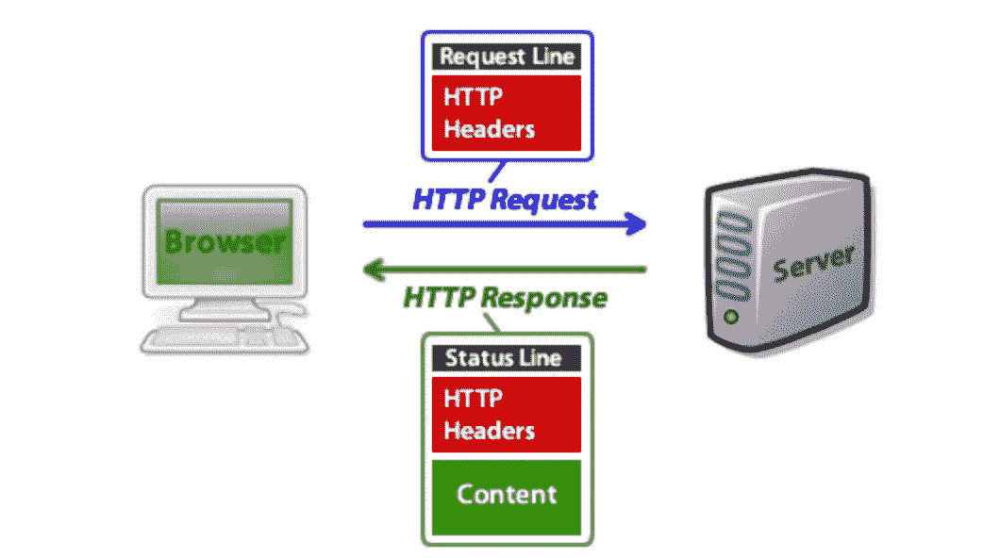
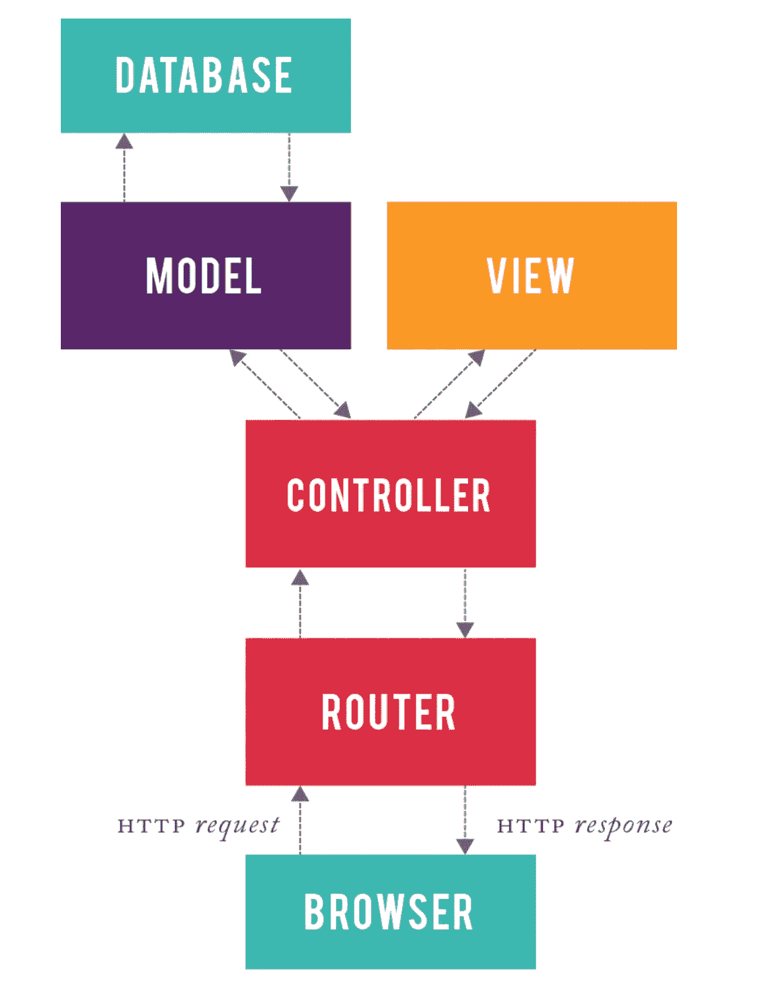

# Rails MVC 架构的 HTTP 请求/响应周期

> 原文：<https://medium.com/quick-code/the-http-request-response-cycle-with-rails-mvc-architecture-6fa0137362c0?source=collection_archive---------4----------------------->

现在，我在熨斗学校训练营的 15 周已经过半，我已经开始复习课程的前几部分。技术面试不知不觉就来了，练习面试题永远不嫌早。除了理解概念，我还需要能够在现场简洁地传达这些概念。说起来容易做起来难！

我最近重温的一个主题是使用 Rails 后端的 HTTP 请求/响应周期。看起来很简单:你在浏览器中输入一个 URL，它将信息发送给服务器。然后这些信息被处理，瞧！，服务器会发回适当的数据显示在您的网页上。但是，在打开一个网页的瞬间，有很多事情在幕后发生。为了让我自己更好地把握这个周期，我将把它全部放在这里，这样你也可以获得一些洞察力。开始了。

1.  **HTTP 请求**

HTTP 请求由 3 部分组成:请求行、头部和主体。请求行包括 HTTP 方法、您试图访问的 URI(资源的路径)和 HTTP 版本(1.1、2.0 等。).头本质上是元数据，或者关于被发送的请求的信息，包括像 cookies 和认证令牌这样的东西。HTTP 请求的最后一部分，即消息体，是可选的。主体将包含发送到服务器的信息(也称为“有效负载”)，比如表单数据或任何需要处理的东西。

**2。服务器**

下一节专门讨论 MVC(模型视图控制器)架构，就像 Rails 一样。其他后端设计会有不同的数据处理方式。然而，在 Rails 中，HTTP 请求的第一站是路由器。路由器可以被认为是系统的“交通警察”。根据请求的指定方法和路径，路由器将请求发送到相应的控制器。控制器本质上是决策者，它们包含用于与模型交互的动作(方法)。控制器将信息发送到适当的模型，该模型是一个可以向数据库查询所请求数据的类。数据通过控制器发送回来，然后到达视图，在视图中，数据被转换成可以在页面上呈现的 HTML/JSON。

**3。HTTP 响应**

服务器准备好 HTTP 响应后，该响应将被发送回用户。响应由 3 部分组成:状态行、标题和主体。这些类似于 HTTP 请求，除了状态行包括 HTTP 版本、状态代码和状态消息。如果一切顺利，您应该得到状态代码“200”和状态消息“OK”。头也是元数据，只是这次它们描述了响应的内容以及用户代理应该如何处理它。主体包含客户端请求的资源数据。然后，客户端的浏览器呈现响应数据，这样循环就完成了！

你有什么想法？你能在面试中向潜在雇主描述一下这种循环吗？